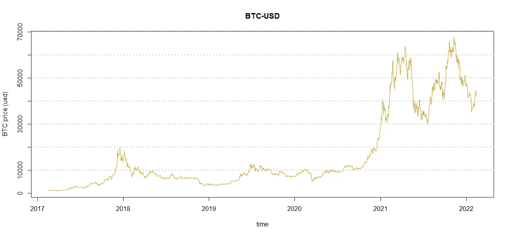
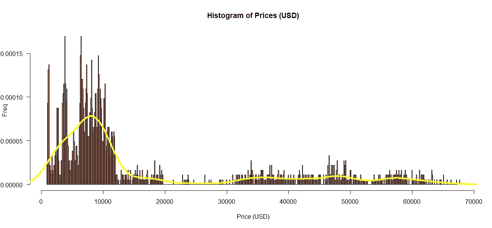
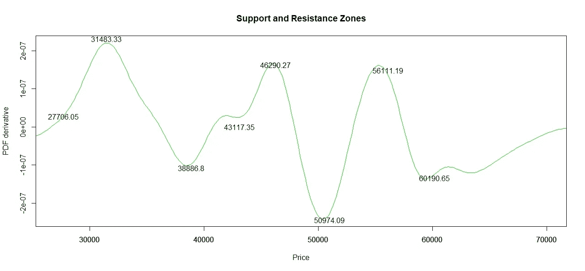

# 如何使用价格概率密度函数的导数找到比特币的支撑位和阻力位

> 原文：<https://medium.com/coinmonks/how-to-find-bitcoin-support-and-resistance-levels-using-the-derivative-of-a-price-probability-d3366dfe8425?source=collection_archive---------10----------------------->

**简介**

支撑位和阻力位是大交易者的基本要素，指的是汇率趋势可能被中断或逆转的价格水平[1，2]。

通常，支撑和阻力是通过跟踪趋势线、支点、整数、移动平均线、斐波那契数列和其他指标找到的。

因此，本研究旨在调查价格概率密度函数(PDF)的微分(微积分基本定理)的潜力，以寻找支撑位和阻力位，换句话说，当您可以使用概率论进行买卖时。

**数据处理**

使用 Coingecko 的价格[3]。使用 R 软件[4]和信号处理(信号)包[5]进行数据导入、预处理和数学程序。所有的数据处理都是使用 R 统计计算基金会的免费软件进行的。用 R！

**如何找到比特币的支撑和阻力**

下载 R (www.r-project.org)。安装并打开。安装 geckor 包[6]并从 Coingecko 中提取比特币价格:

> install . packages(" geckor ")
>库(" geckor ")
>BTC . I = coin _ history(coin _ id = " bit coin "，vs_currency = "usd "，days = "1825 ")

如果我们想要可视化比特币(BTC)价格图表(图 1)，我们可以提供价格图表作为 at 参数:

> plot(btc.i$timestamp，btc.i$price，type="l "，col="orange2 "，main = " BTC-美元"，xlab= "时间"，ylab="BTC 价格(美元)")
> abline(h=c(10000，20000，30000，40000，50000，60000，70000)，col="gray "，lwd=2，lty=3)

Figure 1\. Bitcoin (BTC) Price Chart.

这项研究的目标是确定比特币价格的概率密度函数(PDF ),以找到支撑位和阻力位。在 R 中绘制 PDF(图 2)的常用方法是应用函数 hist 和 density 来绘制直方图:

> hist(btc.i$price，breaks=480，col = "orange "，main="Histogram of Prices (USD)"，xlab="Price (USD)"，ylab="Freq "，prob = TRUE，las=1)
>线条(density(btc.i$price)，lwd = 4，col="yellow ")

Figure 2\. Histogram of Bitcoin Prices (orange bars) and its PDF (yellow line).

图 2 中的重要信息是不可能找到每一次价格变动的终点。通过这种方式，导数测试被用于定位比特币 PDF 的临界点，换句话说，这些临界点代表价格运动的中断或逆转。我们可以通过使用信号包[7]中的函数 sgolayfilt 来推导概率分布函数。

> hist . a>install . packages(" signal ")
>library(" signal ")
>hist . a . SG = sgolayfilt(hist . a $ y，n=7，m = 1)
>plot(hist . a $ x[140:512]，HIST.a.sg[140:512]，type="l "，col="green "，main = " Support and Resistance Zones "，ylab = " PDF derivery

Figure 3\. Support and Resistance zones of Bitcoin.

请注意，max 和 min 函数在其参数中选择最大值和最小值。

**结论**

这个简单的建议是一个很好的机会，向交易者展示一种新的方法，根据统计数据找到支撑位和阻力位。此外，只要在 coin_history 函数中更改硬币，该方法就可以应用于其他数字资产。换句话说，不同的币没有不同的方式。在目前的情况下，比特币的支持和阻力被发现一起完成了这项研究。

如果您喜欢这些内容，请考虑以下建议:

BTC:BC 1 qljlmuwq 9 gyvn 7 uhvwwypsj 4x 8 hcetuzhw 9 quh 0

BNB:bnb 159am 7 huy 53mg 7 sygnklrtxkahkdk 2 qxzmnk 0 GW

BUSD:bnb 159am 7 huy 53mg 7 sygnklrtxkahkdk 2 qxzmnk 0 GW

**致谢**

作者感谢中本聪、哈尔·芬尼、尼克·萨博、赵昌鹏、萨布丽娜·莫赖斯和安德烈·福斯。

**参考文献**

1.阻力的支持:技术分析和日内汇率。《经济政策评论》，第 6 卷，第 2 期，2000 年 7 月，可在 https://ssrn.com/abstract=888805 SSRN 查阅:

2.【支持线和阻力线:知道什么(investopedia.com)】

3.[www.coingecko.com](http://www.coingecko.com)

4.[https://www.R-project.org/](https://www.R-project.org/)

5.[https://cran.r-project.org/web/packages/signal/index.html](https://cran.r-project.org/web/packages/signal/index.html)

6.谢尔盖·马斯蒂斯基(2021)。geckor:“coin gecko”API 的 R 客户端。r 包版本 0.2.0。[https://CRAN.R-project.org/package=geckor](https://CRAN.R-project.org/package=geckor)

7.信号开发者(2013)。信号:信号处理。网址:【http://r-forge.r-project.org/projects/signal/ 

> 加入 Coinmonks [电报频道](https://t.me/coincodecap)和 [Youtube 频道](https://www.youtube.com/c/coinmonks/videos)了解加密交易和投资

## 也阅读

 [## 杠杆代币[多头代币]终极指南

### 杠杆化令牌是具有杠杆化风险敞口的 ERC20 令牌，不考虑保证金、要求、管理…

medium.com](/coinmonks/leveraged-token-3f5257808b22)  [## 最佳加密交易所| 2022 年十大加密货币交易所| CoinCodeCap

### 哪一个是最好的加密交换？在本文中，我们将根据多种加密货币列出 10 大加密货币交易所

coincodecap.com](https://coincodecap.com/crypto-exchange)  [## 2022 年 2 月值得关注的三大游戏代币| CoinCodeCap

### 排名前 3 位的游戏也占交易总量的 85%以上。Defi 王国、Axie Infinity 和 Pegaxy…

coincodecap.com](https://coincodecap.com/top-3-gaming-tokens-to-look-out-for-in-february-2022)  [## 2022 年最佳加密交换平台| CoinCodeCap

### 随着时间的推移，我们大多数人将转向 dex 以获得更好的安全性和隐私。因此。在这里，我们将讨论…

coincodecap.com](https://coincodecap.com/best-swap-platforms)  [## 10 大最佳在线赌场|赢得并赢取免费 BTC 2022 | CoinCodeCap

### 接收、支付和赚取加密货币| |有各种各样的最佳在线赌场可供选择，有可能…

coincodecap.com](https://coincodecap.com/best-online-casinos)  [## 2021 年 6 大最佳硬件钱包|顶级加密硬件钱包[更新]

### 最好的加密货币硬件钱包是绝对必要的。我们将在 NGRAVE、Ledger Nano X 和…

medium.com](/coinmonks/the-best-cryptocurrency-hardware-wallets-of-2020-e28b1c124069)  [## 加密交易机器人——19 款最佳免费加密交易机器人

### 2022 年币安、比特币基地、库币和其他密码交易所的最佳密码交易机器人。四进制，位间隙…

medium.com](/coinmonks/crypto-trading-bot-c2ffce8acb2a)  [## 最佳 4 个加密交易信号电报通道

### 这是乏味的找到正确的加密交易信号提供商。因此，在本文中，我们将讨论最好的…

medium.com](/coinmonks/best-crypto-signals-telegram-5785cdbc4b2b)