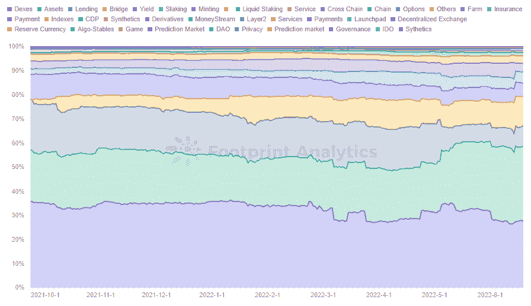
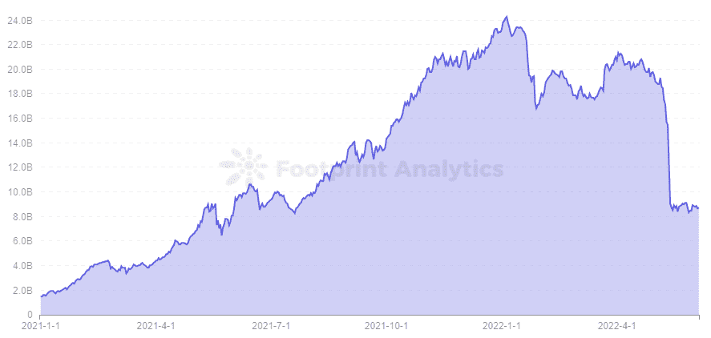
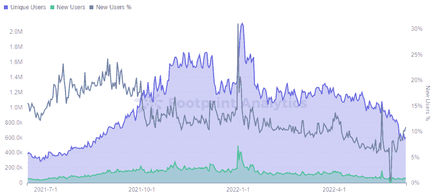
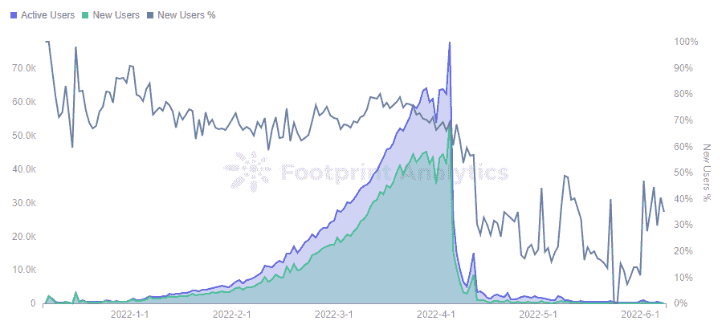
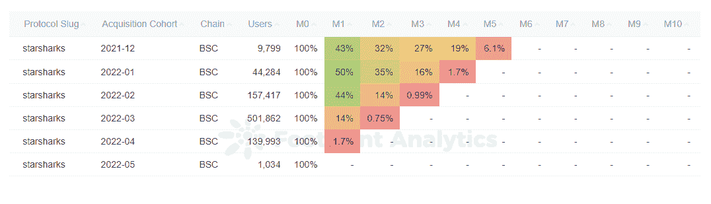
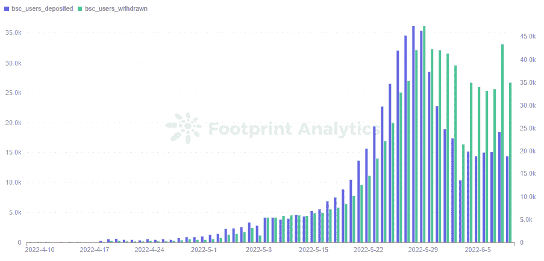

# 如何在熊市中寻找机会

> 原文：<https://medium.com/coinmonks/how-to-find-opportunities-in-a-bear-market-ee5bbf766684?source=collection_archive---------63----------------------->

2022 年 6 月

数据来源:[足迹分析—投资熊市仪表盘](https://www.footprint.network/@DamonSalvatore/Investing-in-a-Bear-Market?date=past360days&channel=ENG-263)

自 4 月份以来，加密货币市场一直处于严重低迷状态。

比特币从历史高点下跌了 70% ，而[以太坊](https://www.footprint.network/@DamonSalvatore/Ethereum-Dashboard?date=past90days&chain=Ethereum&symbol=ETH&symbol2=eth&channel=ENG-263)下跌了 80%。像[露娜](https://www.footprint.network/@DamonSalvatore/Terra-Dashboard?channel=ENG-263)这样的整个生态系统已经被抹杀，几十个代用币和 [GameFi](https://www.footprint.network/@rogerD/GameFi-Users-Overview?date__=past180days&chain=BSC&protocol_type=GameFi&channel=EN-263) 代币几乎失去了所有价值。

在牛市中，只需投资贝塔跟随大势，就能获得被动收益。但在熊市，这是行不通的。在这种情况下，我们需要利用阿尔法投资来寻找投资机会。

# 如何在熊市中投资 DeFi

**利用宏观数据发现市场趋势**

DeFi 复制了传统金融的几乎所有模式，从贷款到金融衍生品。DeFi 与传统融资项目的主要区别在于智能合同的使用、供应链上更透明的信息以及作为激励措施的代币的铸造。

因此，DeFi 具有传统金融的许多特征，但它缺乏强有力的监管，导致价格大幅波动。除了在 crypto 上赚更多的钱，DeFi 没有更多真实世界的用例，大多数人都觉得很难加入。因此，在最初的兴趣热潮之后，用户增长已经停滞。

根据[足迹分析](https://www.footprint.network/@DamonSalvatore/Investing-in-a-Bear-Market?date=past360days&channel=ENG-263)的数据，dex 不再是 DeFi 的顶级品类，其市场份额下降了**40%至 27%。贷款项目被抹杀，从第二位的20%下降到 8%】。资产和桥梁项目现在占据了 31%和 12%的市场份额。**

****

***Footprint Analytics — Market Share of TVL by Category***

**1.使用一元成本平均策略**

**平均成本指的是分配等量的资金并定期投资**。这与试图把握市场时机形成对比，在高点卖出，在低点买入。****

**在当前的宏观环境下，我们无法判断一个令牌何时会触底。因此，将平均成本投入到你认为能够长期生存的项目中是有意义的。虽然稳定投资固定金额的现金不如进行完美的摇摆交易有利可图，但它更安全。**

**2.稳定货币投资**

**加密货币的高波动性导致的 FOMO 情绪使其难以做出明智的决策，尤其是在熊市中，因此使用 stablecoins 是一种风险相对较低的投资选择。Lending 和 DEX 平台上都不缺乏对 stablecoin 的投资，由 stable coin 组成的 LP 也可以防止非永久性损失。虽然稳定的债券有更多的使用案例和更少的波动性，但重要的是要记住它们也有风险。**

**然而，在 UST 崩溃后，算法稳定的安全性是一个问题。集中式稳定帐户的不透明信息也存在一定的安全问题，过度抵押的稳定帐户的清算风险也令人担忧。**

**根据足迹分析公司的消息，这一暴跌导致了 DeFi 最大的稳定币指数平台 Curve 在 TVL 的急剧下滑。这表明稳定的收入毕竟不是那么稳定，所以要谨慎投资。**

****

***Footprint Analytics — Curve TVL***

# **熊市如何投资 GameFi**

****利用宏观数据发现市场趋势****

**来自 [Footprint Analytics](https://www.footprint.network/@DamonSalvatore/Investing-in-a-Bear-Market?date=past360days&channel=ENG-263) 的数据显示，GameFi 的独立用户在 2021 年末达到顶峰，在 1 月份再次达到顶峰，然后震荡下行。更明显的下降发生在 5 月下旬，新用户逐渐减少。6 月 8 日新增用户 6.5 万，独立用户 60.6 万，仅为峰值的 30%。**

****

***Footprint Analytics — Daily Gamers Trend***

**GameFi 1.0 发展迅速，玩家最普遍的感受就是无聊。现在的游戏可玩性比较低，大部分项目只是用代币作为奖励机制来吸引大量采销玩家，项目周期基本只有几个月。**

**在众多 GameFi 项目中选择一个项目进行投资并不容易。从项目人气、新玩家增长、老用户留存、代币发放等方面来评估项目是一个很好的方法。**

**进入初期将更有可能收回资本，同时应更加关注项目的动态，根据项目的动态及时做出决策，并抓住可能出现代币价格波动前夕的机会。**

**比如很多用户喜欢 [StarSharks](https://www.footprint.network/@Bond/Address-Analysis-of-Starsharks?gamefi_name=starsharks&channel=ENG-263) 早期模型，大量用户加入项目。**

**然而，用户的快速涌入导致代币被过度印制，代币通胀导致价格下跌。当项目负责人意识到问题并移除租赁市场时，用户数据也跌落悬崖，不再能够吸引新用户，令牌价格陷入死亡螺旋。**

****

***Footprint Analytics — StarSharks Daily Users***

**《T2》明星博客的下降在留存率上也很明显，4 月份进入游戏的用户中只有 1.7%的人留了下来。前期的老用户已经流失，只有去年 12 月进入的还有 6.1%的留存，大概是因为这个用户以较低的成本拥有了 NFT，现在已经基本回笼了足够的资本，之后的输出就是纯收益。因此，选择合适的时机进入尤为重要。**

****

***Footprint Analytics — Monthly Retention Analysis***

**除了关注整体市场的宏观形势，项目的宏观调控也很重要。尽管这与权力下放相反，但在早期阶段的有效控制可以防止象征性价格飙升和暴跌，从而使项目更持久地发展。因此，对于用户来说，密切关注项目的动态(如项目的交流或社区中的有组织活动)非常重要，以便能够了解未来的方向，并在变化发生之前采取正确的行动。**

*   **投资 3A 游戏**

**随着 GameFi 瓶颈的出现，一些传统开发商正在进军区块链的世界，风投们已经在 3A 游戏上工作了很长时间，其中最著名的 Illuvium 获得了很多关注，其巅峰时期的象征性价格为 1800 美元。**

**虽然 3A 游戏开发成本高，周期长，但游戏精美的画面和丰富的可玩性会吸引更多看重内在价值的玩家。他们能否打破死亡螺旋的魔咒，就等今年网游的表现了。**

**熊市投资不能只寄托在投机上，还要找到这种有价值的游戏。传统游戏开发商的开发能力毋庸置疑，但能否适应区块链，做出适合加密货币用户的游戏，还需要关注其经济模式。**

*   **谨慎地关注新的赚钱方式**

**StepN 将 [X-to-earn](https://www.footprint.network/@DamonSalvatore/X-to-earn-Token-Dashboard?channel=ENG-263) 模式带到了最前沿，甚至一度被认为是摆脱死亡螺旋的出路。然而，随着一系列负面消息的出现，从 6 月份开始， [StepN](https://www.footprint.network/@DamonSalvatore/StepN-Dashboard?date_range=past90days&channel=ENG-263) 的取款超过了 BSC 链上的存款，令牌一路下跌。**

****

***Footprint Analytics — StepN Daily Users Deposited & Withdrawn on BSC***

**无论 StepN 的尝试是否成功，X-to-earn 模式在短期内都将是一个值得关注的领域。关键是多看多选，分析项目自身的价值优势，在项目前期的低点进入，最大限度降低被套牢的风险。**

# **摘要**

**传统金融投资者利用内幕信息跑赢散户。虽然这仍然发生在加密中，但区块链数据是公开透明的，这使得那些研究数据的人缩小了差距。**

**在了解宏观趋势后，你应该参与社区活动以跟上信息，研究链上数据，然后谨慎做出判断但在做足够研究时迅速行动。**

**这篇文章由[足迹分析](https://www.footprint.network/@DamonSalvatore/Investing-in-a-Bear-Market?date=past360days&channel=ENG-263)社区提供。**

**Footprint 社区是一个世界各地的数据和加密爱好者相互帮助了解和获得关于 Web3、元宇宙、DeFi、GameFi 或区块链新兴世界任何其他领域的见解的地方。在这里，你会发现活跃、多样的声音相互支持，推动着社区向前发展。**

> **加入 Coinmonks [电报频道](https://t.me/coincodecap)和 [Youtube 频道](https://www.youtube.com/c/coinmonks/videos)了解加密交易和投资**

# **另外，阅读**

*   **[最佳以太坊钱包](https://coincodecap.com/best-ethereum-wallets) | [电报上的加密货币机器人](https://coincodecap.com/telegram-crypto-bots)**
*   **[交易杠杆代币的最佳交易所](https://coincodecap.com/leveraged-token-exchanges) | [购买 Floki](https://coincodecap.com/buy-floki-inu-token)**
*   **[3Commas 对 Pionex 对 Cryptohopper](https://coincodecap.com/3commas-vs-pionex-vs-cryptohopper)|[Bingbon Review](https://coincodecap.com/bingbon-review)**
*   **[加密复制交易平台](/coinmonks/top-10-crypto-copy-trading-platforms-for-beginners-d0c37c7d698c) | [如何在 WazirX 上购买比特币](/coinmonks/buy-bitcoin-on-wazirx-2d12b7989af1)**
*   **[CoinLoan 评论](https://coincodecap.com/coinloan-review)|[Crypto.com 评论](/coinmonks/crypto-com-review-f143dca1f74c)**