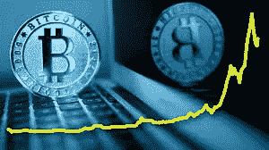

# 如何资助我在尼日利亚的比特币钱包

> 原文：<https://medium.com/coinmonks/how-to-fund-my-bitcoin-wallet-in-nigeria-bde68e82b24e?source=collection_archive---------32----------------------->

由于尼日利亚中央银行对所有加密货币活动的限制，尼日利亚人不能再使用他们的银行购买或出售任何加密资产，因此各种平台有不同的方式向尼日利亚人提供购买和出售服务。例如，Luno 使用一个凭证系统来进出客户的银行账户，而在币安，你可以通过外部钱包或其 P2P 交易系统存入比特币。

Funding BTC Wallet

我们将讨论如何用 P2P 交换系统和 Luno 代金券系统为您的钱包提供资金。

**P2P 交易所；**

有了 P2P，你基本上可以通过一个安全的系统从平台上的其他用户那里购买比特币，该系统允许比特币的双方(即你和卖家)在交易中履行自己的职责，而不会作弊。

大多数 P2P 平台都有类似的交易方法，因此下面的步骤是为币安 P2P 量身定制的，但它们也可以用于各种 P2P 交易平台，因为它们都是类似的

**如何在币安 P2P 网站上购买加密货币**

要使用币安 P2P 交易平台，您需要一个经过验证的币安帐户才能使用交易平台。

**第一步:**登录你的币安账户，进入币安 P2P 页面。如果您没有币安帐户，请注册一个帐户并获得验证。

**第二步:**选择菜单栏中的*购买密码*，然后选择 *P2P 交易*。

**第三步:**点击您想要购买的加密硬币旁边的*购买*按钮。浏览下拉列表中不同的价格和支付方式后，选择您喜欢的选项，然后点击“*购买【加密货币】*”按钮。

**第三步:**输入您想购买的法币或加密货币数量，点击*购买*。

**第四步:**验证支付方式和总价。将显示一个倒计时，你必须在交易所给定的时间范围内付款(通常是 15 分钟)。付款后，点击*转账，下一步*，选择*确认*。

**第五步:**卖家发布加密货币给你，交易就结束了。您可以点击*转账至现货钱包*，将加密货币转入您的现货钱包。

您也可以点击“*查看我的账户*”查看您刚刚购买的加密货币。

**路诺代金券**

要在尼日利亚的 Luno 上购买比特币，你必须先将奈拉存入你的 Luno 账户，然后用你账户中的奈拉购买比特币。棘手的部分是向你的 Luno 账户汇款，因为商业银行被禁止与加密交易所互动。2021 年 11 月，Luno 向尼日利亚加密市场推出了凭证支付系统。

*   导航到您的 NGN 钱包，然后选择“*存款*
*   如果你之前没有使用过 Luno 的代金券，会有一个教程模板向你介绍代金券系统。按下*下一个*继续
*   选择“*创建凭证*按钮，输入您要存入的金额，然后选择“*下一步*
*   将弹出一个确认页面，说明金额和存款费用。选择*继续支付*。押金是你存款金额的 2%,上限是 2500 NGN。
*   在弹出的网页上，可以进行刷卡支付或者银行转账。成功付款后，您的优惠券详情将发送到您的 Luno 电子邮件地址和电话号码
*   返回 Luno，在兑换您的优惠券屏幕上输入您收到的优惠券详细信息，然后选择“*兑换优惠券*
*   最后，输入通过短信和电子邮件发送给您的六位数代码

一旦你的鲁诺 NGN 钱包被存入，你现在可以用这笔钱购买比特币。

## **如何出售你的比特币**

卖你比特币最好的地方是 [**达特非洲**](https://dartafrica.io/)**；**尼日利亚和加纳最好的交流平台。Dart Africa 不仅为他们的比特币交易提供了最好的汇率之一，还提供了市场上最快的支付系统之一。在其网站和移动应用程序上都有一个[硬币计算器](https://dartafrica.io/coincalculator)功能(可以在[谷歌 Play 商店](https://play.google.com/store/search?q=dart+africa&c=apps)上下载)，它给出你想要出售的比特币数量的奈拉值。

Sell your Bitcoin

按照以下步骤在 Dart Africa 上出售您的比特币；

–要在 Dart Africa 上进行交易，您必须在他们那里有一个账户。确保在创建帐户时使用正确的凭据，或者如果您已经有帐户，只需登录即可。使用发送到您电子邮件的验证邮件来验证您的帐户。

–首次登录您的帐户时，系统会要求您创建一个 PIN，请确保您选择了一个您能记住的 PIN。将来当您想从 Dart Africa 帐户提取资金到您的银行帐户时，将使用此 PIN。

–将您的银行帐户详细信息添加到 Dart Africa 帐户的帐户列表中。

–点击出售硬币，选择比特币作为您的首选兑换硬币，并输入您想要出售的金额，奈拉值将使用当前汇率显示。

–点击开始交易，他们的系统将自动创建一个带有条形码的钱包地址，将比特币发送到该地址，资金将在 2 次批量确认后发送到 Dart Africa 帐户。请注意，您可以向提供的钱包地址发送任何金额，他们的系统将根据收到的金额为您存款。

—在您的 Dart Africa 帐户被贷记后，您可以将资金提取到您的银行帐户。

> 加入 Coinmonks [电报频道](https://t.me/coincodecap)和 [Youtube 频道](https://www.youtube.com/c/coinmonks/videos)了解加密交易和投资

# 另外，阅读

*   [阿联酋 5 大最佳加密交易所](https://coincodecap.com/best-crypto-exchanges-in-uae) | [SimpleSwap 点评](https://coincodecap.com/simpleswap-review)
*   购买 Dogecoin 的 7 种最佳方式
*   [最佳期货交易信号](https://coincodecap.com/futures-trading-signals) | [流动性交易所评论](https://coincodecap.com/liquid-exchange-review)
*   [火币加密交易信号](https://coincodecap.com/huobi-crypto-trading-signals) | [Swapzone 审查](/coinmonks/swapzone-review-crypto-exchange-data-aggregator-e0ad78e55ed7)
*   [最佳加密交易机器人](/coinmonks/crypto-trading-bot-c2ffce8acb2a) | [购买索拉纳](https://coincodecap.com/buy-solana) | [矩阵导出评论](https://coincodecap.com/matrixport-review)
*   [Coldcard 评论](https://coincodecap.com/coldcard-review) | [BOXtradEX 评论](https://coincodecap.com/boxtradex-review)|[uni swap 指南](https://coincodecap.com/uniswap)