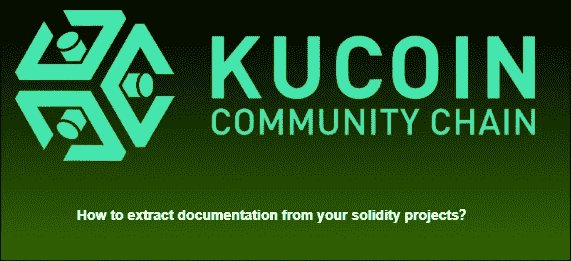
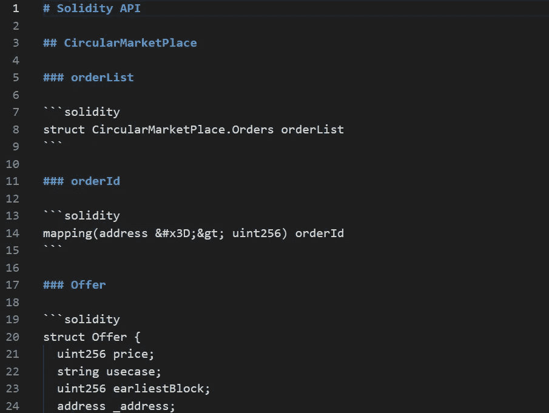

# 如何从你的实体项目中生成降价文件？

> 原文：<https://medium.com/coinmonks/how-to-generate-markdown-file-from-your-solidity-projects-afb0499d5ca5?source=collection_archive---------6----------------------->



文档通常是一项繁琐的工作，因为它需要大量的复制和粘贴手动工作。因此，使用文档生成器将节省大量时间，毕竟这是开发人员最有价值的资产。

在本文中，我们将学习如何使用 solidy-docgen:一个由 OpenZeppelin 在 hardhat 项目中开发的文档生成器工具。在这种情况下，我们将生成一个降价文件从坚实的源代码，可以使用在静态网站。没有进一步的原因，让我们进入教程。

**前提:**

*   已安装节点

**#1:安装 solidy-docgen**

您可以通过在硬盘项目目录中运行以下命令来安装它:

```
npm install solidity-docgen
```

**#2:在硬件配置**中包含坚固性-docgen

```
// hardhat.config.js
require('solidity-docgen');

module.exports = { 
     ......
     docgen: {}
 };
```

**#3:生成降价文件**

您可以通过运行以下命令生成降价文件:

```
npx hardhat docgen
```

**#4:找到您的降价文件**

当步骤中的命令完成后，您可以看到一个名为**的新目录文档**被创建。在这个文件夹中，您可以找到生成的降价文件。



example of the generated markdown file

**事后诸葛亮**

在这篇短文中，您已经学会了使用 solidy-docgen 库自动生成文档，希望这个工具能为您节省大量编写文档的时间！

别忘了去 KCC 找找更棒的加密项目。

KCC 社交网络
不和:[https://discord.gg/H5ucJydSyd](https://discord.gg/H5ucJydSyd)
推特:[https://twitter.com/KCCOfficialTW](https://twitter.com/KCCOfficialTW)
电报:[https://t.me/KCCOfficialEnglishCommunity](https://t.me/KCCOfficialEnglishCommunity)
电报频道:[https://t.me/KCCOfficialChannel](https://t.me/KCCOfficialChannel)

> 加入 Coinmonks [电报频道](https://t.me/coincodecap)和 [Youtube 频道](https://www.youtube.com/c/coinmonks/videos)了解密码交易和投资

# 此外，请阅读

*   最佳[密码交易机器人](https://coincodecap.com/best-crypto-trading-bots) | [购买索拉纳](https://coincodecap.com/buy-solana) | [矩阵出口评论](https://coincodecap.com/matrixport-review)
*   [Coldcard 评论](https://coincodecap.com/coldcard-review) | [BOXtradEX 评论](https://coincodecap.com/boxtradex-review)|[uni swap 指南](https://coincodecap.com/uniswap)
*   [比特币基地评论](/coinmonks/coinbase-review-6ef4e0f56064) | [德里比特评论](/coinmonks/deribit-review-options-fees-apis-and-testnet-2ca16c4bbdb2) | [FTX 评论](/coinmonks/ftx-crypto-exchange-review-53664ac1198f)
*   [Coinmetro 评论](https://coincodecap.com/coinmetro-review) | [VirgoCX 评论](https://coincodecap.com/virgocx-review)
*   [法国 4 大最佳加密副本交易平台](https://coincodecap.com/copy-trading-platforms-france)
*   [从 WazirX 切换到 CoinDCX 的 5 个理由](https://coincodecap.com/reasons-to-switch-from-wazirx-to-coindcx)
*   [联合国硬币评论](https://coincodecap.com/unocoin-review) | [最佳加密赌注硬币](https://coincodecap.com/best-crypto-staking-coins)