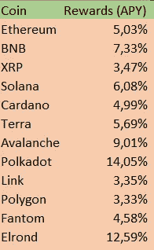
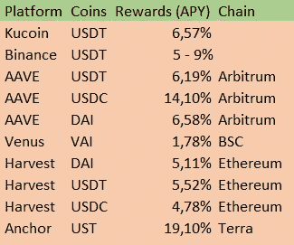
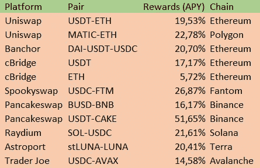
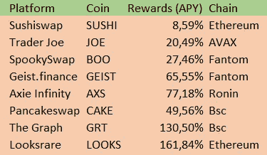

# 如何产生可持续的被动收入使用加密！

> 原文：<https://medium.com/coinmonks/how-to-generate-sustainable-passive-income-using-crypto-e95e4f3277a8?source=collection_archive---------0----------------------->

## 被动加密财富方式介绍。

# 介绍

世界正在慢慢改变。人们开始远离朝九晚五的工作，追求自己的梦想，或者寻找福利或薪酬更高的地方。工作机会越来越多，这并不奇怪；人们辞职是因为他们开始意识到生命和生活是有限的，他们应该得到比办公室或工厂更好或更多的工作。然而，缺点是不容易实现工作是可有可无的生活。

> **“睡觉的时候不找到赚钱的方法，就工作到死。”—沃伦·巴菲特**

这就是被动收入的来源！正如沃伦巴菲特曾经写道的那样，找到一种在睡觉时赚钱的方法，为你提供一种可以工作和做任何你想做的事情的生活，这是至关重要的。**我已经在 Crypto 中找到了这种方法，我将教你如何达到同样的效果！** Crypto 是一个不断扩大的新领域，在这里，机会无处不在。如果你知道去哪里找，你可能会得到让你受益终生的奖励！如果你想了解我的被动收入来源[，点击这里](/coinmonks/600-a-month-my-sustainable-passive-income-streams-for-march-db3c55e2b770)！

> 交易新手？尝试[加密交易机器人](/coinmonks/crypto-trading-bot-c2ffce8acb2a)或[复制交易](/coinmonks/top-10-crypto-copy-trading-platforms-for-beginners-d0c37c7d698c)

# 方法，使被动收入与密码！

这些选择包括一些最常见的被动收入投资选择。确实存在其他的可能性，我强烈建议你自己去探索这个空间！我没有包括任何重债/庞氏/金字塔选项，因为我不认为这些是可持续的，它们的风险太高，不值得推荐。不管怎样，尽情享受吧！

## **1 —下注区块链本地硬币！**

**风险等级:低—3%至 20%。**许多链和令牌都有自己的交易验证方式。大多数股权证明链使用“挖掘”新块的验证器，以及放入硬币并信任这些验证器以挖掘正确交易的委托器。这些产品通常风险最小，因此收益也可能最低。我总结了一些最受欢迎的提供赌注奖励的硬币！

Staking rewards of some of the most popular blockchains.

正如你所见，区块链像波尔卡多特和埃尔隆德提供两位数的赌注收益率，但所有提到的选项都值得探索。请记住，一些连锁店(如 DOT)会经历*通货膨胀，*降低实际收益率。像以太坊这样的连锁店实际上会经历接近-1%到-2%的负通胀！这意味着实际产量实际上会比提到的要高。但是，像往常一样，对所有的选择做你自己的研究！

## 2 —使用稳定的美元硬币进行农业生产！

**风险水平:低—1%至 20%。**许多 DeFi 协议、CEX 协议和德克斯协议都为你的稳定资本提供了不错的收益生成选项，方法是将它们借给其他投资者，或将你的资金用于闪贷等合同互动。这些期权的回报通常因交易量或资金用途而异，如果你以平台的本地代币的形式获得任何收益回报。这些投资选项是所有提到的选项中风险最小的，因为没有稳定货币价格变动的风险。然而，如果你使用 DeFi，你就增加了需要考虑的智能合约风险。看看下面的表格，看看你的一些选择和它们的收益率！

USD yields on some of the most popular Dapps

大多数协议在你的静态资金上提供了不错的收益，一些平台在与它们的本地令牌奖励和收益聚合器配对时甚至提供了更高的收益。Anchor protocol 是目前的赢家，但要小心，因为这是一个有补贴的平台！当补贴停止时，预计奖励将再次降至个位数。如果你想在 kucoin 上交易，考虑使用[我的推荐](https://www.kucoin.com/r/rf/1de5d)！

## 3 —提供流动性！

**风险等级:低/中/高—5%到 500%。如果没有流动性池和流动性提供者(LP ), DeFi 和分散式交易所的世界将不复存在。流动性提供者在资产池的两边提供他们的资产。USDT 50%，瑞士联邦理工学院 50%。当交易者在这个池中交易时，你会得到一部分产生的费用。这些流动性池产生更高的收益，但也暴露于更多的风险，如非永久性损失(IL)。当资产价格开始上涨或下跌时，持有资产而不是提供流动性可能(不是)更明智。看看这里的一些不同选项吧！**

A handful of Liquidity positions and their yields (src: [https://coindix.com/](https://coindix.com/))

如你所见，在提供流动性时，收益率要高得多，但风险也是如此！在投资这些资金池之前做适当的研究，因为回报和损失要高得多。在提供流动性时，您应该考虑以下风险水平。**低风险低回报**是只需要 1 项资产或稳定收益的流动性池，如过桥或美元池。**中等风险和中等回报**是流动性池，一边是稳定的货币，另一边是资产，如 USDT-FTM。**高风险高回报**是要求池两边都有 2 项资产的池，像 MATIC-ETH。*敬请关注，阅读关于流动性池及其回报的更深入的解释！*

## 4 —押道/Dapp/奖励代币！

**风险级别:中/高—35%到 500%。最有风险，因此也是最有回报的策略是投资和持有来自 DApps 的本地代币。大多数 DeFi 应用程序都有自己的本机令牌，可用于投票、获得一部分(交易)奖励或提高其所提供产品的收益率。这些回报往往是最高的，但通常伴随着通胀加剧、智能合约风险或集中化风险。这些代币的价格通常非常不稳定，随着越来越多的代币被分发出去，价格通常会下降，并且它们通常由可能搞砸或离开项目的集中开发团队组成。然而，好的一面是更高的收益率、更多的回报、投票权和更大的上升潜力。下面是一些提供这些令牌的项目！**

Some projects that offer their native token

正如你所看到的，其中一些回报已经达到了三位数的收益率。由于这似乎是最有利可图的，所以在投资这些项目之前，必须考虑到大量的谨慎和研究。这些都是高风险的，而且经常会有不明显的警告。如果它好得不像真的，大多数时候它就是真的！

# 结论

在 DeFi 和 CeFi 加密领域有很多机会。一个人必须知道从哪里开始赚取被动收入。有许多不同的投资组合，上面提到的选项将提供一个可能的投资可能性的好主意。我总是建议将你的投资分散到多个渠道，这样你就不会让自己暴露在太多的风险中，也能使你的投资组合多样化。

看看我的其他文章，了解更多关于可持续的被动收入流和投资选择！你可以随时关注我关于投资和使用加密的被动收入的未来文章。如果您有任何问题，请随时评论或回复！

为了公开我的故事，请考虑给我买杯咖啡:[https://ko-fi.com/igormd](https://ko-fi.com/igormd)！

如果您想在 kucoin 上交易，请考虑使用[我的推荐](https://www.kucoin.com/r/rf/1de5d)！:)

> 加入 Coinmonks [电报频道](https://t.me/coincodecap)和 [Youtube 频道](https://www.youtube.com/c/coinmonks/videos)获取每日[加密新闻](http://coincodecap.com/)

## 另外，阅读

*   [复制交易](/coinmonks/top-10-crypto-copy-trading-platforms-for-beginners-d0c37c7d698c) | [加密税务软件](/coinmonks/crypto-tax-software-ed4b4810e338)
*   [网格交易](https://coincodecap.com/grid-trading) | [加密硬件钱包](/coinmonks/the-best-cryptocurrency-hardware-wallets-of-2020-e28b1c124069)
*   [10 本关于加密的最佳书籍](https://coincodecap.com/best-crypto-books) | [英国 5 个最佳加密机器人](https://coincodecap.com/uk-trading-bots)
*   [ko only 点评](https://coincodecap.com/koinly-review) | [Binaryx 点评](https://coincodecap.com/binaryx-review)|[Hodlnaut vs CakeDefi](https://coincodecap.com/hodlnaut-vs-cakedefi-vs-celsius)
*   [MoonXBT vs Bybit vs 币安](https://coincodecap.com/bybit-binance-moonxbt) | [硬件钱包](/coinmonks/hardware-wallets-dfa1211730c6)
*   [火币交易机器人](https://coincodecap.com/huobi-trading-bot) | [如何购买 ADA](https://coincodecap.com/buy-ada-cardano) | [Geco。一次审查](https://coincodecap.com/geco-one-review)
*   [币安 vs 比特邮票](https://coincodecap.com/binance-vs-bitstamp) | [比特熊猫 vs 比特币基地 vs Coinsbit](https://coincodecap.com/bitpanda-coinbase-coinsbit)
*   [密码电报信号](/coinmonks/top-3-telegram-channels-for-crypto-traders-in-2021-8385f4411ff4) | [密码交易机器人](/coinmonks/crypto-trading-bot-c2ffce8acb2a)
*   [最佳加密交易所](/coinmonks/crypto-exchange-dd2f9d6f3769) | [印度最佳加密交易所](/coinmonks/bitcoin-exchange-in-india-7f1fe79715c9)
*   [开发者最佳加密 API](/coinmonks/best-crypto-apis-for-developers-5efe3a597a9f)
*   最佳[密码借贷平台](/coinmonks/top-5-crypto-lending-platforms-in-2020-that-you-need-to-know-a1b675cec3fa)
*   [杠杆代币](/coinmonks/leveraged-token-3f5257808b22)终极指南