# 如何从 Nexo 获得免费的 150 美元奖金！

> 原文：<https://medium.com/coinmonks/how-to-get-a-free-150-bonus-from-nexo-90938187b302?source=collection_archive---------2----------------------->

# 概述

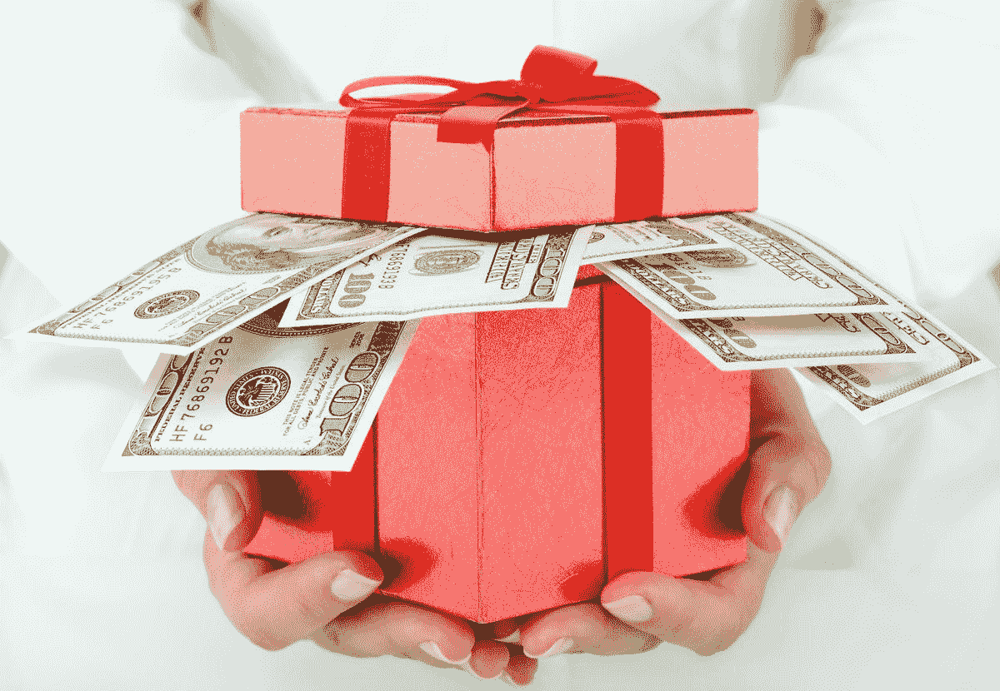

Image taken from Forbes

作为被动收入和注册奖金的一种追求，几天前 Nexo 的一条新闻引起了我的注意——Nexo 目前为平台的新用户提供高达 150 美元的注册奖金！作为 Nexo 的现有用户，遗憾的是，这不是我可以利用的——但如果你是 Nexo 的新手，你可能想继续阅读以了解更多！

# Nexo 是什么？

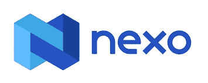

N[**exo**](https://nexo.io/ref/hce5cfdt5o?src=web-link)**本质上是一个数字钱包，我在里面储存加密货币并赚取利息。它声称是世界上最先进、受监管的数字资产机构，提供即时加密贷款、每日资产收益、交换，并且是唯一一家以 40 多种法定货币和 200 多个司法管辖区向全球 350 多万用户提供服务的区块链公司。由于他们的[行业知名托管人](https://click.nexo.io/?qs=d9b40bbe1a58a36f7ea29e6d552e344de113c7feb764a9c2a7dae175a0605825cad5d64a7470882ebc28e833a5b93c2839fb2cd14990725df0b1a60c76ed9f76)和领先的合规管理机构，Nexo 持有的所有资产价值最高可保证 3 . 75 亿美元。**

**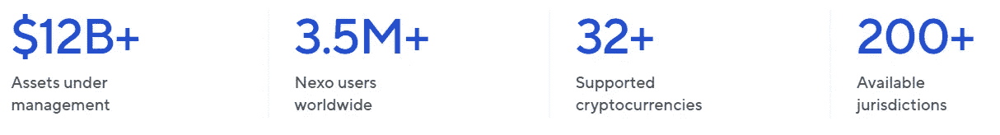**

# **Nexo 简介**

**简而言之，[**Nexo**](https://nexo.io/ref/hce5cfdt5o?src=web-link)**提供了如下一系列服务:****

*   ******购买:**使用您的 Visa 和 Mastercard 信用卡或借记卡，直接在 Nexo 平台上安全地购买所有您喜欢的加密货币。购买的资产会立即记入您的帐户，没有隐藏的费用，请放心，显示的金额就是您将被收取的费用。****
*   ******交换:**直接在 Nexo 平台上，在 300 多个市场对之间轻松交换。交易以有竞争力的价格立即执行。除此之外，每购买或交换一次加密，可获得高达 0.5%的返现(取决于您的忠诚度等级，忠诚度等级越高，您获得的返现就越多)。****

****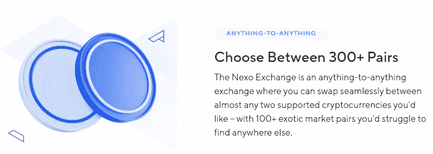****

*   ******赚取:**获得高达 20%的利息，每天从您的密码和稳定帐户中支付！这是 Nexo 提供的我个人最喜欢的服务之一，因为我可以安全地存储我的加密货币，同时允许它以比传统金融机构更好的利率复利！利息按日支付，并可根据灵活的条款随时提取。锁定条款提供了更高的收益率，但代价是灵活性降低，因为资产被锁定在 1 至 3 个月的期限内。****

****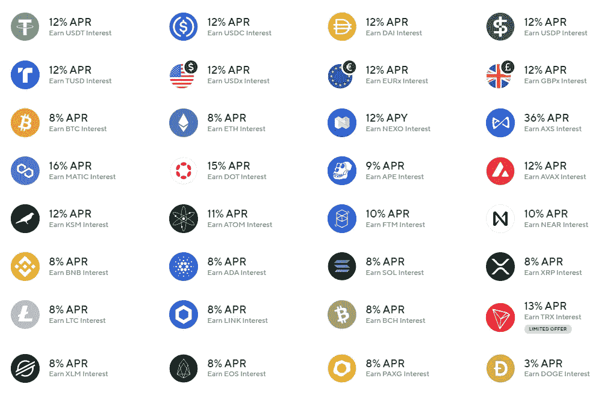********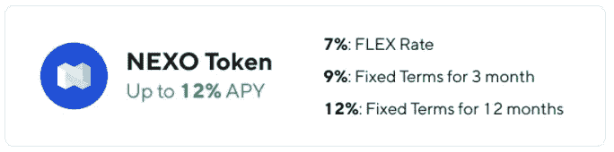****

*   ******借款:**享受即时加密信贷额度，借款利率从 4 月份的 0%开始。这是一个无麻烦的过程，没有发起费用或信用检查。****

****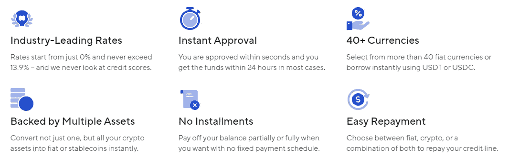****

# ****为什么选择 Nexo？****

****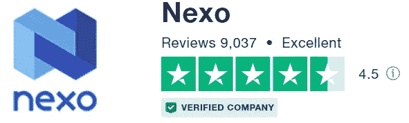****

****Nexo 在 Trustpilot 上的评级为优秀；不难看出其中的原因。****

********

*   ******安检**:你的资金是 Nexo 上的 SAFU****

****Nexo 是一个安全的平台，您的资产受到军用级别的 III 级保险库、3.75 亿美元的托管资产保险和实时储备审计的保护。****

****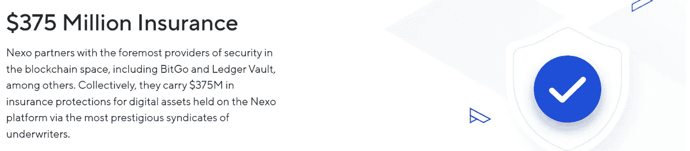********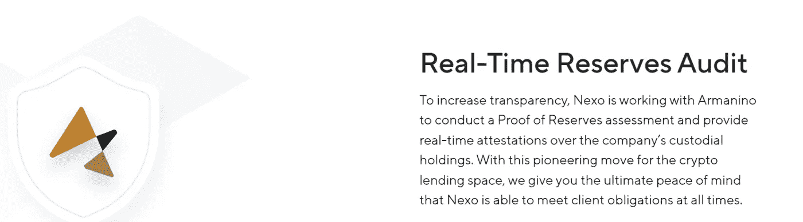********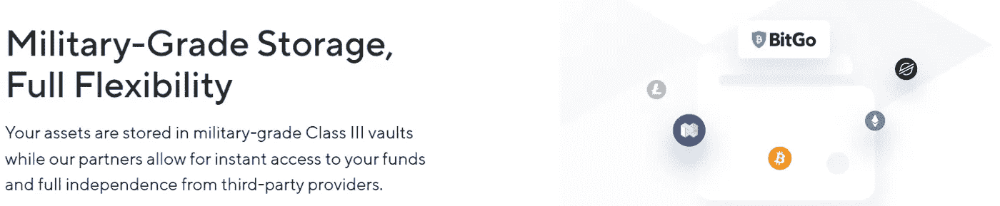****

*   ******诱人的利率**让你闲置的数字资产获得巨大的被动收入！****
*   ******免费提现**！随着 Polygon bridge 的推出，通过 Polygon 网络的所有提款都是免费的，通过以太坊网络的每月免费提款数量有限，这也取决于您的忠诚度等级。关于这方面的更多信息，请查看我以前的文章[这里](/coinmonks/bridging-erc20-matic-the-nexo-multichain-bridge-597ae382bad1)。****
*   ****可靠而有帮助的**客户服务**。****
*   ****通往**菲亚特**的桥梁。****

****事实上，这样的例子不胜枚举！在我之前的文章中，看看我喜欢使用 Nexo 的主要原因。****

**** [## 我喜欢使用 Nexo 的原因

### 按照爱因斯坦的说法，“复利是世界第八大奇迹。谁理解它，谁就赢得它…谁…

medium.com](/coinmonks/reasons-why-i-love-using-nexo-522527e05eb2) 

# 如何利用 150 美元奖金

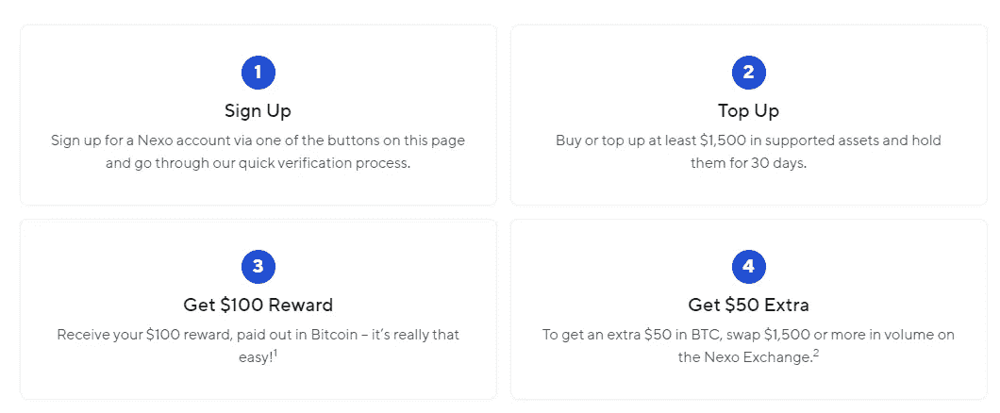

*   **使用 150 美元的欢迎奖金登录页面为 Nexo 注册**，该页面可在[此处](https://platform.nexo.io/ref/getstarted150)或 [Nexo 官方网站](https://nexo.io/)找到。

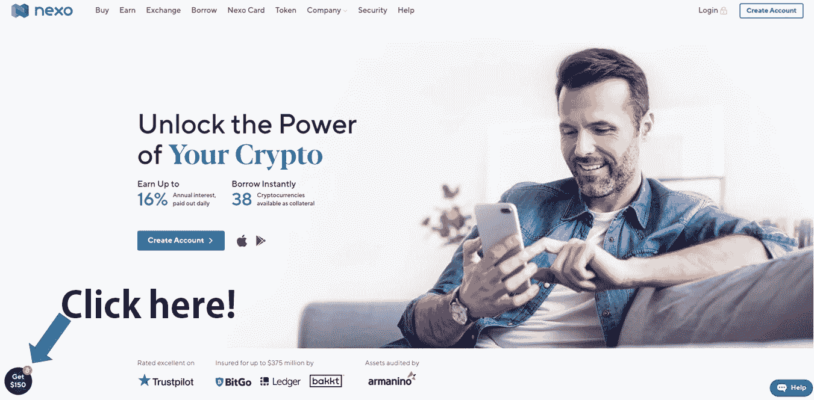

(注意:你只能选择使用[推荐链接](https://nexo.io/ref/hce5cfdt5o?src=web-link)获得 25 美元的注册奖励，比如我的[这里的](https://nexo.io/ref/hce5cfdt5o?src=web-link)，或者使用我之前提到的链接获得 150 美元的欢迎奖励；这两项奖励不可叠加。如果你想投资不超过 1500 美元的资本，你仍然可以用 100 美元的存款获得 25 美元的注册奖金，使用我这里的[推荐链接](https://nexo.io/ref/hce5cfdt5o?src=web-link)

*   完成 KYC 验证。
*   存放任何价值 1500 美元的支持资产，持有期为 30 天。有几种不同的充值方式——使用您的私人存款地址从外部钱包转移资产；通过银行转账充值，并在 Nexo 交易所用 stablecoins 兑换 crypto 或者直接用信用卡或借记卡购买数字资产。
*   在 30 天的持有期结束时，将以比特币形式存入 100 美元的注册奖金。然后，比特币奖金可以被提取，或者干脆留在 Nexo，以进一步复利。
*   要在 100 美元的基础上获得额外的 50 美元奖金，只需在 30 天的持有期内利用 Nexo 上的交易所在 Nexo 交易所进行 1500 美元或更多的交易。这笔额外奖金将于 2022 年 8 月 1 日至 8 月 10 日存入您的 Nexo 账户。

# 150 美元奖金有什么好处？

*   促销活动在有限的时间内进行，从 5 月 5 日星期四 00:00 UTC 到 7 月 1 日星期四 14:00 UTC。
*   你一定是 Nexo 的新用户。
*   注册必须通过[欢迎奖金登录页面](https://platform.nexo.io/ref/getstarted150)而不是通过[推荐链接](https://nexo.io/ref/hce5cfdt5o?src=web-link)([推荐链接](https://nexo.io/ref/hce5cfdt5o?src=web-link)使你有权以 100 美元的最低存款获得 25 美元的注册奖金，而目前最低存款为 1500 美元的注册奖金增加到 150 美元)
*   身份验证必须已经完成。
*   受支持资产的存款价值必须至少为 1500 美元，并且在 30 天持有期结束时必须保持在该价值以上。(在这方面，我个人建议存入稳定的硬币，以避免期末价格波动影响您获得奖励的资格)
*   1，500 美元的余额应仅从外部钱包发送到 Nexo 账户；从其他 Nexo 钱包进行的内部转账将没有资格参与促销活动。

# 最后的想法

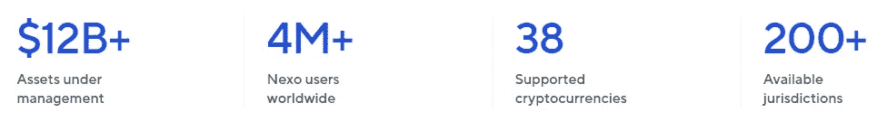

如果你是加密货币的新手，并且正在寻找一个多功能的数字钱包，而不仅仅是安全地存储你的资产，那么看看 Nexo 吧！3 年多来，我一直是 Nexo 的满意客户，就像其他用户一样。

当你开始 Nexo 的被动收入之旅时，为什么不利用它诱人的注册奖金呢？

*   如果您拥有资产 **> $1500** ，您可以通过上述当前正在进行的促销活动在 BTC 获得高达$150 的**注册奖金。**
*   如果你的资产价值在**100 美元到 1500 美元**之间，你可以通过[推荐链接](https://nexo.io/ref/hce5cfdt5o?src=web-link)在 BTC 获得**25 美元**的注册奖金，比如我的[这里](https://nexo.io/ref/hce5cfdt5o?src=web-link)！

请随意查看我之前在 Nexo 上的文章，并在下面的评论区留下您的想法。投资愉快！

 [## 桥接 ERC 20 & MATIC:Nexo 多链桥

### Nexo 已经与 Polygon 网络集成，将基于 ERC20 的 ETH、USDT、USDC、MATIC 和许多其他公司连接到 Polygon…

medium.com](/coinmonks/bridging-erc20-matic-the-nexo-multichain-bridge-597ae382bad1)  [## 我喜欢使用 Nexo 的原因

### 按照爱因斯坦的说法，“复利是世界第八大奇迹。谁理解它，谁就赢得它…谁…

medium.com](/coinmonks/reasons-why-i-love-using-nexo-522527e05eb2) 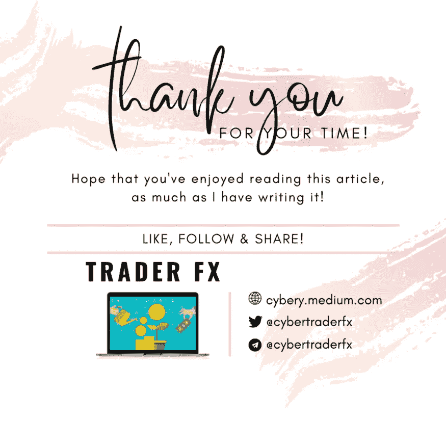

和往常一样，这不是财务建议！而只是我投资过的，觉得值得分享的投资平台。在投资前做好自己的研究，不要存你输不起的钱。下面有什么问题可以随时问我。

*如果你喜欢这篇文章，* [*跟着&订阅*](/@cybery) *！*

*查看以下值得信赖的平台！*

*🎁*[*honey gain*](https://r.honeygain.me/CYBER577DD)*一款被动收入 app，从你未使用的互联网带宽中赚钱。* [*免费获得 5 美元*](https://r.honeygain.me/CYBER577DD) *，无需投资。*

*🎁* [*蛋糕 Defi*](https://cakedefi.com/?ref=677920) *一站式投资平台，以高达 100%的年利率烘焙被动现金流！* [*在 DFI 用 50 美元存款获得 50 美元奖金*](https://cakedefi.com/?ref=677920) *。*

*🎁*[*Nexo*](https://nexo.io/ref/hce5cfdt5o?src=web-link)*一家先进、受监管的数字资产机构，提供即时加密贷款，资产年利率高达 36%，是一家交易所，在 200 多个司法管辖区提供 40 多种法定货币的服务。* [*用 100 美元存款获得 25 美元*](https://nexo.io/ref/hce5cfdt5o?src=web-link) 奖金*。*

*🎁*[*Hodlnaut*](https://www.hodlnaut.com/join/RTbHxuJMX)*一个强大的加密借贷平台，从你闲置的加密货币中产生被动现金流，年利率高达 9.4%。* [*在 USDC 存款 1000 美元可获得 30 美元*](https://www.hodlnaut.com/join/RTbHxuJMX) *奖金，存款 1500 美元可获得 50 美元。*

*🎁* [*Kucoin*](https://www.kucoin.com/r/af/rJH29LZ) *一个庞大的加密货币交易所，提供有趣的产品，如赌注、自由交易机器人和比特币云挖掘服务。*

*🎁* [*火币*](https://www.huobi.com/en-us/topic/double-invite/register/?invite_code=5t5jb) *一个提供多样化产品、免费空投和交易机器人的加密货币交易所。*

*🎁*[*MEXC*](https://www.mexc.com/en-US/register?inviteCode=mexc-1NAJC)*一家持有 MX 令牌的加密货币交易所，有着有趣的列表和频繁的空投。*

*🎁*[*Crypto.com*](https://read.cash/@TraderFX/10-tips-to-maximize-earnings-on-honeygain-an-effortless-free-passive-income-app-68535728#bad-link)*一家位于新加坡的加密货币交易所。* [*获得 25 美元*](https://crypto.com/app/fcbsjmf5pb) *在 CRO 赌一张红宝石卡。*

*🎁*[*Pionex*](https://www.pionex.com/en-US/sign/ref/mWhH4v29)*一个免费的多功能套利交易机器人，自动化低买高卖的过程，全天候。*

***针对马来西亚投资者***

*🎁*[*Luno*](https://www.luno.com/invite/EDXG2X)*在 BTC 用 100 令吉购买 BTC 获得 25 令吉奖金！*

*🎁* [*斯塔沙威*](https://www.stashaway.my/referrals/kenleel9jx) *获得 6 个月免费投资！*

*🎁Wahed code 'KENLIE1' RM10 注册奖金*

*🎁Capbay P2P 代码' 8879c6' RM100 注册奖金*

*🎁* [*亦然*](https://download.versa.com.my/1bAf/referral?deep_link_value=QF218MMB) *用 100 令吉存款获得 10 令吉奖金！*

*🎁*[*KDI*](https://app.digitalinvesting.com.my/registration/signup?referral_code=103433)*存入 250 令吉，即可获得 10 令吉的奖金！*

***接我*** [***中***](https://cybery.medium.com/)***|***[***read . cash***](https://read.cash/r/TraderFX)***|***[***Youtube***](https://www.youtube.com/c/SmartInvestingChannel)***|***[***推特***](https://twitter.com/cybertraderfx)

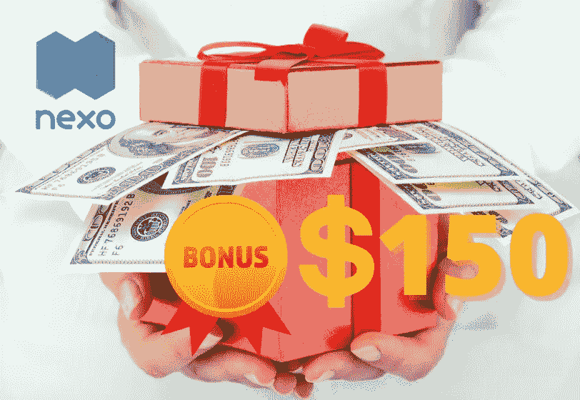

> 加入 Coinmonks [电报频道](https://t.me/coincodecap)和 [Youtube 频道](https://www.youtube.com/c/coinmonks/videos)了解加密交易和投资

# 另外，阅读

*   [3 commas Review](/coinmonks/3commas-review-an-excellent-crypto-trading-bot-2020-1313a58bec92)|[Pionex Review](https://coincodecap.com/pionex-review-exchange-with-crypto-trading-bot)|[coin rule Review](/coinmonks/coinrule-review-2021-a-beginner-friendly-crypto-trading-bot-daf0504848ba)
*   [莱杰 vs Ngrave](/coinmonks/ledger-vs-ngrave-zero-7e40f0c1d694) | [莱杰 nano s vs x](/coinmonks/ledger-nano-s-vs-x-battery-hardware-price-storage-59a6663fe3b0) | [币安评论](/coinmonks/binance-review-ee10d3bf3b6e)
*   [Bybit Exchange 评论](/coinmonks/bybit-exchange-review-dbd570019b71) | [Bityard 评论](https://coincodecap.com/bityard-reivew) | [Jet-Bot 评论](https://coincodecap.com/jet-bot-review)
*   [3 commas vs crypto hopper](/coinmonks/3commas-vs-pionex-vs-cryptohopper-best-crypto-bot-6a98d2baa203)|[赚取加密利息](/coinmonks/earn-crypto-interest-b10b810fdda3)
*   最好的比特币[硬件钱包](/coinmonks/hardware-wallets-dfa1211730c6) | [BitBox02 回顾](/coinmonks/bitbox02-review-your-swiss-bitcoin-hardware-wallet-c36c88fff29)
*   [BlockFi vs 摄氏](/coinmonks/blockfi-vs-celsius-vs-hodlnaut-8a1cc8c26630) | [Hodlnaut 点评](/coinmonks/hodlnaut-review-best-way-to-hodl-is-to-earn-interest-on-your-bitcoin-6658a8c19edf) | [KuCoin 点评](https://coincodecap.com/kucoin-review)****