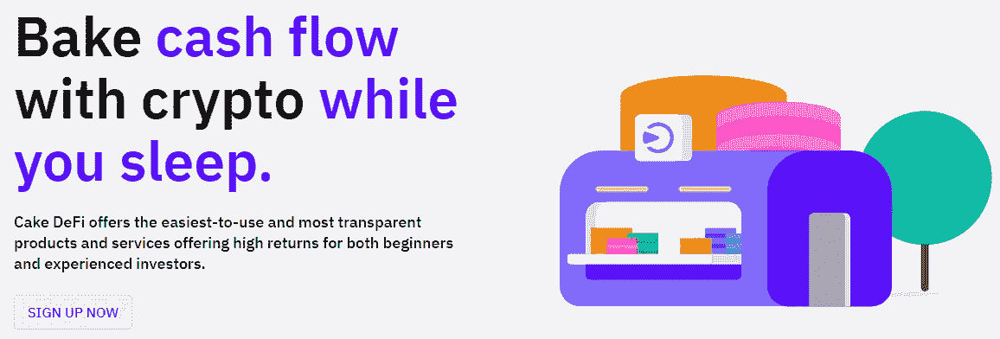
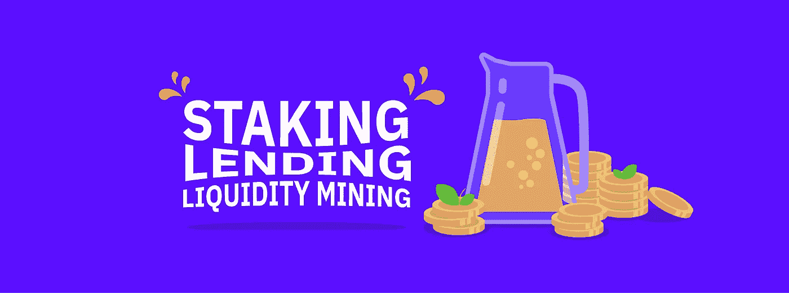
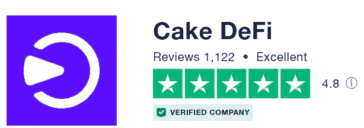
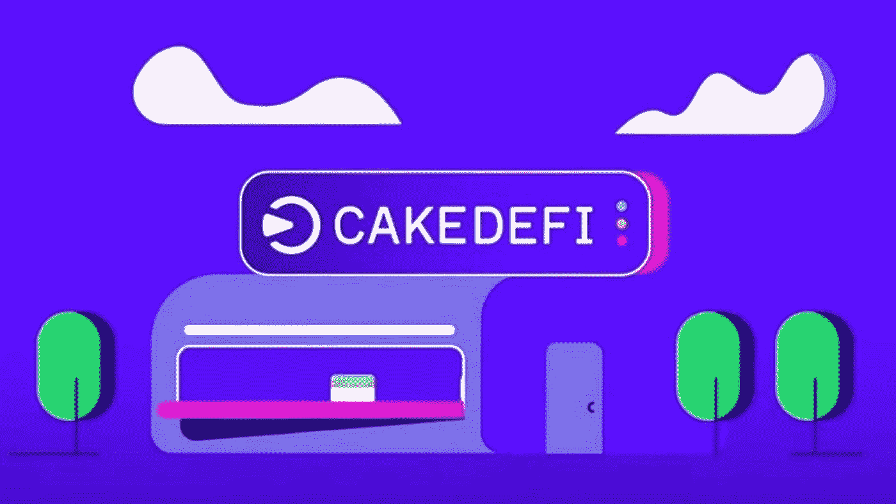

# 如何在这个复活节从蛋糕大战中获得 40 美元的免费签约奖金！

> 原文：<https://medium.com/coinmonks/how-to-get-a-free-40-signup-bonus-from-cake-defi-this-easter-7523230c9af?source=collection_archive---------13----------------------->

C ake DeFi 是一个总部位于新加坡的一站式密码货币投资平台，通过投资、流动性挖掘&贷款服务，从闲置的密码货币中获取被动现金流，产生高达 150%的 APY 回报率。老实说，正是当时相对慷慨的签约奖金两年前吸引了我加入他们——我几乎不知道，蛋糕 DeFi，已经将我的投资组合规模扩大了一倍，并且凭借其巨大的潜力, [DFI 币](/coinmonks/dfi-an-underrated-coin-7effca02ed3f)(def link 币)的表现超过了 BTC，将会是我做过的最好的投资决定之一；我唯一的遗憾是没有早点签约！蛋糕 DeFi 通常提供 30 美元的签约奖金，最低存款额为 50 美元，转化为令人印象深刻的 60%的投资回报率——这一签约奖金现在扩大到更慷慨的 40 美元，存款额相同，尽管条款有一些变化，我将在下面的文章中详细阐述。

# 简单地

[**Cake DeFi**](https://cakedefi.com/?ref=677920) 根据您的风险偏好和投资偏好，提供多种服务培育您的密码货币。我将它的主要产品总结如下:更多详情，请通读我之前的文章，了解蛋糕定义服务的[概述](/coinmonks/earn-delicious-passive-cash-flow-with-cake-defi-f01fce47e4c6)，以及关于使用蛋糕定义服务产生被动收入的[教程](/coinmonks/how-to-earn-passive-income-with-cake-defi-a-tutorial-64abe4a01bec)。

*   **入股**:分配 DFI 进入入股，回报率在 30-40%之间。持有/不持有资产没有费用。投资是在灵活的条件下进行的，没有最短的合同期限。在 DFI，奖励每天支付两次，因此与资本相结合。
*   **流动性挖掘**:将 2 项同等价值的资产分配到流动性挖掘池中，如比特币-DFI、以太网-DFI、USDT-DFI 等，产生最高 150%的 APR 回报(取决于市场情况)。奖励主要在 DFI 每天支付两次，并且可以自动下注以产生更多的复利。最近推出的[分散资产](/coinmonks/invest-in-tesla-google-apple-easily-with-decentralized-assets-cdfe4e58330b)代表了分散金融的一场革命，使投资者能够在股票/ETF/贵金属投资的两个领域中两全其美，同时获得高收益的隐货币。
*   **贷款**:通过贷款，资产(比特币/以太坊/ USDT/ USDC)被锁定在 1 个月的期限内，有保证的基础年利率和潜在回报，如果资产价格超过某个目标，在期限到期时。
*   **冰柜**:冰柜可以比作一个忠诚度计划，投资者将他们的资金锁定在一段固定的时间内，从每月到 10 年不等，以换取更高的回报。

# 为什么是蛋糕 DeFi？

[**蛋糕 DeFi**](https://cakedefi.com/?ref=677920) 是让你闲置的数字资产发挥作用的绝佳方式，产生被动现金流，让你可以高枕无忧。请放心，您的基金是蛋糕中的 SAFU，由一个敬业、透明的团队运营，他们永远愿意创新和提供帮助。看看我之前的文章[关于为什么我喜欢用蛋糕 DeFi！毕竟，Cake DeFi 赢得了像我一样的许多快乐顾客的信任，在像](/coinmonks/8-reasons-why-i-love-using-cake-defi-f6547b9dfc4c) [Truspilot](https://www.trustpilot.com/review/cakedefi.com) 这样的评论网站上获得了很高的评级，这不是没有原因的！

# 如何获得 40 美元奖金？

[**Cake DeFi**](https://cakedefi.com/?ref=677920) 最近推出了寻找复活节彩蛋的促销活动，在 2022 年 4 月 25 日之前的有限时间内，注册奖金从之前的 30 美元增加到 40 美元。他们最近还修改了该奖励的条款和条件，新用户除了通过 KYC 验证之外，还需要通过参加以下活动锁定至少 50 美元的资产，为期至少 1 个月:

*   1 批贷款:进入 BTC/联邦理工学院/ USDT/ USDC 贷款批次，为期一个月，最低投资额为 50 美元。奖金在输入的批次开始时支付。
*   流动性挖掘冰柜:将至少 50 美元的资金分配到流动性挖掘池中，然后前往冰柜将其冻结至少 1 个月。奖金将在冻结时支付。
*   下注冰柜:下注至少 50 美元的 DFI/达什，然后去冰柜把它冷冻至少一个月。奖金将在冻结时支付。

赢得的 40 美元奖励在 DFI 支付，在冰柜中锁定 180 天，之后(解冻后！)奖金可以自由提取/用于进一步投资。与此同时，这笔奖金虽然被锁在冰箱里，但会努力产生复利，所以这将是一个很好的锦上添花！在完成 1 个月的初始锁定期后，您的资本(初始 50 美元存款)可以自由使用，从而使您有权获得奖金。

# 合格交易的示例

*   一笔 50 美元 USDT 的存款存入一批贷款，为期 1 个月。
*   价值 50 美元的 LTC 存款进入流动性挖掘，然后冻结 1 个月(在进入流动性挖掘池后，前往冰柜冻结您的资金)
*   在 DFI 存入 50 美元，然后冻结一个月(同样，在下注后，去冰柜冻结你的资金)

# 最后的想法

[**Cake DeFi**](https://cakedefi.com/?ref=677920) 是一个值得信赖的平台，在你踏上财务独立之旅的同时，产生被动现金流。我已经无数次提取了我在 Cake DeFi 上产生的一部分利息，而我的资本和剩余利息继续在后台复利。虽然获得注册奖金的新条款可能看起来是一个额外的障碍，但请记住，锁定的奖金将是复利，您将能够获得投资蛋糕定义的全部经验；甚至可能在平台上投资获得如此多的乐趣，以至于你忘了计算注册奖金到期的天数！

[**立即注册**](https://cakedefi.com/?ref=677920) **开始从您的数字资产中产生被动现金流！**

*更新:复活节促销已经结束；然而，当您在此* *注册* [*时，您仍然可以通过我的会员链接获得 30 美元的注册奖金+10 美元的学习&收入+独家额外奖金！*](https://cakedefi.com/?ref=677920)

# 进一步阅读

 [## 用蛋糕 DeFi 赚取美味的被动现金流！

### 沃伦·巴菲特曾经说过‘如果你在睡觉的时候没有找到赚钱的方法，你会一直工作到死。“的确……

medium.com](/coinmonks/earn-delicious-passive-cash-flow-with-cake-defi-f01fce47e4c6)  [## 如何赚取蛋糕 DeFi 被动收入:教程

### 沃伦·巴菲特曾经说过“如果你在睡觉的时候没有找到赚钱的方法，你会一直工作到死。”这是…

medium.com](/coinmonks/how-to-earn-passive-income-with-cake-defi-a-tutorial-64abe4a01bec)  [## 用分散的资产轻松投资特斯拉、谷歌和苹果！

### 概述

medium.com](/coinmonks/invest-in-tesla-google-apple-easily-with-decentralized-assets-cdfe4e58330b)  [## DFI，一枚被低估的硬币？

### 经过几天的绿色交易后，加密货币市场今天正在经历一些修正，也许…

medium.com](/coinmonks/dfi-an-underrated-coin-7effca02ed3f)  [## 我喜欢用蛋糕 DeFi 的 8 个理由！

### Cake DeFi 是一个加密货币投资平台，从您的数字资产中产生被动收入。立即注册…

medium.com](/coinmonks/8-reasons-why-i-love-using-cake-defi-f6547b9dfc4c) 

*本文使用的部分图片和资料摘自蛋糕 DeFi 网站和博客。*

和往常一样，这不是财务建议！而只是我投资过的，觉得值得分享的投资平台。在投资前做好自己的研究，不要存你输不起的钱。下面有什么问题可以随时问我。

*如果您喜欢这篇文章，* [*关注&订阅*](/@cybery) *！*

*查看以下值得信赖的平台！*

*🎁*[*honey gain*](https://r.honeygain.me/CYBER577DD)*一款被动收入 app，从你未使用的互联网带宽中赚钱。* [*免费获得 5 美元*](https://r.honeygain.me/CYBER577DD) *，无需投资。*

*🎁* [*蛋糕 Defi*](https://cakedefi.com/?ref=677920) *一站式投资平台，以高达 200%的年利率烘焙被动现金流！* [*在 DFI 用 50 美元存款获得 30 美元*](https://cakedefi.com/?ref=677920) *。*

*🎁*[*Nexo*](https://nexo.io/ref/hce5cfdt5o?src=web-link)*全球最先进、受监管的数字资产机构，在 200 多个司法管辖区提供 40 多种法定货币的即时加密贷款、每日资产收益、交换和服务。* [*用 100 美元存款获得 25 美元*](https://nexo.io/ref/hce5cfdt5o?src=web-link) *。*

*🎁* [*摄氏度*](https://celsiusnetwork.app.link/174094633e) *一个金融科技平台，提供带息储蓄账户、借贷，以及用数字和法定资产进行支付。* [*在 BTC 拿 50 美元*](https://celsiusnetwork.app.link/174094633e) *拿 400 美元存款。*

*🎁*[*Hodlnaut*](https://www.hodlnaut.com/join/RTbHxuJMX)*一个稳健的新加坡加密借贷平台，成立于 2019 年，从你闲置的加密货币中产生被动现金流。* [*拿 30 美元*](https://www.hodlnaut.com/join/RTbHxuJMX) *在 USDC 存 1000 美元。*

*🎁* [*BlockFi*](https://blockfi.com/?ref=a16e37fd) *一种加密货币兑换和钱包。* [*用 100 美元存款获得 10 美元*](https://blockfi.com/?ref=a16e37fd) *。*

*🎁* [*库币*](https://www.kucoin.com/land/register/r/rJH29LZ) *最大的加密货币交易所之一。*

*🎁* [*火币*](https://www.huobi.com/en-us/topic/double-invite/register/?invite_code=5t5jb) *最大的加密货币交易所。*

*🎁*[*MEXC*](https://m.mexc.com/auth/signup?inviteCode=1NAJC)*最大的加密货币交易所之一。*

*🎁*[*Crypto.com*](https://read.cash/@TraderFX/10-tips-to-maximize-earnings-on-honeygain-an-effortless-free-passive-income-app-68535728#bad-link)*一款基于新加坡的加密货币兑换 app。* [*得到 25 美元*](https://crypto.com/app/fcbsjmf5pb) *在 CRO 赌赢一张红宝石牌。*

*针对马来西亚投资者*

*🎁* [*斯塔沙威*](https://www.stashaway.my/referrals/kenleel9jx) *获得 6 个月免费投资！*

*🎁Wahed code 'KENLIE1' RM10 注册奖金*

*🎁Capbay P2P 代码' 8879c6' RM100 注册奖金*

*接我* [*中*](https://cybery.medium.com/)*|*[*read . cash*](https://read.cash/r/TraderFX)*|*[*Youtube*](https://www.youtube.com/c/SmartInvestingChannel)*|*[*推特*](https://twitter.com/cybertraderfx) *|*

**

> *加入 Coinmonks [电报频道](https://t.me/coincodecap)和 [Youtube 频道](https://www.youtube.com/c/coinmonks/videos)了解加密交易和投资*

# *另外，阅读*

*   *[瓦济里克斯 NFT 评论](https://coincodecap.com/wazirx-nft-review)|[Bitsgap vs Pionex](https://coincodecap.com/bitsgap-vs-pionex)|[Tangem 评论](https://coincodecap.com/tangem-wallet-review)*
*   *[如何使用 Solidity 在以太坊上创建 DApp？](https://coincodecap.com/create-a-dapp-on-ethereum-using-solidity)*
*   *[币安 vs FTX](https://coincodecap.com/binance-vs-ftx) | [最佳(SOL)索拉纳钱包](https://coincodecap.com/solana-wallets)*
*   *[如何在 Uniswap 上交换加密？](https://coincodecap.com/swap-crypto-on-uniswap) | [A-Ads 审查](https://coincodecap.com/a-ads-review)*
*   *[加密货币储蓄账户](/coinmonks/cryptocurrency-savings-accounts-be3bc0feffbf) | [YoBit 评论](/coinmonks/yobit-review-175464162c62)*