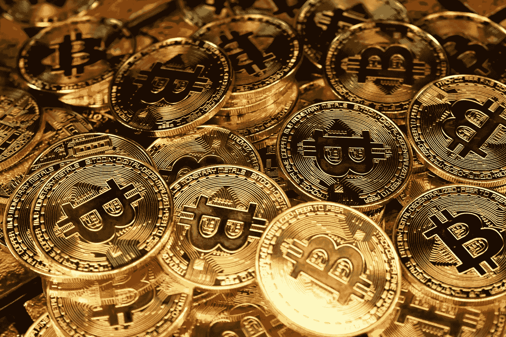

# 如何获得免费的加密货币

> 原文：<https://medium.com/coinmonks/how-to-get-free-cryptocurrency-fa9b2ba11bfc?source=collection_archive---------39----------------------->

人生最美好的东西都是免费的吧？包括密码。

有很多方法可以让你不用做太多的工作就可以免费获得密码。

然而，在网上搜索这个通常会导致一些人抛出自己的硬币，以及许多其他的骗局。

今天，我们将寻找合法的途径来获得免费的加密。

我们知道每个人都很忙，所以这些方法很简单，应该会占用你 30 分钟以上的时间。

让我们上车吧！

# **注册交易所**

注册交易所是免费建立你的密码袋的好方法。有两个交易所可以轻松赚取免费的加密货币。

第一个是比特币基地。比特币基地有很多不同的原因，但一个巨大的优势是，你可以使用推广链接获得 10 美元的比特币，只需注册并在头 30 天内存入 100 美元。还有一些其他的方法可以在比特币基地上获得免费的加密，我们稍后会谈到。

[**使用此推广链接报名前往比特币基地。**](https://coinbase.com/join/heil_58)

第二个获得免费加密的交易所叫做双子座。下面会再次提到双子座，但这是另一个很好的交易，可以提供额外的奖励。像比特币基地一样，在 30 天内使用推广链接存入 100 美元，你将获得 10 美元的比特币。

使用此推广链接注册 Gemini。

# **比特币基地学有所得**

除了比特币基地提供 10 美元的比特币供你注册和投资，他们还有一个名为“学习和赚取”的项目。

比特币基地学习和赚取是一个简单的，但伟大的方式来赚取免费的加密不需要花费太多的时间。实际上，在大约 30 分钟内，你可以免费获得大约 50 美元的不同加密货币。

以下是比特币基地如何学习和获得作品:

在比特币基地网站上，将会有一个学习和收获板块。在这里，单击您想要了解和获取的加密。然后你会看一个很短的视频。这些视频通常不到一分钟。然后会有一个关于你刚才看的视频的问题。正确回答问题，你将获得少量的密码，通常每个问题一美元。

你可以免费赚取 1.5 美元到 10 美元不等的钱，这取决于你学习的是哪种加密技术。

比特币基地学习和收入可以给很多种不同的密码，这是一个很好的方式来分散你的投资组合。

[**使用此推广链接注册比特币基地。**](https://coinbase.com/join/heil_58)

# **使用勇敢的浏览器**

Brave 是一款互联网浏览器，它以快速、私密和安全而闻名。他们不像谷歌那样收集你的数据，并提供无广告的体验。

但是，他们向你展示他们自己的广告，这可以为你赢得基本注意力令牌(BAT)。

你可以设置你想看广告的时间。最多每 6 分钟一个广告，所以每小时 10 个广告。对于移动体验，这些广告是作为推送通知发送的。你可以轻而易举地把它拿走。

每次你在 Brave 上看到一个广告，你都会得到一小笔 BAT。随着时间的推移，仅仅浏览互联网就能让你收获不少。

BAT 最棒的一点是，你可以直接在浏览器上给你喜欢的创作者提示。你的代币会直接给创作者，给创作者更多的钱，而不是像 app store 那样的中间人。

# **水龙头**

水龙头是一个有趣的方式来赚取少量的某些免费密码。

其实挺好用的。你去一个有水龙头的网站，输入你的钱包地址，点击一个按钮，瞧，你会得到少量的密码。就这么简单。

水龙头通常是为了让人们对一个项目感兴趣。

不过，没有多少加密货币有水龙头。主要的几个是 NANO 和 Moons，它们是 Reddit 上的一种社交货币。

# **赌上你的密码**

你可以押上你的密码，以赚取你的密码的利息。这个利息是由你押的代币提供的。例如，如果你下注 100 卡达诺，几个星期后你就会有 101 卡达诺。

赌注类似于挖掘密码，但使用更少的能量

赌注大多是在钱包上完成的。只要把你的密码放在钱包里，你就能获得密码利息。这非常容易。你押的密码越多，你赚的就越多。

如果你不想找一个钱包来存放你的密码，你可以用一个交易所。

比特币基地让你持有一定的密码，虽然不要太多。例如，你只需在比特币基地持有 ALGO，就能以 4%的利率持有阿尔格兰德(ALGO)股票。

双子座提供了更好的回报，让你选择更多的加密货币来赚取利息。如果你决定用交易所自己的双子币，一种固定在 1 美元上的稳定币，你将从你的密码资产中获得 8.05%的利息。你甚至可以赚取少量的 [**比特币**](https://www.cryptolovesh2o.com/blog-posts/what-is-bitcoin-is-bitcoin-worth-investing-in) 和以太坊币。

[**使用此推广链接报名 Gemini。**](https://gemini.com/share/46em5ykcl)

# **总结和现在做什么？**

注册一个交易所是免费获得少量密码以增加初始投资的简单方法。用勇者上网浏览可以赚到少量 BAT。你可以通过钱包或比特币基地或双子座这样的交易所获得被动加密。比特币基地学习和赚取让你得到各种各样的加密只是为了观看视频和接受测验。水龙头是一个体面的方式，通过在项目的网站上输入你的钱包地址，免费赚取少量的加密。

如果你喜欢你今天在这里读到的内容，考虑捐一点点比特币到这个地址:

> ***33b 81 web WG 8 dfirbpanysk 7 TN 7 ZT 4 buyss***

既然你已经知道了如何获得免费加密，学习一下 [**购买加密的最佳方式！**](https://www.cryptolovesh2o.com/blog-posts/what-are-the-best-exchanges-to-buy-crypto)

> 加入 Coinmonks [电报频道](https://t.me/coincodecap)和 [Youtube 频道](https://www.youtube.com/c/coinmonks/videos)了解加密交易和投资

# 另外，阅读

*   [WazirX vs CoinDCX vs bit bns](/coinmonks/wazirx-vs-coindcx-vs-bitbns-149f4f19a2f1)|[block fi vs coin loan vs Nexo](/coinmonks/blockfi-vs-coinloan-vs-nexo-cb624635230d)
*   [本地比特币审核](/coinmonks/localbitcoins-review-6cc001c6ed56) | [加密货币储蓄账户](https://coincodecap.com/cryptocurrency-savings-accounts)
*   [什么是保证金交易](https://coincodecap.com/margin-trading) | [美元成本平均法](https://coincodecap.com/dca)
*   [支持卡审核](https://coincodecap.com/uphold-card-review) | [信任钱包 vs 元掩码](https://coincodecap.com/trust-wallet-vs-metamask)
*   [Exness 回顾](https://coincodecap.com/exness-review)|[moon xbt Vs bit get Vs Bingbon](https://coincodecap.com/bingbon-vs-bitget-vs-moonxbt)