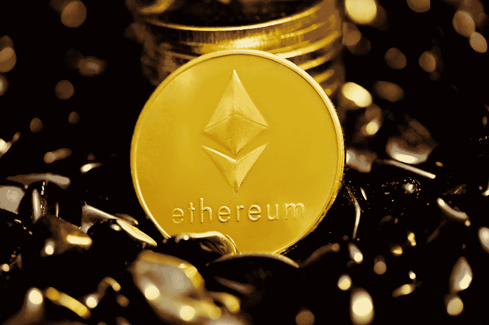
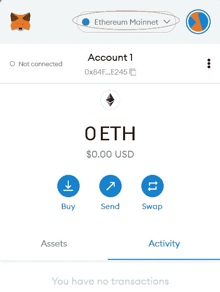
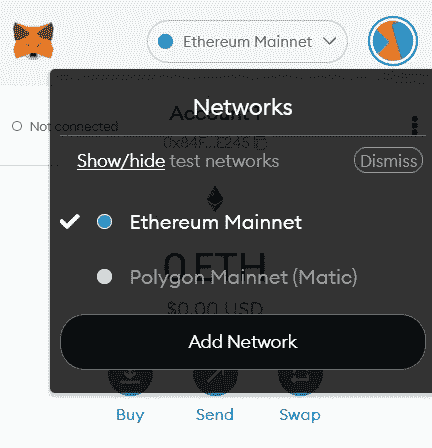
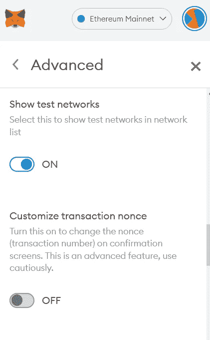
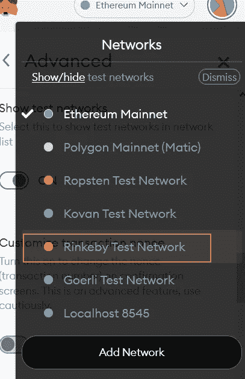
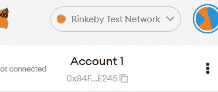
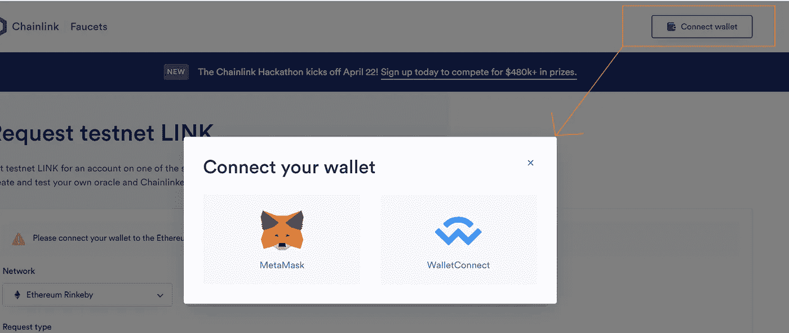
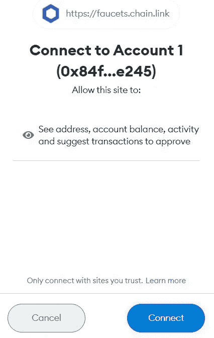
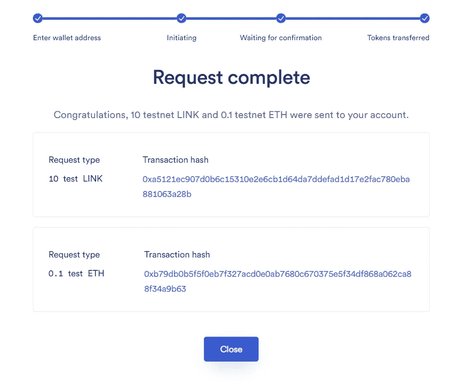

# 如何在您的加密钱包中获得免费测试乙醚

> 原文：<https://medium.com/coinmonks/how-to-get-free-test-ether-on-your-crypto-wallet-675ee44813ef?source=collection_archive---------12----------------------->

## 从 Metamask 钱包上的 Chainlink Rinkeby 水龙头获得免费测试乙醚

Photo by [Kanchanara](https://unsplash.com/@kanchanara?utm_source=medium&utm_medium=referral) on [Unsplash](https://unsplash.com?utm_source=medium&utm_medium=referral)

在我们开始之前，让我们澄清一下，这篇文章不是关于免费获得加密货币，或者至少不是拥有真正价值的东西。这篇文章是关于从[链条水龙头](https://faucets.chain.link/)中获取**测试乙醚**，以便你以后可以使用。

现在把它放在一边，让我们直接进入任务。

## 什么是测试乙醚，为什么有人需要它？

顾名思义，Test Ether 是在智能合约部署到以太坊主网之前用于测试智能合约的以太。真正的以太是非常昂贵的，一个公司不可能愿意花费数百万在测试代码上。

出于这个原因，我们有一个叫做测试网的东西。测试网络模拟真实网络，它在很多方面帮助了整个加密社区。人们可以试验和玩网络，而不用担心任何损失。

对于我们开发人员来说，这非常方便，因为我们可以免费测试和部署我们的智能合同到这些网络上，否则这是不可行的。

## 取消隐藏元掩码上的测试网络

我们的 [Metamask](https://chrome.google.com/webstore/detail/metamask/nkbihfbeogaeaoehlefnkodbefgpgknn?hl=en) 钱包默认支持测试网，我们需要做的就是启用它们。

要在您的钱包中启用 **Rinkeby testnet** ，请打开浏览器上的 Metamask wallet 选项卡，然后单击下拉菜单选择网络。在我的例子中，默认设置为以太坊 Mainnet。

MetaMask Window

点击下拉菜单，您会看到一个网络列表和一个选项**显示和隐藏测试网络**。如果你没有看到 rinkeby testnet，你需要在你的钱包里取消隐藏测试网络。

点击**显示/隐藏**按钮后，您将进入设置页面，在这里您可以启用测试网络的可见性。

Enabling Test Networks

这将启用所有测试网络，我们现在可以在网络下拉列表中看到 Rinkeby 测试网络。从那里我们可以选择 Rinkeby 测试网络。

Selecting The Rinkeby Test Network

这样，我们成功地启用了 rinkeby testnet，现在可以从 Chainlink 水龙头获得免费的测试乙醚。

Rinkeby Testnet On Metamask

## 从 Chainlink Rinkeby 水龙头中获取免费试验乙醚

要为您的帐户获得免费测试乙醚，请前往[水龙头。链。链接](https://faucets.chain.link/rinkeby)并寻找**连接钱包**按钮，将您的 metamask 钱包连接到水龙头。

(确保您在连接前选择了 rinkeby 测试网络)

Connecting Metamask

选择元掩码，这将提示一个确认窗口

连接钱包后，我们现在可以请求免费测试乙醚。在确认验证码点击发送请求后，这将启动转移过程，在结束时，您将在您的 metamask 钱包中有测试乙醚。

在这个过程的最后，你可以检查你的钱包免费测试乙醚。根据网络流量的不同，有时可能需要更长的时间(记住以太坊的封锁时间是 13 秒)。

我们现在可以使用这个测试以太来测试我们的智能合约。

如果你喜欢这篇文章，或者碰巧发现它对你有帮助，一定要看看我的列表****。****

# **其他文章**

**[**用 Python 创建加密交易机器人**](https://coinsbench.com/automate-crypto-trading-with-python-1e2bcd6e7031)**

**[**用 Python 生成密码**](/@akshatm408/generating-passwords-with-python-2ed088d5f1)**

> **加入 Coinmonks [电报频道](https://t.me/coincodecap)和 [Youtube 频道](https://www.youtube.com/c/coinmonks/videos)了解加密交易和投资**

# **另外，阅读**

*   **[如何购买 Monero](https://coincodecap.com/buy-monero) | [IDEX 评论](https://coincodecap.com/idex-review) | [BitKan 交易机器人](https://coincodecap.com/bitkan-trading-bot)**
*   **[CoinDCX 评论](/coinmonks/coindcx-review-8444db3621a2) | [加密保证金交易交易所](https://coincodecap.com/crypto-margin-trading-exchanges)**
*   **[红狗赌场评论](https://coincodecap.com/red-dog-casino-review) | [Swyftx 评论](https://coincodecap.com/swyftx-review) | [CoinGate 评论](https://coincodecap.com/coingate-review)**
*   **[Bookmap 评论](https://coincodecap.com/bookmap-review-2021-best-trading-software) | [美国 5 大最佳加密交易所](https://coincodecap.com/crypto-exchange-usa)**
*   **[如何在 FTX 交易所交易期货](https://coincodecap.com/ftx-futures-trading) | [OKEx vs 币安](https://coincodecap.com/okex-vs-binance)**