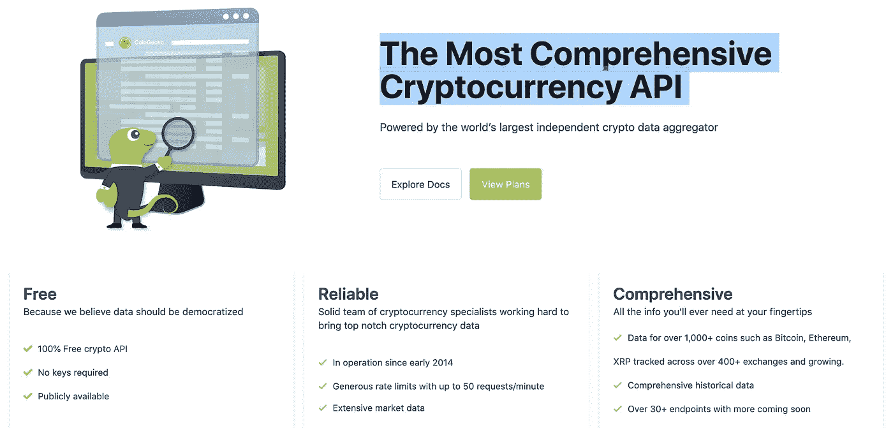
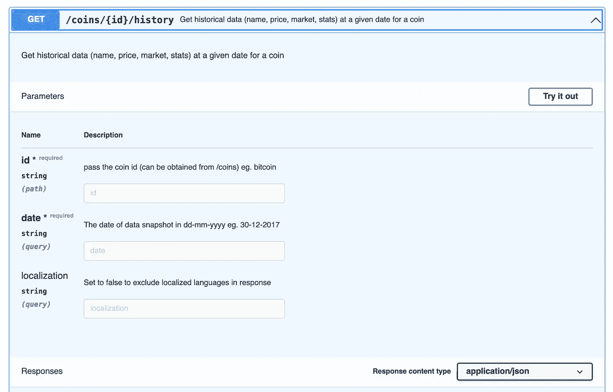
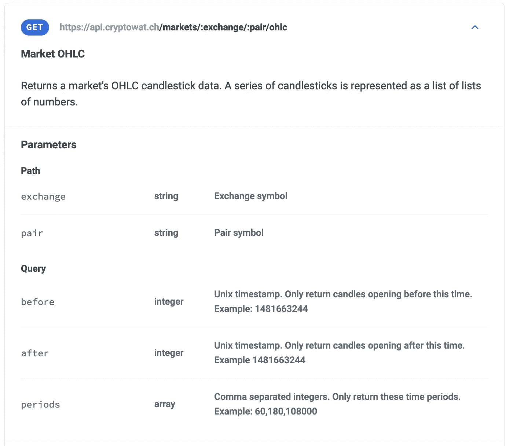
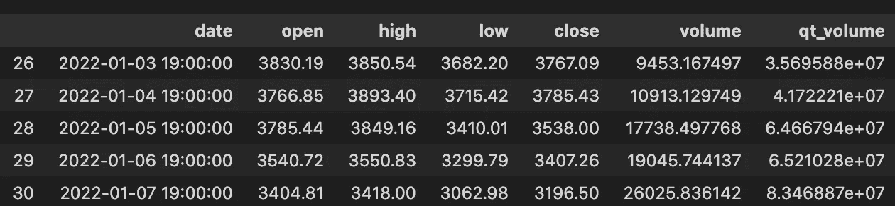
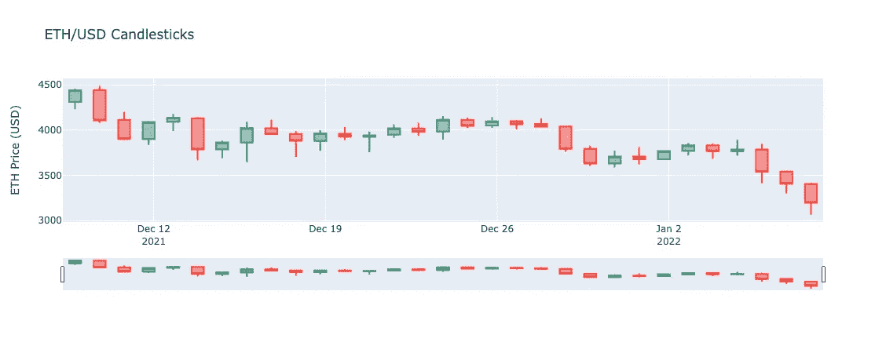

# 如何获得历史加密价格

> 原文：<https://medium.com/coinmonks/how-to-get-historical-crypto-prices-46b8ff133efd?source=collection_archive---------1----------------------->

## 制作您自己的烛台图表，并获得数据，以找到您最喜爱的密码价格模式！


我的一个朋友最近问我如何找到加密货币对的历史开盘价、最高价、最低价和收盘价(OHLC)数据。我知道如何在 CoinGecko 上查询价格，但我实际上不知道如何收集历史数据。对于希望对加密货币价格进行一些算法分析的人，或者甚至只是维护 excel 电子表格以帮助他们跟踪其表现的人来说，这是有用的信息。

当然，这些数据必须随时可用！

> 如果你不能自由、轻松地获得像价格历史这样简单的东西，那么去中心化、公开化的区块链会有什么样的前景呢？

通过一点研究，我能够解决这个问题，现在我也将向您展示如何做到这一点。

# 寻找 API 提供者


Photo by [Compare Fibre](https://unsplash.com/@comparefibre?utm_source=medium&utm_medium=referral) on [Unsplash](https://unsplash.com?utm_source=medium&utm_medium=referral)

一个厨师创造了新鲜，微妙的主菜知道，这一切都取决于挑选高品质的原料。同样，这项工作依赖于找到一个完美的 API 来提供我们需要的信息，这样我们就可以拼凑一个脚本来处理它。

## 让我们试试硬币壁虎

我做的第一件事是检查 CoinGecko。他们的网站是我用来跟踪我的加密投资组合的价格表现的主要来源，我知道他们有一个 API。也许，他们有办法获得高/低/开盘价/收盘价信息。

您可以在这里找到 Coingecko API 文档。他们给自己贴上了“最全面的加密货币 API”的标签，他们有一个免费的计划让我玩，所以我对这个领先感到兴奋！



[https://www.coingecko.com/en/api](https://www.coingecko.com/en/api)

我迫不及待地点击“浏览文档”，寻找我需要的数据。

事实上，他们有各种有趣的数据，我鼓励你看看他们有什么可用的。也许你会为其他有趣的项目或分析收集一些想法，例如使用趋势数据来跳跃动量交易或根据类别数据寻找新的硬币来探索！

然而，在查看价格数据时，我只看到了当前价格数据，以及可以从特定日期提取的历史价格数据。



request param only allows a specific date

Coingecko 可能有历史价格数据，但是只有一个日期字段。获取一系列历史价格数据会非常低效和繁琐。

> 我需要为历史开盘、盘高、盘低、收盘(OHLC)价格数据找到一个更好的选择。

## [关于加密货币的 OHLC 的旁白]

如果你仔细想想，开盘价、最高价、最低价和收盘价是一个有点奇怪的概念。对于常规的股票市场来说，它们很有意义，因为股票市场局限于一个地点，而且它们有交易开始和结束的市场时间。

> 加密货币市场没有地点，也没有交易时间。

加密的术语不像股票市场那样清晰:

*   当一个市场总是开放时,“开放”或“关闭”意味着什么？
*   当价格信息是一个连续不间断的流时，什么是'高'和'低'价格？

为了继续，我们必须根据我们的需求做出假设。在我的例子中，我并不太关心*确切的开始和结束时间是什么时候，但是我希望看到大致每天一段时间的数据，并查看 OHLC 在许多天内的性能。*

因此，打开和关闭的时间并不重要，只要它们与下一次打开和关闭相隔大约 24 小时。反过来，可以在这 24 小时左右的时间内收集高点和低点。

## 找到更好的来源

我用谷歌搜索了一下数据来源，找到了[的这篇文章](https://blog.rmotr.com/top-5-free-apis-to-access-historical-cryptocurrencies-data-2438adc8b62)，它帮我找到了一些好的线索。该网站给出了一些很好的评论，请随意尝试不同的评论。不过出于我的目的，我选择了第一个选项: [Cryptowatch](https://docs.cryptowat.ch/rest-api/) 。

我选择 Cryptowatch 是因为它提供了以下功能:

*   它有一个免费层，非常慷慨的每日限额来满足我的需求
*   它拥有来自各种交易所和交易对的信息
*   它有一个“/ohlc”API 端点，为我完成了所有的聚合工作

我们最感兴趣的端点如下:



[https://docs.cryptowat.ch/rest-api/markets/ohlc](https://docs.cryptowat.ch/rest-api/markets/ohlc)

请注意端点如何具有参数来选择对、日期范围，甚至周期的大小。

> 这正是我们要找的！

# 是时候把手弄脏了！


Photo by [Max Duzij](https://unsplash.com/@max_duz?utm_source=medium&utm_medium=referral) on [Unsplash](https://unsplash.com?utm_source=medium&utm_medium=referral)

现在我们有了一个好的数据源，我们需要创建一个脚本来获取数据。

Python 有一些方便的工具可以清晰而轻松地做到这一点。Jupyter 笔记本特别允许你以“试错”的方式来做这件事，并且非常适合处理数据。(这也是 python 和 Jupyter 笔记本成为数据科学家最喜欢的工具的一个原因！)

## 设置

设置您的环境超出了本文的范围，但是您可以在这里找到资源:

*   Anaconda 安装:Anaconda python 发行版可能是安装 python 和 jupyter 笔记本最简单的方法，尤其是如果你有一台 PC 的话。请参考他们的安装文档进行设置
*   [请求](https://docs.python-requests.org/en/latest/user/install/#install):这是一个用于获取 REST API 请求的基本库。通常在你的环境设置好之后，你只需要输入`pip install requests`。该链接有安装和使用的官方文档。

一旦您的环境设置好了，就创建一个 jupyter 笔记本，并通过导入请求来启动您的脚本。

`import requests`

## 选择贸易对

为了获得我们需要的数据，我们需要选择一个交易所和我们希望在该交易所交易的交易对。api 有各种各样的交换可供选择。要查看列表，您可以按以下方式查询:

```
# Fetch list of exchanges
resp = requests.get('https://api.cryptowat.ch/exchanges')
```

创建一个单独的 jupyter 单元格，使用 resp 对象来查找您想要的交换名称。例如，

```
# Get list of exchange values you can use
exchange_names = [e['symbol'] for e in resp.json()['result'] \
    if e['active']]
exchange_names### You should see a response similar to the following:
['coinone',
 'uniswap-v2',
 'ftx',
 'coinbase-pro',
 'gemini',
 'binance',
  ...
]
```

理论上你可以从这个列表中选择任何东西，但是我们将在我们的脚本中选择'**双子座**'。

选择交易所后，我们可以看到交易对列表:

```
# Select Gemini
EXCHANGE = 'gemini'# Fetch markets on the exchange
exchange_resp = requests.get(f'https://api.cryptowat.ch/markets/{EXCHANGE}')
```

在单独的单元格中，处理响应

```
# See all the pairs in the marketpairs = [i['pair'] for i in exchange_resp.json()['result'] \
    if i['active']]
pairs### You should see a response similar to this
['btcusd',
 'ethbtc',
 'ethusd',
 'zecusd',
 'zecbtc',
 'zeceth',
 'ltcusd',
 ...
]
```

让我们继续我们的脚本，选择' **ethusd** '对(又名以太坊 vs 美元)。我们将通过在新单元格中添加行`PAIR = 'ethusd'`来设置参数。

**注意:**提前想好你想要的那双通常更容易。例如，如果我知道以太坊是 ETH，美元是(USD ),那么我可以假设 ETHUSD 是配对

```
# you an verify that it is the correct pairing by checking here
PAIR = ‘ethusd’# Verify Pair exists
pair_resp = requests.get(f’https://api.cryptowat.ch/pairs/{PAIR}')pair_resp.json()### You should see a response similar to this
{'result': {'id': 125,
  'symbol': 'ethusd',
  'base': {'id': 77,
   'symbol': 'eth',
   'name': 'Ethereum',
   'fiat': False,
   'route': 'https://api.cryptowat.ch/assets/eth'},
  'quote': {'id': 98,
   'symbol': 'usd',
   'name': 'United States Dollar',
   'fiat': True,
   'route': 'https://api.cryptowat.ch/assets/usd'},
  'route': 'https://api.cryptowat.ch/pairs/ethusd',
  'markets': [{'id': 672,
    'exchange': 'zonda',
    'pair': 'ethusd',
    'active': True,
    'route': 'https://api.cryptowat.ch/markets/zonda/ethusd'},
    ...
  ],
  ...
}
```

## 选择日期范围

除了交易对，我们还必须选择我们的日期范围。我们还想将周期设置为每天。下面我设定了一个月的范围和每天的时间段。

```
# Date Parameters
START_DATE = '12/8/2021'
END_DATE = '1/8/2022'
PERIOD = 86400  # Time period in seconds (e.g., 1 day = 86400)
```

如果您密切关注 API，您会注意到您实际上需要使用时间戳(即，从 UTC 1970 年 1 月 1 日开始的秒数)来代替日期字符串。幸运的是，我们可以使用内置的`datetime`库很容易地在 python 中转换它。在您的脚本中包含以下内容以进行转换

```
# Convert the dates to timestamps
from datetime import datetimedef to_timestamp(dateString):
    element = datetime.strptime(dateString, '%m/%d/%Y')
    return int(datetime.timestamp(element))# Will be used later to convert back
def to_date(timestamp):
    dt = datetime.fromtimestamp(timestamp)
    return dt.strftime('%m/%d/%Y')start_ts = to_timestamp(START_DATE)
end_ts = to_timestamp(END_DATE)
```

## 调用 API


Created on memegenerator.net

现在我们已经有了所有需要的参数，是时候调用 Cryptowatch API 端点了。

```
# Fetch the data
params = {
  'after': start_ts,
  'before': end_ts,
  'periods': PERIOD,
}ohlc_resp = requests.get(
    f'https://api.cryptowat.ch/markets/{EXCHANGE}/{PAIR}/ohlc',
    params=params)
ohlc_resp.json()['result'][f'{PERIOD}']
```

这个调用应该在一个元组列表中给我们一堆结果，其中包含我们正在寻找的数据。

# 操纵数据


Photo by [Earl Wilcox](https://unsplash.com/@earl_plannerzone?utm_source=medium&utm_medium=referral) on [Unsplash](https://unsplash.com?utm_source=medium&utm_medium=referral)

现在我们有了数据，我们可以用它来操纵、分析和呈现数据。此时，您真的可以对数据做任何您想做的事情。为了演示这一点，我们将执行以下操作:

*   将数据放入结构化的 python 对象中，并获得用户友好的打印输出
*   创建蜡烛图

## 打印易读的对象

下面的代码定义了一个类对象，以及它将如何输出。

```
import json
import pprint as ppclass Ohlc():
    def __init__(self, tuple):
        (self.close_ts,
         self.open,
         self.high,
         self.low,
         self.close,
         self.volume,
         self.quote_volume) = tuple
        self.close_dt = to_date(self.close_ts) def __repr__(self):
        return pp.pformat({
            'close_dt': self.close_ts,
            'price': {
              'open': self.open,
              'high': self.high,
              'low': self.low,
              'close': self.close,
            },
        })
```

` __init__ '函数将获取从 API 调用返回的元组对象，并将它们放入类中。` __repr__ '函数确定对象的字符串表示形式，并允许我们以我们想要的方式打印响应。

现在我们所要做的就是通过类输入数据并打印结果。我们可以用一个简单的列表理解表达式很容易地做到这一点

```
ohlcs = [Ohlc(i) for i in ohlc_resp.json()['result'][f'{PERIOD}']]
ohlcs### You should see a response similar to this
[{'close_dt': 1639008000,
  'price': {'close': 4440.15, 'high': 4456.05, 'low': 4229.99, 'open': 4310.34}},
 {'close_dt': 1639094400,
  'price': {'close': 4106.69, 'high': 4490.84, 'low': 4077.15, 'open': 4441.35}},
 {'close_dt': 1639180800,
  'price': {'close': 3900.4, 'high': 4200, 'low': 3888.88, 'open': 4113.06}},
 ...
]
```

## 创建蜡烛图

蜡烛图通常用于分析股票的价格表现。它们是一种简洁的方式，通过粗棒线代表开盘价/收盘价范围，用线代表高低点范围，用粗棒线代表开盘价、收盘价、最高价和最低价。

您可以搜索 python 绘图库来帮助您将这些数据转换成蜡烛图。下面我们将使用一个名为`pandas`的库将数据收集到数据帧中。然后，我们将使用数据框和名为`cufflinks`的 python 库进行绘图。

首先，我们需要安装先决条件:

在命令控制台中，您应该能够安装它，如下所示:

```
python -m pip install --upgrade pip 
pip install pandas
pip install plotly
```

[参见: [Plotly - Getting started](https://plotly.com/python/getting-started/) 获取故障排除信息]

*注意:如果你使用的是 vscode，你可能需要下面的代码来显示图形*

```
import plotly.io as pio
pio.renderers.default = "vscode"
```

接下来，我们将使用以下代码创建数据框:

```
# Convert timestamp to date object in each row
data = [tuple([datetime.fromtimestamp(i[0])] + i[1:]) \
    for i in ohlc_resp.json()['result'][f'{PERIOD}']]# Create dataframe
columns = ['date', 'open', 'high', 'low','close',\
    'volume', 'qt_volume']
df = pandas.DataFrame.from_records(data, columns=columns)df.tail()
```

您应该会看到类似如下的结果:



现在我们用 plotly 把这个数据框变成一个蜡烛图

```
qf = cufflinks.QuantFig(
    df, title="", name='ETHUSD')qf.iplot()
```

这几行可能需要一点时间，但它们会产生如下精彩情节:

```
import plotly.graph_objects as gofig = go.Figure(data=[
    go.Candlestick(x=df['date'],
        open=df["open"],
        high=df["high"],
        low=df["low"],
        close=df["close"])
])fig.update_layout(
    title=f"ETH/USD Candlesticks",
    yaxis_title="ETH Price (USD)"
)
```

然后，瞧！你现在有一个烛台阴谋。我有没有提到它也是交互式的！



You can zoom in and out with the nav on the bottom of the plot

# 出去探索吧！

在上面，您学习了如何执行以下操作:

*   找到合适的 API
*   使用 python 获取历史价格数据
*   将数据分为对象和数据框
*   将数据绘制成蜡烛图

这个过程可以用任何 API 重复，你可以用任何你想要的方式操作数据。

现在剩下的就是出去尝试一些事情！祝你好运！

> 免责声明:
> 
> 我不是财务顾问，本文中表达的观点不是财务建议。加密货币和智能合约是复杂的工具，具有很高的亏损风险。你应该仔细考虑你是否了解这些工具是如何工作的，你是否能够承担失去你的钱的高风险。我鼓励你在做出任何投资决定之前进行自己的研究，避免投资任何你不完全了解其运作方式和所涉及风险的金融工具。

> 加入 Coinmonks [电报频道](https://t.me/coincodecap)和 [Youtube 频道](https://www.youtube.com/c/coinmonks/videos)了解加密交易和投资

## 也阅读

[](https://blog.coincodecap.com/bitsgap-review) [## 获取信号、交易机器人和套利

### 在本文中，我们将讨论 bits gap——一个满足您所有交易需求的一站式加密交易平台…

blog.coincodecap.com](https://blog.coincodecap.com/bitsgap-review) [](https://blog.coincodecap.com/blockfi-review) [## BlockFi 评论 2021:利弊和利率| CoinCodeCap

### 今天，我们提出了一个全面的 BlockFi 评论，这是一个成立于 2017 年的加密贷款平台，拥有其…

blog.coincodecap.com](https://blog.coincodecap.com/blockfi-review) [](/coinmonks/buy-bitcoin-in-india-feb50ddfef94) [## 如何在印度购买比特币？2021 年购买比特币的 7 款最佳应用[手机版]

### 如何使用移动应用程序购买比特币印度

medium.com](/coinmonks/buy-bitcoin-in-india-feb50ddfef94) [](/coinmonks/best-crypto-tax-tool-for-my-money-72d4b430816b) [## 加密税务软件——五大最佳比特币税务计算器[2021]

### 不管你是刚接触加密还是已经在这个领域呆了一段时间，你都需要交税。

medium.com](/coinmonks/best-crypto-tax-tool-for-my-money-72d4b430816b) [](https://blog.coincodecap.com/crypto-to-buy-in-2022) [## 9 个 2022 年最值得购买的密码| CoinCodeCap

### 2021 年对于加密货币、比特币、NFT 或不可替代代币、元宇宙等等来说是很棒的一年。这一年…

blog.coincodecap.com](https://blog.coincodecap.com/crypto-to-buy-in-2022) [](https://blog.coincodecap.com/best-hardware-wallet-bitcoin) [## 存储比特币的最佳加密硬件钱包[2021] | CoinCodeCap

### 保管您的数字资产很容易，但找到正确的存储方式却是一项繁琐的任务。在线钱包有一个风险…

blog.coincodecap.com](https://blog.coincodecap.com/best-hardware-wallet-bitcoin) [](/coinmonks/pionex-review-exchange-with-crypto-trading-bot-1e459d0191ea) [## Pionex 评论 2021 |免费加密交易机器人和交换

### Pionex 是为交易自动化提供工具的后起之秀。Pionex 上提供了 9 个加密交易机器人…

medium.com](/coinmonks/pionex-review-exchange-with-crypto-trading-bot-1e459d0191ea) [](/coinmonks/top-3-telegram-channels-for-crypto-traders-in-2021-8385f4411ff4) [## 2022 年密码交易员的三大电报渠道

### 加密信号是来自专业交易者的交易想法，以特定的价格或价格买卖特定的加密货币

medium.com](/coinmonks/top-3-telegram-channels-for-crypto-traders-in-2021-8385f4411ff4) [](https://blog.coincodecap.com/free-crypto-portfolio-trackers) [## 2022 年 5 个最佳免费加密投资组合追踪器

### 加密投资组合追踪器是作为一个解决方案创建的，既费时又令人困惑的家务提供一个…

blog.coincodecap.com](https://blog.coincodecap.com/free-crypto-portfolio-trackers)