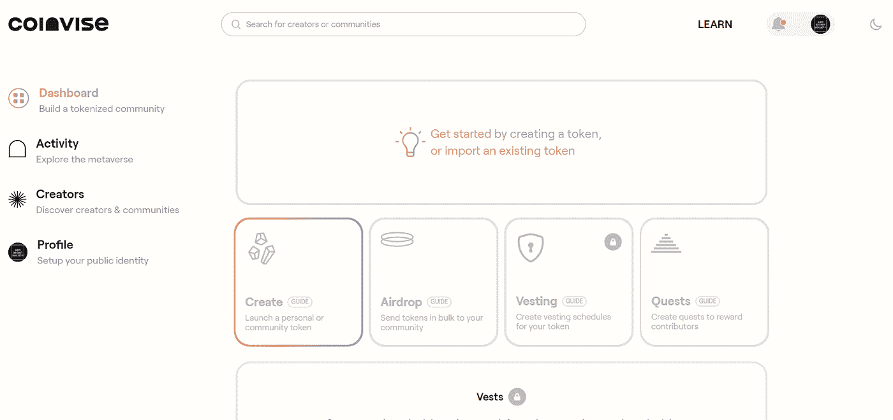

# 如何涉足一把刀？

> 原文：<https://medium.com/coinmonks/how-to-get-involved-in-a-dao-a0c80c66b0d5?source=collection_archive---------0----------------------->

## 成为早期贡献者并获得奖励

在今天的文章中，我们将更深入地研究 DAOs，并讨论如何参与其中。

首先，它是 ICO(初始硬币发行)，然后是 Defi(分散金融)，然后是 Meme 硬币，现在是 NFTs(不可替代的代币)。我很清楚下一个趋势将是 DAOs。

我认为，在了解它们如何运作之前，或者如果你正在考虑投资，重要的是要清楚它们是什么。

## 什么是刀？

我们准备去[维基百科](https://es.wikipedia.org/wiki/Organizaci%C3%B3n_aut%C3%B3noma_descentralizada)找道的定义。

**分散自治组织(DAO)** ，有时也称为分散自治公司(DAC)，是一个由编码为透明计算机程序的规则表示的组织，由组织成员控制，不受中央政府的影响。道的金融交易记录和计划规则保存在区块链上。这类企业组织的确切法律地位尚不清楚。

Source: [Wikipedia](https://es.wikipedia.org/wiki/Organizaci%C3%B3n_aut%C3%B3noma_descentralizada#/media/Archivo:Decentralized_economy.jpg)

现在让我们一个字一个字地定义，以便有一个更一般的视野。

**分散的**:用来形容不受一个中心控制的组织或其活动。

自主的:独立的，有权力做出自己的决定

组织:为了一个共同的目的，以一种有组织的方式一起工作的一群人

这种新的组织方式是一种不同于传统公司的运作方式。在我之前的[帖子](/bankless-dao/daos-will-change-everything-b955588eeedc)中，我更多地谈到了这些差异。

不再有专制的首席执行官，无用的官僚机构和以前统治公司的金字塔等级制度。Dao 来使所有过程民主化。此外，通过 Defi，您将不再依赖银行来接收或发送资金。Web 3 和 Defi 使 DAOs 以一种革命性的方式赋予用户权力。

## Dao 是如何工作的？

为了更容易理解 DAO 是如何工作的，让我们举一个简单的例子。想象一下，你是一个 DAO 的成员，你有一个可以使项目受益的想法，并且你想用它来做出贡献。例如创建网站或博客。

要做到这一点，你需要创建一个提案，如果提案通过，所有成员都会进行投票。他们还可以决定从联合金库中拿出多少代币来实现这个想法。这个工作可以分公会，我后面会讲到。

就这么简单！ **Web3 和智能合约允许整个流程公开透明，因此一切都掌握在社区手中。**

现在，虽然有许多关于 DAO 如何工作的解释，但它们通常是一般性的。在这种情况下，我将向您展示一些非常有用的 dapps，它们对于了解 DAOs 的潜力非常重要。

大多数成功的 Dao 都遵循以下 5 个步骤:

1.建立一个使命

2.建立一个社区

3.创建共享金库

4.构建治理框架

5.分配所有权

我将向您展示执行这些步骤最常用的工具。

## [不和](https://discord.com/)

Discord 是一款免费的文本、语音和视频聊天应用，有数千万人使用。Discord 于 2015 年首次推出，旨在让人们在一起玩电脑游戏时轻松交流。今天，它是 play2earn、元宇宙 NFTs 和 DAOs 社区中使用最多的应用程序。

[Bankless DAO discord](https://discord.gg/bankless)

## [快照](https://snapshot.org/#/)

快照是一个分散的投票系统。它为如何计算投票的投票权提供了灵活性。Snapshot 支持各种投票类型，以满足组织的需求。创建提案和对快照进行投票是用户友好的，并且不耗费汽油，因为该过程是离线执行的。
简而言之，Snapshot 是一个外链无气多治理客户端，易于验证，结果难以辩驳。

[Snapshot](https://snapshot.org/#/)

在这篇文章中，我不打算谈论截图中显示的所有项目。我分享了他们的推特账号，这样如果你对他们感兴趣，你可以调查更多。它们是用刀可以创造出什么的一些最好的例子。

> [-Loot 项目](https://twitter.com/lootproject)
> -D[ecentraland](https://twitter.com/decentraland)
> -E[ns 域](https://twitter.com/ensdomains)
> -G[it coin](https://twitter.com/gitcoin)
> -B[无脚刀](https://twitter.com/banklessDAO)
> - [体质刀](https://twitter.com/ConstitutionDAO)
> -[FWBtweets](https://twitter.com/FWBtweets)
> -P[oapxyz](https://twitter.com/poapxyz)

## [灵知保险箱](https://gnosis-safe.io/)

Gnosis Safe 是一个智能合约钱包，允许用户安全地存储令牌并与分散的 web 交互。其核心是一个多签名钱包。

[Gnosis Safe Dapp](https://gnosis-safe.io/)

无论您是一家公司还是一群朋友，它都是一个非常有用的工具，因为通过 multisign，只有在社区决定这样做的情况下，资金才能移动。

例如，如果您的企业中有 10 个主要利益相关者，您可以设置电子钱包，要求在发送交易之前得到所有 10 个人的批准。

## [共同签证](https://www.coinvise.co/dashboard)

创作者铸造和发行社交令牌的平台。Coinvise 还提供开发人员友好的易用 API，将社交令牌集成到现有的媒体平台上。

[Coinvise dashboard](https://www.coinvise.co/dashboard)

这个平台允许您创建自己的 Mint 令牌，一个固定供应的个人或社区令牌，通过空投分发。此外，向您的社区批量发送令牌。令牌可以通过一个独特的可申领链接发送，或者直接发送到一个地址列表，您可以创建任务来奖励完成任务的贡献者。

## [塌陷地](https://collab.land/)

Collab Land 是一个社区管理应用程序，它使用 Discord 和电报机器人来验证您是否持有某个 NFT。

[Collab.land](https://collab.land/) on discord

/tip 命令在许多 Dao 的 discord 社区中广泛使用。因为它有助于容易地发送令牌而不会留下不和。

起初，这看起来有点吓人，建议在进入 DAO 和使用这些工具之前先了解一些加密货币的背景。

分散金融有一个缓慢而渐进的学习曲线。
未来，将会开发更多的工具和协议来促进 DAO 的操作，并使其更易于为每个人所用。

现在你知道了什么是刀，它是如何工作的，以及它最常用的工具，我们准备好下一步了。

# 我怎么会和刀扯上关系？

在这幅风景画中，你可以看到各种类型的道，以及每种类型的许多例子。有这么多，我不能在这篇文章中总结他们。

DAO landscape by [Cooopahtroopa](https://twitter.com/Cooopahtroopa)

正如你所看到的，有不同类型的 Dao:收藏家 Dao，赠款 Dao，媒体 Dao，服务 Dao，投资 Dao，社会 Dao。它们中的每一个都有不同的协议和管理社区及其令牌的方式。

我把这个链接留给你，这个链接指向 [DAOcentral](https://daocentral.com/) ，一个寻找和学习最流行 Dao 的好工具。

了解刀是如何工作的最好方法是参与其中。你可以通过两种方式做到这一点:

# 投资一把刀

道通常有他们的代币。今天形成的许多 Dao 的数量将会增加，因此它们的价格也会上涨，所以我理解投机的部分。投资者总是在寻找新的机会，事实证明，Dao 是一种很好的资产。
在 coinmarketcap 中，您可以看到这是一个大约 25，000，000，000 美元的市场。

Top DAO tokens by [Coinmarketcap](https://coinmarketcap.com/es/view/dao/)

一些 DAOs 代币获得了丰厚的回报，而且市场仍在不断扩大。我还认为有必要说一句，Dao 目前(以及整个密码领域)存在的一个问题是监管。所以任何关于这些法律收紧的消息都会让分散的财政颤抖，所以谨慎总是明智的。

这些代币中的许多还提供诸如赌注之类的 Defi 好处。他们允许你获得被动收入，并通过自动协议产生非常高的 APYs。例如[奥林巴斯刀](https://www.olympusdao.finance/)、[复合刀](https://compound.finance/)或[曲线刀](https://curve.fi/)。

也就是说，现在我将解释参与道的最佳方式。

# 贡献给一把刀

作为 DAO 的贡献者，您必须参与到项目中，而不仅仅是在交易所购买令牌并持有它。

一旦你理解了上述工具的操作，你就明白了**令牌就是道中的力量。权力越大，责任越大！**

对我来说，能够参与处于初始阶段的社区并共同成长是一件令人兴奋的事情。我们都可以做道工，得到“公司股份”的回报我觉得这非常具有突破性。

**如果你给刀增加了价值，你会因此得到奖励，win2win。**

你可以投票决定刀的未来。你可以分享你对如何改进项目的想法。作为一名网络开发人员，作为一名不和谐的 mod，或者通过贡献你的时间和愿望，你可以通过创建艺术设计、博客、视频、播客等内容来增加价值。

无论哪种方式你都可以想象！这完全取决于 DAO 的类型和社区决定的使命。

在接下来的一年里，两个词将成为潮流。行会和奖金。对 DAO 做出贡献的两种最常见的方式。

## 行会

**行业协会是我们对社区团体的称呼，可以是社会性的，也可以是面向商业/项目的。**

把行会想象成社会集体。共同的兴趣和共同的目标将个人联系在一起，一起从事项目。

“一体行动”及其机制用于管理和资助这些项目。

在 DAOs 之前，公会通常发送发票，但现在，他们可以向 DAO 发送一个建议，这就像一个多签名的银行帐户。Dao 也可以为公会服务于不同的目的，并且可以为特定公会的管理和资助的特定项目而设置。

***帮会和刀有什么区别？***

行会是主体间的现实和社会结构。我想我们可以说行会是现代意义上的社区、集体和公司的混合体。

Dao 就像是由他们的软件定义的链上公司。如果没有使用 DAO 投票的代理(人类参与者),它们几乎从来没有任何真正的代理或自治。

为了更好地理解它，想象一下，一个道是一个公司，行会是它的部门。以便该行会的成员协调，然后在不同行会之间协调成道。

“协调”这个词在道中有着至关重要的意义。

道可以通过行会将资金分散到社区。请记住，一切都将通过投票以透明的方式民主决定。我们看到了 Dao 相对于传统公司的一大优势。现在你可以在员工之间决定用什么、用多少和怎样花这笔钱。

糟糕的时代来临了，典型的懒惰员工在公司里有着精心挑选的职位，他也是一个暴君，当他贡献更少的时候却比他的同事得到更多的薪水。那，通过提供刀的机制，就结束了！

**如果你想加入道，帮助社区，你可以成为早期的贡献者。**

早期贡献者是任何对刀有贡献的人，不管他们属于哪个公会。要成为一个早期的贡献者，你必须“潜入”道，通常是在它的不和谐中。它们通常被分成几个部分，每个部分独立工作。

公会角色是与你的技能组合相关的特定公会角色。例如，如果我是一名作家，我将拥有编辑协会角色以及作家角色。公会角色可以通过在入职过程中对消息做出反应而随意获得。

[Anti Secret Society](https://twitter.com/Antisecretsoci2) discord roles

Discord 选择角色的能力对于管理 DAO 非常有用。可能性有很多，我给你留了一个指南，让你看看用这个[工具](https://support.discord.com/hc/en-us/articles/214836687-Role-Management-101)能做什么。

一切皆有可能。一把刀可以有多个帮会作为创始人/成员。

DAO 如何通过公会和角色工作的一个很好的例子是[无银行 Dao](https://www.bankless.community/) 。无银行道是一个分散的社区，协调和传播无银行媒体，文化和教育。其目标是推动以太坊、Defi 和比特币等真正无银行货币系统的采用和认知。

[Bankless DAO website](https://www.bankless.community/)

在他们的网站上，你可以查看那里的公会以及如何投稿。如你所见，他们被分成多个公会，因为这是最有效的方法。你有作家、开发人员、设计人员、财务人员、法律人员、分析人员、教育人员、研究人员、营销人员、翻译人员和运营人员。

在这个链接中，你可以看到最新的提议。
[https://snapshot.org/#/banklessvault.eth](https://snapshot.org/#/banklessvault.eth)

我建议访问他们的不和谐，虽然在开始时似乎有很多信息，但一旦你选择了你的角色并专注于你能做出的贡献，你就会更好地理解一切。

我可以给你的另一个建议是寻找 DAOs 的“OGs 贡献者”并向他们提问，他们是第一个有兴趣向你解释一切并开始贡献的人。

领导者在公会中很重要。除了向程序引入新用户，他们还应该处理令牌的管理和分发。

这就是为什么**在成员的贡献和他们将获得的回报之间保持平衡是重要的**，这是一个道成功的关键。

## 慷慨

公会分发代币最简单的方法之一就是通过奖金。**赏金是许多加密货币和区块链项目向公众提供的交易，个人可以通过完成特定任务获得奖励，通常以代币的形式。**

这些任务可能包括关于项目的公开文章、创建多媒体资源以及使用不同的社交媒体平台推广项目。它们也可以是翻译或错误报告。

一些人称自己为赏金猎人，他们寻找有奖金计划的项目，并执行不同的任务。为此，我将为您留下两个目前最适合查找这些程序的 dapps:

[-第三层](https://alpha.layer3.xyz/)

[-拉比托尔](https://rabbithole.gg/)

Dao 正在创建自己的微观经济，向完成任务以实现其使命的成员发放奖金。通过赚取以 DAO 的本地令牌命名的奖金，成员可以获得所有权，这种方式使 web2 初创公司股权期权看起来过时了。

无论你是作家、设计师还是开发人员，你都可以申请(或创造)工作奖金。

## 博彩业和元宇宙行会

在我看来，这种组织模式可以推广到任何商业/生活领域。谁知道 10 年后我们会在哪里...**通过道甚至可以治理一个国家。**

[Decentraland DAO](https://dao.decentraland.org/en/)

你能想象知道政客们用我们的钱做什么吗？能够消除今天荒谬和低效的官僚主义？将来，你的口袋里可能会有一个 Dapp，通过它你可以投票表决重要的决定，比如选举总统或者决定如何处理税收。可能性是无限的！

但是现在，最好是脚踏实地，评估我们在哪里。我们正处于一个 metaverses 和 pla2earn 游戏爆炸式增长的时代，但由于缺乏监管和必要的艰难学习曲线，这种增长还不到它们的一半。

如我之前所说，公会可以是公司内部的部门，但它**也可以作为元宇宙内部的团队或军队。**

让我解释一下，假设你有 10 个朋友，他们都是艺术家，想在元宇宙创建一个画廊。如今，进入分散土地、沙盒或 Omnium Space 等游戏的主要障碍有两个:

*   土地是昂贵的，在那些游戏中一个地块的平均购买价格大约是 8000 美元。
*   除了懂美术，还要懂编程

许多艺术家问我如何在分散的土地上展览，因为他们在 youtube 上看过一个视频“如何在元宇宙创收”。一旦你调查，你发现这些问题，这使得他们中的许多人无法进入。

**阿刀给你的可能性是为元宇宙创建一个工作组。**可分为以下几个行会:

*   国库公会:负责为项目筹集资金，并对不同的土地和元数据进行调查。
*   艺术行会:负责创建艺术和设计部分
*   开发者协会:使用 SDK 开发 web3 或程序。
*   营销行会:社交网络的内容创造者和管理者

有了这 4 个公会，这将是一种开始在不同的团队中分配工作的方式。协作和拥有一个良好的社区是 Dao 世界成功的关键。他们都有相同的使命，所以他们会联合起来，让一切变得更容易。

我认为合作艺术项目会变得越来越普遍，但是，我认为公会和 Dao 在游戏世界中有更大的潜力。

虚拟现实和图形的质量在最近几年有了显著的提高，预计在几年后会接近完美。在此期间，钱包、游戏的令牌组学和整个加密空间，总体而言，也将得到改善。

**游戏公会并不新鲜**，在《暗黑破坏神》或《魔兽争霸》中已经有一群人一起玩了。然而，如果你理解了 web3、NFTs、DAOs 和元宇宙提出的范式转变，你就会意识到，这只是更大的事情的开始。

想象一下他们发行了中世纪的元宇宙。每一片土地，每一把剑，每一种元素，比如钢铁或黄金，都可能是 NFT。都可以互换。土地的主人可以建造城堡和投石器来保护自己。那个人就是“鲸鱼”。或者是投入资金最多的一家。发生什么事了？如果没有士兵来保卫城堡，它可能会被征服。所以他有兴趣把他的土地借给新手玩家或者那些不想投资的人。所以他必须为他们提供食物和武器来换取他们的工作。好吧，我知道有些游戏已经可以类似地工作了，尽管我想象的是，用超现实的图形和虚拟现实眼镜。🤯

**个人认为 play2earn 游戏应该更侧重于“玩”的部分，而不是“赚”的部分。因为如果不好玩，电子游戏注定会失败。**

大多数游戏都想复制阿西的风格，我不认为这是正确的做法。不可否认的是，Axie Infinity 被载入史册。

像 Axie Infinity 这样的游戏也推出了另一个革命性的概念，**奖学金项目**。事实上，你可以把你的 NFTs 借给其他玩家，并分享收益，这是令人惊讶的！它允许那些不能支付进入游戏的人也有选择。

对于那些批评 play2earn games、NFTs 和元宇宙的人，我推荐他们观看这部短片，这部纪录片讲述了像菲律宾这样的贫穷国家的人们的生活发生了怎样的变化。

在这篇文章中，我不想对游戏公会说太多，所以我确信，我没有解释清楚他们的假设，以及他们将要闯入密码空间的力量。

Source: [Crypto Street](https://twitter.com/CryptoSt_news)

# 结论

道来改变一切。自从 1983 年推出以来，互联网已经有了很大的发展。**web 3 代表了以前不为人知的用户赋权。**

那时我还没有出生，但是我知道互联网已经变得越来越容易访问，越来越便宜，越来越稳定。随着这些平台都以更友好的方式呈现，用户会逐渐到达。大规模采用只是时间问题。

Source:[101 Blockchains](https://101blockchains.com/es/)

历史上第一次，国与国之间将真正实现平等。硅谷这样的地方不会垄断所有的技术发展。取而代之的是在论坛中创建的一群朋友，他们来自地球的不同地方，将能够创建一个 DAO，收集资金，并向其他人承包/提供服务。

一个来自非洲的网络开发人员将能够获得和另一个在瑞士的人一样的报酬。这假设了这些国家的经济发生了如此彻底的变化，至少这是一本书的内容。

Dao 是一个有待开发的市场，许多专家指出它们是密码世界的下一个趋势，我同意这一点。你也可以成为投资者、雇员并获得“股份”(代币)，这一事实将使许多人决定通过公会和奖金，根据自己的品味和偏好作为自由职业者工作，而不是为他们的混蛋老板工作。

作家、开发人员、设计师、经济学家、律师、内容创作者、社区管理者、游戏玩家以及其他许多职业在未来 10 年的功能将与现在完全不同。

**未来在于 NFTs、元宇宙和分散金融**。DAOs 将是最常见的组织方式，你越早理解这一点，你就能从中获得越多的好处。

疫情加快了所有这些工具的采用。许多人被迫远程办公或失业。我们目前处于早期阶段，现在这些社区正在形成，你有一个千载难逢的机会加入它们。

**找到你的激情，提高你的技能，成为你所信仰的任何一种道的早期贡献者。过几年你会感谢我的！🙂**

**作者简历**

我是 [*KAF*](https://twitter.com/kafcrypto) *，帮助人们走近、道、德菲、的顾问和自由撰稿人。在 kafcrypto@gmail.com 雇佣我*