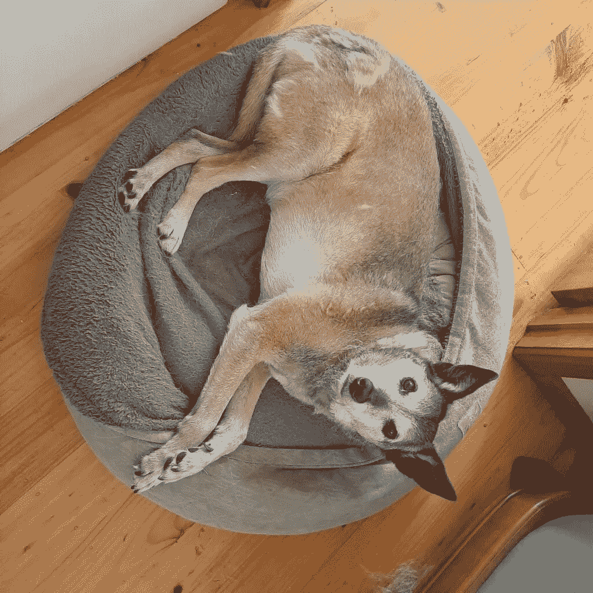
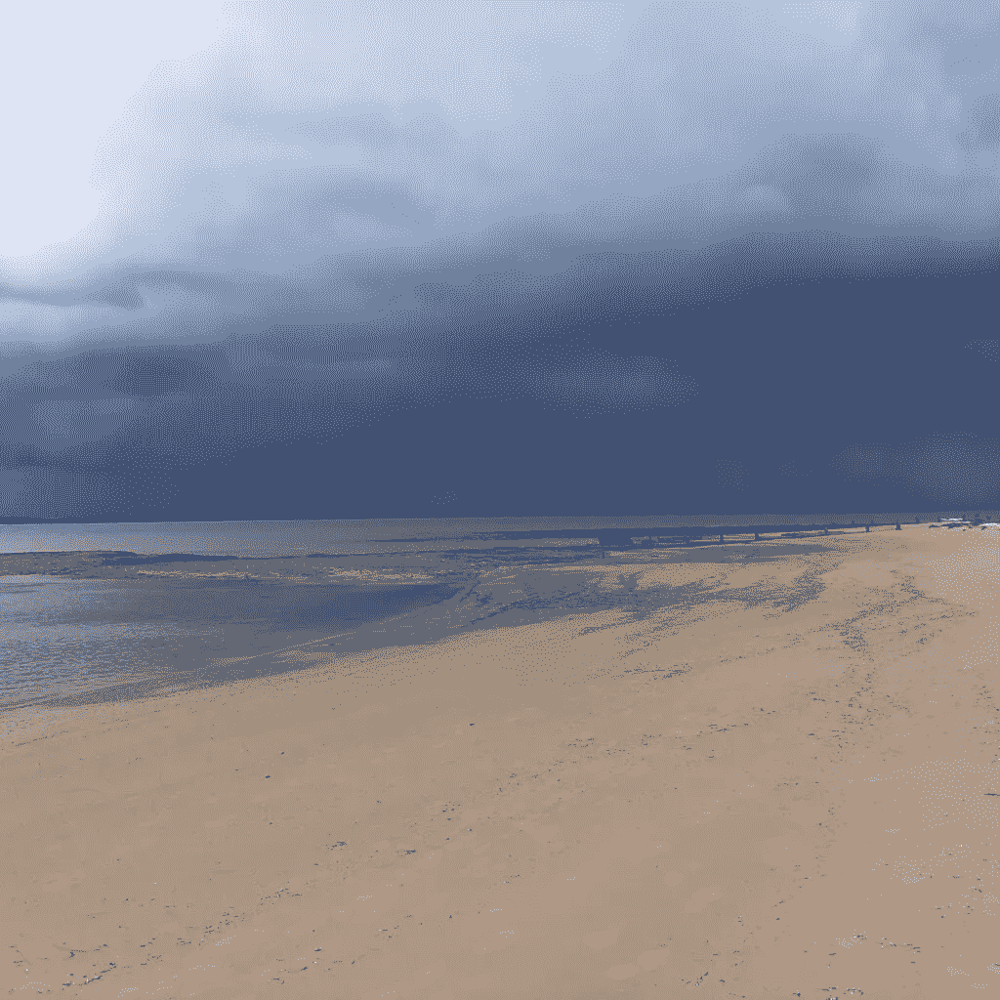
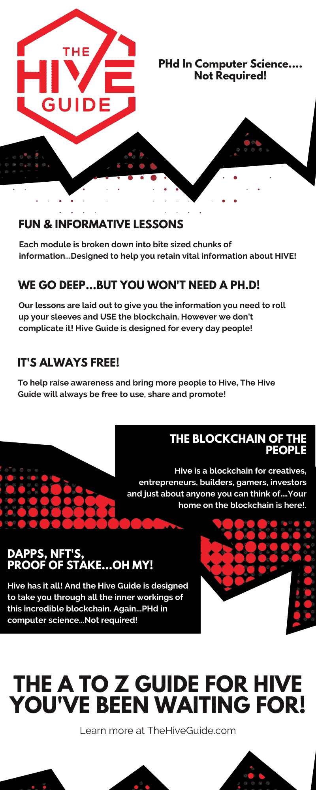

# 如何获得报酬去遛狗

> 原文：<https://medium.com/coinmonks/how-to-get-paid-to-walk-your-dog-68e87a12854?source=collection_archive---------20----------------------->

一段时间以来，我知道我应该多锻炼。知道你应该锻炼和实际做些什么是两码事。当然，我每天都遛狗，但只是短暂的 15 分钟。我在自欺欺人。

然后我发现了这个[神奇的小应用，它付钱让我锻炼。](https://actifit.io/signup?referrer=markhodge)它叫做 Actifit，可以记录你日常工作中的活动。

只要你达到至少 5000 个 Actifit 步骤，并通过记录你所做的简短描述来提供活动证明，你将获得 Actfit 代币奖励。这些小代币是蜂巢区块链的一部分，这意味着你也会得到一点蜂巢的奖励。

你会得到多少报酬？

这取决于多种因素，包括你做了多少活动，你的帖子的质量以及有多少人阅读它。挺上瘾的。

这些天，我通常在早餐前记录 4000 步的活动步数，并在午餐时间进行一次像样的散步。Actifit 是我需要的动力。与其说是钱，不如说是背后的社区。我只需要参与进来，猜猜我在持续减肥。这种感觉很好。狗也觉得挺好的。

那么，我在这些报告中写些什么呢？

我试着让它变得有点意思。我一直在评论这里的热浪，并提到网球和板球比赛，因为它们发生了。它已经成为一种个人日记。
通常，我会附上一张那天我看到的东西的照片。有时候很平凡，有时候很壮观。有时候除了管理员没人能看到。有时候我会吸引一大群人。

这只是 Hive 改变我工作、思考和感受方式的另一种方式。

如果你不是 Hive 的会员，加入 Actifit 的费用是 2 美元。这钱花得值

[点击这里加入 Actifit】](https://actifit.io/signup?referrer=markhodge)

要了解更多关于 Hive 的信息，请点击下图。

## 关于作者

对典型的英国庄稼汉的称呼

马克·霍奇茨是一名自由撰稿人、资深网络营销者和失败的音乐家。许多年前，一觉醒来，发现自己成了一名银行经理。这不是他计划的生活。手指和脚趾交叉，他跳船，开始了在家工作的新生活。尽管有一些失误，他从未后悔过这个决定。

*原载于***。**

> **加入 Coinmonks* [*电报频道*](https://t.me/coincodecap) *和* [*Youtube 频道*](https://www.youtube.com/c/coinmonks/videos) *了解加密交易和投资**

# *另外，阅读*

*   *[有哪些交易信号？](https://coincodecap.com/trading-signal) | [Bitstamp vs 比特币基地](https://coincodecap.com/bitstamp-coinbase) | [买索拉纳](https://coincodecap.com/buy-solana)*
*   *[ProfitFarmers 点评](https://coincodecap.com/profitfarmers-review) | [如何使用 Cornix 交易机器人](https://coincodecap.com/cornix-trading-bot)*
*   *[十大最佳加密货币博客](https://coincodecap.com/best-cryptocurrency-blogs) | [YouHodler 评论](https://coincodecap.com/youhodler-review)*
*   *[my constant Review](https://coincodecap.com/myconstant-review)|[8 款最佳摇摆交易机器人](https://coincodecap.com/best-swing-trading-bots)*
*   *[MXC 交易所评论](/coinmonks/mxc-exchange-review-3af0ec1cba8c) | [Pionex vs 币安](https://coincodecap.com/pionex-vs-binance) | [Pionex 套利机器人](https://coincodecap.com/pionex-arbitrage-bot)*
*   *[我的密码交易经验](/coinmonks/my-experience-with-crypto-copy-trading-d6feb2ce3ac5) | [比特币基地评论](/coinmonks/coinbase-review-6ef4e0f56064)*
*   *[CoinFLEX 评论](https://coincodecap.com/coinflex-review) | [AEX 交易所评论](https://coincodecap.com/aex-exchange-review) | [UPbit 评论](https://coincodecap.com/upbit-review)*
*   *[AscendEx 保证金交易](https://coincodecap.com/ascendex-margin-trading) | [Bitfinex 赌注](https://coincodecap.com/bitfinex-staking) | [bitFlyer 点评](https://coincodecap.com/bitflyer-review)*
*   *[麻雀交换评论](https://coincodecap.com/sparrow-exchange-review) | [纳什交换评论](https://coincodecap.com/nash-exchange-review)*