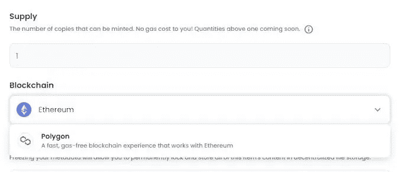
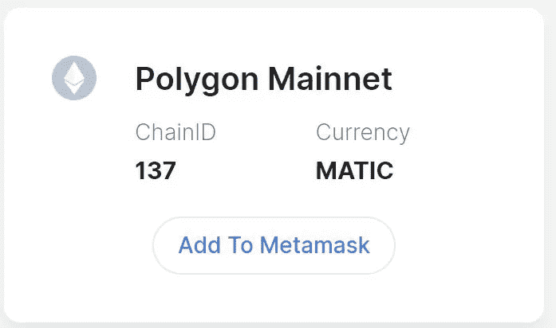

# 如何开始使用 NFTs

> 原文：<https://medium.com/coinmonks/how-to-get-started-with-nfts-251ef45c1ee5?source=collection_archive---------36----------------------->

它们是什么，如何创建自己的，以及如何在没有前期资金投入的情况下销售它们。

Photo by [Andrey Metelev](https://unsplash.com/@metelevan?utm_source=unsplash&utm_medium=referral&utm_content=creditCopyText) on [Unsplash](https://unsplash.com/s/photos/nft?utm_source=unsplash&utm_medium=referral&utm_content=creditCopyText)

NFT 这个词最近在我的新闻提要中出现了很多。这似乎是最新的趋势和快速致富方案，所以在这篇文章中，我将解释什么是 NFT，并给你一些信息，可以帮助你决定是否创建自己的 NFT 值得你花时间。

什么是 NFT？

NFT 代表不可替代的令牌。本质上，NFT 是一种独特的数字财产。虽然艺术是目前 NFT 最广为人知的类型，但非艺术作品实际上可以是数字格式的任何东西，包括音乐、交易卡，甚至推特。当你创造一辆 NFT 并“铸造”它时，你就开始了所有权的记录，这是 NFTs 背后真正的美。就像物理绘画一样，即使制作了印刷品，原件也会保留其价值，无论印刷品的数量如何，因为只有一个原件。类似地，由于 NFTs 保持所有权的记录，如果有人要制作 NFT 内容的副本，则可以知道该副本是伪造的，因此 NFT 原件能够保持其价值。NFT 通常以加密货币的形式出售，但这方面的好消息是，你实际上不需要理解加密货币来创建和出售自己的 NFT。

**如何创建自己的 NFT**

创建一个属于你自己的原创 NFT 收藏出奇的简单。首先，你需要选择你的媒介。如果你是一名艺术家或音乐家，这将是相当简单的，但如果你不具备艺术素质，你可能必须在决定创造什么类型的非功能性艺术之前，玩一会儿，做一些研究。我不打算详细说明这一点，但我会说有一些应用程序和网站可以帮助新手创建数字艺术。对我来说，我从小就喜欢摄影，甚至在高中时在专业摄影工作室实习，所以这是一个很容易的选择。

一旦你决定了你的媒介，并准备好一些东西变成 NFT，你将需要创建一个加密钱包。我有两个加密钱包——一个是通过[比特币基地](https://www.coinbase.com/)的，另一个是通过[元掩码](https://metamask.io/)的。我在 NFT 创作之旅中使用了 MetaMask 钱包，非常满意。创建加密钱包后，就该上传 NFT 的内容并进行制作了。这部分我推荐 [OpenSea](https://opensea.io/) 。如果你用的是电脑，去 OpenSea 网站，连接钱包。如果你是通过你的手机，在 MetaMask 应用程序中，点击菜单图标(左上角的 3 行)，然后点击“浏览器”并导航到 OpenSea 网站，然后继续连接你的钱包。

在 OpenSea 中连接您的加密钱包后，导航至 OpenSea 菜单，点击“帐户”,然后点击“我的收藏”。在这里，您可以点击“创建收藏”按钮。创建收藏后，导航到收藏页面，顶部会有一个写着“添加项目”的按钮。在这之后，就很简单了。如果你想避免预先支付费用，而是允许从购买价格中扣除 2.5%，你唯一需要注意的是将“区块链”下拉菜单下的“以太坊”改为“多边形”。如果你跳过这一步，你需要预先付费。它们不太贵，但我更喜欢没有前期费用的安全感。

然后，点击“创建”,你就正式拥有了自己的 NFT。

**销售您的 NFTs**

如果你经历过创建 NFT 的过程，你可能会想尝试将其货币化。为此，只需导航到您刚刚在 OpenSea 中创建的 NFT，您将看到一个标有“Sell”的按钮。你可以选择 NFT 的出售价格和时间限制，然后点击“完成列表”按钮。如果这是你的第一笔交易，你需要解锁你的货币。这是事情变得有点危险的地方。很有可能在你按下“解锁”和“签名”后，你会得到一个错误，上面写着“你的交易出错了”。请再试一次。

要解决这个错误，您应该做两件事。首先，在你用来创建 NFT 的浏览器中(如果在移动应用程序中，使用该浏览器，或者如果使用计算机，只需打开一个新标签)，打开[链表](https://chainlist.org)。连接你的钱包，然后搜索“多边形”。当你看到“多边形 Mainnet”框时，点击“添加到元蒙版”。

然后会自动弹出一个窗口，询问您是否要切换网络。当弹出窗口出现时，单击“切换网络”。这个完成之后，你需要做的第二件事就是等待。几个小时后，再次进入 OpenSea，检查你的钱包现在显示的是 MATIC 而不是以太坊。如果是的话，解锁应该会成功，尽管你可能还需要尝试几次才能成功。

祝你好运！

XOXO，

数据少女

想要查看我的一些可用的 NFT 吗？看看我在 OpenSea 上收藏的 TA 的“[街猫”。此次募捐所得利润的 50%将捐赠给动物救援和福利组织，以帮助世界各地的小猫。❤](https://opensea.io/collection/street-cats-of-ta)

> 加入 Coinmonks [电报频道](https://t.me/coincodecap)和 [Youtube 频道](https://www.youtube.com/c/coinmonks/videos)了解加密交易和投资

# 另外，阅读

*   [3 商业评论](/coinmonks/3commas-review-an-excellent-crypto-trading-bot-2020-1313a58bec92) | [Pionex 评论](https://coincodecap.com/pionex-review-exchange-with-crypto-trading-bot) | [Coinrule 评论](/coinmonks/coinrule-review-2021-a-beginner-friendly-crypto-trading-bot-daf0504848ba)
*   [莱杰 vs n rave](/coinmonks/ledger-vs-ngrave-zero-7e40f0c1d694)|[莱杰 nano s vs x](/coinmonks/ledger-nano-s-vs-x-battery-hardware-price-storage-59a6663fe3b0) | [币安评论](/coinmonks/binance-review-ee10d3bf3b6e)
*   [Bybit Exchange 审查](/coinmonks/bybit-exchange-review-dbd570019b71) | [Bityard 审查](https://coincodecap.com/bityard-reivew) | [Jet-Bot 审查](https://coincodecap.com/jet-bot-review)
*   [3 commas vs crypto hopper](/coinmonks/3commas-vs-pionex-vs-cryptohopper-best-crypto-bot-6a98d2baa203)|[赚取秘密利息](/coinmonks/earn-crypto-interest-b10b810fdda3)
*   最好的比特币[硬件钱包](/coinmonks/hardware-wallets-dfa1211730c6) | [BitBox02 回顾](/coinmonks/bitbox02-review-your-swiss-bitcoin-hardware-wallet-c36c88fff29)