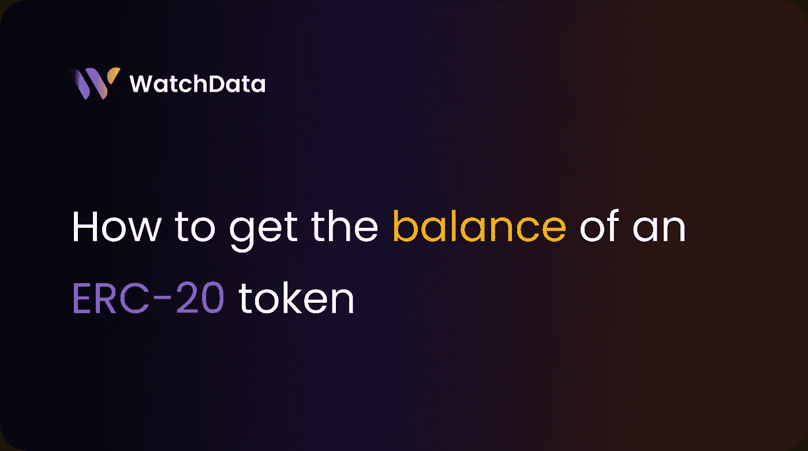
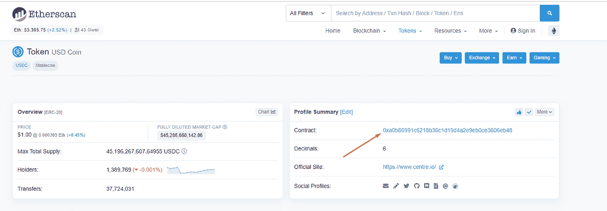
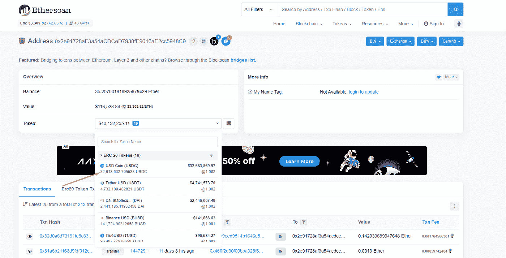
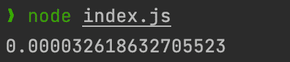
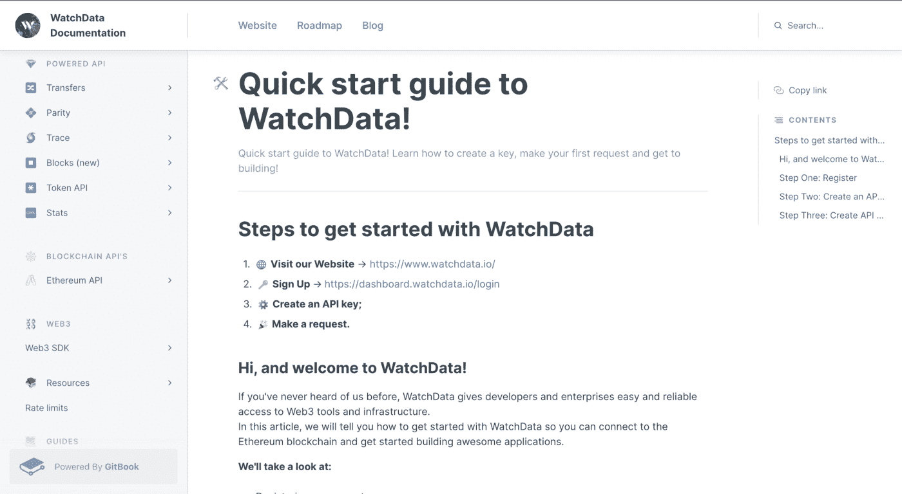

# 如何获得 ERC-20 代币的余额

> 原文：<https://medium.com/coinmonks/how-to-get-the-balance-of-an-erc-20-token-e44fd34579ae?source=collection_archive---------4----------------------->



以太坊网络中最流行的是 ERC20 规范。为了符合这个 ERC20 标准，令牌必须有许多不同的方法和属性。如果智能合约将作为令牌在以太坊网络中工作，您可以将其视为智能合约的标准接口。

今天我们将告诉你如何获得一个特定的 ERC-20 代币的当前钱包余额。

**先决条件:**

*   在系统上安装 Nodejs
*   文字编辑器
*   终端/命令行

**节点配置**

> [**查看我们的快速入门指南**](/@watchdata/a-step-by-step-guide-on-how-to-start-using-the-watchdata-ethereum-api-4f5e727e3529) 了解如何使用我们的 API，并阅读我们的[文档](https://docs.watchdata.io/)

**配置您的项目**

现在您已经完成了启动和运行以太坊节点的所有工作，您可以通过 [web3js](https://web3js.readthedocs.io/en/v1.3.4/getting-started.html) 连接到该节点。这是一个在 [npm](https://www.npmjs.com/) 上的包，可以让你轻松地与以太坊区块链互动。

然后，您应该为项目创建一个文件夹。为此，您应该打开命令提示符并运行以下命令:

*   mkdir 天平
*   cd 天平。

这应该会创建一个名为 ERC20Balance 的文件夹，然后将命令行移动到该目录。

接下来，您需要通过 npm 安装 web3.js 包。为此，您可以运行— ***npm install web3。***

这将创建 **package.json** 和 **package-lock.json** 文件以及 *node_modules* 文件夹。所有这些都应该在你的 *ERC20Balance* 文件夹里。

完成后，我们可以创建一个文件，并将其命名为 **index.js** 。这就是编写 JavaScript 所需的全部设置，它将为您提供您正在寻找的令牌余额！

**获得 ERC20 代币钱包余额**

一旦我们的项目建立起来，是时候了解一下区块链以太坊了。要获得一个 ERC-20 代币余额，你需要做一些事情。

1.  连接到以太坊节点
2.  为我们想要用来与区块链交互的智能合约编写一个 ABI。
3.  找到 ERC20 令牌以获得余额
4.  找到一个钱包来获得平衡
5.  把这些放在一起。

**连接以太坊节点**

在您的 **index.js** 文件的顶部，您需要导入您之前安装的 Web3 库。

这允许我们调用 Web3 方法，这些方法对于交互和连接以太坊区块链很有用。

为了连接到节点，我们可以使用我们之前构建的 WatchData 中的 HTTP 提供者。通常，您的代码应该如下所示:

```
const Web3 = require('web3');
const provider = '[https://ethereum.api.watchdata.io/node/jsonrpc?api_key=YOUR_API_KEY'](https://ethereum.api.watchdata.io/node/jsonrpc?api_key=3174b787-798e-495b-a673-b3b15b50b9ff');
const web3 = new Web3(new Web3.providers.HttpProvider(provider));
```

这段代码将把您连接到 Watchdata API，它为您运行以太坊客户端。现在，您可以使用 Web3 变量来调用库提供的任何 web3js 方法。

**写 ABI**

ABI 是[应用二进制接口](https://docs.soliditylang.org/en/v0.5.3/abi-spec.html)的简称。

ABI 所做的是确定你想要使用部署在[以太坊虚拟机](https://ethereum.org/en/developers/docs/evm/)上的智能合约中的什么功能。

ERC20 规范实际上是以太坊上的智能合约，你可以在这里 看到它的整个 ABI[。你只需要“balanceOf”方法。仅仅为了一个功能就全部复制，似乎有点没必要。](https://ethereumdev.io/abi-for-erc20-contract-on-ethereum/)

幸运的是，这很有可能。在这个巨大的东西中，你只需要一部分来使用“balanceOf”方法。

```
const minABI = [
   {
       constant: true,
       inputs: [{ name: "_owner", type: "address" }],
       name: "balanceOf",
       outputs: [{ name: "balance", type: "uint256" }],
       type: "function",
   },
];
```

**找到一个 ERC20-Token 获得**的余额

在您的加密活动过程中，您很可能会与许多不同的 ERC20 令牌进行交互。USDC 就是这样一个象征。

USDC 将是我展示的令牌，但是您可以使用遵循 ERC20 规范的任何令牌。

您将需要前往[以太扫描](https://etherscan.io/)以找到“合同地址”。这是控制令牌如何工作的智能合约。对我来说是 USDC。

您将需要获取“合同地址”,您可以这样找到它:



USDC 令牌地址 0xa 0b 86991 c 6218 b 36 C1 d 19d 4 a 2e e9 EB 0 ce 3606 EB 48

**找到钱包地址获取余额**

您可以使用与第 3 步类似的过程来查找钱包地址。

我从交易列表里随机选了一个钱包，在所有代币信息下面。它的地址是—0x2e 91728 af3a 54 acdced 7938 Fe 9016 AE 2c 5948 c 9



**我们来写代码**

我们有一个到以太坊节点的连接、一个要调用的 ABI、一个合同地址和一个钱包地址。通过几个对 web3js 的调用，我们可以得到这个地址包含的 USDC 的数量。

您的整个 index.js 文件将如下所示

//index.js

```
console.log('Hello, World.');curl --request POST \
const Web3 = require('web3');
const provider = '[https://ethereum.api.watchdata.io/node/jsonrpc?api_key=](https://ethereum.api.watchdata.io/node/jsonrpc?api_key=3174b787-798e-495b-a673-b3b15b50b9ff')'[YOUR_API_KEY](https://ethereum.api.watchdata.io/node/jsonrpc?api_key=3174b787-798e-495b-a673-b3b15b50b9ff')['](https://ethereum.api.watchdata.io/node/jsonrpc?api_key=3174b787-798e-495b-a673-b3b15b50b9ff');
const web3 = new Web3(new Web3.providers.HttpProvider(provider));
const token = '0xA0b86991c6218b36c1d19D4a2e9Eb0cE3606eB48';
const wallet = '0x2e91728aF3a54aCDCeD7938fE9016aE2cc5948C9';const minABI = [
   {
       constant: true,
       inputs: [{ name: "_owner", type: "address" }],
       name: "balanceOf",
       outputs: [{ name: "balance", type: "uint256" }],
       type: "function",
   },
];const contract = new web3.eth.Contract(minABI, token);
const getBalance = async () => {
   const res = await contract.methods.balanceOf(wallet).call();
   const format = web3.utils.fromWei(res);
   console.log(format);
}
getBalance();
```

> **注意，由此产生的钱包余额会以** [【魏】](https://www.investopedia.com/terms/w/wei.asp) **的格式显示。这是以太坊支持的最小值**

您需要做的最后一件事就是运行它！此时，您唯一需要做的就是保存 index.js 文件，然后在终端中运行它:

确保你仍然在正确的目录中！

它应该在你的控制台上以卫格式显示的号码



我们已经收集了所有主要网络的信息，包括比特币、以太坊、创和其他我们将在不久的将来添加的区块链。你可以从这些区块链中实时获得**原始数据并使用 Powered API** 。

[阅读我们的文档，了解更多信息](https://bit.ly/3wLGnTt)



我们的 API 免费使用且易于设置——只需 [**注册**](https://bit.ly/3tNMmoT) 即可获得您的第一个 API 密钥，或者如果您已经注册，请登录。我们每天至少更新一次我们的网络数据，因此您知道您的用户正在尽可能获得最新的数据！

希望这些都有帮助。如果您想了解更多信息，欢迎致电 [marketing@watchdata.io](mailto:support@watchdata.com) 给我们发邮件，我们会尽可能快速合理地回复您，并尽我们所能提供帮助！

# 有用的链接

*   [WatchData main](https://bit.ly/3MXPMgi)
*   [WatchData 推特](https://twitter.com/watchdata_io)
*   [观察数据不一致](https://bit.ly/3Ikf30D)
*   [WatchData 文档](https://bit.ly/3IgbLeZ)

> 加入 Coinmonks [电报频道](https://t.me/coincodecap)和 [Youtube 频道](https://www.youtube.com/c/coinmonks/videos)了解加密交易和投资

# 另外，阅读

*   [氹欞侊贸易评论](https://coincodecap.com/anny-trade-review) | [CoinSpot 评论](https://coincodecap.com/coinspot-review)
*   [新加坡十大最佳加密交易所](https://coincodecap.com/crypto-exchange-in-singapore) | [购买 AXS](https://coincodecap.com/buy-axs-token)
*   [投资印度的最佳加密软件](https://coincodecap.com/best-crypto-to-invest-in-india-in-2021) | [WazirX P2P](https://coincodecap.com/wazirx-p2p)
*   [西班牙 5 大最佳文案交易平台](https://coincodecap.com/copy-trading-spain)
*   [Pionex 双投](https://coincodecap.com/pionex-dual-investment) | [AdvCash 审核](https://coincodecap.com/advcash-review) | [坚持审核](https://coincodecap.com/uphold-review)
*   [面向开发者的 8 个最佳加密货币 APIs】](https://coincodecap.com/best-cryptocurrency-apis)