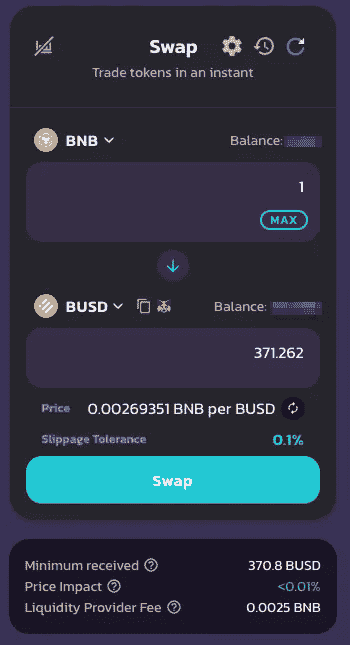
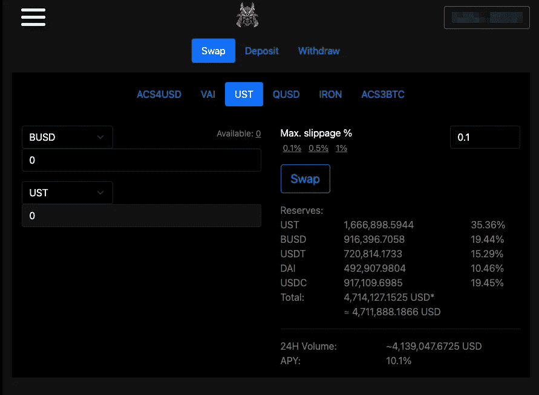
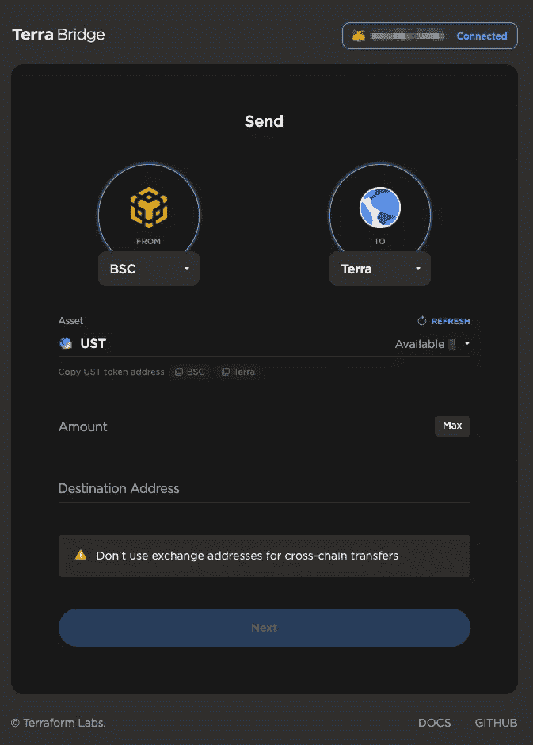
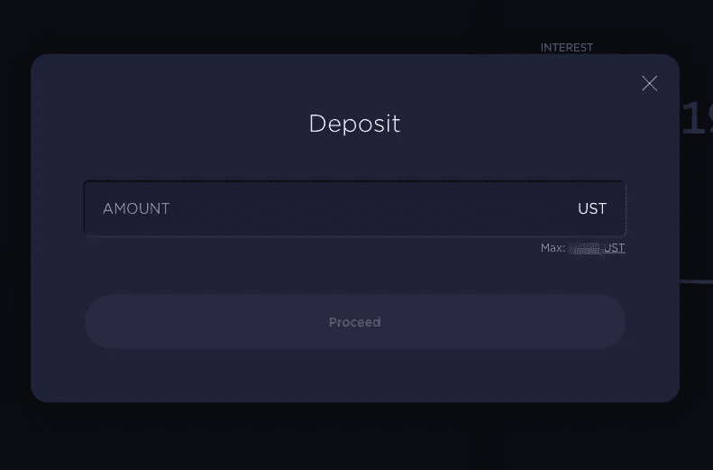
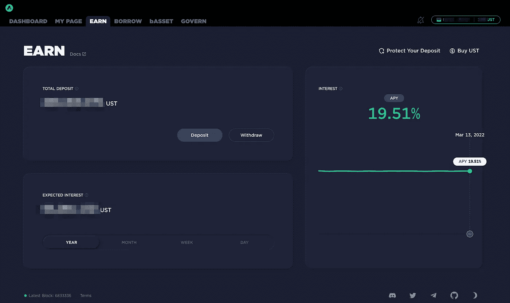
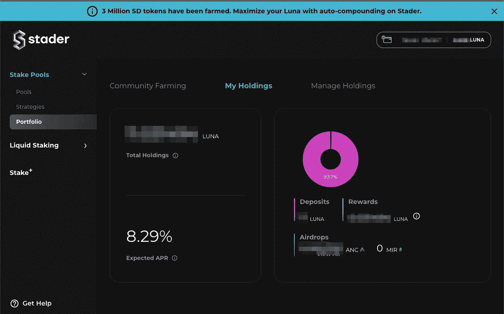

# 如何让 UST 在币安智能链上获得锚定 Terra 的 20%股份

> 原文：<https://medium.com/coinmonks/how-to-get-ust-on-binance-smart-chain-for-20-staking-on-anchor-terra-dc23042e2927?source=collection_archive---------1----------------------->

我一直主张将利润投入到马房中，然后在这些马房中下注。这个稳定的堆栈应该只涨不跌。我认为，目前最有利可图的稳定收益是通过在[锚协议](https://app.anchorprotocol.com/earn)上押下 [UST](https://coinmarketcap.com/currencies/terrausd/) 近 20%的年利率找到的，在那里它每天自动复利。然而，这个过程可能有点令人生畏。本指南旨在帮助我们这些 BSC 上的人获得 UST，将其连接到 [Terra 区块链](https://www.terra.money/)，并开始在 anchor 上赚钱。

本指南假设你已经和 BNB 在币安智能链上，如果不是这样，你可以按照我写的[指南](https://cchen408.medium.com/how-to-get-bnb-on-binance-smart-chain-for-united-states-residents-and-anyone-else-without-access-d8c263fa6f2c)去做。我也使用作为示例中的稳定硬币，但也可以随意使用、、或戴。最后一点需要注意的是，本指南是为那些希望继续控制我们的资金而不是通过集中交易的人而写的。

# 让 UST 加入币安智能链

1.  把 BNB 换成 BUSD。BUSD 是币安美元。这可以在 [PancakeSwap](https://pancakeswap.finance/swap?outputCurrency=0xe9e7cea3dedca5984780bafc599bd69add087d56) 上轻松完成。如果你已经有了 BUSD，那么你可以跳过这一步。

PancakeSwap BNB to BUSD

2.在[埃及稳定互换](https://app.acryptos.com/stableswap/ust/)将 BUSD 换成 UST。我喜欢这种互换，因为费用低，滑点低(我会推荐使用 0.1%的滑点)。请注意，，戴，都支持对换。

恭喜你现在拥有了 UST！！！

# 为 Terra 区块链创建钱包

如果你已经有一个 Terra 钱包设置，你可以跳过这一节。

1.  下载 Terra Station Chrome 扩展:[https://Chrome . Google . com/web store/detail/Terra-Station-wallet/aiifbnbfobmeekipheeijimdpnlgpp](https://chrome.google.com/webstore/detail/terra-station-wallet/aiifbnbfobpmeekipheeijimdpnlpgpp)
2.  创建新的钱包。确保您保存了助记短语、帐户名和密码。如果你想找回一个旧钱包，仅仅有助记短语是不够的，你还必须输入完全相同的帐户名。
3.  复制您的 terra 钱包地址以备后用。

# 将 UST 连接到 Terra 区块链

现在，我们已经准备好将我们的 UST 从币安智能链连接到 Terra！

1.  导航到特拉桥:[https://bridge.terra.money/](https://bridge.terra.money/)

Terra Bridge UST BSC to Terra

2.确保你从 BSC 到 Terra。然后将资产更改为 UST。输入您想要过渡的金额(我总是先尝试小额过渡)。然后在目的地地址字段中输入您的 Terra Wallet 地址。

3.单击下一步并确认交易。

4.您的 UST 大约需要 5 分钟才能到达您的钱包。

# 把 UST 钉在锚上

1.  导航到 https://app.anchorprotocol.com/earn 的
2.  将您的 Terra Station 钱包连接到锚应用程序。
3.  点击存款并输入您想要存款的金额。点击继续并在您的钱包中确认交易。

Deposit

4.享受你的自动复利收益！！！

anchor earn page

对于那些想投资露娜的人，我建议他们用其中任何一种方式将 UST 换成露娜

1.  terra swap([https://app.terraswap.io/swap?to=&type = swap&=&from =乌卢纳](https://app.terraswap.io/swap?to=&type=swap&=&from=uluna))
2.  Terra 站交换([https://station.terra.money/swap](https://station.terra.money/swap))让你可以选择使用其中一个。

为了锁定你的月亮，我推荐使用 [StaderLabs](https://staderlabs.com/) 。在 StaderLabs 出现之前，唯一能锁定 LUNA 的方法就是使用 Terra 站的仪表盘进行锁定。这个过程有点乏味，因为你必须时不时地手动检查你的赌注，因为这些验证器可能会改变，如果你不在上面，你可能会几周或几个月没有任何回报。StaderLabs 已经解决了这个问题，并通过自动复合和“只需点击一下鼠标，就可以将您的股份分散到多个同类最佳的验证器中”，使这个问题变得更加简单。

Stader Dashboard Makes Viewing Your LUNA staking easy

> 加入 Coinmonks [电报频道](https://t.me/coincodecap)和 [Youtube 频道](https://www.youtube.com/c/coinmonks/videos)了解加密交易和投资

# 另外，阅读

*   [瓦济里克斯 NFT 评论](https://coincodecap.com/wazirx-nft-review) | [比茨盖普 vs 皮奥克斯](https://coincodecap.com/bitsgap-vs-pionex) | [坦吉姆评论](https://coincodecap.com/tangem-wallet-review)
*   [如何使用 Solidity 在以太坊上创建 DApp？](https://coincodecap.com/create-a-dapp-on-ethereum-using-solidity)
*   [币安 vs FTX](https://coincodecap.com/binance-vs-ftx) | [最佳(SOL)索拉纳钱包](https://coincodecap.com/solana-wallets)
*   [如何在 Uniswap 上交换加密？](https://coincodecap.com/swap-crypto-on-uniswap) | [A-Ads 审查](https://coincodecap.com/a-ads-review)
*   [加密货币储蓄账户](/coinmonks/cryptocurrency-savings-accounts-be3bc0feffbf) | [YoBit 审核](/coinmonks/yobit-review-175464162c62)