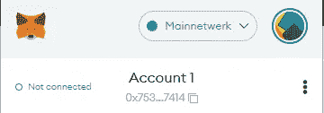

# 如何把你的密码从交易所转移到像 Metamask 这样的浏览器钱包中！

> 原文：<https://medium.com/coinmonks/how-to-get-your-crypto-off-the-exchange-and-onto-a-browser-wallet-like-metamask-76334d2b95e?source=collection_archive---------10----------------------->

# 介绍

如今许多人投资加密，虽然有许多交易所提供更多的功能和产品，但没有一个交易所像所有不同的 DApps 一样通用。有许多不同的连锁店，如以太坊、polygon、fantom 和币安连锁店，提供大量的应用程序、金融服务、DOA 和金字塔计划，可能会满足你的需求。

还有其他很好的理由将你的钱从交易所转移到(硬件)钱包里。即使当你不想与 DeFi 或 Dapps 互动时，保管自己的密码也可能比将其放在交易所更安全，因为在交易所，你的资金可能会被冻结或无法提取。在本文中，我将通过 4 个步骤向你展示如何安全地将资金转移到浏览器钱包中。

# 如何把你的钱从密码交易所转移到你的钱包里！

## 1.创建新的元掩码钱包(或另一个浏览器钱包)

**(**[**【https://metamask.io/download/】**](https://metamask.io/download/)**)(**[**https://brave.com/wallet/**](https://brave.com/wallet/)**)(**[**【https://www.coinbase.com/wallet**](https://www.coinbase.com/wallet)**)(**[**https://trustwallet.com/**](https://trustwallet.com/)**)下载这里**

下载并安装 Metamask 后，会要求您**创建钱包**！按照步骤为您的钱包创建密码，然后单击下一步。
注:这些步骤对于各种浏览器钱包几乎是通用的！

## 2.重要！保存您的秘密恢复短语！

NEVER SHARE THESE WORDS! (example words)

当你读到这一页时，把这些话写在一张纸上，笔记本上，钢板上，刻在木头上。**这 12 个字不要丢，不要分享！如果你想收回你的资金，这 12 个字可以收回你的钱包。千万不要和任何人分享这些话。恶意网站可能会要求这些词，但是除了你，没有人需要这些词。把它们放在保险箱里，不让任何人碰它们。继续设置元蒙版，直到完成。**

## 3.获取您的元掩码地址，并将其列入您的 exchange 白名单

Get your 0x address and whitelist it on your exchange!

下一步将是检索我们的元掩码钱包地址，并将其列入我们选择的交易所的白名单。它可以在 Metamask 扩展中找到。在 KuCoin 上，无论何时你想提取硬币，你都需要将你的地址加入白名单。请务必检查您的白名单地址！一些病毒/机器人在检测到复制/粘贴时会改变地址。

## 4.将资金从 exchange 转移到您的钱包！

Withdraw from the exchange!

**(注意:总是尝试少量以确保有效)**现在我们将从交易所提取资金。选择你选择的硬币，选择的网络和选择的数量。确保“网络”设置正确，因为设置错误的网络可能会导致资金的永久损失！理想情况下，你只需要在以太坊链上发送以太坊，在币安链上发送币安，在 fantom 链上发送 fantom，等等。但是，您可以在 Metamask 中添加的每个链都将支持您的地址！Metamask 支持 ETH、BSC 和 FTM 链，因此您可以将其发送到该地址。

有关所有支持的链条，请参考:【https://rpc.info/ 

## 5.开始使用 DApps 和 DeFi！

现在你的资金已经在你的钱包里了，你可以开始利用 DApps 和服务了！看看[这篇](/coinmonks/low-ethereum-gas-fees-what-to-do-now-16897664c0d7?source=user_profile---------1-------------------------------)关于如何花掉你的以太坊的文章，或者看看我的[被动收入流](/coinmonks/500-a-month-my-passive-crypto-income-stream-of-february-fca6185f2149?source=user_profile---------3-------------------------------)在 DeFi 空间的一些想法！

# 结论

我希望这些步骤已经导致你的资金安全转移。区块链空间有很多机会和服务可供你利用，从成为流动性提供商到在分散的交易所进行交易。请小心骗局(代币)和恶意网站和合同。骗子在这个新的脆弱的世界里非常活跃，所以**注意你的脚步，永远不要给任何人你的秘密密码！**

如有疑问，请随时联系我们！

你想支持我吗？加入 kucoin 时使用我的[推荐链接](https://www.kucoin.com/ucenter/signup?rcode=1de5d)。:)

> 加入 Coinmonks [电报频道](https://t.me/coincodecap)和 [Youtube 频道](https://www.youtube.com/c/coinmonks/videos)了解加密交易和投资

# 另外，阅读

*   [Bybit 融资融券交易](/coinmonks/bybit-margin-trading-e5071676244e) | [币安融资融券交易](/coinmonks/binance-margin-trading-c9eb5e9d2116) | [Overbit 审核](/coinmonks/overbit-review-9446ed4f2188)
*   [有哪些交易信号？](https://coincodecap.com/trading-signal) | [Bitstamp vs 比特币基地](https://coincodecap.com/bitstamp-coinbase)
*   [10 本关于加密的最佳书籍](https://coincodecap.com/best-crypto-books) | [英国 5 个最佳加密机器人](https://coincodecap.com/uk-trading-bots)
*   [ko only Review](https://coincodecap.com/koinly-review)|[Binaryx Review](https://coincodecap.com/binaryx-review)|[Hodlnaut vs CakeDefi](https://coincodecap.com/hodlnaut-vs-cakedefi-vs-celsius)
*   [40 个最佳电报频道](https://coincodecap.com/best-telegram-channels) | [1xBit 评论](https://coincodecap.com/1xbit-review) | [Keevo 钱包评论](https://coincodecap.com/keevo-wallet-review)