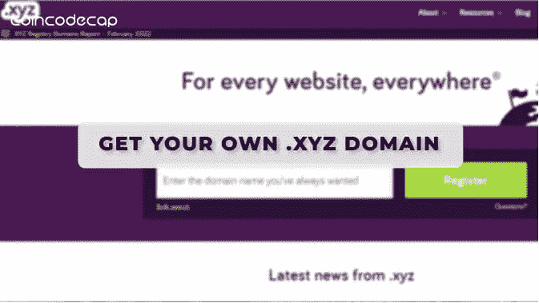
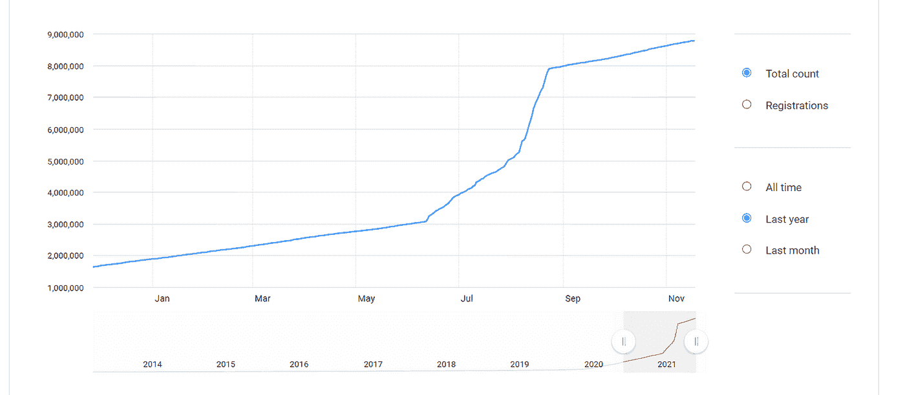
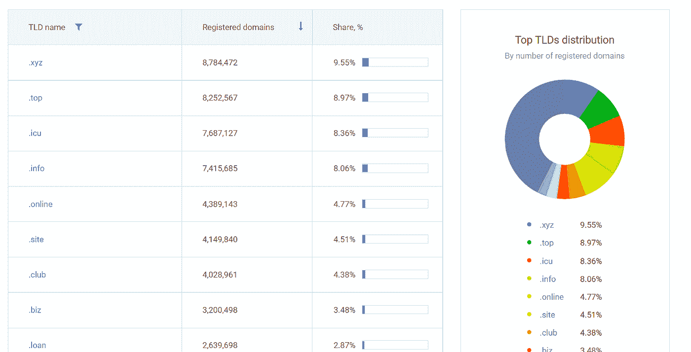
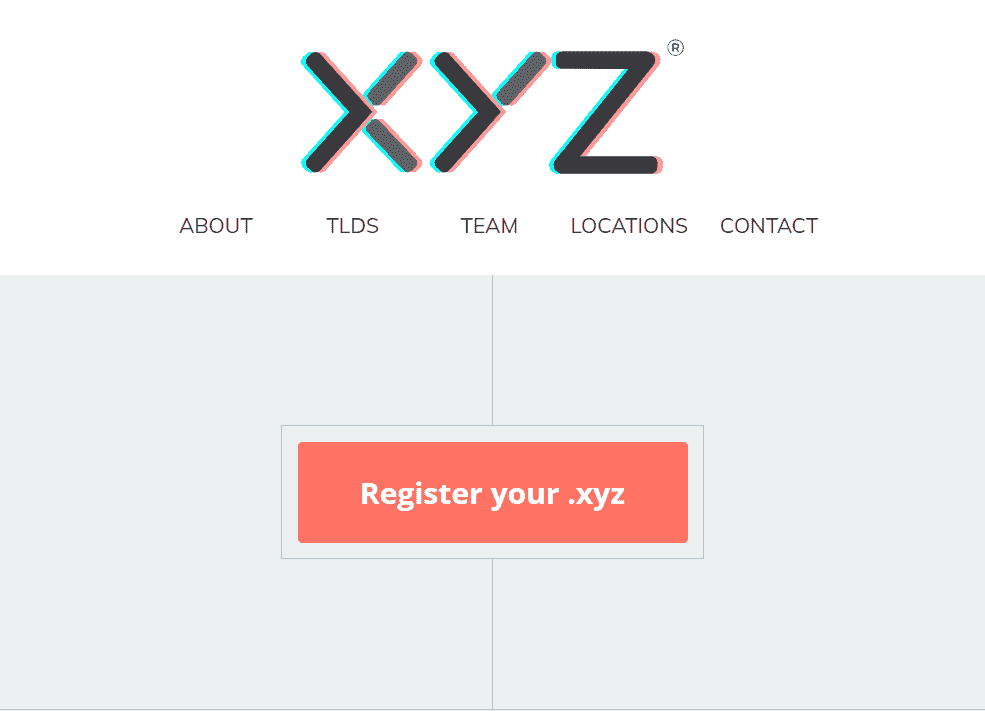
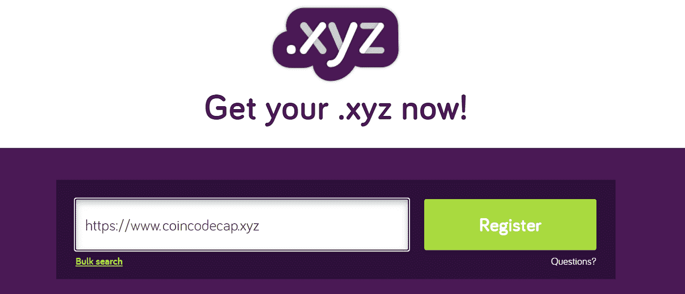
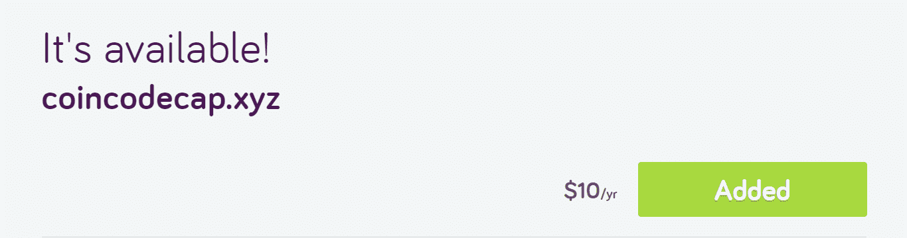
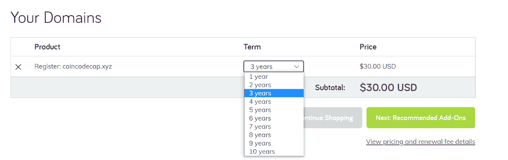
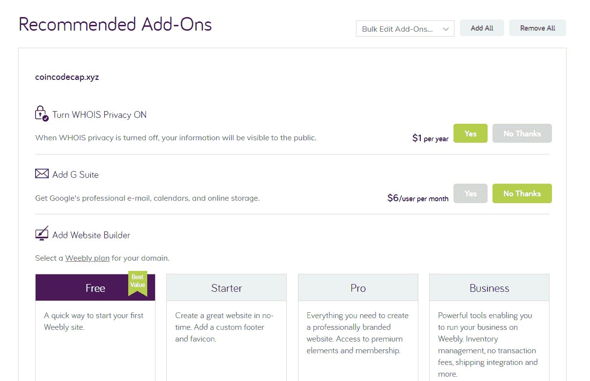
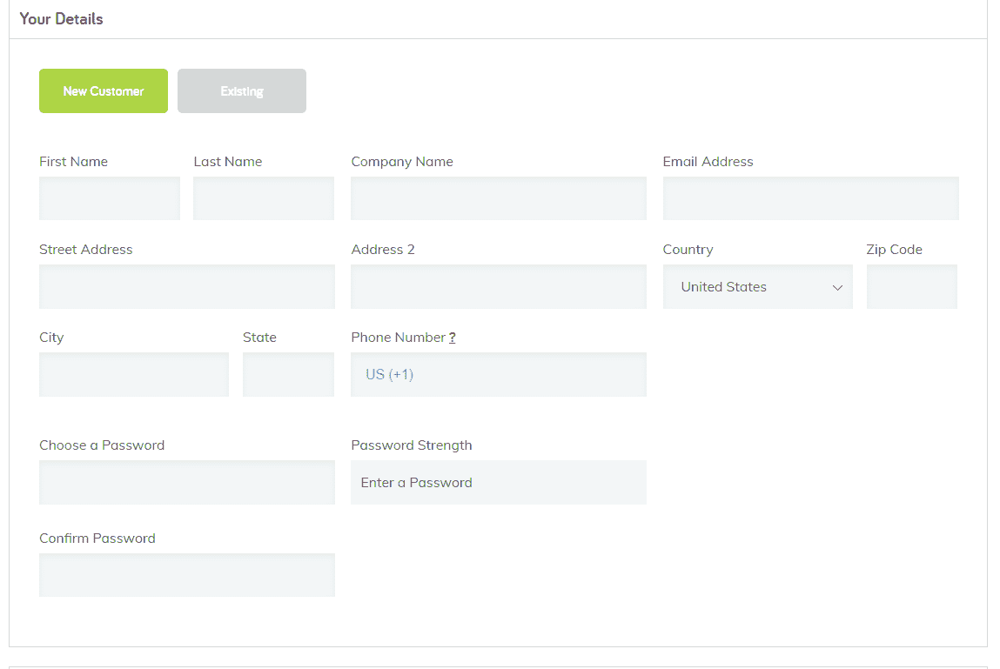
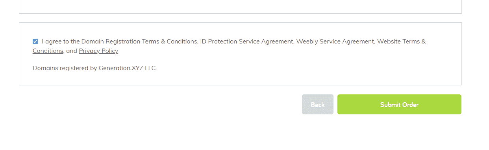

# 如何获得自己的？xyz 域？

> 原文：<https://medium.com/coinmonks/how-to-get-your-own-xyz-domain-ac4d1ca0fba0?source=collection_archive---------29----------------------->

区块链技术的流行预示着从集中到分散机构的根本变化。使用区块链技术的公司往往在各方面都与众不同。比特币和其他加密货币——一种更加透明和安全的数字货币的原始概念，Web 3——一种去中心化的网络体验，[NFT](https://coincodecap.com/non-fungible-tokens-explained)——艺术行业的转变，以及[元宇宙](https://coincodecap.com/free-outfits-in-the-metaverse)——这种转变将在未来几年内震撼人们的心灵。区块链正在给每个行业带来浩劫。

因此，我们如何能在已建立的域名上下注，例如。com，。在，。欧盟，以及。gov？非。com 域名似乎在区块链企业中更受欢迎。例如。xyz 域是区块链组织最常用的域之一。

在谷歌的母公司 Alphabet Inc .选择 [www.abc.xyz](http://www.abc.xyz) 作为其网址后，xyz 域名的受欢迎程度在 2015 年飙升。这主要是因为美国广播公司使用了[www.abc.com、](http://www.abc.com,)，而宝马车队管理部门使用了[www.alphabet.com](http://www.alphabet.com)(事实上，他们仍然在使用)。结果是。xyz 域受到了很多关注。

根据域名统计，受欢迎的。xyz 域近年来呈爆炸式增长。下图显示了注册人数的增加。2021 年的 xyz 域。

2021 .xyz stats.

上面的数据描述了。xyz 是近年来注册人数最多的 gTLD 域名。

# 如何注册一个. xyz 域名？

注册一个. xyz 类似于注册一个普通的。com，。在域中。注册. xyz 域名的逐步指南:

**第一步:**选择你要注册的域名。例如:coincodecap.xyz、blockwish.xyz 等

**第二步:**[https://xyz.xyz/](https://xyz.xyz/)。访问该网站。XYZ 注册处是背后的公司。xyz 域名。该项目在 GitHub 上开放供投稿或反馈。

XYZ 是一个技术组织，为世界各地的个人和企业提供域名和相关服务。作为行业领导者，XYZ 提供多样化的产品，从旗舰产品 domain.xyz 到特定类别的产品。XYZ 成立于 2011 年，旨在为想要数字化的互联网消费者提供创新和选择。此外，它通过将 X、Y、z 三代人联系起来，为所有年龄段的人提供了用新域名打造自己的项目、品牌和企业的机会。

第三步:搜索你想要的域名，如果有的话。

**第四步:**选择你希望域名注册的年期，然后查看注册域名的大概费用。

**第五步:**下一步是根据你的业务/个人需求集成插件。以下是一些您可以集成的附加组件:

**第六步:**下一步是填写你的所有信息，并支付所需金额。

**第 7 步:**阅读条款和条件以便更好地理解，然后提交订单。您的域名现已注册。

# 。xyz X Web 3.0

如果你最近访问了一家加密公司的网站，你肯定会看到一个以“.”结尾的网址。xyz ”,而不是它的更昂贵的对手. com。xyz 已经成为许多 web3 企业的网址终点，从 Block，以前称为 Square，到区块链的初创公司，如 [Mirror](https://mirror.xyz/coincodecap.eth/editions/0xDF5b5ee15CC96ba7d0CB6BD9b2c0fc4417ab6445/3894) 、Proof、Propel 和 Login。但是这意味着什么，为什么它在 web3 世界如此受欢迎？

。xyz 是第一个真正通用的没有内在含义的域名扩展，旨在给人们提供域名的选择。例如:

*   。com 本来是用于商业用途的，
*   。在印度
*   。net 用于网络和
*   。org 为组织，

不属于这些类别之一或者想要脱颖而出的用户应该选择. xyz 作为他们的 TLD。现在你知道为什么大多数 web3 公司使用它了。xyz。Web3 不是 Web2 的升级，而是一种全新的网络体验。尽管. xyz 域名目前由互联网监管机构 ICANN 管理，但一些机构正在致力于开发一个分散的替代系统来支持 web3。XYZ 与 web3 公司的结盟可能会在一个去中心化的网络中基于身份和所有权打开一系列新的赚钱机会。

[**以太坊名称服务(ENS)**](https://coincodecap.com/ethereum-name-service-ens) 是 Web3 的域名服务(DNS)。ENS 允许用户为其所有加密地址生成一个全球身份，并生成一个可搜索的数据库，以使加密钱包和交易更容易访问，即使它们存储在几个不同的平台上。用户现在可以在 ENS 中使用本地。eth 域名或. xyz 域名分享到他们的社交媒体句柄。

***也读，*** [***如何在 ENS 上注册姓名？***](https://coincodecap.com/register-names-on-ens)

**Coincodecap.eth** 是一个 [ENS 域](https://coincodecap.com/register-names-on-ens)代表 Coincodecap 连接的以太坊地址。eth.xyz 功能已经提供给每个。eth 自动命名。就追加”。xyz”到任何的结尾。eth 名称，以便在任何 web 浏览器中查看 ENS 配置文件。例如，在任何浏览器中，coincodecap.eth 的 ENS 配置文件都可以在 coincodecap.eth.xyz 中找到。配置文件材料是使用来自 ENS 的可公开访问的数据自动生成的，并最终由适当的 ENS 用户管理。

# 结论

. xyz 域名在区块链初创公司中很受欢迎，因为它代表了去中心化和 Web3 应用的下一波浪潮。此外，这也给了他们权威，让他们不会落入在科技行业占主导地位的陈词滥调 TLD 之下。

*原载于 2022 年 3 月 16 日 https://coincodecap.com***。**

> *加入 Coinmonks [电报频道](https://t.me/coincodecap)和 [Youtube 频道](https://www.youtube.com/c/coinmonks/videos)了解加密交易和投资*

# *另外，阅读*

*   *[如何匿名购买比特币](https://coincodecap.com/buy-bitcoin-anonymously) | [比特币现金钱包](https://coincodecap.com/bitcoin-cash-wallets)*
*   *[瓦济里克斯 NFT 评论](https://coincodecap.com/wazirx-nft-review) | [比茨盖普 vs 皮奥克斯](https://coincodecap.com/bitsgap-vs-pionex) | [坦吉姆评论](https://coincodecap.com/tangem-wallet-review)*
*   *[如何使用 Solidity 在以太坊上创建 DApp？](https://coincodecap.com/create-a-dapp-on-ethereum-using-solidity)*
*   *[币安 vs FTX](https://coincodecap.com/binance-vs-ftx) | [最佳(SOL)索拉纳钱包](https://coincodecap.com/solana-wallets)*
*   *[如何在 Uniswap 上交换加密？](https://coincodecap.com/swap-crypto-on-uniswap) | [A-Ads 评论](https://coincodecap.com/a-ads-review)*
*   *[加密货币储蓄账户](/coinmonks/cryptocurrency-savings-accounts-be3bc0feffbf) | [YoBit 审核](/coinmonks/yobit-review-175464162c62)*