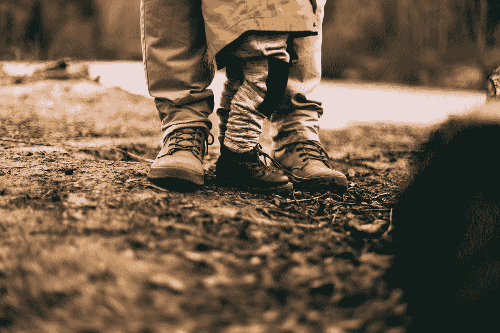
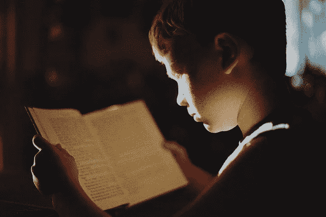
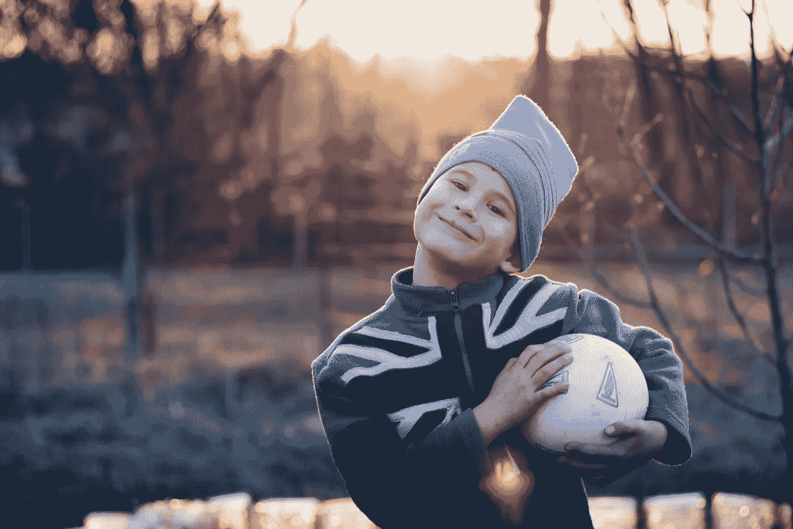
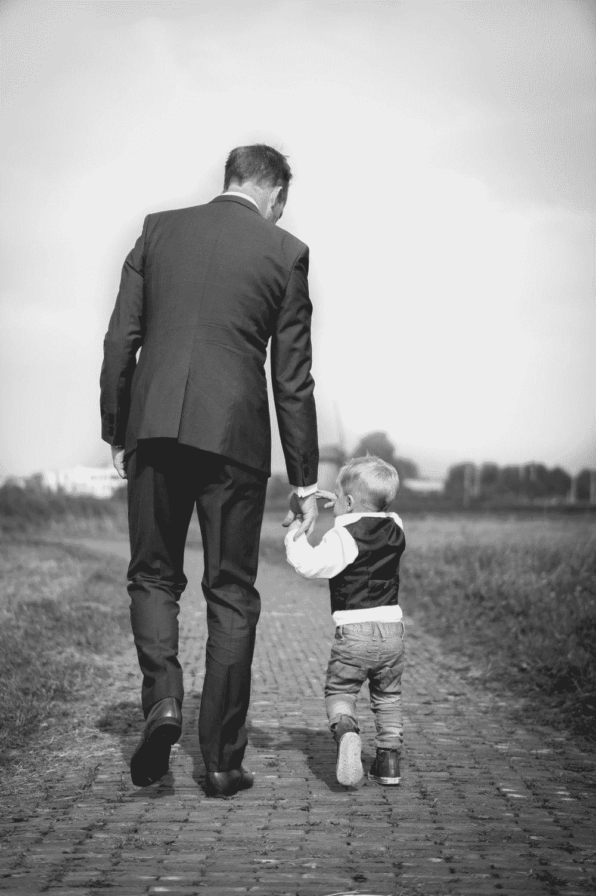
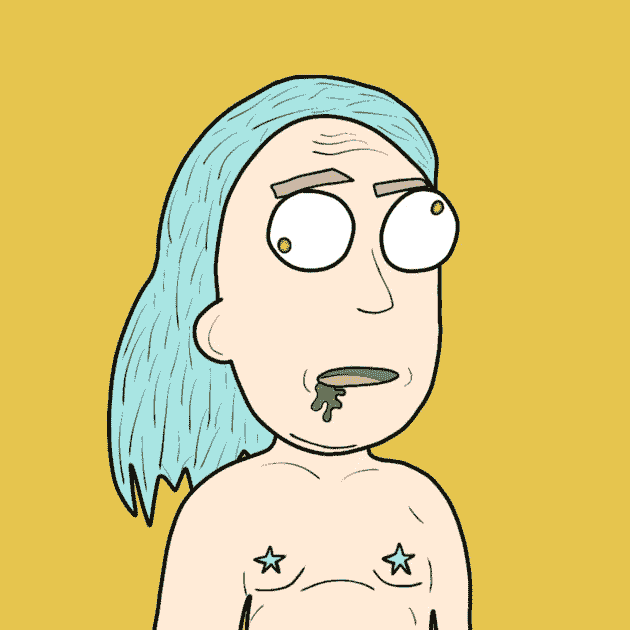

# 如何给你的孩子一个美好的未来(5 个建议)🔮

> 原文：<https://medium.com/coinmonks/how-to-give-your-kid-a-great-future-5-tips-a49564cdd54c?source=collection_archive---------36----------------------->

我没有一个美好的童年…我的妈妈和爸爸在我 6 岁的时候开始分手，我的妹妹 3 岁…我的爸爸在他疯狂的前女友试图绑架我的妹妹后离开了我们一年…他和这个疯子跑了，在美国旅行了一年。他几乎没打电话。

我爸从来没有为我付出过什么，也没有在我生日或者节假日给我打电话。当我回到美国的时候，我会时不时地看到他，但是我更把他看作是一个朋友，而不是父亲。他高中辍学，沉迷于毒品、赌博和酒精，一生大部分时间都在从事建筑工作…

现在你已经对我的父亲/童年有了一个简单的了解，我的目标是不让任何其他孩子结束二流的童年。我们与 [Meta Dads](https://www.twitter.com/metadadsxyz) 的目标是为所有家庭营造一个安全、繁荣、养育、快乐、热情和爱的氛围，同时保持儿童般的生活本质。

在这篇文章中，我想给你一个充满爱心/关怀的父亲的指导，这是我在最需要的时候从来没有得到的。为了简单起见，我将把它作为一个基本的列表。

______________________

**1。陪在他/她的身边
-** 这应该不用说
-一个孩子真正需要的唯一东西就是你的*关注*。100%的关注，而不是 20%……
-如果你告诉他/她你会在下午 6 点带他去棒球练习，一定要去……
-在他所有的生日和假期都去
-如果他/她受伤了，安慰他/她
-只要在他们最困难的时候去，永远都去

**2。教育他/她我是我们家第一个上大学的人……我的教育真正开始于大学之后，那时我开始每周听一本书，也开始阅读。不要让教育在学校教育结束后停止。**

**-** 从教育自己开始。如果你自己都没有受到良好的教育，你怎么能指望培养出一个聪明的孩子呢？学校教育不是伟大的答案
-让你的孩子在早期接触教育/信息书籍
-给他们看 YouTube 上关于教育/精神的视频，比如([精神科学](https://www.youtube.com/c/TheSpiritScience) )
-不要让学校成为你的孩子接受教育的唯一地方
-阅读/听很多书…

**3。旅行直到我 20 岁出头的时候，我才开始旅行。现在我已经去过 20 多个国家，我喜欢旅行……我发现旅行是生活中最伟大的老师之一。
在旅行被认为是奢侈之前，它是一种“寻找自我”的方法。**

-让你接触不同的文化，降低你的自我，这对变得情绪化很有好处
-旅行者有一些最酷的故事要讲，如果你了解生活，讲故事的人往往会死得最开心
-旅行会增强他们的信心
-最好的地理教育就是旅行。这样你会更好地理解周围文化的位置和语言

**4。锻炼** *我的父母，或者我的任何家庭成员，都不锻炼。不用说，我长得很胖…13 岁时，我的体重是 220 磅。我因为这个而害羞，甚至被取笑…不要让这发生在你的孩子身上。*

-轻度瑜伽对孩子来说很棒。它让身体活动，增加灵活性，为他们的余生做好准备。这也有助于他们通过呼吸平衡身心，这是我们都更需要的……
-散步、慢跑或其他形式的有氧运动(划船/骑自行车……)对孩子稳定内脏器官和调节血液非常有益
-我会远离健身和/或负重，至少在孩子停止生长之前
-训练他们如何安全地锻炼将伴随他们一生，并确保他们成年后有一个健康的身体。树枝弯曲了，它就会生长

**5。饮食/食物** *饮食不是某种“快速变瘦”的制度……它是一种生活方式。我们吃什么就变成什么。如果你饮食不好，你怎么能指望你的孩子饮食好呢？学习如何均衡地吃健康的食物。肉应该像美味佳肴一样对待，而不是每天都吃。尽可能多吃蔬菜和水果，远离包装/加工食品以及油炸食品…
我的父母在麦当劳和塔可钟的帮助下把我养大，这导致了我童年时期的肥胖…不要让这发生在你的孩子身上。*

-早餐应该是清淡的东西，水果或鳄梨吐司或类似这样的东西
-午餐应该是主餐。这让你的胃在睡觉前有时间消化食物。煮一些蔬菜，与藜麦或大米混合，做一顿美味、饱腹、健康的饭
-晚餐也应该适度清淡，比如沙拉加小汤(不是罐装的)
-每天至少为他们做一顿饭。这对你和他们都是最健康的。当你烹饪/准备食物时，给食物注入爱的能量——不要让他们想吃薯片、糖果或苏打水就吃。这些应该作为奖励，如果有的话，最多一天一小部分给一次

_________________________________________________________________

这将是一个持续几个月/几年的系列文章，讲述如何培养一个独立思考、受过高等教育、在生活的各个方面都健康、有自信、真正善良的孩子。

如果这个故事对你有任何价值，请竖起大拇指并与他人分享:]

__________________

# 一定要小心！！！

我怎么强调都不为过！保持高度警惕，注意你点击的每一个链接，你做的每一笔交易，以及你接触的每一个人，因为骗子在这个空间里比比皆是，最好看的项目都被取消了。

*在点击所有链接之前，要再三检查，确保它们是你要找的官方链接。在把任何有价值的东西寄给别人之前，也要仔细检查所有的钱包地址。*

**跟随我们的加密/NFT/区块链/元宇宙之旅**

[*推特*](https://twitter.com/TheDudesCrypto)[*不和*](https://discord.gg/Cv8v2Ert8m)[*YouTube*](https://www.youtube.com/channel/UC7pbtSBs9nRJHK6coMhCR8g)[*抖音*](https://www.tiktok.com/@thedudescrypto)[*insta gram*](https://www.instagram.com/thedudescrypto/)[*Spotify 播客*](https://open.spotify.com/episode/5U8vXE9HDAsGbSbebw9p62?si=2rZIigw-Tw2pCxjxmkbYzQ)

请支持我发送 polygon matic 到这个 eth 地址，或者 eth:
0x b 53b 3978333 e 11 c 382 ab 619 f 02 f 469 A8 c 70750 af

干杯，哥们儿

> *加入 Coinmonks* [*电报频道*](https://t.me/coincodecap) *和* [*Youtube 频道*](https://www.youtube.com/c/coinmonks/videos) *了解加密交易和投资*

# 另外，阅读

*   [Bookmap 点评](https://coincodecap.com/bookmap-review-2021-best-trading-software) | [美国 5 大最佳加密交易所](https://coincodecap.com/crypto-exchange-usa)
*   最佳加密[硬件钱包](/coinmonks/hardware-wallets-dfa1211730c6) | [Bitbns 评论](/coinmonks/bitbns-review-38256a07e161)
*   [新加坡十大最佳加密交易所](https://coincodecap.com/crypto-exchange-in-singapore) | [收购 AXS](https://coincodecap.com/buy-axs-token)
*   [红狗赌场评论](https://coincodecap.com/red-dog-casino-review) | [Swyftx 评论](https://coincodecap.com/swyftx-review) | [CoinGate 评论](https://coincodecap.com/coingate-review)
*   [投资印度的最佳加密软件](https://coincodecap.com/best-crypto-to-invest-in-india-in-2021)|[WazirX P2P](https://coincodecap.com/wazirx-p2p)|[Hi Dollar Review](https://coincodecap.com/hi-dollar-review)
*   [加拿大最佳加密交易机器人](https://coincodecap.com/5-best-crypto-trading-bots-in-canada) | [库币评论](https://coincodecap.com/kucoin-review)