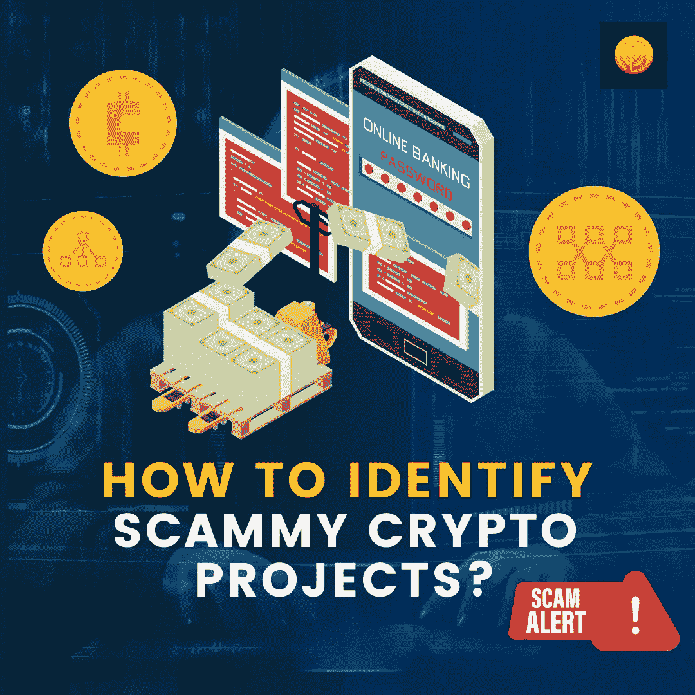

# 如何识别 Scammy 加密项目？

> 原文：<https://medium.com/coinmonks/how-to-identify-scammy-crypto-projects-1998f7588462?source=collection_archive---------25----------------------->

疯狂的美妙之处在于逻辑被贪婪绑架和赎回！当我们谈论加密货币时，这种说法很合适。庞氏骗局在这一年浮出水面。声称 20 倍至 200 倍回报并附有验证证明的硬币可能会深入人心，抓住你的理性。但当你有超过 6524 种加密货币呈现大量用例时，就会发现其中一些会适得其反。显然，这是在 ICO 热潮达到顶峰、狗屎硬币主宰密码诗时发生的事情。结果是 80%的人都付诸东流了。

我们现在处于熊市！这是一个创新以闪电般的速度发生的市场。这段时间开发的一些项目会像 Polygon、 [ADA](https://www.coindhan.com/trading/adainr) 和 SOL 一样好；虽然，他们中的少数人会让你喜欢鱿鱼游戏，山药和露娜。也就是说，在这篇博客中，我们将介绍一些事情来帮助你识别危险信号，远离低劣的[加密](https://blog.coindhan.com/2022/06/24/how-to-build-a-strong-long-term-crypto-portfolio/)浪费。

# 顶级红旗，以节省您的投资，同时选择加密项目

# 糟糕的令牌组学

*   令牌分发是以不公平的方式进行的。所谓不公平，是指只有少数项目业主和开发商拥有超过 30%至 50%的控制权。这是一个完美的泵和倾倒食谱。当心！
*   供应是无限的；因此，这些代币是通货膨胀的，它们也很可能为零。
*   视野一点都不清晰！

# 匿名

如果你没有看到像业主和创始人那样的项目领导，很可能你投资的是一个诈骗项目。在 2017 年发生的大多数 ICO 骗局中，项目的起源并不为人所知。仅仅凭借一份白皮书和一个网站，骗子们就利用了投资者，卷走了他们的资金。

# 静态价格

如果价格有一段时间没有变动，这个项目就不是处于最佳状态。人们可以嘲笑即使在牛市中也没有进展。

# 缺乏经过实战检验的用例

用例对于项目的成功很重要，但是如果你投资的项目没有显示出长期的用例，而仅仅是一个泵转储方案，那就远离它！要判断这一点，您可以看到他们的解决方案，并将其与项目带来的进展对应起来。如果他们不能做到这一点，并出示有效的证据，远离！

# 智能合同未审计

智能合约错误是加密项目中的常见问题。因此，无论你何时接手任何项目，都要注意对他们的智能合同进行审计。如果源代码是封闭的，这是一个很大的暗示，该项目将是一个骗局。

# 集中的

如果只有少数节点，这是一个很大的问题。索拉纳是一个伟大的项目，但只有很少的节点。这并不意味着索拉纳是一个糟糕的项目，但如果有人对索拉纳提出疑问，可以想象投资者对一个刚从岩石中冒出来的项目会怎么想。

# 庞氏骗局

要识别庞氏项目，如果你看到他们的代币经济有一个金字塔结构，项目的价值完全依赖于投机，这是很好的告别这种项目，保护你的现金。

# 正在调查的项目

如果像 SEC 这样的监管机构一直在追踪一个存在缺陷的项目，明智的做法是远离它们。它们可能会在一夜之间爆发，投资者可能会面临风险。

# 疯狂的收益

10%到 20%的回报承诺是好的，但 1000%的回报承诺和庞氏骗局一样好。此类项目从未实现，它们拥有高度安全的流动性池。所以，你现在知道该怎么做了！

# 哄抬股价

价格像 Dogecoin 一样歇斯底里。在这一点上，它可以去月球，下一个时刻，咬灰尘。Doge 一直完全由 Elon Musk 支持，他是唯一一个推动和抛售市场的人。投资前先看一个项目的宏观。如果它们在很长一段时间内表现稳定，那就去买吧！

> 加入 Coinmonks [电报频道](https://t.me/coincodecap)和 [Youtube 频道](https://www.youtube.com/c/coinmonks/videos)了解加密交易和投资

# 另外，阅读

*   [币安 vs FTX](https://coincodecap.com/binance-vs-ftx) | [最佳(SOL)索拉纳钱包](https://coincodecap.com/solana-wallets)
*   [比诺莫评论](https://coincodecap.com/binomo-review) | [斯多葛派 vs 3Commas vs TradeSanta](https://coincodecap.com/stoic-vs-3commas-vs-tradesanta)
*   [Capital.com 评论](https://coincodecap.com/capital-com-review) | [香港的加密借贷平台](https://coincodecap.com/crypto-lending-hong-kong)
*   [如何在 Uniswap 上交换加密？](https://coincodecap.com/swap-crypto-on-uniswap) | [A-Ads 审查](https://coincodecap.com/a-ads-review)
*   [WazirX vs coin dcx vs bit bns](/coinmonks/wazirx-vs-coindcx-vs-bitbns-149f4f19a2f1)|[block fi vs coin loan vs Nexo](/coinmonks/blockfi-vs-coinloan-vs-nexo-cb624635230d)
*   [本地比特币审核](/coinmonks/localbitcoins-review-6cc001c6ed56) | [加密货币储蓄账户](https://coincodecap.com/cryptocurrency-savings-accounts)