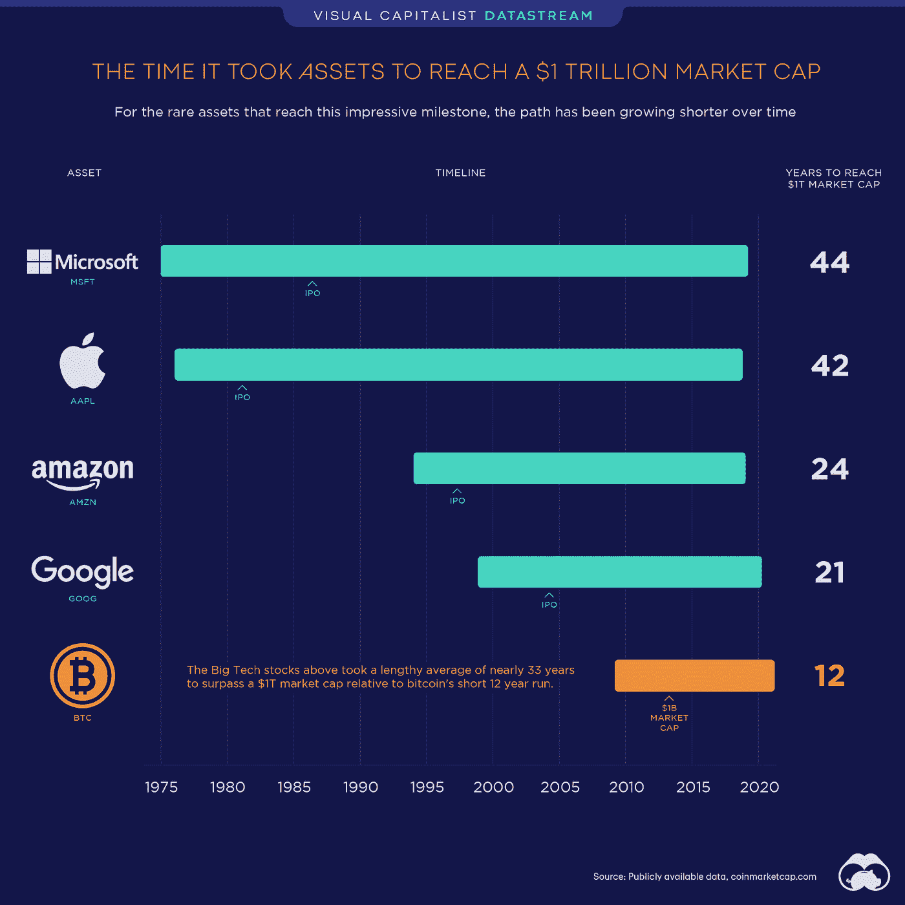
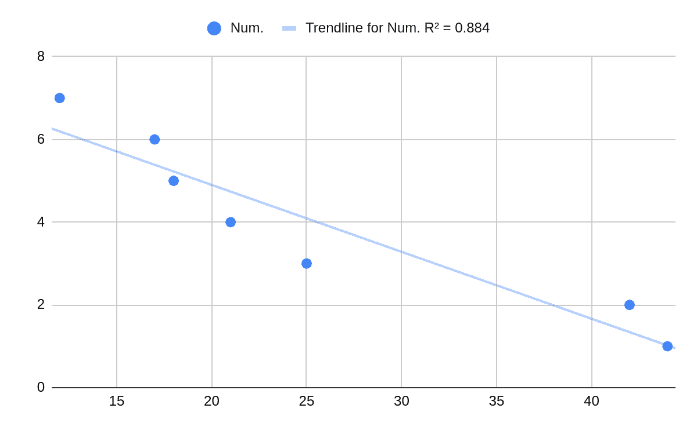
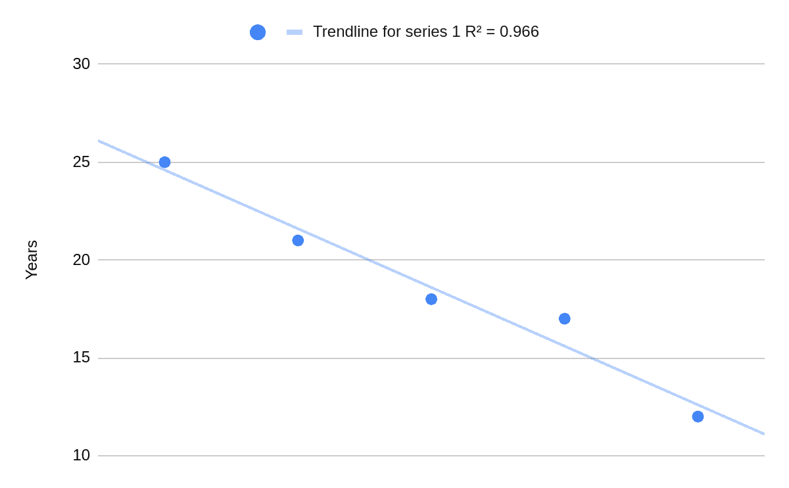
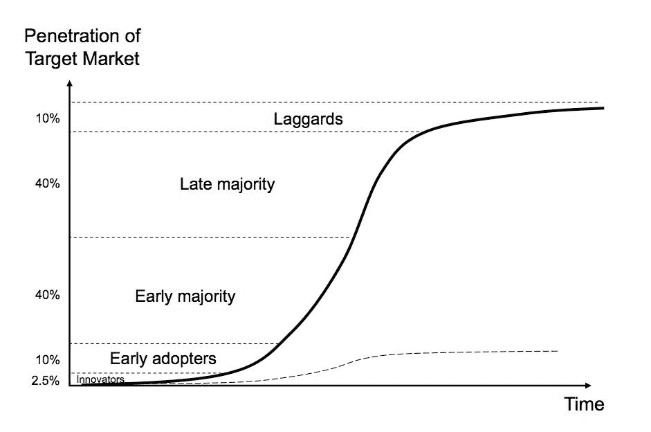
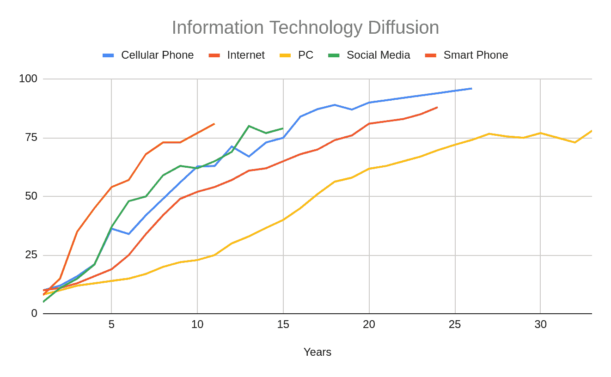
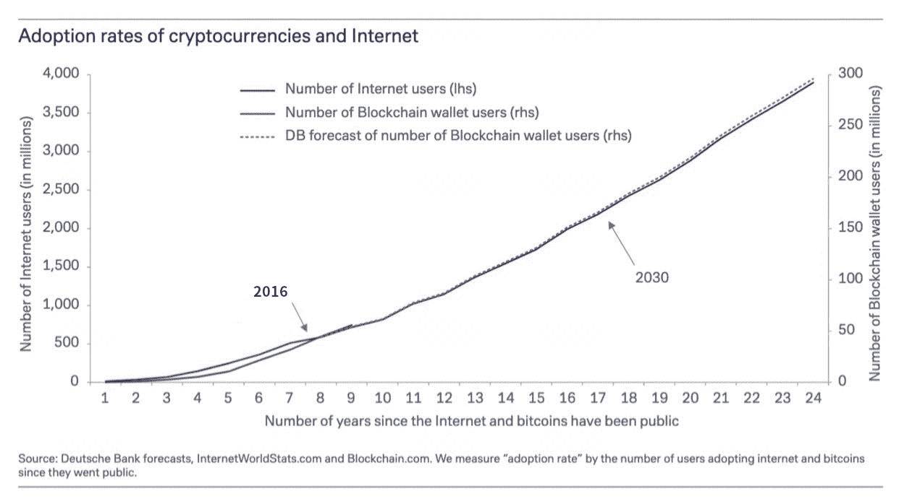
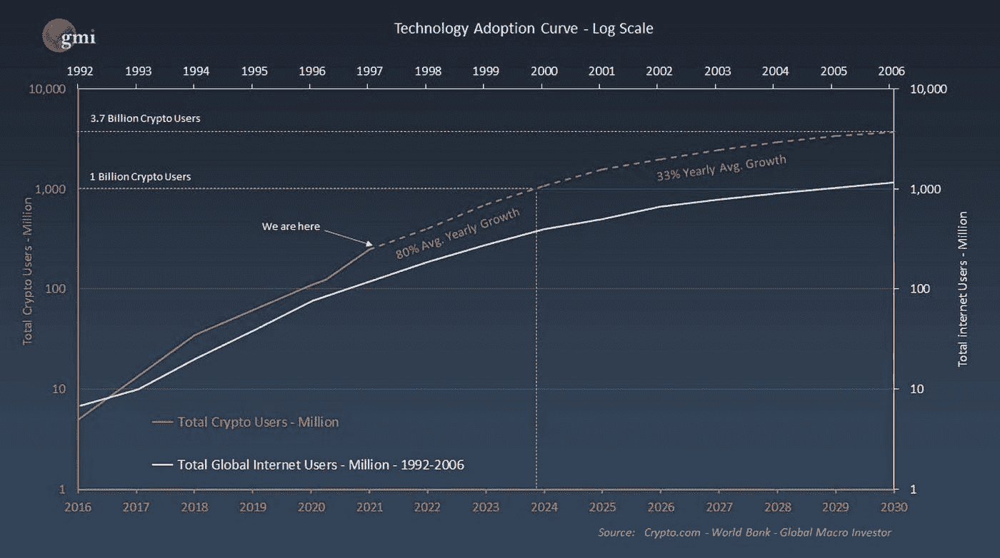
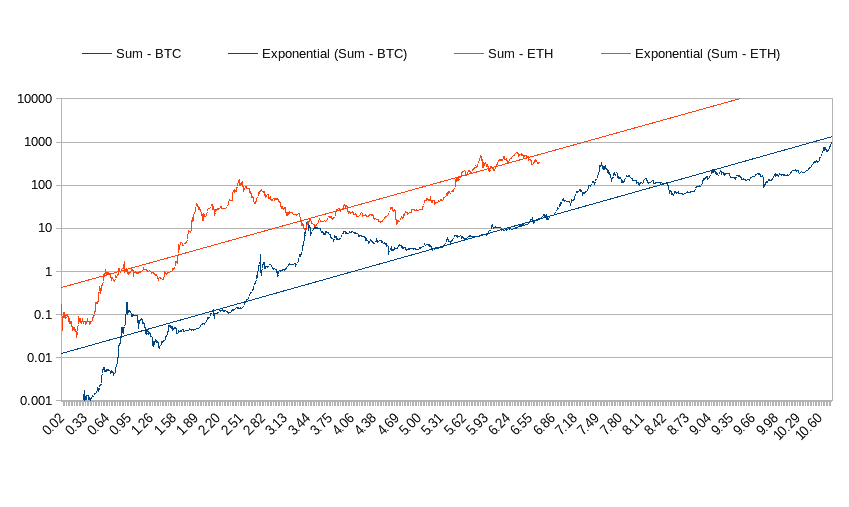
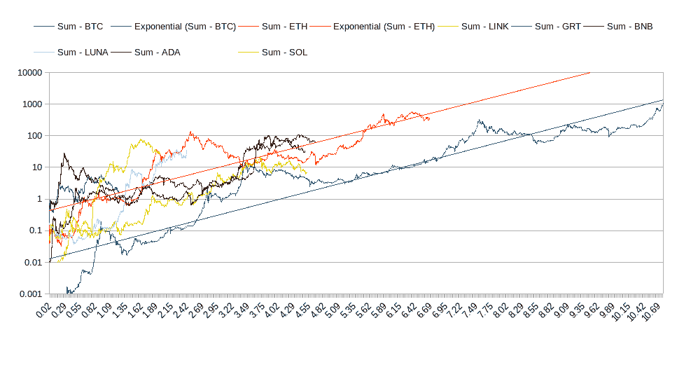
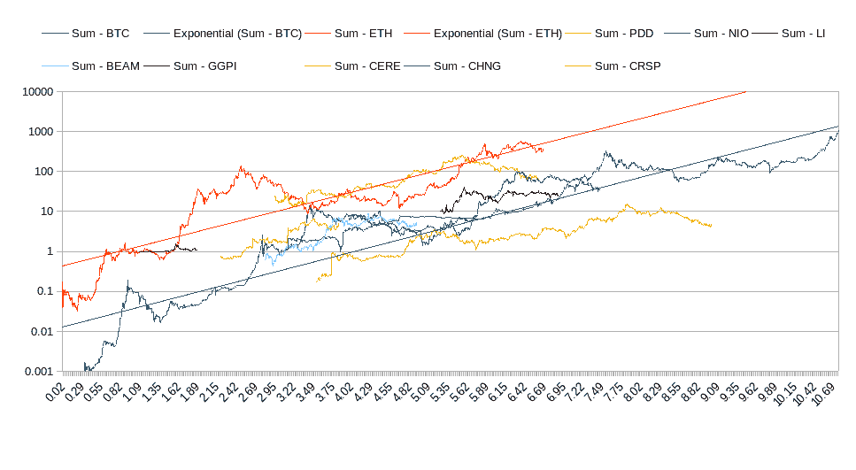

# 如何识别和跟踪下一个万亿美元的资产

> 原文：<https://medium.com/coinmonks/how-to-identify-track-the-next-trillion-dollar-assets-2045f5b2a29a?source=collection_archive---------10----------------------->

比特币在 2021 年 3 月 9 日的万亿化不仅使其成为最新和最快的突破一万亿美元市值的资产，而且 ***照亮了一条看似可行的道路，以确定下一个可能分享相同道路以达到一万亿美元里程碑的资产，即使在更短的时间 fram*** e，即从资产存在之日起不到 12 年。

定位这种资产的方法不需要深刻的洞察力或复杂的技术，但下面的图表只是简单地销售策略。

此外，下表总结了该图表，并增加了两项资产。

简单的线性回归分析使趋势更加清晰。

如果我们认为前两项资产距离我们太远，不能作为有意义的指标，那么其余的资产在可视化成为万亿美元俱乐部成员所需的几年趋势方面做得更好。

鉴于所有 1T 美元资产线性模型的预测为 3.7 年，最近 1T 美元资产线性模型的预测为 9.6 年， ***显然，大约 7 至 10 年将是下一个资产在其市值方面达到一万亿美元的合理估计范围。***

到目前为止，估计数字仅仅是通过统计手段获得的，随后，让我们更深入地挖掘这一趋势背后的驱动因素。自第一次工业革命以来，人类文明主要由技术创新驱动。不仅技术在人类进步中发挥着越来越重要的作用，而且技术传播的速度也越来越快。任何特定的技术，尤其是那些创新的技术，都在以符合被称为 S 曲线的采纳模式的速度传播。

技术采用的 s 曲线

然而，更重要的是，S 曲线的时间框架在不断缩短。例如，根据技术传播(Comin 和 Hobijn (2004 年)和其他人)，炉灶的普及率从 1900 年的 10%到 1957 年的 90%用了 58 年，但电力用了 47 年，家用冰箱用了 24 年，微波炉用了 17 年。如下图所示，这种趋势的一个更明显的表现是被称为信息技术的技术的扩散。

数据来源:技术扩散(Comin 和 Hobijn (2004 年)和其他)

这张图表生动地说明了一种信息技术被发明和介绍给公众的时间越近，以同样的采用率被采用的时间就越短。这种持续而深刻的趋势是第一张图表的潜在驱动因素，显示了不同资产的减少年份，以万亿计。

上图不包括比特币，比特币基于最新的颠覆性信息技术区块链。早些年，区块链技术是如此创新，以至于比特币几乎独自主导了整个市场，因此，尽管其采用率的发展甚至比互联网慢一点点，但竞争的缺乏压倒性地飙升了比特币的市值，并最终在 12 年后使比特币成为最快达到 1 万亿美元的资产。

当以太坊在 2015 年出现时，事情变得更加有趣。以太坊本身是对创新的区块链技术的颠覆性创新，它将图灵机带到了区块链，使比特币成为可能。从那以后，以太坊一直作为一个底层平台工作，基于这个平台，区块链对任何应用程序都有吸引力。因此，从 2016 年开始，加密货币行业成为使用区块链技术创建和交易的所有令牌的代表性集合。

从 2016 年开始，加密货币的采用率开始超过互联网。越来越大的差异由下面图表中的两条背离线来证明。

综上所述，这里可以初步得出一个结论 ***下一个有望在第 7 年到第 10 年达到 1T 市值的资产可能是一种加密货币代币。***

如果我们坚持上面列出的标准，目前市场上肯定已经有一些比特币继承人的候选人了。毫不奇怪，确实存在一个完美的候选者，它以大约 3500 亿美元的市值进行交易，并且已经存在了将近 7 年，即以太坊。

就以太坊与比特币押韵的方式而言，这张图表非常有趣，发人深省。请注意，Y 轴是对数刻度，这意味着每个刻度的间隔代表每项资产市值的 10 倍变化，而 X 轴代表自每个开始日期以来经过的年数，而不是日历年。我们先仔细看看比特币曲线。该曲线在 2021 年 3 月 9 日比特币触及 1 万亿美元的日期结束，第一个未标明的年份被从曲线中剔除，这导致了 10.6 年的时间框架，而不是比特币整个生命周期的 12 年。另外，与蓝色曲线交叉的蓝色直线是对市值曲线的指数拟合，在对数刻度中表现为直线。根据 R2 的数据，指数回归拟合占曲线的 87%，这使其成为比特币稳定趋势的良好代表。此外，我们可以从图表中看到，趋势线触及 1 万亿美元的时间比曲线本身要早一点。

在我们理解了比特币的曲线和线条之后，以太坊部分就不言自明了。鉴于以太坊的寿命为 6.7 年，市值约为 3500 亿美元，趋势占 75%且稳定，有理由认为以太坊是一个完美的候选人，根据趋势线，可以在不到 1 年的时间内达到 1 万亿美元的里程碑，这意味着如果一个人决定在此时投资以太，以太坊的象征，在 1 或 2 年的时间框架内可以获得 200%的利润。

然而，以太坊的结论并不是本文的目的，本文旨在 ***通过识别具有 1T 美元潜力*** 的早期鸟类，找到一种在预定时间跨度内能够带来至少 10 倍(如果不是 100 倍)回报率的资产。然而，比特币和以太坊的布局为筛选各种可能的年轻资产提供了一个极好的工具。

在我们深入所有合格的候选人进行详细分析之前，首先要提到最适合这种分析的投资理念。投资对大多数投资者来说总是令人沮丧的，因为任何没有达到预定价格目标和持有期的特定投资都容易受到不适当的头寸平仓和开仓的不自信决策的影响，从而导致不必要的损失和错失。识别和跟踪 1 万亿美元潜在资产的方法是试图回答哪种资产在达到什么价格之前将被持有多长时间，以便目标资产可以自信地持有到那时 ，最终要么实现可能改变人生的利润，要么由于超高的回报率，由于其较小的配置而对整个投资组合几乎没有影响。

随后，我们将看一看通过这种方法挑选的所有潜在资产的总体情况。首先，我们必须概述一些具体的标准，以便将我们的关注点从目前市场上所有可用的资产中大幅缩小。

1.  自股票上市或公司成立之日起至少一年。
2.  自股票上市或公司成立之日起不超过 7 年。
3.  至少有 1 年的公开交易数据(自股票首次公开募股后的数年)。
4.  目前的市值超过 1 亿美元，如果超过 3 年，则为 1B 美元。

如前所述，对于候选人来说，加密货币是一个不可避免的行业，第一次尝试是关注一些选定的令牌，看看它们如何适应 BTC-以太带。

*多个硬币与比特币和以太坊乐队的历史数据图*

除了比特币和以太，还有 Link、Chainlink 的令牌、BNB、币安的令牌、阿达、卡尔达诺的令牌、露娜、特拉的令牌、索尔、索拉纳的令牌、图的令牌 GRT。这些线纠缠太多，看不清楚，然而，基本上它们遵循的是 BTC-以太带定义的趋势，更接近以太坊而不是比特币，一些代币表现过度，而一些表现低迷。请注意，这里不会对每个令牌进行详细的分析，将在后续文章中讨论。

虽然到目前为止，搜索主要集中在加密货币上，但股票仍然可能是一些有前途的候选人的潜在资源。因此，对近年来的首次公开募股进行了彻底的调查，从而得出了下面的图表。

*多个股票的历史数据图以及比特币和以太币波段*

这个以股票为导向的图表不同于上面以加密货币为导向的图表，因为这里绘制的股票更加成熟，并且倾向于向波段的下限移动，甚至向下跳水。因此，与加密货币相比，作为候选货币的股票似乎不那么强劲，也不太可能击败以太坊甚至比特币。

***简而言之，使用从一开始就阐述的方法来搜索资产证明是卓有成效的，并且已经找到了一批候选者，将在接下来的文章中进一步研究。*** 敬请关注，后续文章不仅会对投资标的进行分析，还会给出一些确凿的结论。

*请注意，本文不作为投资建议，只应被视为提供信息。*

> 加入 Coinmonks [电报频道](https://t.me/coincodecap)和 [Youtube 频道](https://www.youtube.com/c/coinmonks/videos)了解加密交易和投资

# 另外，阅读

*   [如何匿名购买比特币](https://coincodecap.com/buy-bitcoin-anonymously) | [比特币现金钱包](https://coincodecap.com/bitcoin-cash-wallets)
*   [瓦济里克斯 NFT 评论](https://coincodecap.com/wazirx-nft-review)|[Bitsgap vs Pionex](https://coincodecap.com/bitsgap-vs-pionex)|[Tangem 评论](https://coincodecap.com/tangem-wallet-review)
*   如何使用 Solidity 在以太坊上创建 DApp？
*   [币安 vs FTX](https://coincodecap.com/binance-vs-ftx) | [最佳(SOL)索拉纳钱包](https://coincodecap.com/solana-wallets)
*   [如何在 Uniswap 上交换加密？](https://coincodecap.com/swap-crypto-on-uniswap) | [A-Ads 评论](https://coincodecap.com/a-ads-review)