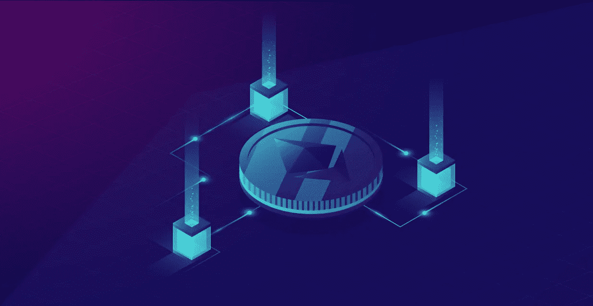
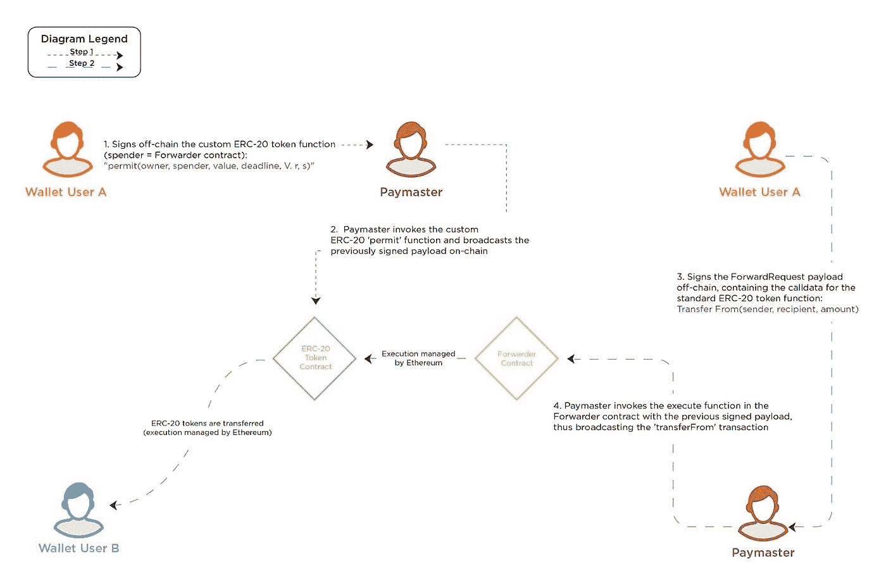

# 如何实现无气交易？—氪星思维

> 原文：<https://medium.com/coinmonks/how-to-implement-gasless-transactions-kryptomind-2a12a992fdfd?source=collection_archive---------20----------------------->



Implement Gasless Transactions

# 了解以太坊中的气体:

在以太坊的世界里，气体至关重要。举个例子，是燃料让它运行，就像汽车需要燃料来运行一样。根据定义，术语“gas”是指用于量化完成特定操作所需的计算量的单位。

每个以太坊交易都有成本，因为它们都需要计算资源来完成。以太坊的原生货币 ETH 是用来交燃气费的。此外，天然气价格通常以 Gwei 单位表示，Gwei 单位本身也是 ETH 的一个单位。一个 Gwei 相当于 0.000000001 ETH(或 109 ETH)。

例如，你经常会说你的煤气价格是 1 Gwei，而不是 0.000000001 ETH。Gwei，代表千兆卫，相当于 1，000，000，000 卫(1 卫= 1018 ETH)，是一种计量单位。ETH 的最低级单位叫做“微”,是以 b 货币的创始人的名字命名的。

# 为什么会有气费？

*   以太坊矿工因保护网络和确认交易而获得天然气费。
*   天然气收费还可以防止欺诈用户用交易淹没网络，堵塞网络。

用于确定以太坊燃气成本的算法是动态的。因此它们会波动。以太坊网络经常被批评收费高，性能差。例如，以太坊网络的平均交易成本往往高于比特币区块链。希望更快完成交易的以太坊网络用户只需支付更多费用。用户可能会选择网络流量相对较低的时段来降低燃气成本。如果他们不介意较慢的交易速度，他们也可以减少小费。

这就提出了一个问题，这些天然气成本是否可以消除。

是的，多亏了元交易，我们可以做到这一点。

# 元事务

## 这是什么？

元交易是包括实际交易的标准以太坊交易。不需要天然气或区块链的参与，因为实际的交易是由用户签名并转发给运营商或类似的机构。运营商将该签署的交易提交给区块链，同时支付相关费用。转发智能合约在执行之前检查实际交易的有效签名。

## 以太坊的限制

在 ERC 20 协议令牌转移的上下文中存在一个关键的治理层:approve 和 transferFrom 之间的交互，它允许令牌在外部拥有的帐户(EOA)之间转移，并通过抽象出 msg 在特定于应用程序的条件下用于其他合同。sender 作为令牌访问控制的定义机制，可以说是 ERC 20 协议令牌成功的主要原因之一。

尽管如此，该解决方案受到 ERC-20 批准功能是根据 msg.sender 来指定的这一事实的限制。EOA 必须利用 ERC-20 令牌来进行用户的初始活动。如果用户想要参与

对于智能协定，需要两个事务(approveand 和智能协定调用，后者将在内部调用 transferFrom)。用户必须拥有 ETH 来支付交易气体费用，即使是在支付另一个人的最基本的使用情况下。

## 我们如何解决这个问题？

为了解决这个问题，我们可以在 ERC-20 令牌契约中添加一个新的函数 permit，使用户能够使用已签名的消息(通过 secp256k1 签名)而不是使用 msg.sender 来更改许可映射。换句话说，通过提交帐户已签名的消息，permit 方法可用于修改帐户的 ERC-20 许可(参见 IERC20.allowance)。令牌持有者账户不需要进行交易，因此也没有必要保留任何 ETH，因为它不依赖 IERC20.approve。

签名的数据是按照 EIP-712 组织的，它已经被主要的 RPC 和钱包提供商广泛用于增强用户体验。



# 实施无汽油交易

**示例:**我们的示例智能协定标记为 Forwarder.sol，它实现了 EIP-712 域分隔符(_domainSeparatorV4)，该分隔符用作编码方案的一部分，编码的最后一步是获取消息摘要，然后通过 ECDSA 进行签名(_hashTypedDataV4)。

# 货代合同

以太坊上可扩展元事务转发的智能契约

智能合同转发器. sol 扩展了 EIP-2770，并包含以下核心功能:

verify:根据类型化的结构化数据验证签名。

```
/*** @dev Verifies the signature based on typed structured data.* See https://eips.ethereum.org/EIPS/eip-712*/function verify(ForwardRequest calldata req, bytes calldata signature) public view returns (bool) {address signer = _hashTypedDataV4(keccak256(abi.encode(_TYPEHASH,req.from,req.to,req.value,req.gas,req.nonce,keccak256(req.data)))).recover(signature);return _nonces[req.from] == req.nonce && signer == req.from;}execute: Executes the meta-transaction via a low-level call./*** @dev Main function; executes the meta-transaction via a low-level call.*/function execute(ForwardRequest calldata req, bytes calldata signature) public payable whenNotPaused() returns (bool, bytes memory) {require(_senderWhitelist[msg.sender], "AwlForwarder: sender of meta-transaction is not whitelisted");require(verify(req, signature), "AwlForwarder: signature does not match request");_nonces[req.from] = req.nonce + 1;// solhint-disable-next-line avoid-low-level-calls(bool success, bytes memory returndata) = req.to.call{gas: req.gas, value: req.value}(abi.encodePacked(req.data, req.from));if (!success) {// solhint-disable-next-line no-inline-assemblyassembly {returndatacopy(0, 0, returndatasize())revert(0, returndatasize())}}/*** @dev Validates that the relayer/forwarder EOA has sent enough gas for the call.* See https://ronan.eth.link/blog/ethereum-gas-dangers/.*/assert(gasleft() > req.gas / 63);emit MetaTransactionExecuted(req.from, req.to, req.data);return (success, returndata);}
```

# 一些安全注意事项:

我们跟踪链上的随机数映射以防止重放。此外，代运商防止任何人出于潜在的恶意目的公开交易。sol 智能合同的执行功能受到白名单的保护。此外，智能契约是可拥有的，它提供了基本的访问控制机制，其中允许 EOA(所有者)独占访问某些功能(即，addSenderToWhitelist、removeSenderFromWhitelist、killForwarder、pause、unpause)。此外，智能合同功能 execute 是可暂停的，这意味着它包含了一个紧急停止机制，所有者可以激活它。最后，使用函数 killForwarder 建立自毁操作作为紧急备份。

注意 1:白名单中的 eoa 在发送事务之前仔细检查编码的(用户签名的)呼叫数据是非常重要的。

> 交易新手？试试[密码交易机器人](/coinmonks/crypto-trading-bot-c2ffce8acb2a)或者[复制交易](/coinmonks/top-10-crypto-copy-trading-platforms-for-beginners-d0c37c7d698c)

注 2: calldata 是存储函数外部调用数据的地方。函数可以在内部调用，例如，从契约内部调用，或者当函数的可见性是外部的时，在外部调用。当这样的外部呼叫发生时，该呼叫的数据存储在 calldata 中。

注意 3:对于 addSenderToWhitelist 和 killForwarder 函数，我们没有实现一个专用的严格策略来从不允许零地址 0x0000000000000000000000000000。这样做的原因是，第一，函数通过被 Ownable 来保护，第二，可以认为像 0x 000000000000000000000000000000001 这样的地址是同样危险的，但是我们对此不做任何事情。

*原载于 2022 年 6 月 24 日*[*【https://kryptomind.com】*](https://kryptomind.com/how-to-implement-gasless-transactions)*。*

> 加入 Coinmonks [电报频道](https://t.me/coincodecap)和 [Youtube 频道](https://www.youtube.com/c/coinmonks/videos)了解加密交易和投资

# 另外，阅读

*   [密码本交易平台](/coinmonks/top-10-crypto-copy-trading-platforms-for-beginners-d0c37c7d698c) | [Coinmama 审核](/coinmonks/coinmama-review-ace5641bde6e)
*   [印度的加密交易所](/coinmonks/bitcoin-exchange-in-india-7f1fe79715c9) | [比特币储蓄账户](/coinmonks/bitcoin-savings-account-e65b13f92451)
*   [OKEx vs KuCoin](https://coincodecap.com/okex-kucoin) | [摄氏替代品](https://coincodecap.com/celsius-alternatives) | [如何购买 VeChain](https://coincodecap.com/buy-vechain)
*   [币安期货交易](https://coincodecap.com/binance-futures-trading)|[3 commas vs Mudrex vs eToro](https://coincodecap.com/mudrex-3commas-etoro)
*   [如何购买 Monero](https://coincodecap.com/buy-monero) | [IDEX 评论](https://coincodecap.com/idex-review) | [BitKan 交易机器人](https://coincodecap.com/bitkan-trading-bot)