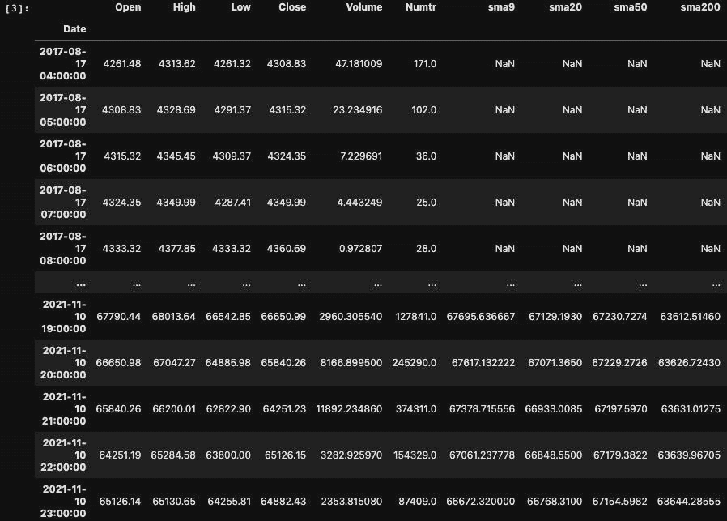
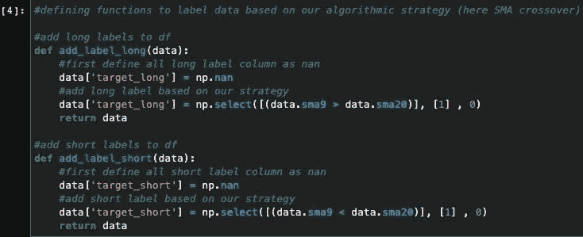
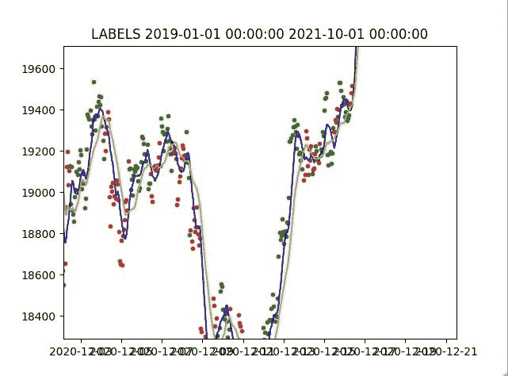
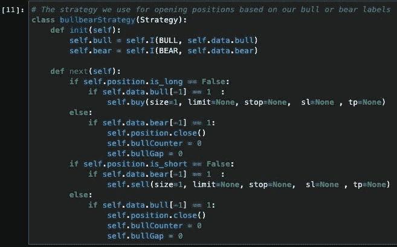
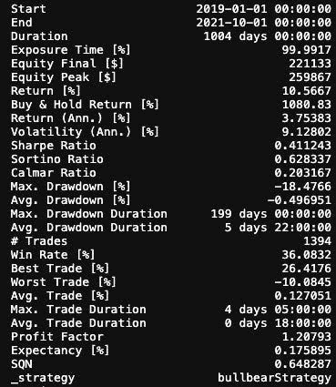
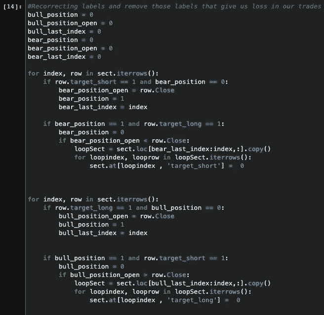

# 如何通过机器学习提高算法交易的胜率:标记数据

> 原文：<https://medium.com/coinmonks/how-to-improve-algorithmic-tradings-win-rate-by-machine-learning-labeling-data-9186017b5c61?source=collection_archive---------1----------------------->

> 如果您想最大限度地提高性能，请在开始开发之前阅读 1DES 博客上的这些" [How to](https://1des.com/blog/topics/how-to) "文章。

在交易自动化的时代，算法交易已经成为各种人和公司获取利润的流行方法。好处是，你可以运行一个基于算法的机器人来为你执行交易，并在多个市场中赚取利润。然而，由于市场上出现的不同情况，许多算法的胜率可能很低，这使得你的算法效率低下，毫无用处。这时，机器学习可能有助于解决这个问题，并实现潜在利润的最大化。

Algorithmic Trading

在来自 [1DES](https://1des.com/) 的这一系列文章中，我们将检验机器学习是否能够提高算法策略在币安 BTC/USDT 市场上的胜率。

这将通过使用 1H OHLC 历史数据来完成。

首先，我们使用 Python 回溯测试库来计算算法策略的胜率。接下来，我们在相同的数据和时间线上使用机器学习模型来提高我们的胜率。

在本实验中，我们将关注这 3 个方面:

第 1 部分:标签数据

第 2 部分:特性选择

第 3 部分:比较回溯测试结果和训练

# 第 1 部分:标记数据

谈到加密货币市场，可能有许多算法策略需要考虑。我们将使用被称为“移动平均交叉”的简单而流行的策略来简化问题。当短期 SMA 在长期 SMA 上方交叉时，这是买入信号，因为它表明趋势在向上移动。与此同时，当短期均线穿过长期均线下方时，这是卖出信号，因为它表明趋势正在向下变化。在这个例子中使用了币安 BTC/USDT 1 小时时间框架的收盘价的 SMA9 和 SMA20。

我们的实验将在 Jupyterlab 环境中实现。克隆 [crypto_labeling_data](https://github.com/the1des/crypto_labeling_data) 库并运行 [labeling_data.ipynb](https://github.com/the1des/crypto_labeling_data/blob/main/labeling_data.ipynb) 以便更好地理解。

**模块[1–3]**

首先，我们来探究一下数据。除了 2017 年 8 月 17 日至 2021 年 11 月 10 日的币安 1 小时 OHLCV 数据，我们还增加了几个指标

data

**模块[4–8]**

现在，让我们根据 SMA 交叉策略来标记我们的数据。为了证明当 SMA9 > SMA20 时是买入信号，所以我们将数据标记为“target_long ”,另一方面，当 SMA9 < SMA20 时是卖出信号，所以我们将数据标记为“target_short”。

crossover strategy

然后我们将使用 pyplot 库可视化数据。长标签在绿点上，短标签在红点上。SMA9 和 SMA20 分别是蓝色和黄色的线。因此，我们对数据的分布有了很好的了解。下图显示了部分情节。

result plot

**区块[9–13]**

回溯测试库提供了一个名为 Strategy 的类，允许您创建自己的策略来打开和关闭多头和空头头寸。我们的策略是当我们到达一个“牛市”目标时开仓，当我们到达一个“熊市”点时平仓。对于空头头寸，应该反过来做。我们的数据集有两个额外的列，称为“bull”和“bear ”,与交叉策略中的“target_long”和“target_short”相同，但是如果您希望使用不同的标注策略，您可以将数据标记为 bull 或 bear。这样，每当我们改变我们的标记策略时，我们不必改变我们的回溯测试策略。

strategy

准备好回溯测试函数和标记数据后，让我们运行回溯测试来计算我们的交叉策略胜率:

backtest

根据 1394 笔交易，我们的胜率是 36.08%，没有你想象的那么高。我们想发现的是机器学习如何提高我们的胜率。一种方法是将这些标签和一些特征直接输入机器学习模型，看看是否有助于改进它们。但问题是，当我们在标签中有这么多错误时，这意味着我们正在向我们的模型输入错误的数据，我们不能期望更好的结果。

**第 14-19 街区**

为了修正我们的标签，我们应该去掉那些在我们开仓买入或卖出时给我们带来损失的标签。这是通过逐个迭代我们的标签，模拟我们的回溯测试策略，并在标签给我们带来损失时改变标签来实现的。

changing the label

一旦错误的标签被移除，我们应该能够以 100%的成功率再次运行回溯测试。为了验证这一点，我们准备了校正后的数据集，并重复了与主策略相同的过程。

如你所见，我们的标签已被成功更正。这给了我们一个很好的干净的数据集来输入我们的机器学习模型。

在下一篇文章中，我们将讨论如何根据我们的策略找到合适的特征，然后在这些特征上训练我们的模型，看看我们是否可以提高胜率。

> 加入 Coinmonks [电报频道](https://t.me/coincodecap)和 [Youtube 频道](https://www.youtube.com/c/coinmonks/videos)了解加密交易和投资

## 也阅读

 [## 2022 年 2 月值得关注的三大游戏代币| CoinCodeCap

### 排名前 3 位的游戏也占交易总量的 85%以上。Defi 王国、Axie Infinity 和 Pegaxy…

coincodecap.com](https://coincodecap.com/top-3-gaming-tokens-to-look-out-for-in-february-2022)  [## 2022 年最佳加密交换平台| CoinCodeCap

### 随着时间的推移，我们大多数人将转向 dex 以获得更好的安全性和隐私。因此。在这里，我们将讨论…

coincodecap.com](https://coincodecap.com/best-swap-platforms)  [## 10 大最佳在线赌场|赢得并赢取免费 BTC 2022 | CoinCodeCap

### 接收、支付和赚取加密货币| |有各种各样的最佳在线赌场可供选择，有可能…

coincodecap.com](https://coincodecap.com/best-online-casinos)  [## 2021 年最佳加密借贷平台| 6 大比特币借贷平台

### 获得比特币和其他加密货币的最佳贷款利率

medium.com](/coinmonks/top-5-crypto-lending-platforms-in-2020-that-you-need-to-know-a1b675cec3fa)  [## 2021 年 6 大最佳硬件钱包|顶级加密硬件钱包[更新]

### 最好的加密货币硬件钱包是绝对必要的。我们将在 NGRAVE、Ledger Nano X 和…

medium.com](/coinmonks/the-best-cryptocurrency-hardware-wallets-of-2020-e28b1c124069)  [## 加密交易机器人——19 款最佳免费加密交易机器人

### 2022 年币安、比特币基地、库币和其他密码交易所的最佳密码交易机器人。四进制，位间隙…

medium.com](/coinmonks/crypto-trading-bot-c2ffce8acb2a)  [## 最佳 4 个加密交易信号电报通道

### 这是乏味的找到正确的加密交易信号提供商。因此，在本文中，我们将讨论最好的…

medium.com](/coinmonks/best-crypto-signals-telegram-5785cdbc4b2b)  [## Bitsgap 评论-交易机器人加密信号和套利 2022

### 这篇文章的重点是 Bitsgap 审查，这是一个最终的交易解决方案，并提供交易机器人，信号…

coincodecap.com](https://coincodecap.com/bitsgap-review)