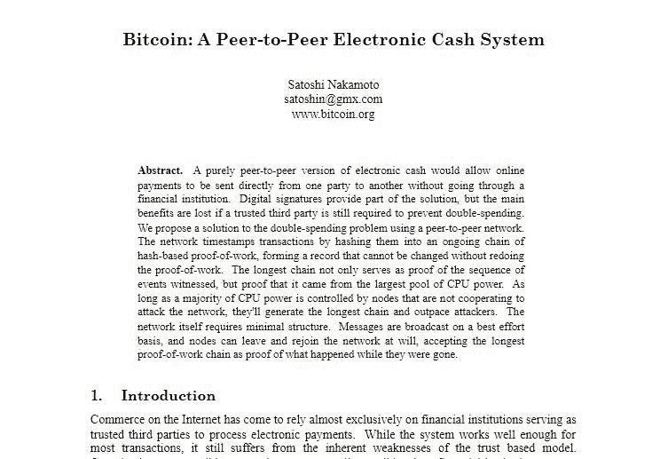
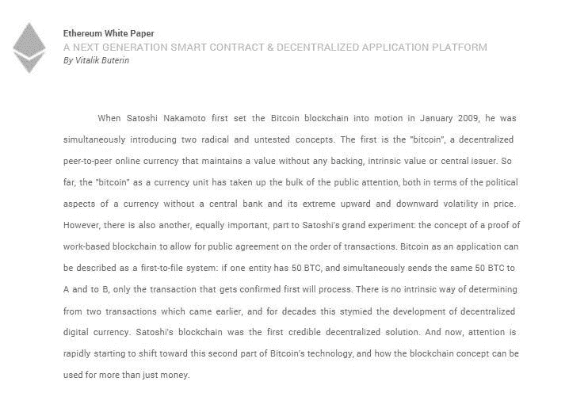

# 如何投资 ICO:完整指南——梅隆邮报

> 原文：<https://medium.com/coinmonks/how-to-invest-in-an-ico-the-complete-guide-mellonpost-e1db7ed22cd7?source=collection_archive---------41----------------------->

(最后更新日期:2022 年 4 月 26 日)

ICO 是 Initial Coin Offering 的缩写，这是一个公司想要为新的加密货币产品筹集资金时使用的术语。

这种为新密码筹集资金的方法类似于首次公开募股，这是一种当公司想加入股票市场时筹集资金的方法。

一般来说，一家寻求筹集资金创造新硬币的公司可以启动首次硬币发行，作为筹集资金的策略。

自 2014 年首次用于以太坊初始硬币发行以来，这一策略就一直存在。

至少可以说，对于团队和创始人来说，ICO 是筹集资金建立加密项目的非常有效的手段；协议和生态系统。

**也读:** [**区块链技术讲解**](https://mellonpost.com/blockchain-technology-explained/)

在首次发行硬币期间，符合公司要求的感兴趣的投资者可以购买该报价。

所述提议可以是加密货币令牌的形式，或者可以是加密项目中的特定股份。

密码行业还没有良好和全面的法规，所以投资者很容易在这些交易中失去他们的钱。

尽管许多投资者报告了巨额收益，但许多人也在欺诈性 ico 中损失了数百万美元。

因此，任何想要深入 ico 世界的人都应该做好研究，找出他们想要投资的任何硬币的使用案例。

要参与最初的硬币发行，你必须对加密货币的工作原理有一个现有的了解。

至少了解一下加密钱包和交易所是如何运作的，会让你减轻很多压力。

**也可以阅读:如何投资 ICO:完整指南**

这是因为要获得任何新的代币，你必须首先购买现有的数字货币。

正是这些已建立的数字货币，你现在将兑换成你想要投资的新代币。

最初的硬币发行是非常有趣的，需要一些好的支持思想来使它真正发挥作用。

这就是为什么从一开始，ICO 的创始人或组织者就必须决定如何组织产品。

ICO 的结构大约有三种方式，包括:

# ico 的类型

# 静态供给和静态定价

该模型与公司决定指定代币数量的限制以及它需要的融资目标有关。

在这个系统中，每个代币都有特定的奖励，代币的总供应量也是固定的，以后不能再增加。

# 静态供给和动态定价

ICO 的这种模型在具有固定供应方面与最初的模型相似。然而，在资金方面，目标是动态的。

利用该系统，从筹资过程中筹集的资金量将能够进一步确定每个代币的总价格。

筹集比最初估计和目标更多的资金将导致代币价格的进一步稀释。

# 动态供应和静态定价

当代币的数量没有上限时，采用这种提供硬币的模式，这意味着代币的数量在数量上保持动态。

但是，无论供应量如何变化，价格将始终保持不变。

在这个系统中，发行过程中筹集的资金数量将决定代币的供应量。

因此，筹集的资金越多，也就意味着以同样价格发行的代币越多。

我们现在已经知道，最初的硬币发行可以分为三种不同的方式。

但是组织者如何将这些信息传达给投资者呢？这就是白皮书的用武之地。

ICO 白皮书也称为 Woof Paper，是一个信息包，旨在向潜在投资者传达加密项目的必要信息。

白皮书通常放在一个简单的网站上，网站上有一个用于令牌的域名，它将包含有关产品的所有信息。

# ICO 白皮书示例；

白皮书更深入地解释了加密项目的理念和未来计划，以及该项目在美国的拟议和预期案例。

**也可阅读:** [**如何推广代销商产品和服务的 9 种方式**](https://mellonpost.com/9-ways-how-to-promote-affiliate-products-and-services/)

白皮书中的信息预计将详细介绍以下内容:

*   代币的货币政策。
*   什么样的支付方式(硬币)是可以接受的，
*   它将在适当的时候在哪个交易所推出，
*   投资者在与它交换硬币时将如何收到代币
*   ICO 周期有多长，当然
*   项目需要多少。

# ICO 发布的指导原则

原则上，在 ICO 期间，如果投资者满足项目的预计财务要求。然后项目会进一步进行。

然而，如果筹集的资金低于预测，那么投资者将获得退款，ICO 将被视为不成功。

* * *但很多时候，由于加密货币领域的监管不力，这一原则没有得到遵守。

这可能会让你问:那么谁应该管理 ICO 呢？

答案是任何人！实际上，任何人(生活在美国)只要能够获得所需的技术和技能，就可以开始开发自己的代币，进而推出 ICO。

如前所述，加密空间仍然有一个糟糕的监管框架。

旁注；我订阅的一个 youtuber 最近刚刚推出了一种加密货币。这就是进入太空有多容易。

**另读:** [**如何在 5 分钟内开始一场邮件营销活动**](https://mellonpost.com/how-to-start-an-email-marketing-campaign-in-5-minutes/)

他推出一枚硬币并没有什么不好，但如果任何人都可以在没有任何适当监管的情况下简单地创造自己的硬币，那就大错特错了。

因为，如果他们不是诚实的人，他们可以在人们可能已经投资了硬币之后的任何一天决定拉地毯。

这就是为什么 ICO 被认为是最容易筹集资金的方式，也被认为是最容易诈骗的融资策略。

如果你对 ICOs 感兴趣，知道如何在这个领域行动会节省你很多时间。

这就是为什么在你投资任何新硬币发行的泡沫运动之前，你应该总是通过检查项目负责人的背景来做你的研究。

如果团队负责人之前没有任何与加密货币或区块链相关的投资组合，那么你最好拿着你的钱。

最重要的是，这些团队成员拥有可证实的专业知识和真实的身份，正如他们的简历上所描述或写的那样(你有责任去发现)。

有时，著名的名人被带到现场，以促进 ICO，让这不要阻止你做进一步的研究。

**也可阅读:** [**如何察觉和避免庞氏骗局**](https://mellonpost.com/how-to-detect-and-avoid-ponzi-schemes/)

有一些名人在过去推广过一些 ico，而且效果很好。

但也有一些其他人被送上法庭，在项目组织者因 ICO 欺诈被起诉后，他们不得不支付和解金。

一个很好的例子就是 Centra Tech 的联合创始人 Sohrab Sharma 因 ICO 诈骗 2500 万美元而被判入狱 8 年。

确保项目团队对目标是透明的，并致力于实现目标的过程，正如白皮书中所写的那样。

留意白皮书上的任何法律条款，并确保在购买前有一个清晰的理解。

此外，查看筹集的资金是否存放在托管钱包中。

托管钱包通常需要多个访问密钥，这是为了提供一个额外的保护，防止诈骗。

TopICOlist 是一个网站，在其网站上提供更多关于可用 ico 的信息，以便您可以进行比较并做出决定。

ICO 和 IPO 的主要区别在于，ICO 通常是为了筹集资金来资助新的加密项目而成立的。

IPO 是由一家现有的公司组织的，该公司希望上市并在股票市场上提供其股份。

更重要的是，正如我前面提到的，国际公司几乎没有监管，而首次公开募股受到政府金融机构的良好监管。

由于这些糟糕的法规，一些国家不允许公司运营 ico，而其他[国家](https://stanford-jblp.pubpub.org/pub/ico-comparative-reg/release/2)允许，

作为一项强制性要求，任何想要在股票市场发行股票的公司都必须在监管机构注册，并创建一份称为招股说明书的法律文件。

# 什么是 IPO 招股说明书？

招股说明书也是一种文件，就像白皮书一样，但在这种情况下，它是由一家想要上市的公司发布的。

这是美国证券交易委员会(SEC)要求公司提供的强制性文件。

它旨在包含对公司的描述以及与首次公开募股相关的条款和条件，以及潜在投资者在投资该公司之前需要了解的任何其他信息。

而另一方面，只有当 ico 作为安全令牌而非实用令牌发行时，它们才需要满足监管要求。

此外，ICO 和 IPo 的另一大区别是，投资 ICO 并不意味着你拥有项目或公司的股份。

此外，也不保证项目会成功，也不保证令牌在将来会有用。

而对于首次公开募股，公司提供公司的股票，你可以购买并拥有公司的股份，顺便说一下，公司已经在运营了。

加密令牌已经以不同的方式和不同的模式进行了分类，但在本文中，我将重点关注最流行的分类，即实用和安全令牌。

# 实用令牌

效用令牌是这样一种令牌，持有这种令牌的任何人都有可能在未来获得某项服务或产品。

这些代币通常是由新创企业创造的，目的是为他们的项目筹集资金。

它们也可以被视为用户代币，并且是与上述初始硬币发行相关的代币类型。

# 安全令牌

安全令牌与辅助交易资产(如公司股票)的价值挂钩。

因此，基于发行公司之外的其他人的活动，价值可以容易地增加。

并且这种类型的令牌因此受到 SEC 的管理。

如果按照所有法规要求进行了良好的分类和执行，公司可以发行代表公司股票的安全令牌。

最后，正如我在本文中解释的，ico 很酷，比 IPO 更容易组织

也更容易被骗，所以根据你的投资目标，在投资任何产品之前都要做好尽职调查。

祝你好运！

*原载于 2022 年 4 月 26 日*[*【https://mellonpost.com】*](https://mellonpost.com/how-to-invest-in-an-ico-the-complete-guide/)*。*

> 加入 Coinmonks [电报频道](https://t.me/coincodecap)和 [Youtube 频道](https://www.youtube.com/c/coinmonks/videos)了解加密交易和投资

# 另外，阅读

*   [3 商业评论](/coinmonks/3commas-review-an-excellent-crypto-trading-bot-2020-1313a58bec92) | [Pionex 评论](https://coincodecap.com/pionex-review-exchange-with-crypto-trading-bot) | [Coinrule 评论](/coinmonks/coinrule-review-2021-a-beginner-friendly-crypto-trading-bot-daf0504848ba)
*   [莱杰 vs Ngrave](/coinmonks/ledger-vs-ngrave-zero-7e40f0c1d694) | [莱杰 nano s vs x](/coinmonks/ledger-nano-s-vs-x-battery-hardware-price-storage-59a6663fe3b0) | [币安评论](/coinmonks/binance-review-ee10d3bf3b6e)
*   [Bybit Exchange 审查](/coinmonks/bybit-exchange-review-dbd570019b71) | [Bityard 审查](https://coincodecap.com/bityard-reivew) | [Jet-Bot 审查](https://coincodecap.com/jet-bot-review)
*   [3 commas vs crypto hopper](/coinmonks/3commas-vs-pionex-vs-cryptohopper-best-crypto-bot-6a98d2baa203)|[赚取加密利息](/coinmonks/earn-crypto-interest-b10b810fdda3)
*   最好的比特币[硬件钱包](/coinmonks/hardware-wallets-dfa1211730c6) | [BitBox02 回顾](/coinmonks/bitbox02-review-your-swiss-bitcoin-hardware-wallet-c36c88fff29)
*   [BlockFi vs Celsius](/coinmonks/blockfi-vs-celsius-vs-hodlnaut-8a1cc8c26630)|[Hodlnaut 点评](/coinmonks/hodlnaut-review-best-way-to-hodl-is-to-earn-interest-on-your-bitcoin-6658a8c19edf) | [KuCoin 点评](https://coincodecap.com/kucoin-review)