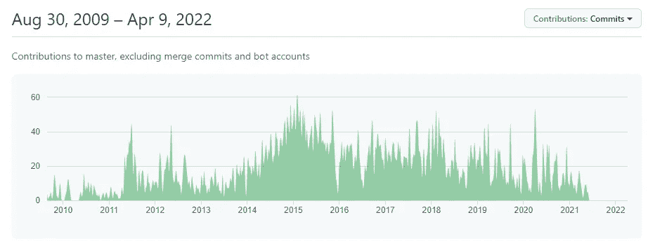
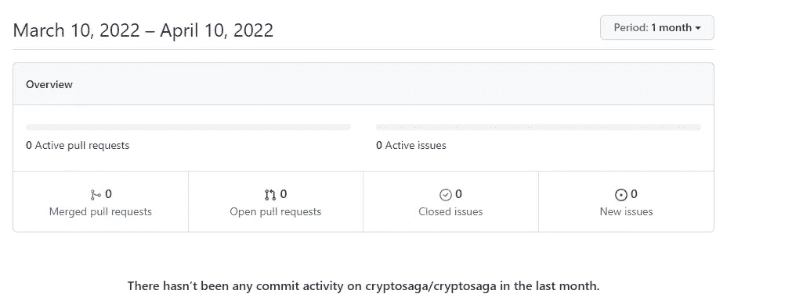
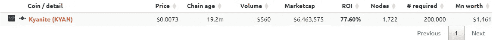
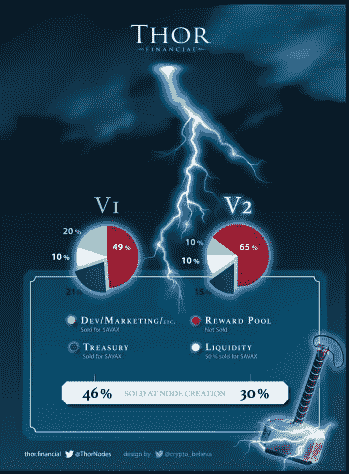

# 如何投资 Masternodes 而不被骗

> 原文：<https://medium.com/coinmonks/how-to-invest-in-masternodes-without-getting-scammed-5588f84dd792?source=collection_archive---------2----------------------->

Image by [DC Studio](https://elements.envato.com/user/DC_Studio/stock-video)

我对 Web3 和 crypto 的兴趣超越了利润。由支持它的人管理的去中心化世界的想法有一种《星际迷航》乌托邦的感觉，我想成为其中的一部分。Web3 不是免费的。构建 Web 3 需要基础设施和熟练人员的努力才能实现。虽然我在编程或创建有趣的项目方面没有任何技能，但我确实有一种强烈的愿望，那就是帮助这个领域的远见者建设未来。这就是主节点的用武之地。

什么是主节点？

主节点是加密网络或 Web3 基础设施的关键部分。节点提供服务——隐私、计算能力、存储等。—并为所提供的服务赢取代币。

有一些节点项目仅仅基于一件事——产生利润。如果你觉得这听起来不错，那就不应该。应该是一面巨大的红旗。masternode 空间已经被只关注利润的庞氏骗局所感染。他们工作…一段时间。然后他们崩溃，导致巨大的损失，而对 Web3 毫无贡献。我稍后会谈到如何识别这些骗局。这非常简单。

但首先，我们来谈谈如何找到 masternode 项目。

**如何找到 Masternode 项目**

Twitter 和 YouTube 可能是寻找 masternode 项目的好来源，但要小心。确保你追随的是真正热爱 Web3 的人。太多有影响力的人专注于快速获利和点击诱饵，快速致富的标题。一个提供高回报而没有建设任何东西的项目，有很大概率是骗局。

如果你想在 masternode 空间寻找未被发现的宝石，你可以使用像 [masternodes.biz](https://masternodes.biz) 和 [masternodes.online](https://masternodes.online) 这样的网站。这些网站列出的 masternode 项目比您可能研究的还要多。它们还能为你提供有价值的信息，如交易量、市值和投资回报率(ROI)。仅仅因为一个网站上市并不意味着它是一个蓝筹项目。你仍然需要做你的研究。

让我们复习一下如何做那件事。

**如何研究主节点**

投资 masternodes 时要考虑的三个主要因素是项目、问题和盈利能力。

**项目**

看看核心团队。他们吸毒了吗？他们过去成功过吗？如果你对这两个问题的回答都是肯定的，那么你几乎可以保证有一个可靠的项目。你可能不会这么幸运。许多 masternode 项目是社区驱动的，这意味着没有集中的团队来控制它们。如果你的项目是社区驱动的，看看他们的 GitHub。有多少人在捐款？项目有多少次提交？最近一次是什么时候？

开发社区越活跃越好。

让我们以 Dash 为例:

Dash 有一个活跃的社区，有超过 19，000 个提交。这些指标表明了一个健壮和繁荣的项目。

现在让我们来看看 CryptoSaga:

CryptoSaga 总共有 34 次提交，在过去 4 年中没有提交。尽管 MasterNodes.online 显示一个 CryptoSaga 节点获得了令人印象深刻的 203%的投资回报率，但我不会碰这个节点。可以肯定地说，这个项目已经失败了。

*路线图*

活跃的社区并不意味着有效的社区。项目如何按照路线图执行？是按时达到里程碑还是路线图充满了崇高的目标而没有行动？

例如，看看 [Sylo 路线图](https://www.sylo.io/roadmap)。它显示了实现目标的历史。他们的不和也表明他们正处于启动激励节点(使用[探索者 NFTs](https://seekers.xyz/) )和迁移网络的风口浪尖。简而言之，他们正在实现他们的愿景。

很长时间没有更新的、包含崇高目标的路线图可能是一面红旗。该项目可能不会认真执行其愿景。当然，一个项目也可以发布一个路线图，只显示成就而忽略任何挑战。这也可能是一个危险信号。评估路线图进展时要小心。

问题:这个项目解决了什么问题？

你的 masternode 项目解决了真正的问题吗？节点到底有没有存在的理由？我们来看[蓝晶石币](https://kyancoin.net/)为例。

[Masternodes.online](https://masternodes.online/) 展示了一个合理投资为 1500 美元、投资回报率为 77%的项目，但它解决了什么问题？蓝晶石硬币网站称，这是一种专门用于色情服务和赌博的加密货币，即“成人”硬币。为什么需要这样做？如果你使用的是法律服务，任何费用都可以。如果想要隐私，为什么不用 Monero 或者 Dash？那些硬币可以用来做任何事情。为什么我们需要一个专门用于赌博和成人服务的硬币？我认为蓝晶石硬币并不能解决问题，并会将其从我的列表中排除。

*谁是竞争对手？*

也许蓝晶石硬币会是一个可行的解决方案，如果它是唯一的隐私硬币(我假设它是一个隐私硬币。我对这个项目没有足够的兴趣去验证它)。但是蓝晶石并不是镇上唯一的隐私游戏。我已经提到了 Monero 和 Dash。这两个项目都有更强大的追随者，并被供应商更广泛地接受。蓝晶石不能碰那些项目。至少，在可预见的未来不会。

盈利能力:运营一个节点需要什么？

我要放蓝晶石一马。在 masternode 领域，Dash 确实是一个更好的项目，但是你需要大约 115，000 美元来投资一个节点。这对我们中的大多数人来说都是成本过高的。Dash 的投资回报率也在 6%左右。这与蓝晶石提供的 77%相差甚远。蓝晶石可能是一个更好的项目选择的人只寻求产量。

在投资 masternodes 时，你需要有一套计划。你是一个项目的信徒，想要帮助建立一些东西，还是你正在寻找一个快速赚钱的机会？如果是后者，你最好有一个可靠的退出计划。

运行 masternode 的成本不仅仅是赌注。您需要考虑运行您的节点需要哪些资源以及这些资源的成本。一些像[预搜索](https://www.presearch.io/)这样的节点可以在虚拟私人服务器上运行，每年只需 25 美元。每个月运行一个[通量节点](https://runonflux.io/)将花费你那么多。阅读该项目的白皮书，并加入他们的不和谐，以获得一个好主意，你会花多少钱来运行一个节点，它是多么容易设置。

为自己运行这些数字，并决定你的潜在利润是否值得运行你选择的节点的成本。

**如何避免骗局**

每次谈到 crypto 都要谈到骗局，这很可悲，但这就是早的代价。我因诈骗损失了数千英镑。幸运的是，在主节点空间中很容易发现它们。许多白皮书将概述一个经典的庞氏支付模式。你只需要去寻找。

*什么是庞氏骗局？*

庞氏骗局利用新的投资来偿还以前的投资者。例如，我可以承诺你对我的诈骗基金的投资有 25%的回报。十个人每人投资 1000 美元，我从其中五个人那里拿 250 美元付给另外五个人。现在五个人有了 1250 美元，觉得我是神。

当然，我不会告诉那五个我拿了 250 美元的人是我干的。我只是等待更多的人带来资金，并支付他们的钱加上他们期待的 250 美元。现在他们也认为我是神。目标总是吸引更多的投资者和资金。看到问题了吗？

最终，你会失去愿意投资的人。那钱就没了。没套现的都输了。这正是一些“节点”正在做的事情。

**如何识破庞氏骗局**

第一个危险信号是项目希望你购买一个节点而不是股份。合法的主节点希望你在游戏中拥有皮肤，并要求你投入一定数量的硬币来运行节点。这些硬币仍然是你的，你可以随时拆封和清算它们。一个诈骗节点将要求你“购买”节点。你的硬币不见了。那些硬币去哪里了？让我们来看看这张来自 [Thor.financial](https://thor.financial/) **的信息图。**

它显示 Thor nodes 购买价格的 49%进入 V1 的奖励池，65%进入 V2 的奖励池。

第二个危险信号是你的节点支付被用来支付先前节点持有者的奖励。在 Thor node 的情况下，你是在向当前的 Thor node 持有者支付，而未来的投资者将会向你支付。不可持续。是的，有些人会赚钱，但生态系统在目前的状态下注定会崩溃。这种支付模式普遍得令人不安。

第三个危险信号是这个项目没有提供任何有价值的东西。下面是 Thor 网站上的一段引文，说明了我在说什么:

“我们的目标是以最小的努力帮助尽可能多的人持续产生被动收入。这是人们真正应得的奖励，我们把它带给你。”

雷神存在的唯一理由就是让持有者赚钱。它不构建任何东西。他们的网站继续说，他们投资 Defi 协议、NFTs、赌注池和“其他项目”这基本上是让你投资的所有流行语。也许他们真的投资了，但这意味着 Thor Financial 很可能通过了 [Howey 测试](/cryptostars/the-hidden-risk-of-nfts-that-no-one-is-talking-about-963d3f0296ed)并可能成为美国证券交易委员会(SEC)的目标。

另外，雷神甚至不是一个节点。该项目不正确地使用了这个术语。记住，一个节点提供了某种为项目增值的工作。没有工作涉及一个托尔'节点'。这只是一个投资池。

**结论**

Masternodes 是参与 Web3 的好方法。作为一个成长中的生态系统的一部分，你可以赚取 crypto。如果你认为合适的话，这个密码可以被用于更多的节点或其他投资。

这一领域的研究至关重要。利用 Twitter、YouTube 和 masternode 聚合网站(如 Masternodes.online)寻找潜在项目，然后在投资前深入了解他们的项目、问题和盈利能力。最后，确保你了解你所支持的项目的风险，不要冒险超过你能承受的损失。

***如果你想继续对话，可以在 Twitter 上联系我***[***@ cryptedegenml***](https://twitter.com/cryptodegenfml)***或***[***cryptedegenml***](/@cryptodegenfml)***这里上媒如果你喜欢这篇文章，请为它鼓掌(高达 50 倍)，让我知道你喜欢它。这对我意义重大。谢谢你，德根兄弟！***

> *加入 Coinmonks* [*电报频道*](https://t.me/coincodecap) *和* [*Youtube 频道*](https://www.youtube.com/c/coinmonks/videos) *了解加密交易和投资*

# 另外，阅读

*   [麻雀交换评论](https://coincodecap.com/sparrow-exchange-review) | [纳什交换评论](https://coincodecap.com/nash-exchange-review)
*   [维护卡审核](https://coincodecap.com/uphold-card-review) | [信任钱包 vs MetaMask](https://coincodecap.com/trust-wallet-vs-metamask)
*   [TraderWagon 回顾](https://coincodecap.com/traderwagon-review) | [北海巨妖 vs 双子星 vs BitYard](https://coincodecap.com/kraken-vs-gemini-vs-bityard)
*   [Exness 点评](https://coincodecap.com/exness-review)|[moon xbt Vs bit get Vs Bingbon](https://coincodecap.com/bingbon-vs-bitget-vs-moonxbt)
*   [如何开始通过加密贷款赚取被动收入](https://coincodecap.com/passive-income-crypto-lending)