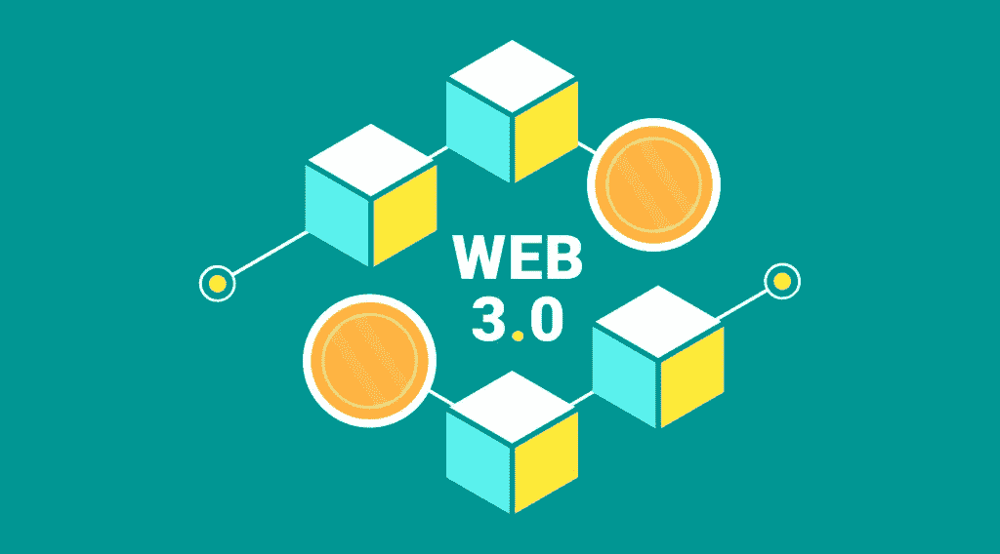

# 如何投资 Web 3.0？你需要知道的一切

> 原文：<https://medium.com/coinmonks/how-to-invest-in-web-3-0-everything-you-need-to-know-3d8d7a9ca883?source=collection_archive---------46----------------------->

Web3 是一个新的概念，指的是基于区块链技术的万维网。它的主要特点是去中心化——目的是让用户对他们的数据有更多的控制权。这种想法在 2021 年底变得更加流行，这主要是由于加密货币爱好者的兴趣以及知名技术专家和公司的投资。你可以在我们之前的文章中了解到 [Web3 的含义和特征](https://stealthex.io/blog/2022/06/01/what-is-web3-the-new-internet-era-starting-today/)。在新的 [StealthEX](https://stealthex.io/) 文章中阅读更多关于如何投资 Web 3.0 的信息。

因此，让我们来看看 Web 3.0 作为您投资的一个潜在领域。投资这个新想法值得吗？而如果是，你在入门的时候会遇到哪些困难？

好消息是，投资 Web3 及其未来项目的想法正在获得动力。就在最近，全球最大的加密货币交易所币安宣布，随着 crypto 滑入熊市，它推出了自己的风险投资基金，投资 Web3.0。该公司的附属公司币安实验室周三表示，它已经为其首次启动基金筹集了 5 亿美元，并计划将这笔钱投资于建设全新版本万维网的公司。

# 如何使用 Web3 进行投资？

显然，大公司都相信这个新想法，然而，当你面对一个新的市场时，会遇到什么困难呢？首先，新兴技术的投资者，无论是 Web1 还是 Web3，都面临着三重挑战:挑选赢家，避免炒作，以及在波动中持有。首先，从一堆相似的加密项目中挑选赢家是一项挑战。数字市场往往只为少数大赢家留有空间，而这些大赢家往往很难确定。即使在加密货币市场继续熊市的加密冬天，你还能继续持有你的加密货币吗？

此外，大多数 Web3 项目相对较新:在过去的 9 年中，出现了大量的项目，很难区分两个具有相似特征的项目。仅在 2021 年就增加了 5400 多枚代币！

第三，有很多被炒作的项目，有些甚至没有真正的价值。一个例子是 LUNA 及其悲剧性的垮台，这影响了加密市场上的许多新投资者。有前途的新技术吸引投机者。虽然投机在某种程度上对建设新产业是必要的，但它往往会导致过高的预期。

# 如何投资 Web 3.0？

以下是投资 Web 3.0 和其他新兴技术的一些基本原则:

*   分散投资:它降低了波动性，让持有股票更容易度过炒作周期，同时也减轻了失败项目的损失。
*   价值投资:价值投资者寻求购买相对于基本面便宜的资产(例如，知识产权、团队素质、网络活动)。这种方法有助于投资者识别真正有吸引力的项目，避免估值过高和夸大其词。
*   数据驱动的方法:对客观数据的严格使用有助于消除炒作。事实上，Web 3 具有独特的数据集，使得这种方法可以应用。

# Web 3.0 加密如何入门？

有很多方法可以进入新的投资领域，即 Web3 及其新兴优势。

1.  很可能，加密硬币和加密项目是第一个想到的 Web3 投资。你可以购买和持有加密货币。有许多属于 Web 3.0 的协议，其中包括 Polkadot (DOT)、Kusama (KSM)、Stepn (GMT)、Ethereum (ETH)、BitTorrent (BTT)、Chainlink (LINK)等。
2.  另一种投资加密货币的方法是将你的时间投入到加密挖掘中，比如比特币挖掘。如果你有编程技能，你可以自己做。
3.  如果你有流动资金和时间，你可以寻找 Web3 项目，并学习交易加密。由于加密货币的波动性很大，这真的是一种帮助你了解市场并从中获利的好方法。
4.  加密赌注是你赚取利息的另一个好机会。它使你能够通过持有你的加密货币来赚钱。本质上，你将加密货币存入赌注池，然后超时赚取收益。
5.  除了直接投资 Web 3，你也可以开始投资从事 Web 3 的公司，例如 Meta 或 Samsung。最终，这减轻了风险暴露。新手可以通过证券交易所直接投资公司或者购买他们的非上市公司。
6.  顺便说一句，NTFs 是另一个在 Web3 投资上发财的机会。与加密货币相比，买卖 NFT 实际上可能会给你提供更好的安全边际，因为 NFT 有一种美感，而加密货币只是屏幕上的数字。
7.  此外，你可以投资于帮助实现 Web 3.0 想法的工具，如微芯片、Nvidia 显卡和可用于采矿的设备，等等。
8.  另一个使用 NFTs 的 Web3 投资方法是投资元宇宙房地产。我们之前提到过很多元宇宙项目，包括分散土地、沙盒等等。大名鼎鼎的 metaverses 已经有了大投资者，但如果你有一个崭露头角的元宇宙，并且你投资较早，你的巨额利润可能会在适当的时候得到回报。

# 结论

Web3 是未来吗？也可能是。很难说什么是加密市场，尽管它已经存在了十年，但它仍然是最不可预测的市场之一。投资 Web 3.0 技术的方式有很多。其中许多看起来不寻常，但本质上都是关于一件事:发现事物的价值。选择适合自己的方法，找到自己的定位。

# 如何访问 Web3？

很简单！你可以马上投资 crypto 来实现。X 在这里帮助你购买任何属于 Web3 加密项目的硬币。你可以私下做这件事，不需要注册服务。我们的加密收藏有 400 多种不同的硬币，您可以立即进行钱包到钱包的转账，没有任何问题。

## 如何购买 Crypto？

只需去 [StealthEX](https://stealthex.io/) 并遵循这些简单的步骤:

1.  选择要兑换的货币对和金额。比如，[比特币(BTC)](https://stealthex.io/coin/bitcoin) 到 [Stepn (GMT)](https://stealthex.io/coin/stepn) 。
2.  按下“开始交换”按钮。
3.  提供要将您的加密传送到的收件人地址。
4.  处理交易。
5.  接收您的加密硬币。

在 [Medium](https://stealthex-io.medium.com/) 、 [Twitter](https://twitter.com/Stealthex_io) 、 [Telegram](https://t.me/StealthEX) 、 [YouTube](https://www.youtube.com/channel/UCeES_XBesX76ge7xf1meuSw) 和 [Reddit](https://www.reddit.com/user/Stealthex_io) 上关注我们，了解关于 [StealthEX.io](https://stealthex.io/) 和其他加密世界的最新消息。

在购买任何密码之前，不要忘记做你自己的研究。本文表达的观点和意见仅代表作者个人。

*原载于 2022 年 6 月 3 日*[*https://stealthex . io*](https://stealthex.io/blog/2022/06/03/how-to-invest-in-web-3-0-everything-you-need-to-know/)*。*

> 加入 Coinmonks [电报频道](https://t.me/coincodecap)和 [Youtube 频道](https://www.youtube.com/c/coinmonks/videos)了解加密交易和投资

# 另外，阅读

*   [币安 vs FTX](https://coincodecap.com/binance-vs-ftx) | [最佳(SOL)索拉纳钱包](https://coincodecap.com/solana-wallets)
*   [比诺莫评论](https://coincodecap.com/binomo-review) | [斯多葛派 vs 3Commas vs TradeSanta](https://coincodecap.com/stoic-vs-3commas-vs-tradesanta)
*   [Capital.com 评论](https://coincodecap.com/capital-com-review) | [香港的加密借贷平台](https://coincodecap.com/crypto-lending-hong-kong)
*   [如何在 Uniswap 上交换加密？](https://coincodecap.com/swap-crypto-on-uniswap) | [A-Ads 审查](https://coincodecap.com/a-ads-review)
*   [WazirX vs CoinDCX vs bit bns](/coinmonks/wazirx-vs-coindcx-vs-bitbns-149f4f19a2f1)|[block fi vs coin loan vs Nexo](/coinmonks/blockfi-vs-coinloan-vs-nexo-cb624635230d)