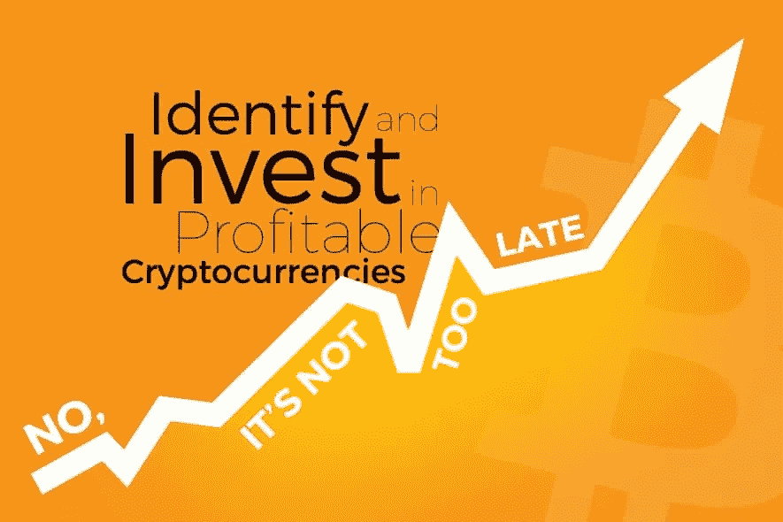
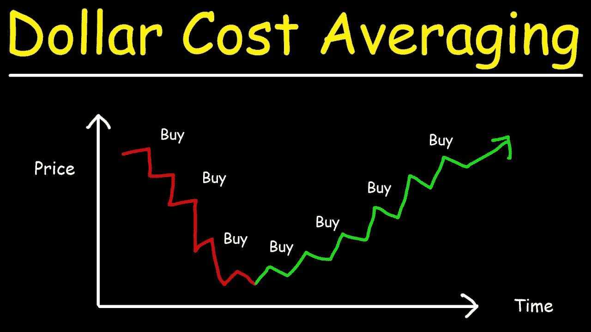
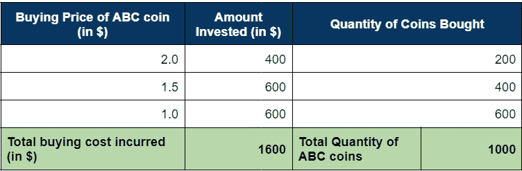
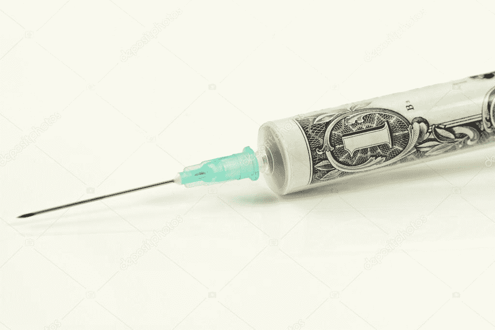

# 如何投资？投资加密货币并确保盈利的技巧

> 原文：<https://medium.com/coinmonks/how-to-invest-tips-to-invest-in-cryptocurrency-and-make-assured-profit-5d385c959e86?source=collection_archive---------45----------------------->

Image Source: Chipin

[加密货币](/coinmonks/simple-way-to-understand-cryptocurrency-by-day-to-day-examples-9f3bb62f7c9c)，由于几个月来比特币和替代币的价格下跌，金融生态系统的未来目前受到许多投资者和市场的怀疑。为控制通货膨胀而进行的[加息](/the-capital/be-careful-cryptocurrency-stock-market-can-hit-the-recession-e8c47238d31b)和媒体持续的负面影响导致了加密市场和投资者在他们的投资组合中遭受严重的名义损失。

这引发了期货交易投资者的大量抛售或平仓，加剧了价格下跌的多米诺骨牌效应，并使新手交易员感到恐慌。

当前整个市场的经济事务凸显了像特斯拉、比特币基地和 Celsius 这样的大企业和公司裁员 3.5%至 8%，由于这种挥之不去的衰退压力，员工失业。

[在这种时候，投资加密市场](/coinmonks/why-you-should-own-at-least-1-cryptocurrency-fdb6185542bf)似乎不确定，投资者对赚回或损失血汗钱的担忧不断蔓延。

作为一名秘密投资者，我建议一些技巧，帮助你在现货交易中尽量减少损失，保持盈利。做期货交易的人应该仔细评估风险并主要关注短期杠杆利润。

## **货币成本法投资:**

平均购买成本主要与最小化任何资产的购买成本有关。

例如，如果你的加密钱包里有 1000 美元，并打算投资比特币，那么只投资最初可用资金总额的 10-30 %,并留意价格波动。

根据你的风险偏好，在比特币价格下跌时，以总资金的一小部分购买比特币。通过这种方式，你可以从名义损失中节省大量资金，并最大限度地降低不同阶段获得的总比特币的购买成本。

> 让我举一个假设的例子给你看:

假设你投资了一个名为 ABC 的加密硬币，市价为 2 美元。通常在 2 美元，要获得 1000 ABC，你需要支付 2000 美元。

这几乎是你一次性全部投资的金额。

如果市场下跌，那么遭受的损失是累积的，并严重影响投资回报。为了掩盖损失，除了长期持有硬币，直到价格攀升到买入价以上，别无选择。

或者，如果你使用美元(货币)成本平均法，并随着比特币价格下跌按比例分配你的总投资，那么对于 1 BTC，你投资:

从上表可以看出，要获得 1000 枚 ABC 硬币，总投资成本为 1600 美元。

因此，ABC 币的平均买入价=**1600/1000 = 1.6 美元**

> 这意味着您以 1.6 美元的购买成本购买了 1000 枚 ABC 硬币，比之前支付 2000 美元购买相同数量的硬币的成本要低。肯定是一个更聪明和有利可图的举动！

## **分散投资组合:**

Image Source: Gold Avenue

在加密市场中，有超过 1200 种加密硬币，每种硬币都有其独特的使用案例。每枚硬币都有特定的用途，并通过不同的波动价格泵提供有利可图的回报。

从一句著名的谚语*“不要把所有的鸡蛋放在一个篮子里”*中，要明白拥有多样化的投资组合从长远来看总是有好处的，因为它可以最大限度地降低投资不良资产的风险。

## **在价格下跌时注入更多资金:**

Image Source: Depositphotos

如果你有更多的储蓄投资，你可以在市场下跌时购买更多的硬币。

这有助于在你的加密交易账户中有一个看跌的 SIP(系统投资组合),每次价格下跌时，以你拥有的钱数购买更多的硬币。

这种策略使平均购买成本最小化，并在价格攀升到最高点时获取最大的资本收益。然而，对于投资者来说，在每次价格下跌时投资都是一个充满压力的决定，也是一个心理恐惧的决定。

## **下注硬币:**

Image Source: Cool wallet

赌注就像一个类似于银行定期存款的盈利计划，在到期日为您提供一定的利息(超过我们投资本金的超额回报)。

如果一个交易所提供赌注计划，人们可以把硬币押上。用户必须为相应的硬币选择合适的赌注计划，该计划以固定的年利率每天提供免费硬币。

这为用户提供了从利息回报中赚取的额外硬币，并且用户可以出售这些免费硬币以获得独立于市场交易价值的利润。

## **最后一行:**

这是一些有助于始终保持投资组合健康的建议。在资产价格波动的交易市场中，有时获取短期利润并建立更多美元成本储备会更好。

> 保持你的情绪中立，避免任何仓促的决定和失去买入机会或获利的 FOMO。

市场投资有风险。作为投资者，关注基本面和经济指标对于长期盈利和获得良好的投资回报至关重要。

> “谢谢你读我的文章。鼓掌、分享并关注我的[个人资料(点击此处)](/@barateprajwal25)了解更多更新和内容。”
> 
> 加入 Coinmonks [电报频道](https://t.me/coincodecap)和 [Youtube 频道](https://www.youtube.com/c/coinmonks/videos)了解加密交易和投资

# 另外，阅读

*   [如何购买 Monero](https://coincodecap.com/buy-monero) | [IDEX 评论](https://coincodecap.com/idex-review) | [BitKan 交易机器人](https://coincodecap.com/bitkan-trading-bot)
*   [CoinDCX 评论](/coinmonks/coindcx-review-8444db3621a2) | [加密保证金交易交易所](https://coincodecap.com/crypto-margin-trading-exchanges)
*   [红狗赌场评论](https://coincodecap.com/red-dog-casino-review) | [Swyftx 评论](https://coincodecap.com/swyftx-review) | [CoinGate 评论](https://coincodecap.com/coingate-review)
*   [Bookmap 点评](https://coincodecap.com/bookmap-review-2021-best-trading-software) | [美国 5 大最佳加密交易所](https://coincodecap.com/crypto-exchange-usa)
*   [如何在 FTX 交易所交易期货](https://coincodecap.com/ftx-futures-trading) | [OKEx vs 币安](https://coincodecap.com/okex-vs-binance)
*   [CoinLoan 审查](https://coincodecap.com/coinloan-review) | [YouHodler 审查](/coinmonks/youhodler-4-easy-ways-to-make-money-98969b9689f2) | [BlockFi 审查](https://coincodecap.com/blockfi-review)