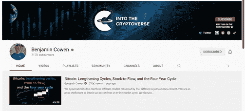
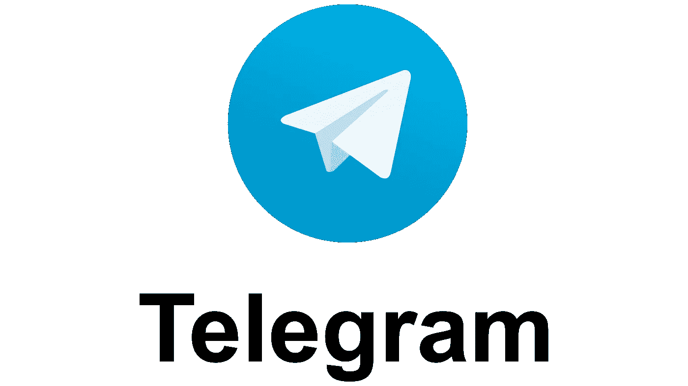
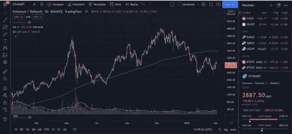

# 如何升级你的加密游戏

> 原文：<https://medium.com/coinmonks/how-to-level-up-your-crypto-game-2b5717ecf04c?source=collection_archive---------42----------------------->

Begin the journey.

**哲学内核**

我曾经收到过一个很棒的建议:如果你的生活是一个电子游戏会怎么样？

讽刺的是这个问题让我放弃了电子游戏，之后我问了自己一个更进一步的问题，为什么电子游戏令人兴奋？

在游戏里，我们成为一个英雄，有目标感，有伟大的使命要完成，不受现实的束缚。有一种强烈的使命感和责任感。为什么这在我们的日常生活中不存在呢？我们的生活由日常事务组成:醒来、工作和睡觉。加上一些额外的东西，也许是一杯早晨的咖啡，或者一年一次的生日，这种例行公事一直重复到我们死去。如果你能在电子游戏里磨，你就能在现实生活中磨。

**如果生活本身变成了电子游戏会怎样？**

每一个活着的人都克服了不可理解的困难，呼吸着这块岩石的空气，以每小时数千英里的速度穿过星尘星系。花一秒钟想想你自己的生活，你会发现它比你玩过的任何电子游戏都更奇怪，更有活力，所有这些微小的事件都塑造了你的存在。吹响你内心的蜡烛，我们每个人都有权力的欲望，征服的观念呼唤着每个人，甚至那些竭尽全力压制它的声音的人。勇往直前，变得更加强大，用你所有的热情去攻击生活。

**找一个导师** 一个让你对某个话题更加熟悉的绝妙方法就是听专家谈论这个话题。YouTube 充斥着虚假的金融专家，选择一个人来听可能是一项艰巨的任务；一个人必须趟过奸诈的骗子的沼泽。我衷心推荐本杰明·考恩的 YouTube 频道。他以一种每个层次的投资者都能理解的方式，提供对经验丰富的交易者都有用的技术分析。从对数回归、支撑带和成交量，考恩先生涵盖了许多有趣的角度来分析比特币的价格。观看该频道将使您更加熟悉 TA，并更深入地了解重要的价格水平。另一个值得一提的是 Coin Bureau，他在挑选长期升值的项目方面有着良好的记录。

Benjamin Cowen YouTube Channel

**参与社区活动**

电报和不和是必须的。加密仍处于起步阶段，区块链上发生的许多事情都是时间敏感的，你越是参与 DeFi(去中心化金融)协议，这就变得越相关。现代时代赋予了人类瞬间获取近乎无限的知识的能力，人类积累的知识就像他在黑暗中盲目摸索的火炬，这就是人类的状况。你能给自己的最大优势就是信息，没有比电报更好的地方可以找到它了。加入你投资/感兴趣的任何项目的电报组，你将收到项目的实时更新。它会让你更好地理解硬币的价格运动，当显示在 CoinGecko 上时，价格运动通常看起来是随机的。

Telegram- Cloud Based Messenging Service

**交易视图**

技术分析。有人喜欢它，有人讨厌它，两位著名的反对者是沃伦·巴菲特和彼得·林奇。这两个人是基本面分析的料。我认为对这两者有一个基本的了解是有用的。加密中的基本面分析与股票略有不同，在股票中，人们看的是资产负债表和市盈率。在 crypto 中，它包括阅读白皮书、理解用例以及项目背后的团队。有了这些数据，你就可以决定资产是被高估了还是低估了。大致来说，基本面分析赢长线，技术面分析赢短线。

TradingView 提供股票和密码的高级财务可视化。在网站上，你可以跟踪价格走势，使用各种指标来更好地了解价格走向。我建议从成交量和移动平均线(50 天，100 天，200 天)等基础数据开始。成交量向我们展示了一项资产的交易频率。移动平均线使价格波动变得平滑，更容易发现关键的支撑位和阻力位。但是，当然，当你越来越适应的时候，你可以尝试更多的指标。使用 TradingView 将提高你的 TA 技能，让你更好地理解价格运动。值得注意的是，价格行为受基本面、市场心理和地缘政治事件的驱动。

ETH/USDT TradingView

在我的密码之旅中，这三件小事对我来说是无价之宝；我希望他们能好好为你服务。

> *加入 Coinmonks* [*电报频道*](https://t.me/coincodecap) *和* [*Youtube 频道*](https://www.youtube.com/c/coinmonks/videos) *了解加密交易和投资*

# 另外，阅读

*   [有哪些交易信号？](https://coincodecap.com/trading-signal) | [Bitstamp vs 比特币基地](https://coincodecap.com/bitstamp-coinbase) | [买索拉纳](https://coincodecap.com/buy-solana)
*   [ProfitFarmers 回顾](https://coincodecap.com/profitfarmers-review) | [如何使用 Cornix 交易机器人](https://coincodecap.com/cornix-trading-bot)
*   [十大最佳加密货币博客](https://coincodecap.com/best-cryptocurrency-blogs) | [YouHodler 评论](https://coincodecap.com/youhodler-review)
*   [my constant Review](https://coincodecap.com/myconstant-review)|[8 款最佳摇摆交易机器人](https://coincodecap.com/best-swing-trading-bots)
*   [MXC 交易所评论](/coinmonks/mxc-exchange-review-3af0ec1cba8c) | [Pionex vs 币安](https://coincodecap.com/pionex-vs-binance) | [Pionex 套利机器人](https://coincodecap.com/pionex-arbitrage-bot)
*   [我的密码交易经验](/coinmonks/my-experience-with-crypto-copy-trading-d6feb2ce3ac5) | [《比特币基地评论》](/coinmonks/coinbase-review-6ef4e0f56064)
*   [CoinFLEX 评论](https://coincodecap.com/coinflex-review) | [AEX 交易所评论](https://coincodecap.com/aex-exchange-review) | [UPbit 评论](https://coincodecap.com/upbit-review)