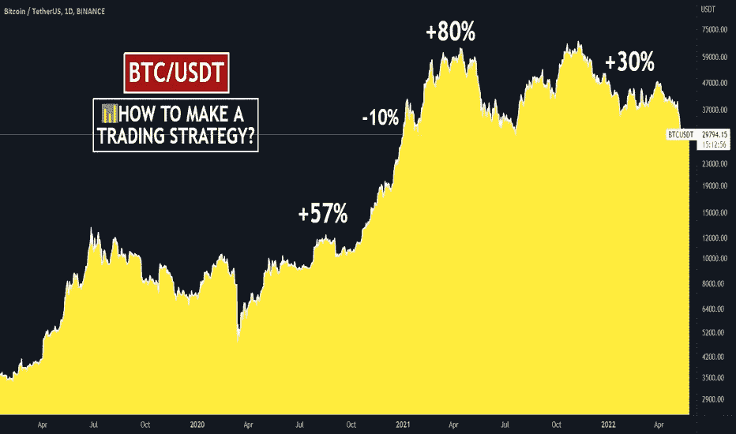
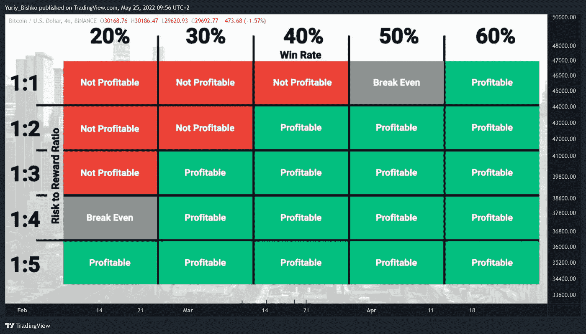
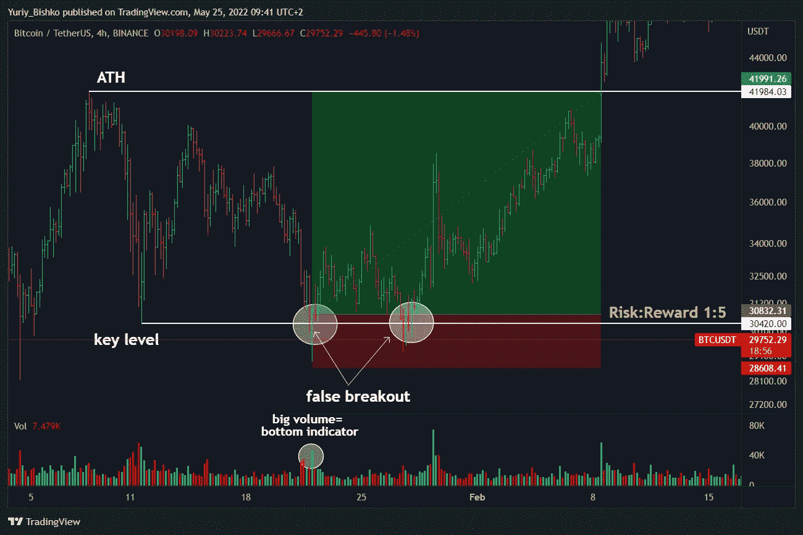

# 📊如何制定交易策略？

> 原文：<https://medium.com/coinmonks/how-to-make-a-trading-strategy-259819f3f0d7?source=collection_archive---------67----------------------->

# 什么帮助交易者成功？没错，他们的交易策略。

# 交易策略是交易者决定是否开始交易的计划。策略的目的是帮助交易者进行更成功的交易，并分析错误和成功。在不确定的时候，这些规则有助于保持冷静，做出正确的决定。简单地说，它是一套过滤器，可以从图表中去除不必要的噪音，帮助您做出正确的决定。

# 💹如何制定交易策略？弄清楚你想交易什么，你最擅长什么。你喜欢交易假突破吗？让我们开始吧！喜欢交换模式？完美！在图表上选择你过去最好的 20-30 个可能的交易，并在图表上寻找重复的模式。一旦你有机会做交易，记住你的策略规则，如果它们都匹配，那么就去做。

# 💹交易策略包括什么？这组规则包括:

# 1️⃣你使用的工具(模式，级别，指标，波浪，[烛台](https://www.tradingview.com/ideas/candlestick/)分析等。).例如，趋势线下的挤压，一个级别的假突破，指标进入超卖或超买区——所有这些交易工具都可以用在你的策略中。

# 2️⃣风险管理。一次交易用多少钱，每次交易的风险。这是任何交易策略的必备要素。你不可能每笔交易都 100%正确，所以拿你所有的资本去冒险是不明智的。交易者的平均胜率是 50–60%。这意味着 10 次交易中有 5-6 次会成功，这是一个非常好的结果。其他 4 笔交易要么亏损，要么盈亏平衡，所以最好从小额交易或加密交易所的虚拟账户开始。在下图中，你可以看到风险回报比和胜率应该是多少。

如果你有 50%的成功交易，那么至少在每笔交易中你应该有 1:2 的 RR(1 次风险你得到 2 次回报)。要在 TradingView 中计算 RR，请使用屏幕左侧的“日期和价格范围”部分，并选择“多头”或“空头”。

**✅Example 的一种交易策略。**
工具:
🔶关键级别的假突破；
🔶音量指示器。

描述:你在图表上标出了 30420 美元的关键水平。假突破后，你注意到图表上出现了大的[成交量](https://www.tradingview.com/ideas/volume/)。
目标:42K 美元的高点水平。

> 交易新手？试试[加密交易机器人](/coinmonks/crypto-trading-bot-c2ffce8acb2a)或者[复制交易](/coinmonks/top-10-crypto-copy-trading-platforms-for-beginners-d0c37c7d698c)

风险回报比为 1:5。对我们有好处？让我们看看表！这种策略的胜率是 50%,所以 RR 是有利可图的。

🚩总结:以 10 美元的风险开始交易，你得到了 50 美元。

**💹给初学者的建议:
1。交易策略不一定是你的。你可以从另一个策略中学习规则，并把它们应用到你身上，制定你的风险管理，进入交易的规则，最后，你每周或每月交易多少次。**

2.从简单的东西开始，比如通道交易和[成交量](https://www.tradingview.com/ideas/volume/)指标，当触及通道边界时，它会告诉你买方或卖方的反应。逐步添加过滤器，以消除图表中的噪音，提高您的胜率。例如，如果[比特币](https://www.tradingview.com/symbols/BTCUSD/)正在下跌，就不要在替代比特币上做多。据统计，99%的加密货币重复比特币的走势，因此这不太可能是一笔好交易。除非你知道秘密信息，或者你有 8 年以上的交易经验，你有足够的经验。

3.把你最好的和不成功的交易截图，分析问题并修复，尽量多重复最好的交易。交易日志最适合做统计。

*🏁遵循你的计划，你会成功的。如果你对如何制定交易策略还有疑问，请写在评论里。有经验的交易者，你是如何创造你的交易策略的？分享给初学者！*

💻朋友们，按下“喜欢”👍按钮，写评论，分享给你的朋友——这将是最好的感谢。

附注:根据我的策略，如果价格显示出来，我就开仓。在进行交易之前，一定要做好分析