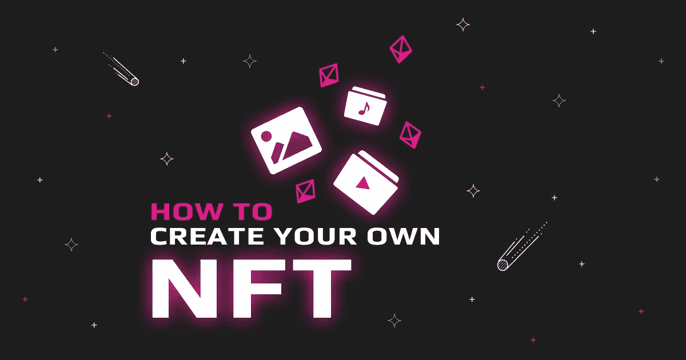
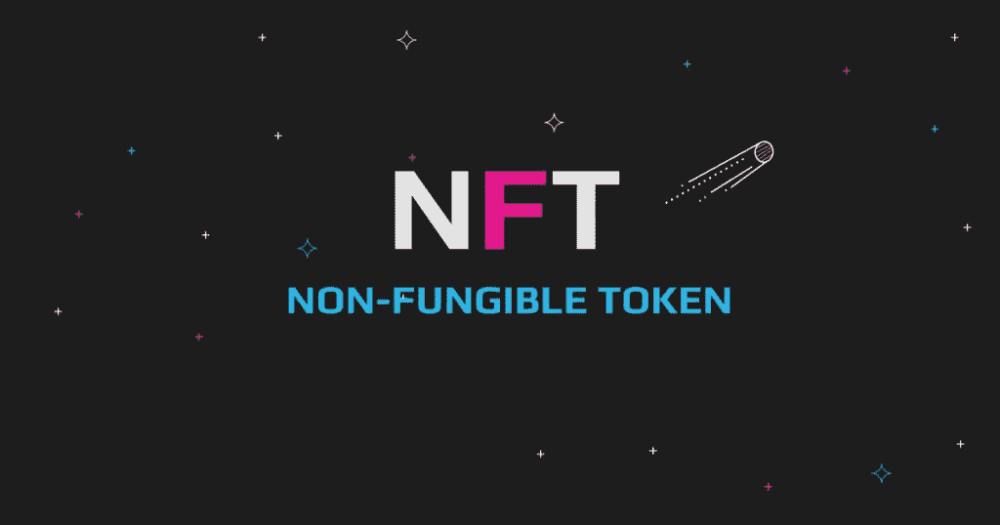
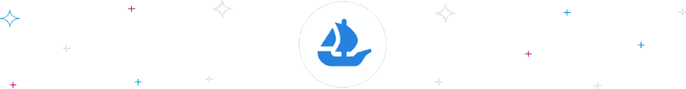
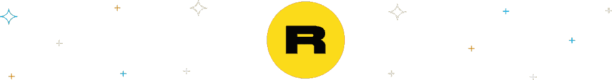
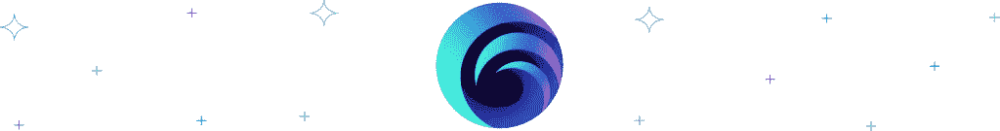
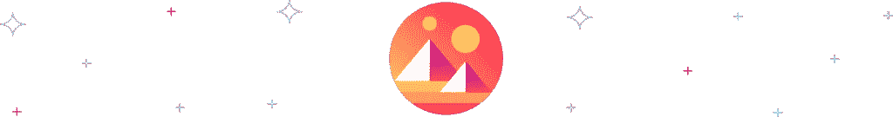
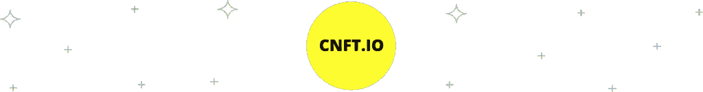

# 如何制作 NFT:你需要知道的一切

> 原文：<https://medium.com/coinmonks/how-to-make-an-nft-all-you-need-to-know-dbe4812fdcbe?source=collection_archive---------16----------------------->

近几个月来，NFT 获得了相当大的炒作，为它们进入主流文化铺平了道路。只有其他人也想加入不断壮大的 NFT 创作者队伍，这才有意义。什么是 NFT？你需要知道什么来自己创造一个？

# 如何创作和销售 NFT 艺术品

自从一年前开始流行以来，NFTs 不仅在密码社区，而且在主流媒体中都是一个被广泛讨论的话题。到目前为止，诸如 Crypto Punks 和 BAYC 等项目已经成为该行业扩张的重要组成部分。尤其是 Bored Ape 游艇俱乐部在塑造全球对不可替代代币的看法方面发挥了重要作用。

像 BAYC 这样的收藏将名人、专家和初学者团结成一个独特的社区，展示了 NFTs 的持续潜力。我们将仔细研究创建 NFT 时需要考虑的所有因素，首先是:

# NFT 炒作:这是怎么回事？

为了充分理解为什么 NFT 现在几乎成为潮流，我们需要理解它的一些基本特征。让我们首先回答关于什么是不可替代令牌的问题，然后也许是炒作是怎么回事！

# 什么是 NFT？

术语“不可替代”描述的是具有独特性质且不可替代的物品。

这意味着 NFT 不能与类似的对等物或同等价值的资产互换。这些资产存在于区块链上，并拥有区分每个令牌的加密签名。因此，这种独特性使得 NFTs 如此有价值。此外，存在于公共区块链上的 NFT 使得任何人都可以容易地验证它们的所有权和真实性。

也可以说，购买 NFT 就像购买一件原创艺术品。众所周知，买家一旦被买走，也就获得了该作品的声望。

# NFTs 的起源

虽然它们似乎在 2021 年初就实现了，但不可替代的代币存在的时间更长。不过，这个奇怪的概念始于 2012 年，只是名字不同。当时，NFT 的前身是*彩色硬币*。这些硬币是比特币的一部分，有时小到代表其他资产的 satoshi。

更准确地说，彩色硬币代表各种物品的所有权，包括实物和虚拟物品。这些包括汽车、房契、公司股票和加密货币；他们甚至在某些时候代表了数字收藏品。

# 理解 NFT Hyp

NFT 正在改变我们对所有权和真实性的看法。虽然内容创作者几乎从一开始就担心他们的作品的保存，但不可替代令牌的独特性为创作者提供了一种新颖但安全的方式来实现这一点。

这并不是说非功能性测试没有问题。他们也受到了相当多的剽窃指控。不管怎样，这个行业的潜力是巨大的。不仅创作者知道这一点，甚至大学和机构也意识到这一点。

# 如何创建自己的 NFT

创建自己的 NFT 的步骤很少，也相对简单，而且通常不是特定于平台的。其他时候，它们取决于您希望创建哪个特定的区块链。因此，我们已经根据您想要创建的每个平台详细解决了这个问题。在我们开始之前，让我们回答一些你可能有的问题。

# 铸造 NFT 意味着什么？

有时我们可能会把“创造”换成“铸造”。铸币是一个术语，描述了如何在区块链创造 NFT。铸造一个 NFT 意味着将原始数字文件中的数据转换成由区块链网络托管的资产。NFT 创建后，不能修改或删除。

# 制作 NFT 艺术品需要什么软件？

对这个决定影响最大的是你计划创作的 NFT 艺术形式和你的风格。

平台通常不监管创作者对软件的选择。当选择软件来创建您的 NFT 艺术，考虑编辑能力，可用的工具和模板选项。还有，创作者可以使用自己熟悉的、用起来舒服的软件。创作 NFT 艺术的一些最好的软件是:

*   克里塔
*   Adobe Illustrator
*   Adobe Photoshop
*   SketchAR
*   科雷尔画家
*   像素链等。

# 有人能创造一个 NFT 吗？

这是一个常问的问题，答案是肯定的。任何人都可以创造一个 NFT。

一个人不需要密码和 NFT 空间的广泛知识来创建他们自己的不可替换的令牌。

然而，在进入 NFT 这艘船之前，有一个明确的目标是至关重要的。受 FOMO 和一种新型投资的刺激，创作者和买家正涌向市场。然而，尤其是最近，随着失败的藏品越积越多，投资者变得越来越谨慎，越来越挑剔。

创建 NFT 的要求相对容易满足，如下面的市场部分所述。你需要自己的原创作品，比如艺术品或某种数字文件。一些加密货币和一个加密钱包。

# 有可能免费创建 NFTs 吗

也是的。

成为 NFT 行业创造者的最大障碍之一是燃气费，这推高了创造 NFT 的成本。一些平台已经推出了铸造选项，允许初学者免费创建一个 NFT，以适应不太富裕的艺术家。

像 OpenSea 和 Rarible 这样的 NFT 市场提供了一个*懒人造币*功能。有了懒人造币，创建者在创建和上传他们不可替代的代币时可以跳过支付汽油费。相反，这些平台将成本转移到了买家身上。值得注意的是，虽然制作 NFT 可能是免费的，但该平台仍然收取销售服务费。这样，您最初可以忽略设置成本，而完全专注于 NFT 的质量。

# 创建您的 NFT 的最佳平台

# OpenSea

成立于 2017 年的 [OpenSea](https://opensea.io/) 迅速崛起，超越了 Cryptopunks 等现有市场。OpenSea 支持基于以太坊、二层网络多边形、Klatyn 和最近的 Solana 的项目。

## 如何在 OpenSea 上创建 NFT

完成 OpenSea 的免费注册后，点击右上方的图标选择用户资料。该页面为用户提供链接他们的钱包的选项，以及支持的提供商列表，如 MetaMask、比特币基地钱包和 TrustWallet。

OpenSea 用户可以按照步骤通过平台连接现有地址或开设新的钱包账户。

之后，你可以点击 OpenSea 的创建按钮。按照平台提供的指示上传您的数字文件，如文件名和项目描述。

此外，您可以选择自定义您的 NFT，并添加可解锁内容等功能。OpenSea 不收取铸造费，但收取 2.5%的上市佣金。像大多数无处不在的市场一样，大众市场允许你选择你想铸造的区块链。自定义 NFT 后点击创建，就大功告成了。

# 稀有的

[Rarible](https://swapzone.io/blog/rarible-price-prediction) 是一个基于以太坊的市场，具有跨链功能。在推出的三年内，该市场已经成为近代最重要的数字艺术画廊之一。Rarible 支持 Tezos 区块链、以太坊、流、多边形和索拉纳。

## 如何在 Rarible 上创建 NFT

在 Rarible 上铸造 NFT 始于将你的钱包连接到平台上。Rarible 支持的钱包提供商包括 Fortmatic、WalletConnect、比特币基地钱包和 MetaMask 等。

接下来，连接好钱包后，从 Rarible 提供的一系列选项中选择您喜欢的 NFT 铸币网络。一旦你准备好了，选择创建，你将面临的选择，使一个单一的 NFT 或多个令牌。

决定之后，你必须上传你的原始数字文件，然后提供其他必要的细节，包括铸造合同。Rarible 提供了一个默认的合同，或者你可以创建一个定制的合同，这个合同通常会比平时花费更多。

# 索尔西

SolSea 为寻求以太坊区块链之外的其他选择的 NFT 创作者提供了一个强有力的建议。SolSea 被描述为第一个允许创作者在他们的 NFT 中“嵌入版权许可”的市场，同样也是最具主导地位的 Solana NFT 市场。

## 如何创建一个基于索拉纳的 NFT 系列

第一步是安装幻影钱包，并用 SOL 为其提供资金。接下来，前往 SolSea，选择连接钱包选项；将出现一个幻像弹出窗口，请求允许连接。

链接钱包后，注册 SolSea。完成注册流程:登录后，导航至“创建”并点击“收藏”选项卡。

SolSea 将要求您填写收集的细节，并支付铸造费。上传文件后，您可以选择“铸币 NFT”选项并签署交易。您也可以随时点击“查看您的铸币”来查看您的铸币令牌。

# 分散土地

去中心化为 NFT 的创造者提供了最丰富的选择。潜在的所有者可以将他们的音乐、艺术品、图像、游戏甚至游戏中的物品制作成 NFT，并出售它们。所有者可以通过分散土地的[市场](https://market.decentraland.org/)或者通过像 Wonderzone 这样的玩赚游戏来完成。

## 如何为分散的土地创建国家森林公园

在分散的土地上铸造 NFT 取决于个人的需要。例如，如果一个人希望“建造”一个 NFT 建筑，他需要从分散土地的许多虚拟地块中购买一块土地。土地可以直接从分散土地市场或游戏中获得。

除了在市场上铸造之外，你还可以在分散地的奇妙地带获得免费的不可替换的可穿戴代币。要做到这一点，在分散的宇宙中找到 [Wondermine](https://wondermine.wonderzone.io/) ，到游戏中的“流星”前选择一颗。

采矿需要几秒钟，每次花费五个奇迹币。结束后，回来取回你的采矿物品，制作你的可穿戴设备。然而，作为初学者，最好先制作其他资源。

例如，鹤嘴锄会帮助你挖掘更好的物品。这是因为在像分散地这样的元经文中，你将需要来自流星的物品和你自己制作的其他工具来创造出一个好的可穿戴 NFT。

# CNFT.io

CNFT.io 是基于 Cardano 的 NFT 的最大市场。这个市场是广受欢迎的卡尔达诺·NFT 系列作品《粘土王国》的举办地。

## 如何在 Cardano 上创建 NFT

要在 CNFT.io 上创建 NFT，您需要一个包含一些 ADA 令牌的代达罗斯或罗伊钱包。这个简单的过程从访问网站和创建账户开始，然后链接你的代达罗斯钱包。接下来，您可以导航到铸造过程来上传您准备好的文件。

该网站将向您展示您的标记化作品的预览；点击下一步按钮继续。你必须在下一页填写具体的细节。除了明确的标题，其中一些是可选的。如果你的内容是明确的，你还有一个 NSFW 选项。

一旦你填写了所有的元数据，你就可以通过扫描一个代码或者将 ADA 转移到粘贴在页面上的钱包中来支付铸造 NFT 的费用。点击发送前，请仔细检查所有详细信息。此过程结束后，您的 NFT 将出现在您发送资金的钱包中

# 创建和销售 NFT 的法律问题

一旦你能在钱包里看到你的符号化艺术品，你几乎没有丢失它们的危险。你所要做的就是把你的种子短语和登录信息留给你自己。同样，转让或出售你独特的 NFTs 的过程一点也不复杂。

这里有一些法律相关的问题，你可能会有关于铸造和销售你的非功能性测试。

# 你能转让 NFT 的所有权吗？

简单的回答是肯定的。如何转让代币的所有权？

发送者通常首先登录他们的加密钱包账户并选择所需的 NFT。接下来，输入收件人的钱包地址，并反复检查每个数字，以确保它是正确的地址。此外，确认钱包是 NFT 兼容的。支付交易费用；这因区块链网络而异，最后，用以太网扫描验证传输。

# 你会因为拍摄 NFT 而被起诉吗？

在 NFT 社区，这是一个备受争议的话题，因为没有法律禁止拍摄 NFT。一些人认为这很好，除非你打算从照片中获利，因为拍照片并不意味着你获得了资产的权利。然而，其他人认为拍摄 NFT 相当于侵犯版权，甚至是盗窃。如果没有创建者的明确许可，最好避免对不可替换的令牌进行截图。

# 与 Swapzone 一起进入 NFT 社区

当你迈出成为 NFT 社区一员的第一步时，exchange aggregator[swap zone](https://swapzone.io/)是获得你的密码的最佳场所。如前所述，创建你自己的 NFT 可能需要费用，通常是以太坊。此外，在 NFT 空间中拥有一些 ETH 通常也是明智的。

访问 Swapzone.io，在[的钱包中存放一些 ETH](https://swapzone.io/currencies/ethereum) 或任何其他硬币。

选择您想要发送的货币和想要接收的内容。Swapzone 将为您提供可用的平台及其费率，以便您选择最适合您的平台。您可以查看每个交易所的 KYC 和反洗钱政策；查看他们的评级和利弊。

选择一个请求，并输入您的电子钱包地址作为收件人。在此之后，您将收到一个地址，您将向该地址发送您希望交换的令牌。一旦您转移了这些，交换将开始，您将在提交的钱包中收到您的令牌。

欢迎来到激动人心的 NFTs 世界！

> 加入 Coinmonks [电报频道](https://t.me/coincodecap)和 [Youtube 频道](https://www.youtube.com/c/coinmonks/videos)了解加密交易和投资

# 另外，阅读

*   [3 商业评论](/coinmonks/3commas-review-an-excellent-crypto-trading-bot-2020-1313a58bec92) | [Pionex 评论](https://coincodecap.com/pionex-review-exchange-with-crypto-trading-bot) | [Coinrule 评论](/coinmonks/coinrule-review-2021-a-beginner-friendly-crypto-trading-bot-daf0504848ba)
*   [莱杰 vs n rave](/coinmonks/ledger-vs-ngrave-zero-7e40f0c1d694)|[莱杰 nano s vs x](/coinmonks/ledger-nano-s-vs-x-battery-hardware-price-storage-59a6663fe3b0) | [币安评论](/coinmonks/binance-review-ee10d3bf3b6e)
*   [Bybit Exchange 审查](/coinmonks/bybit-exchange-review-dbd570019b71) | [Bityard 审查](https://coincodecap.com/bityard-reivew) | [Jet-Bot 审查](https://coincodecap.com/jet-bot-review)
*   [3 commas vs crypto hopper](/coinmonks/3commas-vs-pionex-vs-cryptohopper-best-crypto-bot-6a98d2baa203)|[赚取加密利息](/coinmonks/earn-crypto-interest-b10b810fdda3)
*   最好的比特币[硬件钱包](/coinmonks/hardware-wallets-dfa1211730c6) | [BitBox02 回顾](/coinmonks/bitbox02-review-your-swiss-bitcoin-hardware-wallet-c36c88fff29)
*   [BlockFi vs 摄氏度](/coinmonks/blockfi-vs-celsius-vs-hodlnaut-8a1cc8c26630) | [Hodlnaut 审核](/coinmonks/hodlnaut-review-best-way-to-hodl-is-to-earn-interest-on-your-bitcoin-6658a8c19edf) | [KuCoin 审核](https://coincodecap.com/kucoin-review)