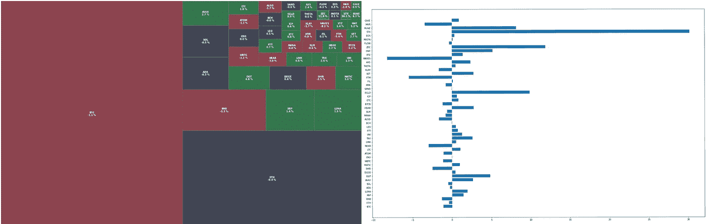
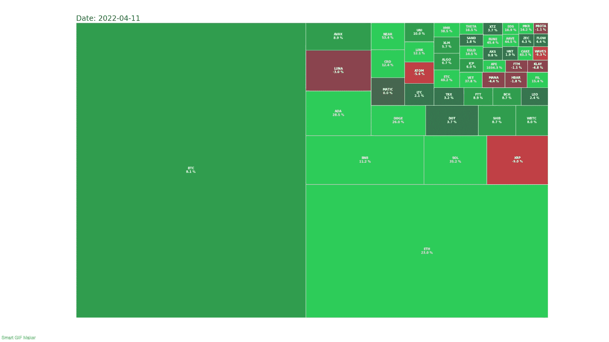
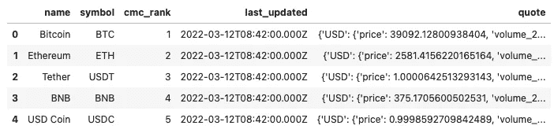
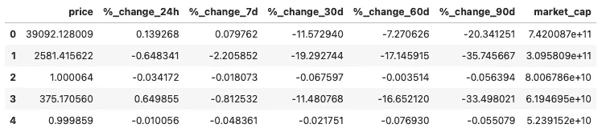
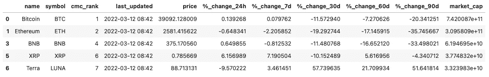
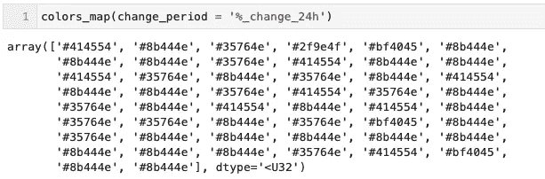
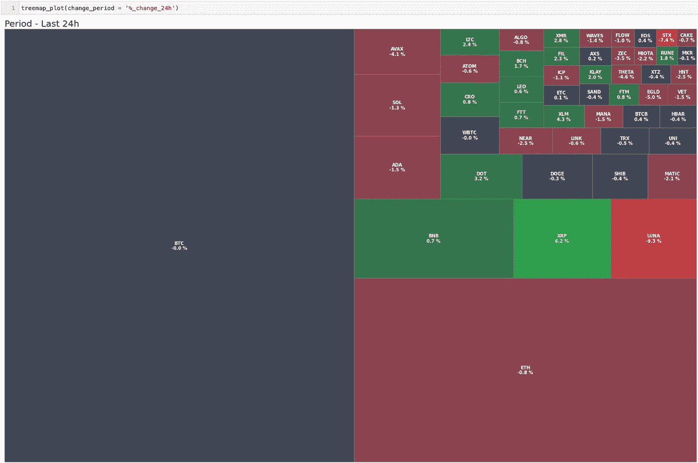
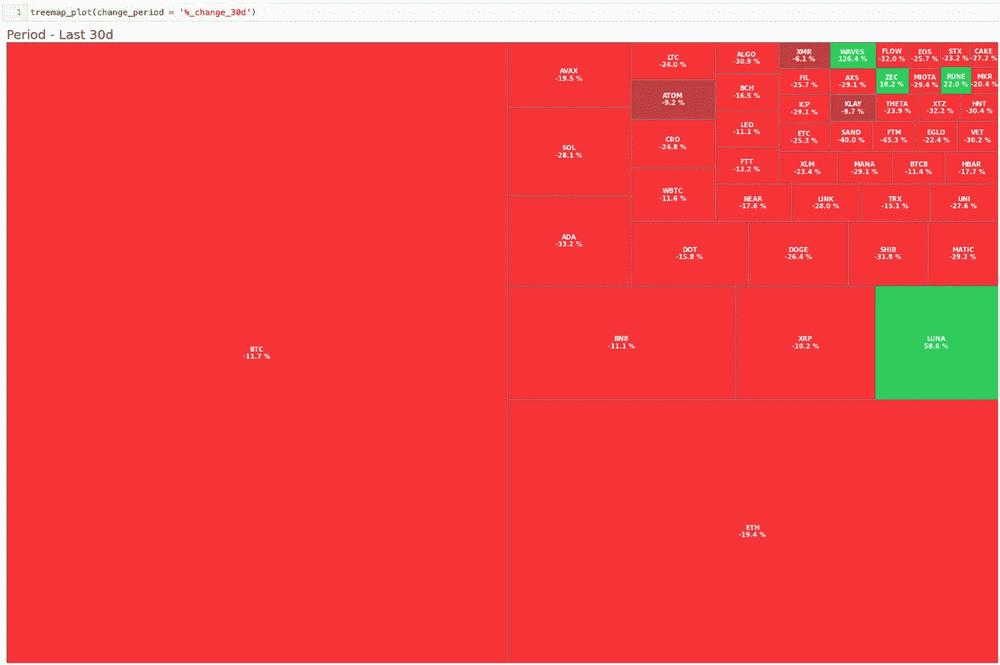

# 如何用 Python 制作加密树图

> 原文：<https://medium.com/coinmonks/how-to-make-crypto-treemap-with-python-1e36ffc8e7b?source=collection_archive---------19----------------------->

# 介绍

树形图是可视化分层数据的非常有效的方法。当我们想了解市场的整体情况时，这很方便。交易员和投资者使用股市树形图来快速浏览按行业划分的许多股票的市场状况。



我们可以用其他可视化工具做同样的事情，但是问问你自己，哪一个能让你更容易理解市场上过去 24 小时的图片。而且看起来也很酷。



# 数据源

像这样的项目的第一步是获得正确的数据。对于 treemap，我们需要每种加密货币的价格变化和市值。从大多数来源提供的 OHLC(开盘、盘高、盘低、收盘)数据中很容易计算出价格变化。

获得价格变化和市值的最简单方法是使用 CoinMarketCap API。大多数对 Crypto world 感兴趣的人过去可能使用过 CoinMarketCap 网页，所以我不打算在这里花时间介绍它:)

我们这个项目需要的是 API 的关键，你会在这里注册后获得:

[](https://coinmarketcap.com/api/) [## 最值得信赖的加密货币市场数据 API | CoinMarketCap

### 一套新的强大、灵活、准确的加密货币市场数据端点。从要求苛刻的企业使用…

coinmarketcap.com](https://coinmarketcap.com/api/) 

# 获取数据

现在你已经有了你的 API 密匙，我们可以进入第一部分，那就是导入所有需要的库。这些是一直在使用的标准库。突出的一个是 coinmarketcapapi，用于访问 CoinMarketCap API(顾名思义:)。

对于可视化，我们使用 squarify 库，将为我们建立树形图。

现在我们可以设置客户机并调用 API，希望它能返回我们需要的数据。

CoinMarketCap API 返回字典列表，在下面你可以看到列表的第一个成员。

```
{'id': 1,
 'name': 'Bitcoin',
 'symbol': 'BTC',
 'slug': 'bitcoin',
 'num_market_pairs': 9226,
 'date_added': '2013-04-28T00:00:00.000Z',
 'tags': ['mineable',
  'pow',
  'sha-256',
  'store-of-value',
  'state-channel',
  'coinbase-ventures-portfolio',
  'three-arrows-capital-portfolio',
  'polychain-capital-portfolio',
  'binance-labs-portfolio',
  'blockchain-capital-portfolio',
  'boostvc-portfolio',
  'cms-holdings-portfolio',
  'dcg-portfolio',
  'dragonfly-capital-portfolio',
  'electric-capital-portfolio',
  'fabric-ventures-portfolio',
  'framework-ventures-portfolio',
  'galaxy-digital-portfolio',
  'huobi-capital-portfolio',
  'alameda-research-portfolio',
  'a16z-portfolio',
  '1confirmation-portfolio',
  'winklevoss-capital-portfolio',
  'usv-portfolio',
  'placeholder-ventures-portfolio',
  'pantera-capital-portfolio',
  'multicoin-capital-portfolio',
  'paradigm-portfolio'],
 'max_supply': 21000000,
 'circulating_supply': 18981025,
 'total_supply': 18981025,
 'platform': None,
 'cmc_rank': 1,
 'self_reported_circulating_supply': None,
 'self_reported_market_cap': None,
 'last_updated': '2022-03-12T08:42:00.000Z',
 'quote': {'USD': {'price': 39092.12800938404,
   'volume_24h': 23370557897.998352,
   'volume_change_24h': -15.4333,
   'percent_change_1h': 0.03036214,
   'percent_change_24h': 0.13926754,
   'percent_change_7d': 0.07976241,
   'percent_change_30d': -11.57294,
   'percent_change_60d': -7.27062594,
   'percent_change_90d': -20.34125138,
   'market_cap': 742008659049.3187,
   'market_cap_dominance': 42.6241,
   'fully_diluted_market_cap': 820934688197.06,
   'last_updated': '2022-03-12T08:42:00.000Z'}}}
```

现在为了更容易操作，我们可以把这个混乱转换成熊猫的数据帧。



这稍微好一点，但仍然不是很有用，所以让我们再清理一下。在这里，我使用上述 df 数据帧中的 quote 列，并将其规范化为新数据帧中名为 quote 的各个列。然后，我更改名称并删除我不需要的列。



最后，我们将这两个数据帧连接成一个数据帧，删除现在拆分为单独列的列“报价”。

我不想在这个树形图中看到 **stablecoins** ，因为它们的价格变化总是非常接近于 0。因此，我在这里删除了符号列中包含 US 或 DAI 的所有行。

这是最终的数据帧。这个项目中有几个我们不需要的列，所以可以随意删除它们或用于其他用途。



# 形象化

二手库“squarify”不支持动态文本大小，所以我们不能在不降低可读性的情况下一次显示太多加密货币。我发现 50 是最大值，但是如果你减小文本大小，你可能会适应更多。

每个彩色矩形代表一种加密货币。矩形的大小基于市值(加密货币流通供应量的总市值。这类似于股票市场的自由流动资本。**市值=当前价格 x 流通供应量**。

每个矩形的颜色是基于我们设定的时间段内的百分比变化。深色表示变化更接近 0，鲜红色表示负向运动，鲜绿色表示正向运动。

为此，我创建了自定义函数，简单地根据我们选择的列中的值创建一个颜色数组。

这是我们为 *%_change_24h* 列调用这个函数时得到的结果。



对于实际的情节，我创建了另一个函数。通过将它包装在一个函数中，我们可以很容易地改变我们想要看到的树形图的周期。我认为函数是直接了当的，唯一容易混淆的部分可能是标签，在那里我使用列表理解来压缩符号和改变值。每个标签被分成 2 行，价格显示有 1 个小数点，后面有%符号。

最后，这里是承诺过去 24 小时的加密树状图。



Crypto Treemap 24h

在过去 30 天里。



Crypto Treemap 30d

# 结论

这是我自己使用的有趣的项目。我希望你能在这里学到一些新的东西，也许能为你自己的投资增加一些有用的工具。

如果你觉得这很有趣，请**跟着**和**拍手**。谢谢:)