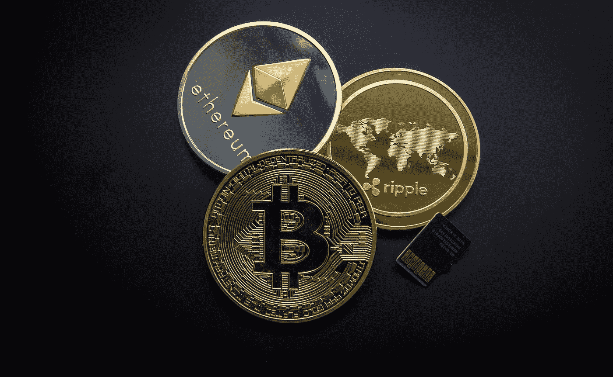
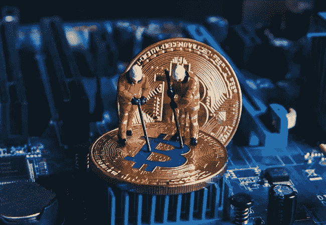
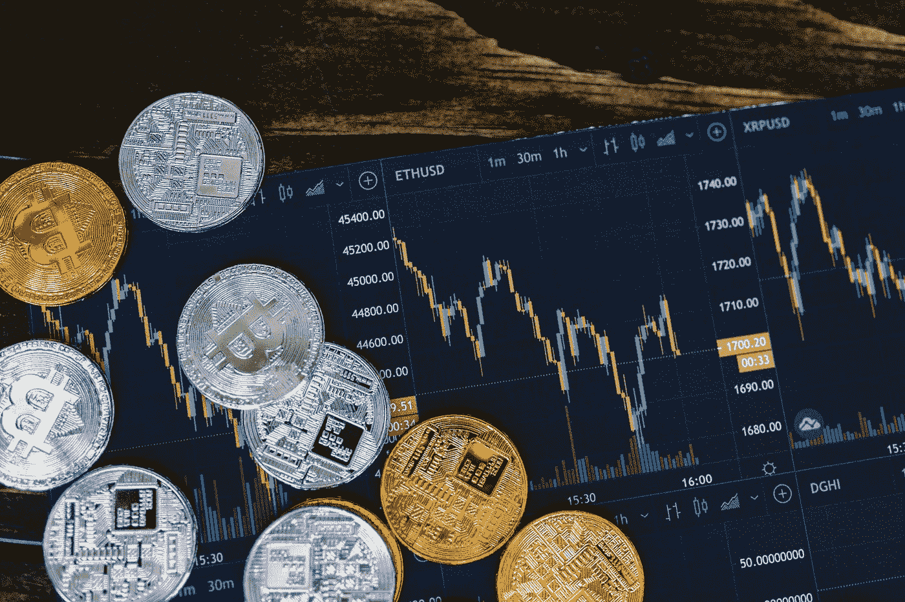
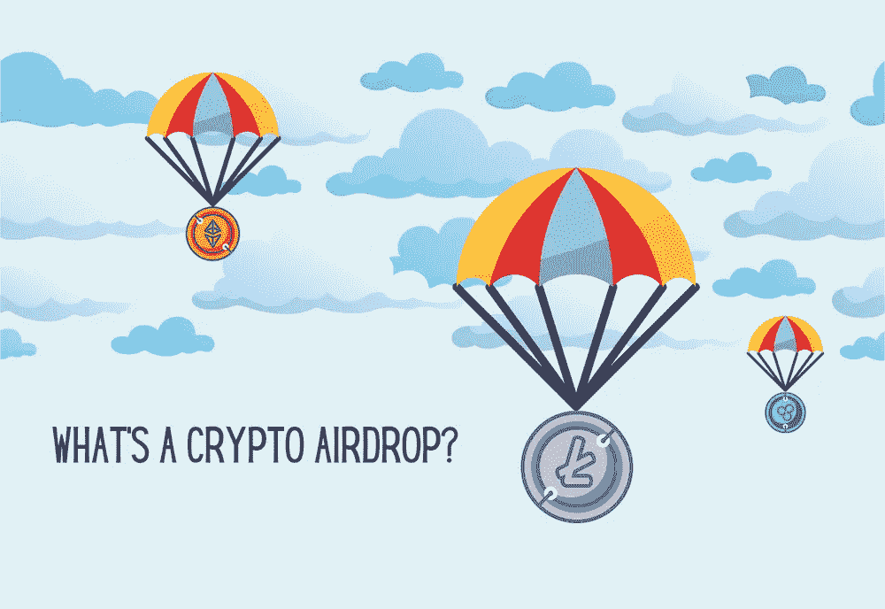
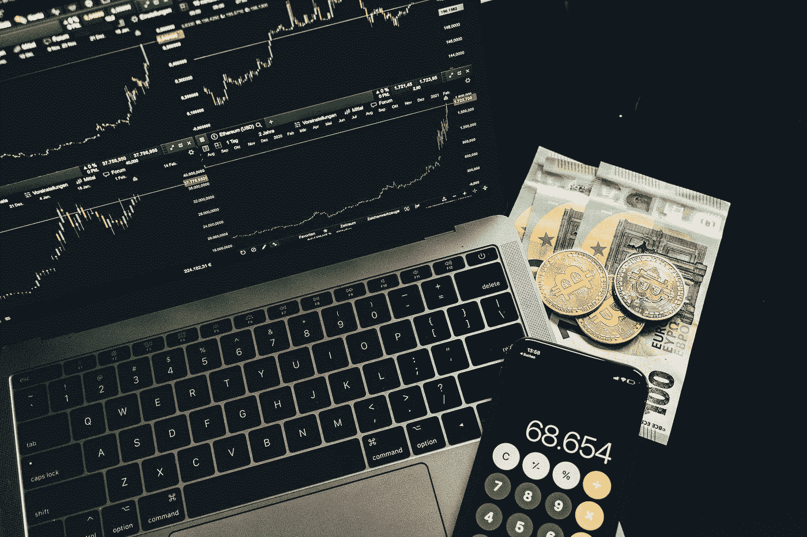

# 如何用加密货币赚钱

> 原文：<https://medium.com/coinmonks/how-to-make-money-from-cryptocurrency-aee678a389a?source=collection_archive---------74----------------------->

2009 年比特币推出时，加密货币首次推出。这些实际上是虚拟货币，其工作原理是透明和高度安全的技术，即区块链。从那以后，密码领域在各方面都有了巨大的发展。事实上，有许多方法可以用加密货币产生现金，尽管没有多少人知道这些方法。在下面的段落中，我们提到了一些关于如何从加密货币中赚钱的万全之策。

# 1.采矿

在处理加密货币的同时，重要的是你要知道比特币挖矿的意义。通过解决一些复杂的数学算法，你将获得加密硬币。为此，需要有一台高质量的计算机供他使用。采矿将是加密货币交易被纳入区块链的过程。当然，在这样做之前，需要对它们进行验证。

# 2.[买入并持有](https://www.coinbase.com/join/VP1V9G?src=android-link)

HODL 被认为是印刷错误，这意味着个人认为他们迟早会从使用他们的加密硬币中获益。对加密货币进行[投资](https://www.coinbase.com/join/VP1V9G?src=android-link)，目的是持有它们，这恰好是人们用来产生现金的一个众所周知的过程。在这里使用的最著名的加密硬币中，可以提到比特币、Ripple (XRP)、以太坊、Monero、Tezos 等等。在做出持有资产的决定之前，耐心是必要的。

# 3.加密叉和空投

你可能会好奇关于空投的情况下，你想产生与加密现金。当加密货币用户免费获得新的代币时，加密空投就会发生。你需要完成一些简单的杂务，以便在这里参与。

例如，您可能具有执行一些简单任务的专业技能，如编写内容、翻译文档等等。如果是这样，你可能会被一些组织雇用，这些组织会为你提供加密货币作为补偿。你可能同样会收到免费代币，其价值可能会在不久的将来增加。

# 4.[加密货币 t](https://www.coinbase.com/join/VP1V9G?src=android-link) [交易](https://www.coinbase.com/join/VP1V9G?src=android-link)

这种交易可以让你利用密码市场可能出现的短期机会。与其担心建立一个[投资组合](https://www.coinbase.com/join/VP1V9G?src=android-link)，它会帮助你在不久的将来产生足够的现金来满足你的需求。没有必要一直坐在电脑前，因为这种方法可以用于几乎任何使用自动化应用程序和机器人按时执行交易的加密货币。如果你知道自己在做什么，加密交易可以证明是相当有利可图的。

**结论**

让我们希望这篇文章将为您提供一个关于如何利用加密货币创收的坚实想法。事实上，投资加密货币有多种方式，包括在交易所购买硬币等等。希望在不久的将来，我们能够正确使用这种创新的投资方式，而不会有被骗子欺骗的风险

> 加入 Coinmonks [电报频道](https://t.me/coincodecap)和 [Youtube 频道](https://www.youtube.com/c/coinmonks/videos)了解加密交易和投资

# 另外，阅读

*   [折叠 App 审核](https://coincodecap.com/fold-app-review) | [Kucoin 交易机器人](/coinmonks/kucoin-trading-bot-automate-your-trades-8cf0ca2138e0) | [Probit 审核](https://coincodecap.com/probit-review)
*   [如何匿名购买比特币](https://coincodecap.com/buy-bitcoin-anonymously) | [比特币现金钱包](https://coincodecap.com/bitcoin-cash-wallets)
*   [币安 vs FTX](https://coincodecap.com/binance-vs-ftx) | [最佳(索尔)索拉纳钱包](https://coincodecap.com/solana-wallets)
*   [比诺莫评论](https://coincodecap.com/binomo-review) | [斯多葛派 vs 3Commas vs TradeSanta](https://coincodecap.com/stoic-vs-3commas-vs-tradesanta)
*   [Capital.com 评论](https://coincodecap.com/capital-com-review) | [香港的加密借贷平台](https://coincodecap.com/crypto-lending-hong-kong)