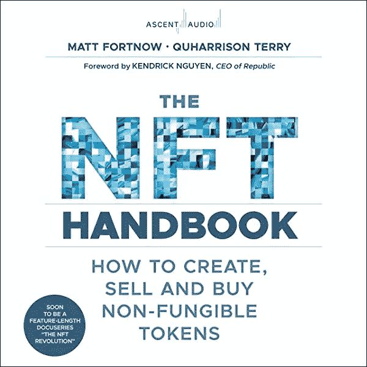

# 如何在元宇宙赚钱:6 个元宇宙收入流

> 原文：<https://medium.com/coinmonks/how-to-make-money-in-the-metaverse-7924a13e22c9?source=collection_archive---------6----------------------->

# 什么是元宇宙？

元宇宙是由软件和硬件创建的虚拟现实。可以通过电脑、耳机，或者借助头像来访问。

和我们熟悉的互联网没有太大区别。在元宇宙，人们可以相互交流，去冒险，甚至赚钱。

[元宇宙在 60 秒内解释完毕](https://www.thecryptopie.com/post/the-metaverse-explained-in-60-secs)

[元宇宙将改变世界的 7 种方式](https://www.thecryptopie.com/post/7-ways-the-metaverse-will-change-the-world-and-you)

这一概念现在正由脸书和苹果等公司开发，它们正在激烈竞争，以率先发布可行的产品。据预测，到 2025 年，元宇宙将成为一个万亿美元的产业。

# 如何赚钱

## 1.在元宇宙购买房产

为什么购买元宇宙房产是一项好的投资？这个问题的答案取决于你愿意在这个虚拟世界投入多少。如果你正在寻找投资机会，那么在元宇宙购买一套公寓是明智的。随着越来越多的人对投资这个平台感兴趣，这些房产的价值将会增加。

要深入了解我为什么认为这项投资会飞向月球，请查看我的文章[以下是我为什么看好购买元宇宙土地以及我为什么认为你应该](https://www.thecryptopie.com/post/why-im-bullish-on-buying-metaverse-land)或观看下面的视频。

这是一个列表，列出了现在购买土地的四大潜在回报。

*   分散土地
*   沙箱
*   无限轴
*   淀积层

## 2.元宇宙代币

尽管我认为许多房产都被严重低估，只会随着主流采用率的增加而升值，但我理解不想在虚拟土地上花费数千美元的情绪。一个更便宜的选择是购买与这些元经文相关的代币。随着这些虚拟土地的财产价值增加，代币也会增加。

*   分散土地-法力
*   沙箱沙
*   无限轴-AXS
*   ILV 火山

## 3.元宇宙指数

如果你相信元宇宙是未来，但没有时间或精力去研究每个单独的宇宙，投资元宇宙指数(MVI)可能是一个很好的选择。它是一篮子代币，旨在捕捉娱乐、体育和商业向虚拟环境转移的趋势。这里的基本投资前提是，通过投资元宇宙指数，这是分散在许多元宇宙代币，你的投资将随着元宇宙行业的增长而增长。

## 4.元宇宙股票

元宇宙指数的想法激起了你的兴趣吗？但是你想要更多的控制？如果你还没有，你应该考虑将部分投资组合分配给最有可能成为元宇宙最大玩家的公司，比如脸书、微软、谷歌、苹果和亚马逊。

## 5.创建 NFT

如果你是一名设计师，这里有一个巨大的机会。如果我们接受这样一个前提，即我们正在走向一个未来，在这个未来，我们将花费大部分时间通过元宇宙中的虚拟角色进行虚拟互动，那么人们将会在那里花费大量时间，并且他们会希望以一种时尚的方式进行互动。创造虚拟艺术、虚拟形象、产品、建筑和可穿戴设备可以赚很多钱。

想开始创建自己的 NFT 并销售它们吗？QuHarrison Terry 和 Matt Fortnow 撰写的《NFT 手册:如何创建、销售和购买不可替代代币》是您的首选资源。你开始需要知道的一切都在一本方便的手册里。另外，如果你通过我的链接购物，我会从亚马逊获得一点回扣，而不会增加你的成本。虽然不多，但对早上喝咖啡有帮助。

## 6.销售元宇宙服务

许多个人和公司将需要帮助建立他们在元宇宙的存在。你可以通过在 Fiverr 和 Upwork 上建造房屋和创造 3D NFT 时装来赚钱。

# 最后的想法

当人们想到元宇宙时，他们通常会想到像《第二人生》或《魔兽世界》这样的网络游戏。然而，在元宇宙，除了玩游戏，还有很多赚钱的方式。作为个人，你可以通过很多方式赚钱，或者在元宇宙创办自己的企业，如果你有一些创造力并发展一套技能，这一点也不难。

 [## 你准备好迎接加密经济了吗？加密派

### 每次你打开新闻，阅读报纸，或者浏览你的推特，你很可能会看到一些故事…

www.thecryptopie.com](https://www.thecryptopie.com/) 

> 加入 Coinmonks [电报频道](https://t.me/coincodecap)和 [Youtube 频道](https://www.youtube.com/c/coinmonks/videos)了解加密交易和投资

# 另外，阅读

*   如何在 Uniswap 上交换加密？ | [A-Ads 评论](https://coincodecap.com/a-ads-review)
*   [WazirX vs coin dcx vs bit bns](/coinmonks/wazirx-vs-coindcx-vs-bitbns-149f4f19a2f1)|[block fi vs coin loan vs Nexo](/coinmonks/blockfi-vs-coinloan-vs-nexo-cb624635230d)
*   [本地比特币审核](/coinmonks/localbitcoins-review-6cc001c6ed56) | [加密货币储蓄账户](https://coincodecap.com/cryptocurrency-savings-accounts)
*   [什么是融资融券交易](https://coincodecap.com/margin-trading) | [成本平均法](https://coincodecap.com/dca)
*   [支持卡审核](https://coincodecap.com/uphold-card-review) | [信任钱包 vs 元掩码](https://coincodecap.com/trust-wallet-vs-metamask)