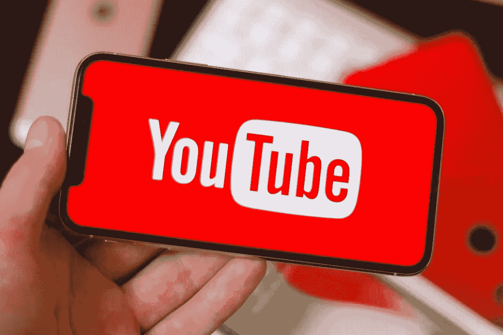
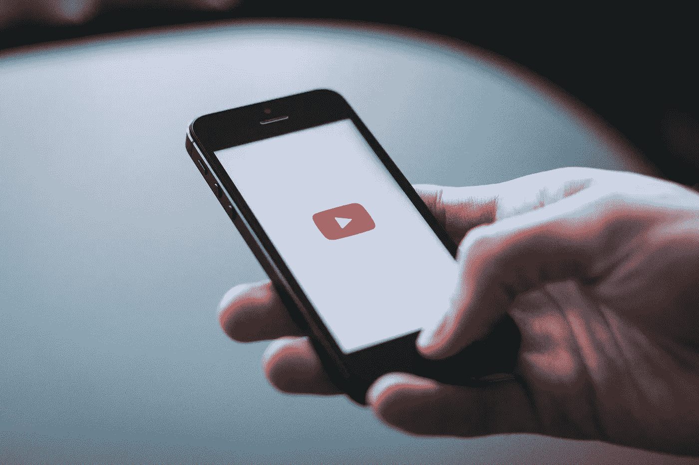
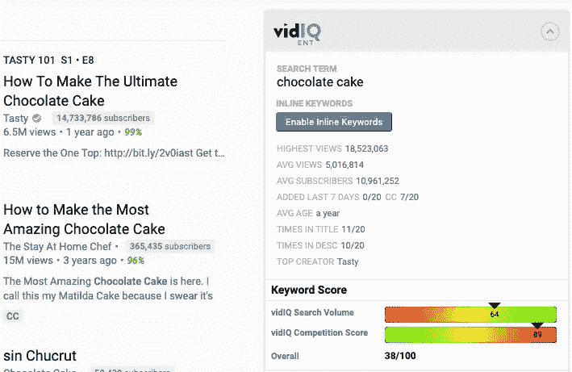
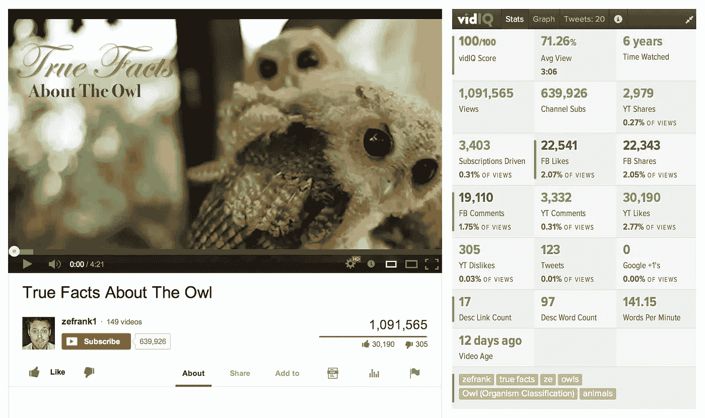
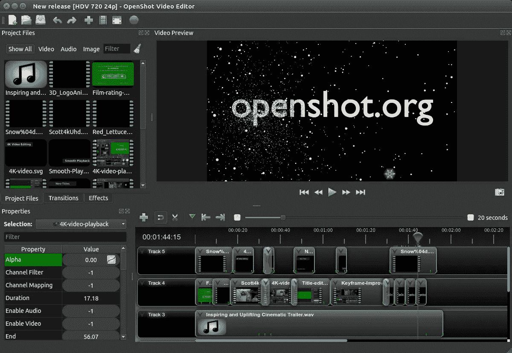
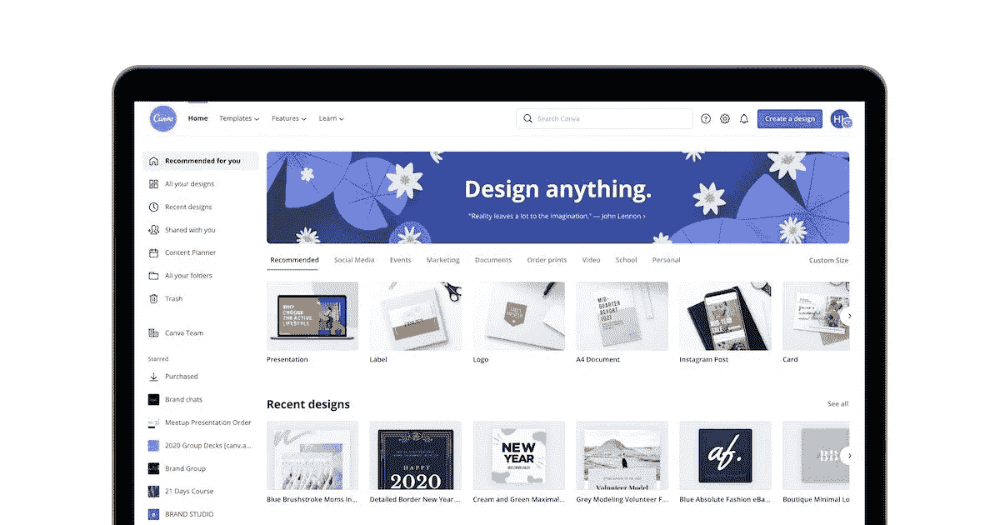
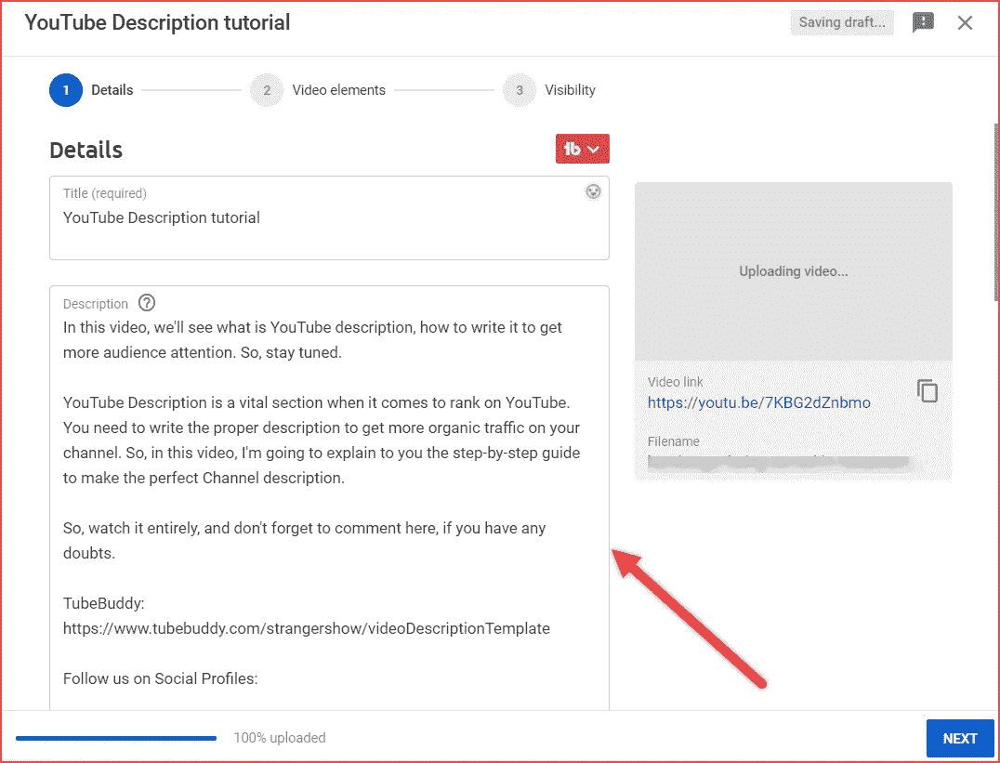
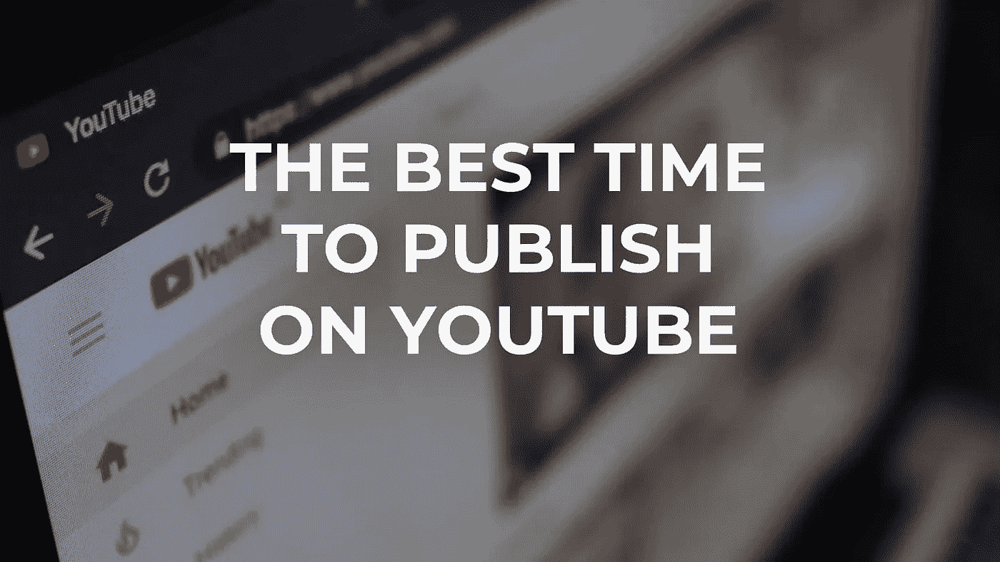
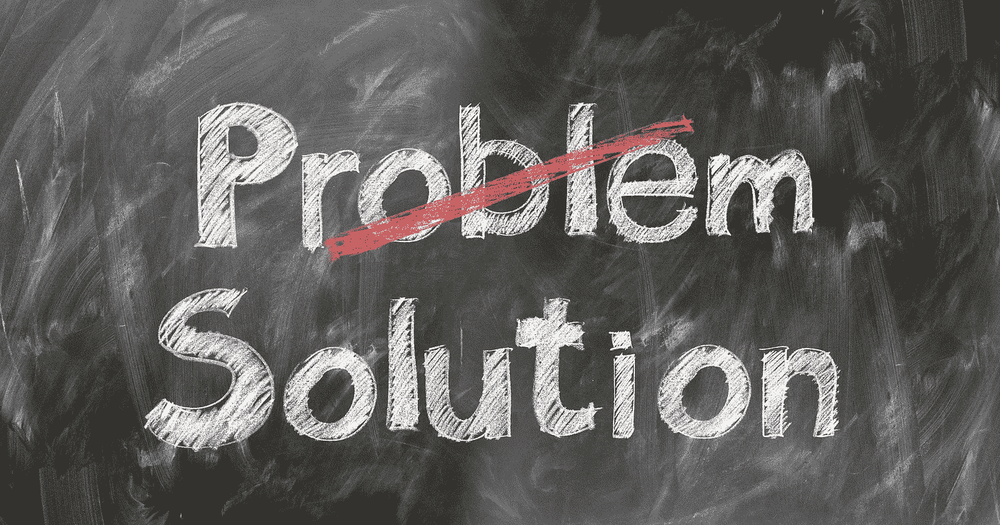

# 不制作视频如何在 YouTube 上赚钱

> 原文：<https://medium.com/coinmonks/how-to-make-money-on-youtube-without-making-videos-cc46f67b88b8?source=collection_archive---------10----------------------->

**Make Money On YouTube**

如果你正在寻找如何在互联网上赚钱，那么它是不可能绕过 YouTube 的，著名的 [**YouTube**](https://youtube.com/) 视频托管由**谷歌**所有，创建于 2005 年 2 月 15 日，到 2013 年底拥有超过 10 亿活跃用户，并且这个数字还在继续增长。成功是如此之大，以至于越来越多的人开始以视频格式创建自己的视频和博客。

对于一些人来说，这只是一种爱好，对于另一些人来说，这是一种挣钱的方式，因为，除了娱乐需求，YouTube 还可以满足财务需求。

越来越多想在 YouTube 上赚钱的人开始从事视频**博客**——在**互联网**上创作和推广视频。

从下面的材料中，你将了解如何在不制作视频的情况下在 YouTube 上赚钱，有哪些方法，以及在 YouTube 上赚钱的说明。

我知道这听起来好得不像真的，但是有人在 YouTube **上没有录制视频**就获得了被动收入。

其实你可以在 YouTube 上上传别人的视频，从中赚钱。然而，你应该确保这些视频受到知识共享许可的保护，并且你也为 YouTube 的观众提供了一些额外的价值。

以下是不制作任何视频也能在 YouTube 上赚钱的步骤。

# 创建 Youtube 频道时的重要信息

**Important Information**

1.  确保完成所有必要的设置，如上传您的 YouTube 频道艺术，有一个正确的频道名称和个人资料图片。
2.  不要跳过“关于”部分。请写几句关于你的频道的话，并附上相关的关键词。
3.  使用 [**VidIQ Chrome 扩展**](https://chrome.google.com/webstore/detail/vidiq-vision-for-youtube/pachckjkecffpdphbpmfolblodfkgbhl?hl=en) 添加相关频道标签。
4.  验证您的帐户，以便您可以上传自定义缩略图。
5.  上传您的品牌标志

一旦你有了一个优化的 YouTube 频道，你就比你的竞争对手领先一步。许多人不太关注创建一个针对搜索引擎优化的 YouTube 频道，并跳过一些基本设置。

你不会发现给你的 YouTube 视频排名有很大的好处。然而，这将向 YouTube 和来到你的频道的观众发出一个积极的信号。

# 不制作视频如何在 YouTube 上赚钱

**Make Money On Youtube**

即使你自己不制作视频，你也可以在 YouTube 上赚钱。要做到这一点，你只需要找到有趣的视频并发布在你的频道上，然后同样通过上下文和其他广告或**联盟计划**将它们货币化

这种收入的主要优势是创建视频内容的速度，也就是说，您不需要花费时间拍摄然后编辑视频。这大大节省了时间。

## 但是也有缺点:-

1.  由于缺乏个人品牌而失去永久观众。
2.  阻塞信道的概率。
3.  无法监管他们的视频主题和内容，因为它们是由其他作者创作的。

# 逐步指令

如果你只是一个博客初学者，还不知道如何在 YouTube 上**赚钱**，那么以下是你必须遵循的简单步骤:

## 1.适当的关键词研究

**VidIQ Keyword Research**

正确的关键词研究是 YouTube 频道快速发展的最重要的步骤之一。由于采用了正确的方法，您可以在移动中每月获得 10-10 万次浏览，而无需额外的推广。

如果你的浏览器是 Chrome，那么我建议安装扩展— **VidIQ** (它将有助于识别热门关键词和优化视频)。

添加完 [**VidIQ Chrome 扩展**](https://chrome.google.com/webstore/detail/vidiq-vision-for-youtube/pachckjkecffpdphbpmfolblodfkgbhl?hl=en) 后，只需在搜索标签中输入你的种子关键词，点击回车，然后点击 VidIQ Chrome 扩展。它会向您显示围绕该种子关键字的许多关键字。

明智地选择关键词，但不要花太多时间寻找关键词。尽快发布你的第一个视频。

## 2.在你的关键词中寻找视频

**Find Video Withing Niche Keywords**

现在的任务是在 YouTube 上找到不会受到罢工和封锁的内容，这很容易检查，你必须找到 **creative commons** 视频，你可以将它们放在一起并上传到你的频道。

在你的利基关键词中找到视频，进入**过滤器选项**并选择知识共享许可。现在，您将有一个视频列表，您可以下载并使用它来创建您的编译视频。

## 3.组合视频以创建新的

**Openshot Video Editor**

一旦你下载了视频，是时候让它们变得独一无二了，使用一个简单的视频编辑器( [**OpenShot**](https://www.openshot.org/) )把视频放在一起。不需要任何高级或花哨的东西，只需将音频静音并将剪辑彼此相邻放置即可。

确保放置剪辑的顺序看起来没问题。添加介绍和结尾不是强制性的，但它们可以让视频看起来更好。一旦你做到了这一点，是时候给它添加一个**音频或画外音**了。一定要做好，让你的视频看起来**自然**。

## 4.创建一个吸引人的缩略图

**Canva Online Designing Tool**

现在你独特的视频准备好了。是时候为你的视频创建一个缩略图了。一个**吸引人的缩略图**可以带来巨大的不同，它还可以提高点击率，所以一个**好印象缩略图**和视频一样重要。

创建缩略图并不是一项困难的任务。您可以使用 [**Canva**](https://www.canva.com/) 、 [**Crello**](https://crello.com/) 或 [**Visme**](https://www.visme.co/) 来创建好看的缩略图。但是在为你的视频创建缩略图之前，确保分析你的**顶级竞争对手的**缩略图。

如果你的 youtube 缩略图需要高质量的股票照片，那么你可以访问**[**Pixabay**](https://pixabay.com/)和 [**Pexels**](https://www.pexels.com/) 。这些网站有数百万张免版税的图片和视频。您可以将它们用于您的 YouTube 视频和缩略图。**

## **5.优化(标题/描述/标签/标签)**

****

****YouTube Video Optimization****

**这里我们需要一个**的小创意**，我们拿着原来的名字玩，我们从名字里扔出一些东西，我们添加一些东西，但是不从根本上改变它(这样可以让你从类似的视频里获得流量)，把你的名字插入描述里添加到这个视频里**【视频名】**还有可能是别的，一行就够了。**

**我们可以将**标签**添加到视频的描述中(这些标签本质上与您已经选择的标签相同，但是使用了#符号)，我们使用 5-10 个标签并通过哈希符号进行书写，如果您使用短语，则使用下划线。**

**确保正确使用**行动号召**。在视频开始时，发出行动号召，例如**喜欢**、**分享**，或**订阅**。推荐你的另一个视频，例如，使用注释。在视频的最后，你应该显示相关的视频和一个**订阅按钮**。**

**现在把你的视频上传到 YouTube。**

****干杯！****

## **6.视频发布时间**

****

****Video Publish Timing****

**在前 4-6 天发布 1-3 个视频，然后你可以发布 5-6 个，但不要超过一天，最好是在**不同的时间**。了解你的观众和他们的反应，然后发布视频，但确保**不要过度发布视频**。**

**接下来，等到 YouTube 开始将视频添加到类似的视频中，并与我们免费分享流量时，保持耐心是很重要的，因为在接下来的 1-3 个月内，频道的情况可能不会发生太大变化，但如果你做得一切都正确，频道将开始收集主题观众并获得浏览量。**

# **有用的提示**

**要想在 YouTube 上赚大钱并从中获得快感，请遵循以下三条建议:**

****

****Helpful Hints****

## **1.诚实和开放**

**你的 YouTube 频道的受欢迎程度和浏览量的增长率与观众对你的视频和你给他们的信息的反应成正比。**

## **2.尊重你的观众**

**这不是没有道理的，这句谚语与现在相关——你希望别人如何对待你，你就如何对待别人。同样的原则也适用于 YouTube。**

## **3.有趣有用的视频**

**如果你能为你的频道提供有趣和有用的材料给观众，你就能在 YouTube 上赚很多钱。重要的是他们能从中学到一些新东西。**

# **结论**

**现在你知道不制作视频如何在 Youtube 上赚钱了。要有耐心，创作有趣有用的视频，吸引观众，收入每天都会增长。很有可能很快你就会拥有数百万用户，并在网络上变得受欢迎。对于那些没有时间**拍摄视频**或者对拍摄不感兴趣的人来说，YouTube 知识共享服务是一个赚钱的好方法。**

****感谢阅读！****

**如果你需要关于如何在不制作视频的情况下在 youtube 上赚钱以及如何在一周内获得 10k 真实 youtube 浏览量的个人**免费培训**，请查看我的网站 [**这里**](https://exceptional-inventor-7654.ck.page/41032d739c)**

> **加入 Coinmonks [电报频道](https://t.me/coincodecap)和 [Youtube 频道](https://www.youtube.com/c/coinmonks/videos)了解加密交易和投资**

# **另外，阅读**

*   **[3 商业评论](/coinmonks/3commas-review-an-excellent-crypto-trading-bot-2020-1313a58bec92) | [Pionex 评论](https://coincodecap.com/pionex-review-exchange-with-crypto-trading-bot) | [Coinrule 评论](/coinmonks/coinrule-review-2021-a-beginner-friendly-crypto-trading-bot-daf0504848ba)**
*   **[莱杰 vs n rave](/coinmonks/ledger-vs-ngrave-zero-7e40f0c1d694)|[莱杰 nano s vs x](/coinmonks/ledger-nano-s-vs-x-battery-hardware-price-storage-59a6663fe3b0) | [币安评论](/coinmonks/binance-review-ee10d3bf3b6e)**
*   **[Bybit Exchange 审查](/coinmonks/bybit-exchange-review-dbd570019b71) | [Bityard 审查](https://coincodecap.com/bityard-reivew) | [Jet-Bot 审查](https://coincodecap.com/jet-bot-review)**
*   **[3 commas vs crypto hopper](/coinmonks/3commas-vs-pionex-vs-cryptohopper-best-crypto-bot-6a98d2baa203)|[赚取加密利息](/coinmonks/earn-crypto-interest-b10b810fdda3)**
*   **最好的比特币[硬件钱包](/coinmonks/hardware-wallets-dfa1211730c6) | [BitBox02 回顾](/coinmonks/bitbox02-review-your-swiss-bitcoin-hardware-wallet-c36c88fff29)**