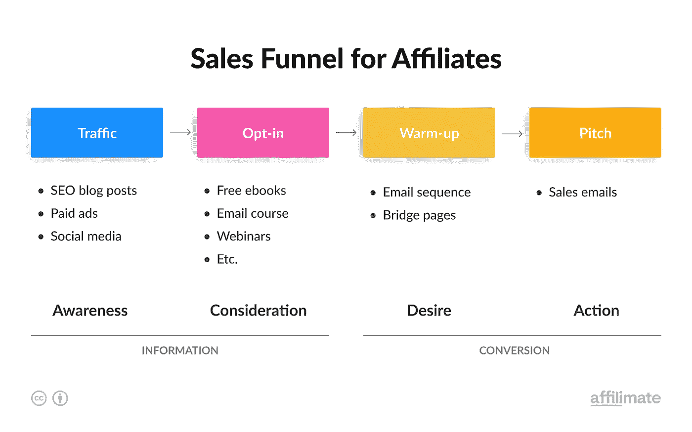
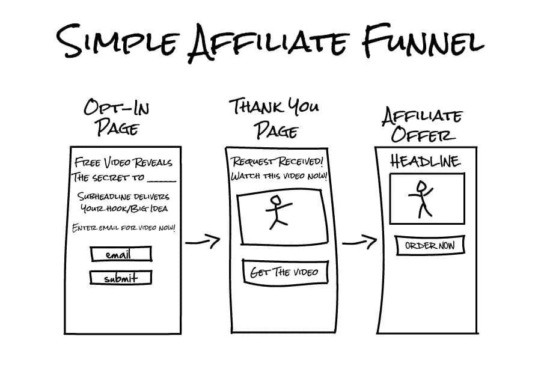
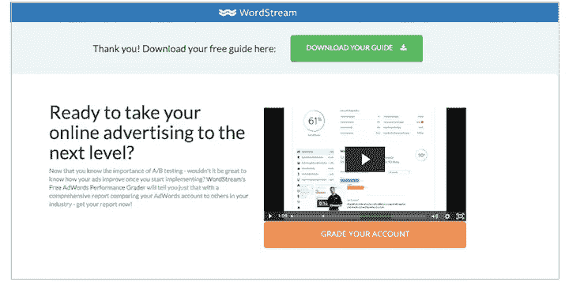

# 如何赚钱网上联盟营销

> 原文：<https://medium.com/coinmonks/how-to-make-money-online-with-affiliate-marketing-77d2a62509af?source=collection_archive---------45----------------------->

## 利用销售渠道每月创造 4000 美元

如今，人们都在寻找在家上网赚钱的方法，但这在 2022 年还可能吗？简短的回答是:是的。谈到网上赚钱，互联网上充斥着假货和欺诈。但是，在窗帘后面才是真正的音乐在播放。这种音乐就是我们今天学习演奏的，当你掌握了它，你就能在家通过网络赚很多钱。

今天，我将教你什么是销售漏斗，如何选择销售漏斗服务，如何建立一个和一些技巧和窍门，如何使它成为一个高转化率的销售漏斗。但是没有良好的流量，销售漏斗就什么都不是，这就是为什么我推荐你也[阅读这篇文章](/@michaelhokl97/how-to-make-money-with-quora-572c9ee7ad9c)。它描述了一种获得免费流量的简单方法。那么，你准备好今天的音乐课了吗？我称之为:“在家网上赚钱”。''

## 销售漏斗服务

在我们开始创建销售漏斗之前，知道选择什么样的服务是很重要的。在这里，我列出了两个不同价格范围的非常受欢迎的服务。

**Systeme.io** 是开始销售渠道和电子邮件营销的好方法。这是一个伟大的全能，因为你可以创建销售渠道，建立电子邮件活动，建立网站等等。所有这些仅售**18.90 美元。**您将获得什么:

10 销售漏斗

10 自动化规则

5000 个联系人

5 篇博客

要了解有关 systeme.io 的更多信息，请单击此处。

**GetResponse.com**也是一个伟大的工具。如果您想从用户友好的电子邮件营销解决方案开始，我推荐 GetResponse。最棒的是，只需 15.58 美元，你就可以:

**无限登陆页面**

**无限制建站**

**自动回复器**

**几种不同语言的客户服务**

[要了解更多关于 GetResponse 的信息，请点击此处](https://www.getresponse.com?ab=Phk7yvwHyp)

## 什么是销售漏斗

销售漏斗是流量在到达购买点之前经过的一系列步骤。它被称为漏斗，因为在迈出第一步并进入漏斗的许多人中，只有少数人能坚持到皈依。

请看上面的图片:

这是一个简单而有效的销售漏斗，用于联盟营销。现在让我们来分解一下:我们有流量，选择加入页面，或挤压页面，桥梁页面(感谢页面)和商家网站，或销售页面，当然还有电子邮件。

电子邮件地址是在选择加入页面期间收集的。我们这样做是为了以后可以向需要更多时间考虑购买的潜在客户发送跟进电子邮件，这也是提醒他们该产品仍然存在以防他们忘记的好方法。

流量是来自你的广告、你的网站或博客上的社交媒体内容的人。如果他们看到一个代销商链接并点击它，他们将被定向到选择加入页面。

选择加入页面或挤压页面是一个重要的页面。这是登录页面，也是您的潜在客户首先看到的内容。在这一点上，我们希望引起客户的兴趣，让他们输入自己的电子邮件地址，这样我们就可以捕捉到它。一旦输入地址，它们将被发送到下一页

桥梁页面是你和销售页面之间的页面。它基本上是通过分享有价值的信息，如免费的电子书或教程视频，来预热客户。这样他们更倾向于购买你的产品。如果他们的兴趣越来越大，他们会点击产品的链接，并被引导到销售页面。

销售页面是由商家创建的，其目的是销售产品。

现在你知道什么是销售漏斗，它是如何构成的，我们现在将仔细看看每一页，我会告诉你什么是重要的，以及如何设计它

> 加入 Coinmonks [电报频道](https://t.me/coincodecap)和 [Youtube 频道](https://www.youtube.com/c/coinmonks/videos)了解加密交易和投资

## 选择加入页面

选择加入页面，也称为登录页面或挤压页面，将是收集电子邮件以换取免费服务的页面。以下是一个优秀的选择加入页面的关键要素:

1.  展示订阅电子邮件列表或下载免费电子书、pdf 文件等主要好处的标题。(称为铅磁铁)

2.允许潜在客户输入电子邮件地址的表单

1.  行动号召，让客户知道该做什么

**头条**

一个好的标题应该:

1.引人注目，抓住潜在客户的注意力

2.向潜在客户解释订阅您的电子邮件列表或下载您的销售线索磁铁会给他们带来什么

试着说出好处，因为人们更倾向于购买好处而不是功能。

慢慢来，想想好处并在标题中强调。

**选择加入表单**

基本的选择加入表格只是要求潜在客户的电子邮件地址。最基本的选择加入表单是只要求潜在客户的电子邮件地址的表单。就像我说的，这是非常基本的，我认为很无聊。所以也问问他们的名字。通过这种方式，你可以在以后对自动发送的邮件进行个性化处理，并建立联系，从而获得更大的转化潜力。

但是不要在选择加入表格上要求太多，因为你要求的越多，他们就越不可能填写

仅仅要求姓名和电子邮件地址就足够了。

**行动号召**

让[交通](/@michaelhokl97/how-to-make-money-with-quora-572c9ee7ad9c)知道下一步该怎么做。

这就是行动号召按钮的目的。尽量不要使用像这样的文字:

*【订阅】【加入】**【获取更新】*等。

使用文本，如:

*“获取免费电子书”、“显示交易”、“T9”等*

记得指出好处！

例子

## 桥接页面

在这一页上，您将进一步强调这些优势。你可以分享一个关于产品的视频，或者写一篇关于产品如何给他们的项目、生活、金钱等带来好处的文章。

在这里，重要的是在你和顾客之间建立联系。不要只评论产品。与客户互动。问一些问题，让潜在客户考虑一下，这样会节省时间，这样你和买家就建立了关系，转化率也会提高。

就设计而言:尽量让它靠近选择加入页面，并确保在这个页面上添加行动号召，这样他们就可以点击链接按钮并被重定向到销售页面

例子

## 销售页面

在销售产品或服务时，商家或卖家通常会有自己的销售页面。所以你现在不用担心这个。

## 提示和技巧

确保你的选择加入页面与销售页面的设计相匹配

少即是多。尽量不要设计任何花哨的东西，因为它可能会分散顾客的注意力

除了电子邮件地址和姓名之外，不要问他们更多的信息。如果你这样做，他们可能不会填写

指出好处

## 电子邮件营销

现在，因为我们收集了电子邮件，所以我们可以使用自动电子邮件向开始有点犹豫的潜在客户发送优惠和奖金。但这是另一天的话题。

现在你知道如何创建一个销售漏斗，以及你需要记住的一些重要部分。[现在是给它增加流量的时候了。你可以使用社交媒体、付费广告、谷歌等。](/@michaelhokl97/how-to-make-money-with-quora-572c9ee7ad9c)

祝你销售好运

这篇文章包含附属链接。一旦你购买我的链接，我会得到佣金。给你的价格不会变。