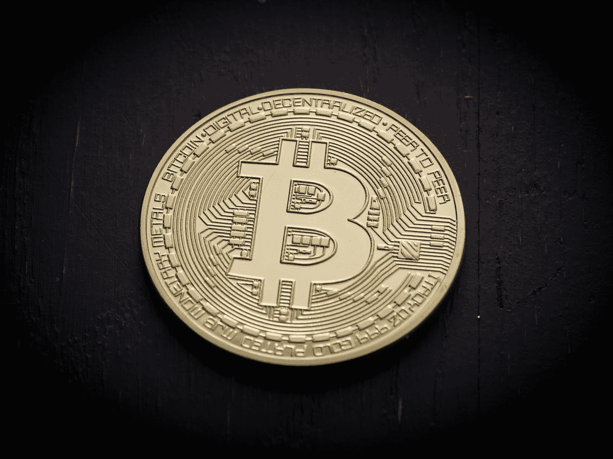

# 如何用比特币在线赚钱

> 原文：<https://medium.com/coinmonks/how-to-make-money-online-with-bitcoin-457c5e2d3473?source=collection_archive---------41----------------------->

## 面向初学者的比特币

Photo by [André François McKenzie](https://unsplash.com/@silverhousehd?utm_source=medium&utm_medium=referral) on [Unsplash](https://unsplash.com?utm_source=medium&utm_medium=referral)

现在是 2009 年，一个名叫“中本聪”的人，至少我们相信这是他的名字，因为没有人真正知道到底是谁创造了比特币，开发了一种电子在线货币。这种名为“比特币”的加密货币诞生了。

今天的社会真的很快，充满活力，电子货币是有益的，它可以通过自己的支付网络轻松地交换，购买和出售。这种加密货币基于密码学，可以用作电子支付，而无需支付银行费用等。

由于 Covid19，人们长期被关在家里，仍然难以找到工作，正在寻找在线赚钱的方法。他们中的一些人试图用比特币赚到钱，或者人们只是为了他们的未来而投资比特币。不管是什么，在这篇文章中，你将学习如何用比特币赚钱。

Photo by [Thought Catalog](https://unsplash.com/@thoughtcatalog?utm_source=medium&utm_medium=referral) on [Unsplash](https://unsplash.com?utm_source=medium&utm_medium=referral)

在我们开始阅读下面的句子之前:“投资机会无处不在。最难的是识别并抓住最有利可图的市场。如何用比特币赚钱有很多方法，所以我决定写这篇指南，分享 5 种常见的方法，如何用比特币在线赚钱。

Photo by [Viacheslav Bublyk](https://unsplash.com/es/@s1winner?utm_source=medium&utm_medium=referral) on [Unsplash](https://unsplash.com?utm_source=medium&utm_medium=referral)

## 如何用比特币赚钱

我知道，我知道你想获得如何用加密货币赚钱的知识。我先告诉你比特币到底是什么。

## **什么是“比特币”？**

比特币的真正概念非常容易理解。它不是实体的，它是存储在数字钱包中的一个文件。使用数字钱包，这种“比特币文件”可以在全球范围内、在人与人之间传送。你不仅可以发送或接收它，你还可以购买一个比特币并持有它，直到它的价格上涨。

如果你决定用比特币进行交易，你将被记录在一个名为区块链的公共列表中。它管理和记录所有交易，加密货币使用这种区块链技术进行支付。

Photo by [Maxim Hopman](https://unsplash.com/@nampoh?utm_source=medium&utm_medium=referral) on [Unsplash](https://unsplash.com?utm_source=medium&utm_medium=referral)

## 比特币历史

今天，大约有 5000 种加密货币正在交易，总市值超过 2000 亿美元。然而，比特币以 1051179684596 美元的市值高居榜首。

这是市场上第一种真正的加密货币，不久之后，许多创造者开发了类似的加密货币，但比特币仍然保持领先地位。原因是，许多人用比特币赚了很多钱，因此它将在世界范围内得到最广泛的认可。

> 加入 Coinmonks [电报频道](https://t.me/coincodecap)和 [Youtube 频道](https://www.youtube.com/c/coinmonks/videos)了解加密交易和投资

在写这篇文章的时候，一个比特币的价格大约是 30，500 美元，但它并不总是这样。从 2009 年诞生到 2013 年，比特币的价格从未超过 10 美元。然而，2013 年后不久，它飙升至 200 美元，到 2017 年，它的价值为 1000 美元。2018 年的价格比达到 10000 美元，但下降到 6000 美元左右。许多人都在猜测为什么会发生这次事故。

2021 年的今天，比特币的价格达到了令人难以置信的 64000 美元。但是现在 2022 年 6 月价格降到只有 30500 美元

你可能会问自己:“‘为什么比特币这么受欢迎？让我告诉你:众所周知，比特币让人们变得富有。它确实创造了财富和百万富翁。所以其他人也想成功。

Photo by [Tezos](https://unsplash.com/@tezos?utm_source=medium&utm_medium=referral) on [Unsplash](https://unsplash.com?utm_source=medium&utm_medium=referral)

## **如何用比特币赚钱？**

终于！最重要的问题。现在你知道比特币是什么了，也对它的历史有了一点了解，我将和你分享 5 个常用的方法，如何用比特币赚钱。我也推荐你去上比特币入门课程。[这本书将教你用比特币赚钱所需要知道的一切，并包含让你成功的所有必要课程。](https://www.digistore24.com/redir/325658/MichaelHokl/)

所以让我们用比特币赚钱，好吗？

## **采矿**

挖矿是比特币最好的赚钱方式。它是如何工作的？在采矿时，你基本上是在解决密码难题，并向区块链网络添加新的区块。你必须区分两种类型:

1.个人挖矿——你自己在挖矿。比特币是最难挖掘的加密货币，因为需求高，但供给有限。因此，你不会获得很大的利润，因为你必须购买硬件和软件，并支付电费。

2.云挖掘——这种形式的挖掘是首选，因为你唯一的支出是一次性费用。你不需要购买任何昂贵的硬件和软件，也不需要支付高额电费。因此，你将继续收到你的股份，直到你停止它。

云采矿的收益是基于你选择的计划和采矿公司的电费。另外，在你考虑雇人替你采矿之前，先检查一下可信度，确保你和你的钱是安全的。

## **购买并持有比特币**

这是目前最简单的方法:低买高卖。例如，你花 2.99 美元买了一件东西，你可以用 4.99 美元把它卖给另一个人。祝贺你！你刚赚了 2 美元。这就是你最终如何从比特币中获利。你买一个比特币，持有它直到价格越来越高，然后你卖掉它。长期投资者遵循这一策略。

对于购买比特币，获得一个比特币钱包。投资，持有(等待合适的时机)，卖出。但要知道，这种方法可能需要几个月或几年才能获得可观的利润。

然而，什么时候才是合适的买卖时机呢？这很大程度上取决于市场和你的判断。[所以在投资比特币之前，先投资自己，用这份详细的初学者教程，学习如何正确解读市场。](https://www.digistore24.com/redir/325658/MichaelHokl/)

Photo by [Kanchanara](https://unsplash.com/@kanchanara?utm_source=medium&utm_medium=referral) on [Unsplash](https://unsplash.com?utm_source=medium&utm_medium=referral)

## **交易**

开始交易就可以用比特币赚钱。许多成功的交易者分析交易图表，市场，外部因素，并愿意冒险。在这里，拥有一份可靠的加密货币简讯会很有帮助，它会让你知道潜在的有利可图的投资机会。[我推荐这本书，因为它提供实时信息，首席编辑有超过 12 年的经验。](https://www.digistore24.com/redir/307348/MichaelHokl/)

当你在当前交易中上涨时，平仓并获利。通过这种方式，人们能够产生数百甚至数千美元。

以下是用比特币在线赚钱的最常见策略:

1.  **比特币对冲:**当市场对你不利时，运用这种策略，通过持有你已经购买的反向头寸来最小化你的风险
2.  **日内交易:**也叫日内交易。这种策略的好处是你不必支付隔夜费，因为你在同一天买入和卖出你的头寸。
3.  **买入并持有:**非常简单，你买入一种加密货币，一旦价格大幅上涨，你就卖出你的头寸，享受利润..这个策略的缺点是，你需要耐心。可能需要一周甚至几年。
4.  **趋势交易:**人们用这种策略来跟随当前的趋势。如果趋势是看涨的，你是在做长期投资。另一方面，如果趋势是看跌的，你应该专注于短期投资。

最后两种方法携手合作，让你更被动地用比特币赚钱。

## **接受比特币支付**

比特币作为实物产品或服务的支付选项越来越受欢迎，你也应该接受它们。只要在你的入口处放一个标志，上面写着:“我接受比特币”。我的意思是，想想看:你有一家企业，你在卖，比如说，二手车或其他任何东西。比你的顾客用比特币支付的还要多。你猜怎么着，你可以持有这些比特币，直到它们升值。

现在你可以获得双倍利润:一份来自你的业务，一份来自持有比特币。聪明吧？除此之外，你将使支付安全，你可以在世界范围内销售产品，不用担心支付问题。你只需要一个比特币钱包来接收你的付款。

## **出借比特币**

现在，无论你是开采、交易、购买还是接受比特币作为支付方式，最好的一点是，你不需要验证它们。交易可以按照你的喜好来做。所以与其积极尝试用比特币赚钱，不如以高达 15%的利率向人们提供贷款。

有许多网站帮助你提供借贷服务，但要小心，在你失去所有辛苦赚来的比特币之前，要对每个网站进行研究。

Photo by [Christian Dubovan](https://unsplash.com/@cdubo?utm_source=medium&utm_medium=referral) on [Unsplash](https://unsplash.com?utm_source=medium&utm_medium=referral)

这是使用加密货币在线赚钱的 5 种常见方式。但是在你试图开始交易或本文中的任何其他方法之前，确保你知道你的极限，研究你想使用的市场和网站。

## **我应该投资比特币吗？**

但是，真的应该投资比特币吗？简短的回答是:是的！绝对的！

比特币是你所有交易和投资需求的解决方案！而且有很多理由把你的时间和金钱投资在比特币和加密货币上。主要原因是:

*   国际支付的交易费用很低
*   没有银行费用
*   比特币可以增加利润和财富
*   投资未来的好方法

也可以投资公司、区块链、创业公司、开发等。，并用比特币赚钱。但在此之前，有必要通过分析市场需求、专家意见、白皮书等来确定一家公司的潜力。你做了正确的研究，你可能会中大奖。

用比特币赚钱可以极大地增加你的金融财富。然而，请始终记住，比特币和加密货币具有高度的投机性。你的钱可能会翻倍，也可能会血本无归。

[这就是我建议你参加一个加密入门课程的原因，这个课程是由一个专业人士编写的，他自己就是一个加密百万富翁，并且愿意分享他的秘密。](https://www.digistore24.com/redir/325658/MichaelHokl/)学习基础知识，知道什么时候买入，什么时候持有，什么时候卖出。熟悉用比特币赚钱所需的工具。因此，我不建议在没有任何知识的情况下投资。

除此之外，永远把你的比特币放在一个安全的钱包里，并对每个网站、每个人或任何东西进行研究。这是你的钱，如果你遇到了错误的人，所有的钱都会没了。请小心！

不过，够了。如果你想在网上赚钱或者仅仅是为了未来投资，Crypto 是很棒的，非常值得。所以祝你好运，要有信心，你能行！

再见

这篇文章包含附属链接。如果你决定通过我的链接购买，我会得到佣金。你的价格将保持不变。谢谢你的支持。