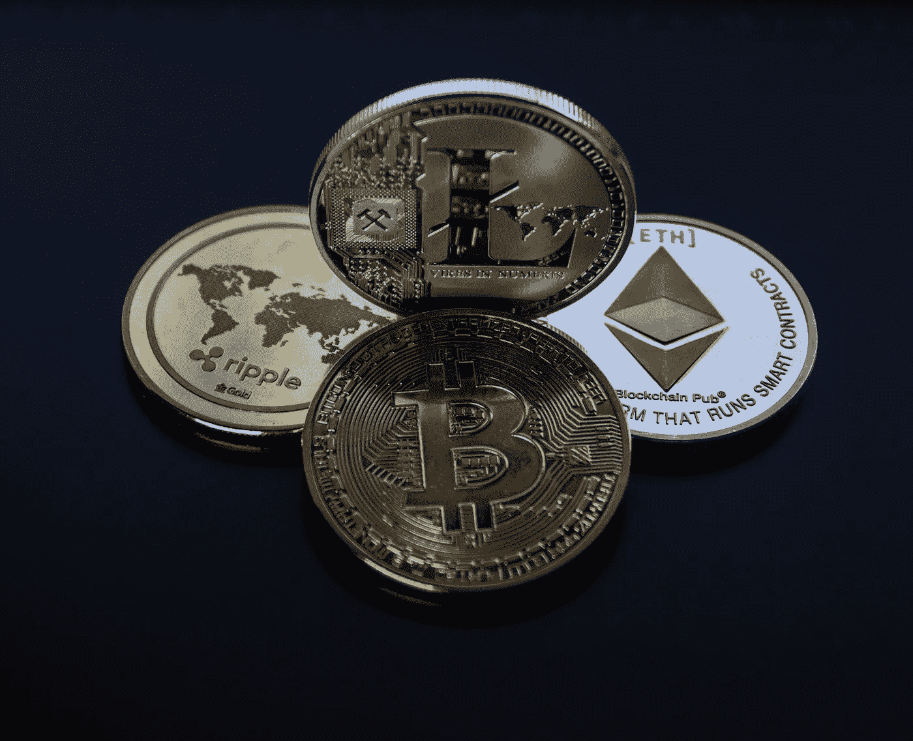
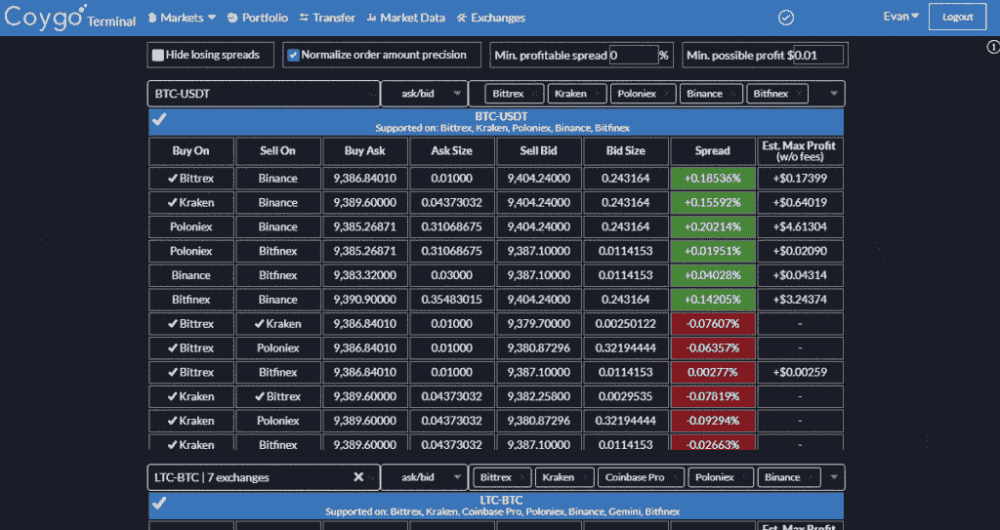

# 如何用加密套利赚钱

> 原文：<https://medium.com/coinmonks/how-to-make-money-with-crypto-arbitrage-3aa7393df777?source=collection_archive---------2----------------------->

如果你已经在加密货币领域工作了一段时间，你可能已经注意到不同加密货币市场和交易所之间的价格差异。即使是流动性最强的数字资产比特币，在不同的市场上也以不同的价格交易。此外，你可能会想到，这些差异提供了绝佳的套利机会。然而，它可能不像乍看起来那么简单。

让我们看看什么是加密套利以及它实际上是如何工作的。

# 什么是加密套利？

在许多方面，加密套利类似于菲亚特或体育套利。这里的主要思想很简单:试图从不同市场或交易所的相同资产的价格差异中获利。

如果你需要一个定义，Investopedia 将套利描述为*“同时买入和卖出一项资产以从价格失衡中获利。这是一种通过利用不同市场或不同形式的相同或类似金融工具的价格差异来获利的交易。”*

也就是说，低买高卖！

交易所的加密货币价差可能很大。它为商家提供了利用价格不一致的合法机会。

有三种不同的方式来执行加密套利:

**一)。常规套利**，是指在不同交易所买卖相同的数字资产，价格差异显著。

**两个)。三角套利**，涉及同一交易所三种货币之间的差价。尝试通过多次转换来利用价格差异。比如你用美元买 BTC，卖 BTC 给 ETH，ETH 再换回美元。

**3)。自动仲裁。一些公司专门为自动加密套利提供工具。例如，这一领域的领导者之一是 ArbiSmart，它提供了一种快速存款、选择计划和收获自动化套利交易好处的方法。**

尽管所有方法都是合法的，而且可能有利可图，但在交易所内部发现三角套利的机会可能会更加困难。相反，在同一个市场中的大量交易可以让你有资格获得有吸引力的费用折扣，这对你的利润有积极的影响。到目前为止，最简单的加密套利方法是使用第三方套利软件，但你需要特别注意你的服务提供商和他们的服务费用。

为了简单起见，我们将在下面使用涉及常规套利的例子。

# 为什么加密套利有利可图

有很多原因可以让你尝试加密套利，包括:

*   **速效**。如果一切按计划进行，这是一种增加资本的合理方式。同时，这都是关于速度的，所以你可以比普通交易赚得更快。
*   **广泛的机会。**有超过 200 家交易所可以买卖加密货币，这意味着大量有利可图的套利机会。
*   **加密货币市场仍然年轻且不稳定**。所以大部分交易所不共享信息，自己运营。大多数加密货币都会经历多次快速上涨和大幅下跌，导致价格差异和有利可图的套利机会。
*   与传统市场相比，竞争较少。并非所有的套利交易者都愿意给加密货币一个机会，这使得加密领域的竞争变得更加激烈。
*   **加密货币的价格差异往往在 3%到 5%之间，有时高达 30–50%(在极端情况下)。**

不言而喻，加密货币套利在大额交易时效果最佳。较小的数额可能会导致微不足道的收入，可能不值得你的时间。事实上，加密货币套利可能是一项非常有利可图的活动，但前提是你要做好研究、估计和计算。

# 如何计算加密套利的成本和收益

每个案例都有所不同，但通常您需要考虑以下费用:

1.  买方交易所(交易所 1)的庄家和庄家费用。
2.  交易费用(取款)(1)。
3.  卖出交易所(交易所 2)的保证金费用(如有)。
4.  卖出交易所的庄家和庄家费用(2)。
5.  最终取款或“托收”的费用(2)。

此外，您可能还需要考虑其他一些变量:

**市场波动。**有些货币比其他货币波动更大，其价格变化可能比预期更快。

**您所在司法管辖区的税收和法规。很容易忘记你必须为你的加密操作缴税。虽然不同领域的规则不同，但在计算套利成本和潜在利润时，你可能需要估计每笔交易需要缴纳多少税。**

***示例:*** 假设您看到了一个涉及菲亚特-to-crypto 对的机会。例如，比特币在 Bitstamp 上的交易价格为 3821 美元，但在 Bitfinex 上的售价为 4032 美元。交易所之间的差价是 211 美元。如果你有足够的资金购买 5 BTC，你可以赚到 1055 美元。如果您通过 SEPA 转账(大约需要 2 天)将资金存入 Bitstamp，您将产生 0%的存款费用(国际转账费用为 0.05%)。然后，您将支付大约。购买 5 台 BTC 的费用(0.25%)为 47.7625 美元(四舍五入为 50 美元)。幸运的是，Bitstamp 的取款也是免费的。

您的 BTC 存款通常需要 20 分钟到一个小时才能到达 Bitfinex 钱包。Bitfinex 上的加密货币存款也是免费的，所以这里没有额外的费用。假设在这一小时内，Bitfinex 上的 BTC 价格下跌了 5%(在最糟糕的情况下，它还可能上涨)，现在你可以仅以 4010 美元的价格出售它。它留给你 943 美元的潜在利润。最后，假设你向 Bitfinex 支付了 0.2% (0.01 BTC)的佣金来出售你的 5 BTC，这样你就剩下 20009 美元了。如果你扣除所有成本和费用，这留给你大约 895 美元的利润。

根据您的情况，您可以决定继续交易或提取资金，这取决于您的选择，将产生 0.1%至 3%的额外费用。此外，要意识到你的生意的税收后果。

总而言之，估计你将支付 3%到 15%的佣金是安全的；因此，你应该只进入最有利可图的机会。

# 如何选择交易所进行加密套利

一旦你决定利用加密套利，你应该评估并注册最有利的加密交易所。一些交易所，如 Bitfinex，要求你验证你的账户(大约需要 6-8 周)并最低存款 10，000 美元才能开始交易。其他人的方法不太严格，但是大多数人会要求您通过 KYC/反洗钱。

选择加密套利交易所时，最关键的变量是:

**速率**。交易费、存款费或取款费的高低会影响交易的成败。尽可能选择低费用的交易。

**地理。**某些交易所或其某些功能在您所在的地区可能会受到限制，因此请在交易前了解这一点。

**名声在外。**在存入资金之前，看看评论和其他人对某些平台的看法。行业内有很多黑幕和不规范的平台，玩得稳不如做得安。

**交易次数**。一些区块链允许快速交易，而另一些在高峰时段可能需要一个小时或更长时间。

**取款次数。有些交易所一天左右才进行一次人工提款，所以在你进入一个交易所之前，请注意并了解规则。**

**账户验证**。一些交易所可能不允许您在验证您的帐户之前提取资金或完全使用市场，这可能需要几天甚至几周的时间。

**市场流动性**。不是所有的交易所都有足够的流动性，尤其是当你打算买卖大量数字资产的时候。

**钱包维护。**大多数套利机会都是由于某些交易所的钱包维护而出现的，因此请确保您知道是否可以提取或存入您选择的加密资产。

# 逐步加密仲裁过程

一步一步的加密套利过程如下:

**1。发现机会。**

许多工具可以帮助你找到加密套利机会。

例如，在 Crypto news，我们提供了一个方便的价格追踪器，可以帮助您识别一些顶级交易所和加密货币之间的加密套利机会。

寻找套利机会的其他有用工具有:

*   coinapp
*   加密套利应用
*   Coinarbitrage.org
*   套利专家
*   Tokenspread.com

此外，你可以利用套利自动化程序(见最后一段)。

**2。决定这个机会是否值得。**

这是决定你是否要盈利的关键时刻。在你开始交易之前，尽可能多的计划是很重要的。你需要调查:

1.  估计费用:交易、转账、网络、存款或钱包费用。
2.  研究风险:取款和转账次数、市场波动、钱包维护以及任何有关外汇交易和取款的规则或前提条件。
3.  权衡一下你的收入中有多少要交税(如果有的话)。

一个好的策略是在发现套利机会之前，在多个交易所开立、验证和投资你的账户(包括法定账户和加密账户)。这会帮你在做交易的时候节省很多宝贵的时间。此外，有时，您可能希望避免交换机之间的 BTC 传输，因为众所周知，网络相对较慢且昂贵，但这只是在拥塞时才会出现问题。

在确定了交易和机会是否适合快速盈利的交易后，是时候执行或者寻找另一个黄金机会了。

# 仲裁自动化程序

除了人工套利交易，还有一些平台提供软件来帮助你发现机会并自动执行交易。他们使用机器人和脚本全天候扫描特定的交易所，并可以自行获利。当然，它们也会带来相应的风险，所以你必须小心不要玩那些你输不起的钱。

最好的自动化加密套利公司之一是 EU-监管的 ArbiSmart，它为投资者提供从€500 开始的不同计划。

几个在这个领域运营的有趣公司是 Arbitao、Haasonline Software、Gekko 和 Gimmer。

希望这篇指南已经教会了你什么是加密货币套利，以及如何去做。请记住，加密货币交易风险很大，你永远不要拿你输不起的钱去冒险。毕竟，是你必须为你的决定和研究负责。

> 加入 Coinmonks [电报频道](https://t.me/coincodecap)和 [Youtube 频道](https://www.youtube.com/c/coinmonks/videos)了解加密交易和投资

# 另外，阅读

*   [如何在 Uniswap 上交换加密？](https://coincodecap.com/swap-crypto-on-uniswap) | [A-Ads 审核](https://coincodecap.com/a-ads-review)
*   [WazirX vs coin dcx vs bit bns](/coinmonks/wazirx-vs-coindcx-vs-bitbns-149f4f19a2f1)|[block fi vs coin loan vs Nexo](/coinmonks/blockfi-vs-coinloan-vs-nexo-cb624635230d)
*   [本地比特币审核](/coinmonks/localbitcoins-review-6cc001c6ed56) | [加密货币储蓄账户](https://coincodecap.com/cryptocurrency-savings-accounts)
*   [什么是保证金交易](https://coincodecap.com/margin-trading) | [美元成本平均法](https://coincodecap.com/dca)
*   [支持卡审核](https://coincodecap.com/uphold-card-review) | [信任钱包 vs MetaMask](https://coincodecap.com/trust-wallet-vs-metamask)
*   [Exness 回顾](https://coincodecap.com/exness-review)|[moon xbt Vs bit get Vs Bingbon](https://coincodecap.com/bingbon-vs-bitget-vs-moonxbt)