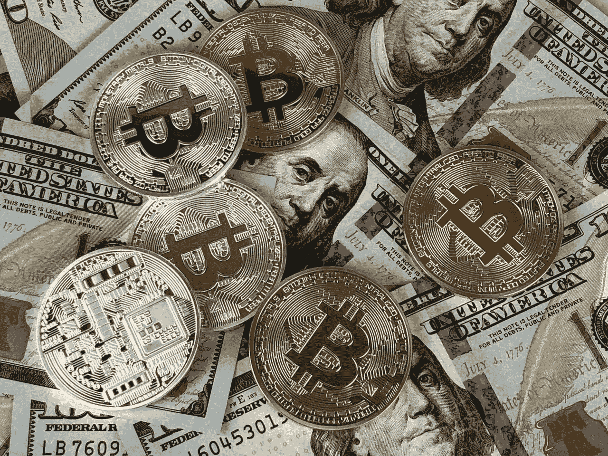

# 如何用加密货币赚钱？

> 原文：<https://medium.com/coinmonks/how-to-make-money-with-cryptocurrencies-191d013c008e?source=collection_archive---------44----------------------->

**什么是加密货币？**

加密货币是只以虚拟形式存在的数字货币。这是额外的钱。

加密货币的目的是让您能够直接向收款人进行在线支付，而无需使用传统的金融中介。这使得比特币和其他加密货币如此具有颠覆性:数字货币让你可以在网上做与实物货币完全一样的事情。

**1。价格上涨**

将我们的资源与可变收入资产相乘的最经典方式，就是比特币，是通过资产价格的正变化。

这种积极变化的发生是因为对该资产的需求大于供给，所以投资者将支付更多的钱来获得该资产。

例如，你可以以 10 万美元买入比特币，然后以 16.4 万美元卖出。在这里，你有 64%的投资收益。

**2。接收付款**

还记得我们提到过接受加密货币作为支付手段的可能性吗？好了，这是第三种用比特币挣钱的方式。

今天，一些公司已经接受比特币作为他们的产品或服务，如万事达卡、微软、Visa、PayPal 等。

不仅是外国公司，巴西也有一些机构接受这种加密货币

**3。交易**

交易加密货币是一种非常常见的活动。许多人利用数字货币的波动性，在短时间内赚取买卖差价。很多次，甚至是同一天。

这种类型的活动需要更有纪律和持续的市场监控，以及图形分析的最低限度的知识。如果没有这些先决条件，进入这个行业会让你面临很高的风险。

另外，一定要清楚交易费用，否则利润可能会被他们完全消耗掉。

**4。游戏**

那些喜欢在线游戏的人已经习惯了付费玩游戏，然而，随着区块链科技的发展，许多事情正在改变。

今天，可以通过玩来赚取加密货币。越来越复杂的虚拟游戏平台允许玩家相互交易，交易物品、地形、服装、头像、武器等等。这些是著名的 NFT——证明只存在于虚拟世界中的无形资产所有权的数字令牌。

这些 NFT 在虚拟现实游戏中具有巨大的价值，并以加密货币进行交易。当你通过游戏中的关卡时，你会获得资产，然后可以用这些资产换取数字货币。

你喜欢这篇文章吗？帮我复习。你将帮助我成长很多，我会在通知中注意到你的帮助，并得到非常。开心感谢:)

> 加入 Coinmonks [电报频道](https://t.me/coincodecap)和 [Youtube 频道](https://www.youtube.com/c/coinmonks/videos)了解加密交易和投资

# 另外，阅读

*   [Bookmap 点评](https://coincodecap.com/bookmap-review-2021-best-trading-software) | [美国 5 大最佳加密交易所](https://coincodecap.com/crypto-exchange-usa)
*   [如何在 FTX 交易所交易期货](https://coincodecap.com/ftx-futures-trading) | [OKEx vs 币安](https://coincodecap.com/okex-vs-binance)
*   [CoinLoan 审查](https://coincodecap.com/coinloan-review) | [YouHodler 审查](/coinmonks/youhodler-4-easy-ways-to-make-money-98969b9689f2) | [BlockFi 审查](https://coincodecap.com/blockfi-review)
*   XT.COM 评论[币安评论](https://coincodecap.com/profittradingapp-for-binance) |
*   [SmithBot 评论](https://coincodecap.com/smithbot-review) | [4 款最佳免费开源交易机器人](https://coincodecap.com/free-open-source-trading-bots)