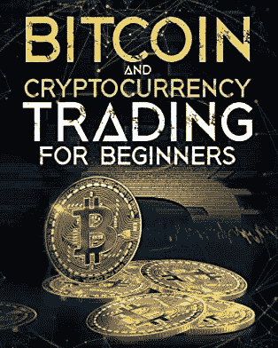

# 如何用加密货币赚钱

> 原文：<https://medium.com/coinmonks/how-to-make-money-with-cryptocurrency-6bd64e9b181c?source=collection_archive---------41----------------------->

*   经过几个月的努力和研究，你对加密货币的兴趣终于有了回报。是时候用加密货币赚钱了，但是不确定从哪里入手。如果你不小心，当你在有时复杂的加密货币交易世界中航行时，你可能会最终失去你辛苦赚来的投资，但有一些方法可以用加密货币赚钱，而不涉及风险投资。让这个指南帮助你学习如何用加密货币赚钱，这样你就可以避免这些错误，开始快速赚钱！

# 新手如何投资加密货币

作为一个初学者，可能很难理解如何开始用加密货币赚钱。幸运的是，有很多方法可以开始收集密码并增加你的投资。为了开始投资加密货币，你可以采取以下几个步骤。选择一个投资加密货币的平台非常简单——你所需要的只是在许多提供加密货币的不同交易所中的一个交易所拥有一个账户，如 Coin base、Gemini 或北海巨妖。一旦你有了一个账户，设置好你的支付方式(信用卡或银行账户)并从你的支票或储蓄账户中转出一些钱，这样当投资的时候你就准备好了。你也可以通过数字钱包投资加密货币，它以数字方式存储你的所有信息，而不是像纸质钱包那样有物理记录。你应该选择最适合你的平台；在决定哪一个适合你之前，一定要研究它们。选择你的密码在选择投资地点后的下一步是选择你想投资的货币。目前有数百种加密货币可用，还有数千种即将推出。对于初学者，建议他们选择高市值(每枚硬币的总价值)、低价格波动和低交易费用的硬币，因为这些硬币很可能会成为广泛采用的货币。这三个因素将有助于确保今天投资加密货币不会给你留下遗憾

# 面向初学者的加密货币视频

比特币之类的加密货币很复杂。我从 2017 年年中开始密切关注他们，甚至我还没有完全了解他们的一切。学习曲线很陡，尤其是当你从零开始的时候。如果你是初学者，试试我们为初学者提供的五个加密货币视频列表，以帮助你入门。这些解释者将为您提供坚实的基础，并帮助您快速了解加密货币。祝你好运！如果您需要更多指导，请查看每个视频末尾的其他资源。当我们发现值得分享的新内容时，我们会继续更新。

*   [区块链技术基础介绍&加密货币](https://www.blogger.com/#) — Andreas Antonopoulos
*   [区块链如何工作——加密货币事实](https://www.blogger.com/#)
*   [如何购买你的第一个比特币或以太坊](https://www.blogger.com/#)
*   [以太坊入门——电脑爱好者](https://www.blogger.com/#)
*   什么是区块链？—初学者的循序渐进指南
*   [什么是挖矿？TechCrunch 解释](https://www.blogger.com/#)

> 加入 Coinmonks [电报频道](https://t.me/coincodecap)和 [Youtube 频道](https://www.youtube.com/c/coinmonks/videos)了解加密交易和投资

# 交易加密货币并获利

如果你想通过交易加密货币赚钱，有几种方法可以实现。你可以在一个交易所买卖不同的硬币，但如果你想最大化你的利润，那就更难了。如果你只是想赚一两个快钱，那么投资这些货币可能不是一个坏主意。然而，如果你正在考虑对加密货币进行长期投资，如果你学会如何交易，从长远来看可能会有更好的回报。有大量的交流和几个指南告诉我们如何去做。我建议从比特币基地开始，因为他们有最大的加密货币选择。一旦你习惯了购买和出售加密货币，尝试进入日交易加密。日内交易就是在短时间内尽可能低的买入货币，尽可能高的卖出。然而，持有加密货币的时间越长，通常意味着利润潜力越大。你想承担多大的风险取决于你自己——特别是因为与美元或欧元等传统货币相比，加密货币仍然相对较新。请记住:尽管加密货币近年来越来越受欢迎，但与其他货币相比，它仍然非常不稳定；不要投资超过你愿意失去的东西！

# 低买高卖

如果你想投资加密货币，有很多策略可以帮你赚钱。最简单可靠的方法就是低买高卖，不需要太多技巧和策略。只要确保你经常这样做，这样你就不会因为过早买进和过晚卖出而赔钱。你也可以尝试通过买入一种货币(如比特币)卖出另一种货币(如以太坊)来进行加密货币的日内交易。如果你学会了如何正确出牌，你就有可能在很短的时间内赚很多钱——甚至有可能比一些人一年的收入还要多。例如，如果你买了价值 100 美元的比特币，五天后以 110 美元的价格卖出，你就赚了 10 美元。十多天，这相当于 100 美元的利润——比许多人一个月赚的还多！当然，加密货币并非没有风险。总有可能会发生一些不好的事情，导致价值一夜之间暴跌；然而，如果你在出售你的股份之前小心你投资了多少钱以及何时/多久持有它，那么投资加密货币可能是一个非常有利可图的投资机会。也就是说:不要把任何钱投资到你不愿意完全失去的加密货币中。

# 不赌博，投资！

加密货币的价格波动很大，因此并不适合所有投资者。加密货币的交易不受任何欧盟监管框架的监管。所以请记住，你的资本处于风险之中。投资加密货币时，你应该意识到可能存在的风险。在投资加密货币之前，你需要检查它们的价值有什么保证，以及它们是否受到金融机构的监管。由于虚拟货币极其不稳定，投资虚拟货币面临着高风险。在此基础上作出的任何投资决策都纯粹是基于投资者对其财务状况、投资目标和风险态度的个人评估和判断。过去的表现不能保证未来的结果。投资加密货币可能会导致金钱损失。此处提供的信息无意作为投资或财务建议的要约或邀约。在做出任何决定之前，如果您对自己的财务、投资或其他财务事项有任何疑问或担忧，您应该寻求独立的建议。永远不要投资超过你能承受的损失，永远记住过去的表现并不能保证未来的回报。如果你认为投资加密货币可能适合你，在做任何决定之前先和专家谈谈！安全总比后悔好！这份文件没有考虑到你的特殊投资目标，财务状况或需求。成为密码百万富翁的可靠途径

# 成为密码百万富翁的可靠途径

自 2010 年以来，我一直是一名加密货币投资者，当时我买了我的第一枚比特币。从那以后，[我又做了几笔交易](https://www.digistore24.com/redir/348520/zaidsunny/)，学到了更多关于购买、出售和交易加密货币的知识——但投资加密货币并不总是一帆风顺。当你投资加密货币时，有很多因素会影响你的成败。有一点是肯定的:随之而来的是更大的波动性——以及更高的回报(和风险)。2013 年，我在 Mt. Gox(现在已经不存在了)上的一次闪电崩盘，让我损失了 20%的投资。仅在 2017-2018 年，就有几个早期采用者在比特币崩溃时损失金钱的例子。更多信息[点击这里](https://www.digistore24.com/redir/348520/zaidsunny/)！