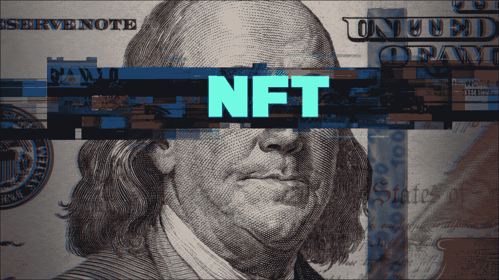

# 2022 年如何用 NFT 赚钱

> 原文：<https://medium.com/coinmonks/how-to-make-money-with-nft-in-2022-63e8f7f05ba9?source=collection_archive---------5----------------------->

**How to Make Money with NFT**

所以，你听说过 NFT 和他们如何帮助一些人赚钱。NFT 是最近冲击主流的加密热潮。如果你是开发数字内容的投资者或小企业，掌握使用 NFTs 赚钱的技术是有意义的。

正如我们每天听到的那样，人们正在赚数百万美元。随着这些信息在媒体上的传播，随着越来越多的人加入，NFT 的受欢迎程度激增也就不足为奇了。

理解 NFT 是用它们赚钱的第一步。我们会给你一个快速的 NFT 概述，并告诉你如何通过销售它们来获利。让我们从什么是 NFT 的例子开始。

## 推荐:[2022 年最佳 5 个元宇宙加密币好项目—榜单 1](/@s.hanz/best-5-metaverse-crypto-coins-with-good-projects-in-2022-list-1-687fedbe668e)

## 什么是 NFT？

不可替换的令牌是“加密令牌”。它们被用于现实世界的商品，如艺术品、音乐，甚至房地产。NFT 与此不同，它们不能像加密硬币一样出售或交易。

NFT 在无限开放的资产中建立了稀缺性。通常，它们用于买卖数字商品，如艺术品、视频游戏皮肤、推文和虚拟房地产。

到目前为止，NFT 的销售额已达数十亿，这表明 2022 年将是增长的一年。你可以通过不同的方式用 NFT 赚取现金。第一种选择是以 NFT 的名义推销你的独特作品。

## 推荐:[2022 年 7 个最佳赌注币](/@s.hanz/7-best-staking-coins-in-2022-70dbc31adcae)

## 如何销售 NFT？

NFT 通常在市场上出售，基于平台的各种流程如 [**币安 NFT 市场**](https://accounts.binance.com/en/register?ref=26723737) 和 **Opensea.io** 。基本上，你会把你的东西发布到市场上，转换成 NFT，然后等待出售。这很像亚马逊、Ebay 甚至 Etsy。如果您已经拥有拥有版权的数字内容，请遵循以下不同的步骤:

## 1.选择您最喜欢的市场，铸造您的产品，并连接您的 Metamask 钱包。

有很多不错的市场可供选择。OpenSea、 [**、币安**](https://accounts.binance.com/en/register?ref=26723737) 、SuperRare、Rare 都在其中。看看这些市场，选择一个适合你的需求。

之后，你需要“铸造”NFT。简而言之，铸造 NFT 是将数字文件转化为加密收藏品或以太坊区块链上的数字资产的过程。虽然这看起来很复杂，但大多数(如果不是全部的话)市场会提供一步一步的指导，让你在他们的平台上直接创造 NFT。

在你选择了一个市场后，你需要将你的 cryptos 钱包链接到它。然后，在你选择的市场上，上传你的数码产品，关注其他的，因为每个平台都有自己的程序设置。

# *创作 NFT 艺术的推荐艺术家:*

[**达米安 3d5 是 NFT 顶级艺人**](https://go.fiverr.com/visit/?bta=182994&brand=fiverrcpa&utm_campaign=friday110222&landingPage=https%3A%2F%2Fwww.fiverr.com%2Fdamian3d5%2Fdo-unique-nft-art-collection-with-100-1k-10k-attributes%3F) ，与 **ESET** “互联网软件&服务”**萨巴顿**等大牌合作。他提供 100，1K 和 10K NFT 的收藏。

[**Damian3d5’s work**](https://go.fiverr.com/visit/?bta=182994&brand=fiverrhybrid&utm_campaign=friday110222&landingPage=https%3A%2F%2Fwww.fiverr.com%2Fdamian3d5%2Fdo-unique-nft-art-collection-with-100-1k-10k-attributes%3F)

## 2.出售 NFT

在填写完所有要求的信息并上传和铸造后，是时候设置您的数码产品进行销售了。你会发现，在你列出“汽油费”之后，市场会对其进行估算。这是 ETH 网络的交易费用。根据网络的繁忙程度，这个数量会有所不同。根据市场情况，降低价格的最佳策略是在非高峰时间发布你的产品。

## 我可以交易 NFT 吗？

你当然可以。这是从 NFTs 中获利的第二种方法。设计师卖 NFT 不是简单的。一些商人把非功能性交易当成商品，买卖它们来赚取现金。如果你目前拥有一个 NFT 收藏，但不再需要它，你可以很容易地卖掉它，就像你自己做的一样。在这种情况下，铸造过程是你唯一要跳过的步骤。

说到通过 NFT 赚钱，知道什么时候卖出是至关重要的。什么时候出售你的 NFT 最有利可图？它依赖于你的数字艺术背后的故事，你为什么购买它，以及它是否有任何其他利润。

你还需要考虑选择的价格。在估算你的潜在收益和损失时，包括其他费用，如汽油费、上市费和支付给最初所有者的版税。这些费用最终会减少你的税后收入。

你可能想要见一位更高级的 NFT 交易专家，这需要对加密货币领域有深入的了解。NFT 还是比较新鲜的，你可以利用自由职业者平台找人(专业人士)辅助你。[**我** **推荐这个聚集了最有经验的 NFT 艺人的平台**](http://www.fiverr.com/s2/3bd189b6e3) ，这样你就可以专注于营销，而不用担心技术上的东西。

# 🌟[创建一个币安帐户，在 USDT 赢取 100 美元奖金](https://www.binance.com/en/activity/referral/offers/claim?ref=CPA_00M6XWFUN3)🌟

**🌟** [**Create a Binance account and get 100$ Bonus in USDT**](https://www.binance.com/en/activity/referral/offers/claim?ref=CPA_00M6XWFUN3)**🌟**

# 🌟我有一个伟大的奖金给你:100 美元在币安注册后🌟

[**一旦您通过此链接**](https://www.binance.com/en/activity/referral/offers/claim?ref=CPA_00M6XWFUN3) 创建了您的币安，存款超过 50 美元，然后在到期前兑换您的 100 USDT 优惠券。

# 推荐创造 NFT 艺术的艺术家:

[**Pwaperpro 是一位顶级的数字艺术家**](https://go.fiverr.com/visit/?bta=182994&brand=fiverrcpa&utm_campaign=friday110222&landingPage=https%3A%2F%2Fwww.fiverr.com%2Fpwaperpro%2Fdraw-and-generate-nft-art-collection%3F) ，他绘制并生成 nft 艺术收藏，拥有几个大客户，如 **MONIN、Remezcla、Mello** 和 **Deutsche Telekom。你也可以考虑这个选择。**

[**Pwaperpro’s work**](https://go.fiverr.com/visit/?bta=182994&brand=fiverrhybrid&utm_campaign=friday110222&landingPage=https%3A%2F%2Fwww.fiverr.com%2Fpwaperpro%2Fdraw-and-generate-nft-art-collection%3F)

## NFTs 的未来如何？

区块链的未来令人怀疑。专家预测，NFT 将继续存在，并将继续扩展到艺术和游戏领域之外，特别是如果富有的投资者继续投资的话。

这些功能可以代表所有权的证明，给予社会地位，授予独家访问权，控制许可，并验证真实性，也有助于 NFT 的增长。它赋予你拥有自己产品的权利，就像 Btc 允许你成为自己的银行经理一样。

## 推荐:[2022 年元宇宙最佳 5 个好项目加密币——榜单二](/@s.hanz/best-5-metaverse-crypto-coins-with-good-projects-in-2022-list-2-15af2f8f01d9)

## 简而言之…

需要记住的是，虽然销售 NFT 看起来很简单，但事实并非总是如此。当你铸造你的内容并出售时，你将面临以太坊波动值关于“汽油费”，这可能是相当重要的，取决于你出售它的时间。请注意，这个新行业的波动性使其具有风险。

利用 NFT 赚钱的理想技术取决于个人。如果你或你的公司有多余的现金，你可以把它投资在一个会随着时间增值的项目上，然后在它升值的时候卖掉它。如果你是一个内容创作者，你最好的选择是把 NFT 作为增加收入的一种方式。

## 请关注并订阅，并确保分享我的工作作为一个激励的姿态。点击这里查看我所有的文章:[https://medium.com/@s.hanz](/@s.hanz)

> 加入 Coinmonks [电报频道](https://t.me/coincodecap)和 [Youtube 频道](https://www.youtube.com/c/coinmonks/videos)了解加密交易和投资

## 也阅读

 [## Bitsgap 评论-交易机器人加密信号和套利 2022

### 这篇文章的重点是 Bitsgap 审查，这是一个最终的交易解决方案，并提供交易机器人，信号…

coincodecap.com](https://coincodecap.com/bitsgap-review)  [## 40 个最佳电报频道，用于加密、电影、表演和演讲| CoinCodeCap

### 免费下载所有电影。德国免费加密信号。下载讲座。CoinCodeCap 经典，网飞电影等。是……

coincodecap.com](https://coincodecap.com/best-telegram-channels)  [## Keevo 钱包点评:是最安全的硬件钱包吗？2022 | CoinCodeCap

### 在这篇 Keevo Wallet 评论中，我们将讨论他们如何改变我们看待硬件钱包的方式。基沃是…

coincodecap.com](https://coincodecap.com/keevo-wallet-review)  [## 2022 年 5 大最佳社交交易平台

### 5 个最佳社交交易平台阅读加密产品评论和比较，了解比特币交易和…

coincodecap.com](https://coincodecap.com/best-social-trading-platforms)  [## BlockFi 评论:2022 年的利弊和利率

### 今天，我们提出了一个全面的 BlockFi 评论，这是一个成立于 2017 年的加密贷款平台，拥有其…

coincodecap.com](https://coincodecap.com/blockfi-review)  [## 如何在印度购买比特币？2021 年购买比特币的 7 款最佳应用[手机版]

### 如何使用移动应用程序购买比特币印度

medium.com](/coinmonks/buy-bitcoin-in-india-feb50ddfef94)  [## 加密税务软件——五大最佳比特币税务计算器[2021]

### 不管你是刚接触加密还是已经在这个领域呆了一段时间，你都需要交税。

medium.com](/coinmonks/best-crypto-tax-tool-for-my-money-72d4b430816b)  [## 9 个 2022 年最值得购买的密码| CoinCodeCap

### 9 个 2022 年最值得购买的加密产品阅读加密产品评论和比较，了解比特币交易和…

coincodecap.com](https://coincodecap.com/crypto-to-buy-in-2022)  [## 存储比特币的最佳加密硬件钱包 2022 | CoinCodeCap

### 硬件钱包是我们存储加密资产的唯一可靠选择。在本文中，我们将讨论 8 个…

coincodecap.com](https://coincodecap.com/best-hardware-wallet-bitcoin)  [## Pionex 评论 2021 |免费加密交易机器人和交换

### Pionex 是为交易自动化提供工具的后起之秀。Pionex 上提供了 9 个加密交易机器人…

medium.com](/coinmonks/pionex-review-exchange-with-crypto-trading-bot-1e459d0191ea)  [## 2022 年密码交易员的三大电报渠道

### 加密信号是来自专业交易者的交易想法，以特定的价格或价格买卖特定的加密货币

medium.com](/coinmonks/top-3-telegram-channels-for-crypto-traders-in-2021-8385f4411ff4)  [## 2022 年 5 个最佳免费加密投资组合追踪器

### 在这篇文章中，我们将带你通过一些最好的免费加密投资组合追踪器，让你选择最好的…

coincodecap.com](https://coincodecap.com/free-crypto-portfolio-trackers)