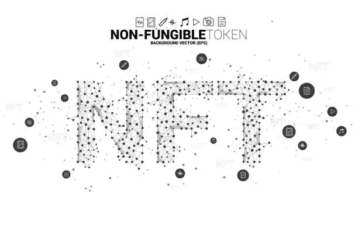
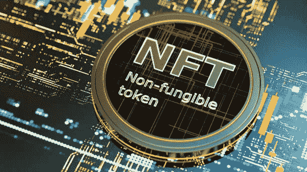
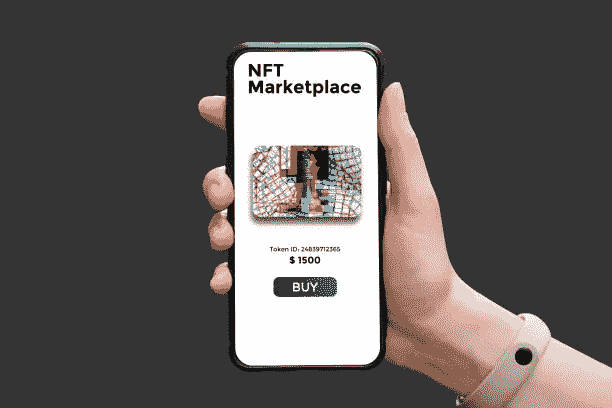
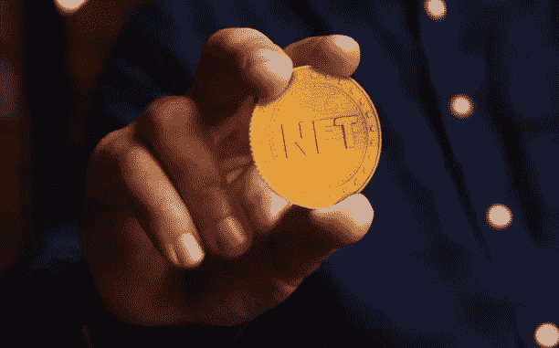

# 如何在 2022 年用 NFT 赚钱，NFTs 的前景如何？

> 原文：<https://medium.com/coinmonks/how-to-make-money-with-nft-in-2022-and-what-is-the-future-of-nfts-a456070f048?source=collection_archive---------21----------------------->

不可替代代币(NFT)市场大幅增长，非替代代币总支出达到 126 亿美元，高于年初的 1.624 亿美元，预计 2022 年将进一步增长。从个人到知名企业，每个人都在谈论创办自己的 NFT。但并不是所有的 NFT 都是相等的；有些非常珍贵，有些则一文不值。

高昂的天然气费用可能会导致无法使用以太坊来生产、购买或出售绝大多数的 NFT。大多数投资者和开发商会试图在二级市场上转售他们的 NFT 以获取利润来弥补这些成本。然而，除了以比你支付或创造的价格高得多的价格出售，似乎还有其他方法可以从非森林交易中获利。通过阅读这篇文章，了解如何在 2022 年用 NFTs 赚钱。

# 什么是 NFT？

对于那些不熟悉的人来说，NFT 代表“不可替代的令牌”，这意味着有一个独特的和不可重复的数字令牌记录在一个数字账本上，它似乎采用区块链技术来构建隐藏在这些古怪的艺术品中的所有权证明。NFT 是具有货币价值的数字收藏品，类似于实际的艺术品

NFT 在许多方面类似于比特币和以太坊等数字货币。术语“不可替代”是指 NFT 是独一无二的，不能与任何其他 NFT 互换。文件中的数据超越了货币范畴，进入了一切领域。

照片、艺术、电影、音乐、推文甚至模因，所有这些都可以很容易地以数字方式复制，但可以作为非功能性副本(NFT)保存，以识别原始副本。任何可以数字化保存的具有货币价值的独特项目都可以用于创建 NFT。唯一的区别是，你支付的是一个数字文件和证明你拥有一个原始副本，而不是一个有形的物体，如艺术品或老式动作玩偶。

# 创建 NFT 需要哪些步骤？

借助在线资源，毫无困难地创建一个 NFT 是可能的。NFT 是在特定的区块链上创建和支持的，以太坊 NFT 是最流行的一个。为了他们的发展,“心流”、“币安”和“以太坊”经常被使用。要进行交易，你需要一个以太坊钱包和某种形式的加密货币。使用智能合约，可以在区块链上记录将 NFT 销售为法定货币或加密货币的情况。

# 如何在 2022 年利用 NFT 赚钱

如果你曾经想知道人们是如何利用 NFTs 谋生的，你会很欣慰地发现有几种可能性。看看这些屡试不爽的策略。

# 1.时尚 NFTs 收入

艺术品可以防止赝品，同样，NFT 也可以解决真实性的问题。越来越多的服装和时尚品牌利用 NFT 潮流，根据标志性名人或设计签名制作数字限量版。时装和服装公司建立 NFT 服装和配饰市场可能有利于 NFT 的发展。人们可以在安全无虞的环境中用 NFTs 无限赚钱。

# 2.非正规学校的租金

在一些纸牌交易游戏中，可以借用 NFT 牌来增加获胜的机会。产生被动收入的一个方法是出租你的非功能性书店，尤其是最受欢迎的。所涉及的双方之间的协议的参数由智能合约管理。因此，客户可以选择租赁协议的期限和他们为 NFT 租赁支付的费用。

这是一个极好的例子，一个出租或出借非正规金融工具的平台。利用这一点，贷款人可以设定最大借款期限和日利率，目前范围从 0.002 WETH 到 2 WETH。

# 3.从 NFT 版税中获利

多亏了 NFT 技术，NFT 的创造者可以设定条件，每当他们的非专利技术在二级市场上出售时，就强制收取版税，允许他们这样做。换句话说，把作品卖给收藏家的艺术家可以从出售作品中获利。

值得注意的是，作者在创建 NFT 时通常会指定所有这些预定义的百分比。自动执行的软件程序被称为“智能合同”，用于执行商业协议和管理版税的分配。你不必担心版税支付或强制执行你作为创作者的条件，因为这个过程是自动化的。

# 4.NFT 立桩

标记 NFTs 的能力是 NFTs 和 DeFi 协议之间链接的优点之一。如果你想开始从你的 DeFi 框架智能合同中赚钱，你必须把你的数字材料押上或者“锁起来”。

一些平台允许您使用任何 NFT，而其他平台则要求您支付原生 NFTs 以获得赌注代币奖励。

# 5.通过提供流动性来赚取 NFT

NFTs 和 DeFi 基础设施目前正在整合，这使得提供流动性并以 NFTs 作为交换来建立您在特定流动性池中的存在成为可能。

例如，在 Uniswap V3 上，自动做市商(AMM)将发行一个 ERC-721 令牌，通常称为 LP-NFT，以反映每当您提供流动性时您在池中锁定的总额中的份额。NFT 刻有您插入的令牌对、令牌符号和池的地址。卖出这种 NFT 可以让你立即从流动性池中抽身。

# NFTs 的未来

加密货币市场的一个新时尚似乎是不可替代的代币。NFT 技术有多种用途，但它的全部潜力直到最近才被发掘出来。

随着越来越多的个人和组织同意加入不可替代的代币生态系统，NFT 淘金热似乎才刚刚开始。即使是最著名的 NFT 仍然是简单的照片。市场仍然被低估；在完全使用最新技术的复杂的不可替代代币变得越来越受欢迎之前，NFT 的受欢迎程度可能不会真正爆发。

但是请记住，NFTs 和底层智能合约技术才刚刚开始成形。因此，毫不奇怪，这里描述的许多应用程序仍处于起步阶段。因此，在将上述任何建议付诸行动之前，确保你已经做了功课，并了解风险。

> *加入 Coinmonks* [*电报频道*](https://t.me/coincodecap) *和* [*Youtube 频道*](https://www.youtube.com/c/coinmonks/videos) *了解加密交易和投资*

# 另外，阅读

*   [Bookmap 评论](https://coincodecap.com/bookmap-review-2021-best-trading-software) | [美国 5 大最佳加密交易所](https://coincodecap.com/crypto-exchange-usa)
*   最佳加密[硬件钱包](/coinmonks/hardware-wallets-dfa1211730c6) | [Bitbns 评论](/coinmonks/bitbns-review-38256a07e161)
*   [新加坡十大最佳加密交易所](https://coincodecap.com/crypto-exchange-in-singapore) | [购买 AXS](https://coincodecap.com/buy-axs-token)
*   [红狗赌场评论](https://coincodecap.com/red-dog-casino-review) | [Swyftx 评论](https://coincodecap.com/swyftx-review) | [CoinGate 评论](https://coincodecap.com/coingate-review)
*   [投资印度的最佳密码](https://coincodecap.com/best-crypto-to-invest-in-india-in-2021)|[WazirX P2P](https://coincodecap.com/wazirx-p2p)|[Hi Dollar Review](https://coincodecap.com/hi-dollar-review)