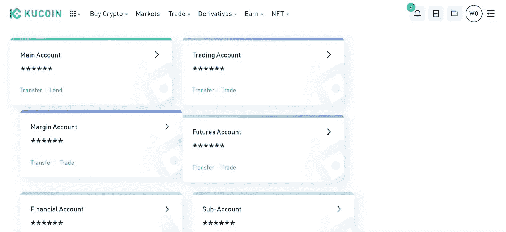
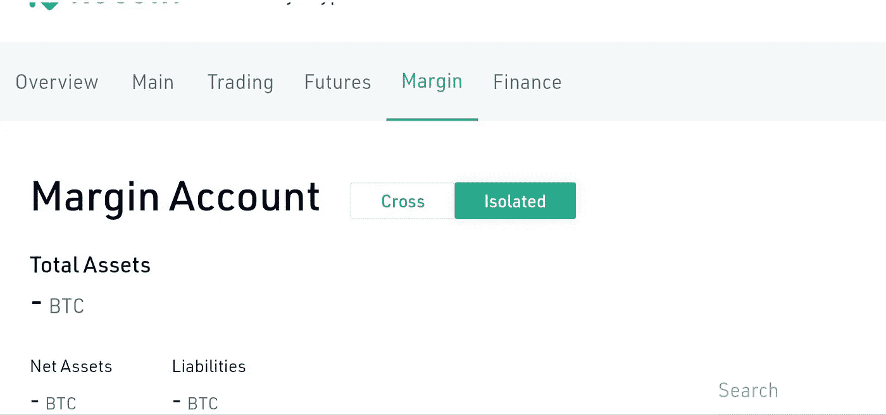

# 如何用很少的投资赚更多的钱？

> 原文：<https://medium.com/coinmonks/how-to-make-more-money-trading-with-little-investments-5da1fd0b4825?source=collection_archive---------17----------------------->

OL 男孩！$GMT 不断打破历史新高，我甚至没有从中获得足够的利润，你呢？

嗯，低资本或有限的资金对新手和老手来说都是一个障碍，所以我们能做些什么呢？如果我告诉你，你可以用比你实际支付能力多 5 倍的资金进行交易，你会怎么样？

你可能听说过现货和期货交易，甚至对它很熟悉，你可能听说过许多关于从期货交易中获得巨额利润的故事，以及更多关于人们在期货交易中获得回报并失去所有资金的故事。当现货交易时，你永远不会真正失去所有的资金，因为资产的价格不可能达到绝对的零，除非它变得崎岖不平，同时，你在现货市场交易中获得的利润没有你在期货交易中获得的那么多。

这就是保证金交易的由来。什么是保证金交易？

保证金交易是一种交易系统，允许交易者借入更多的资金，使他们能够执行更高的交易量，这通常是他们可用的资金所不可能的。借入这些资金需要一定数额的保证金作为抵押。除了增加你的资金，希望进入新头寸但缺少 USDT 的交易者可以将他的任何加密资产存入保证金账户，作为借入 USDT 的抵押品，而不是为 USDT 出售资产。

保证金交易在许多方面类似于现货交易，但也带来了更大的利润，因为借入资金促进了更高的交易量。

听起来很酷，对吧？关于保证金交易你还应该知道什么？

*   保证金交易让你能够在几乎没有抵押品的情况下进入大于你账户余额的头寸。
*   保证金交易比传统交易有更大的利润潜力，但也有更大的风险。
*   保证金利率通常低于信用卡和个人贷款利率。
*   保证金也可以用来以短期贷款的形式从账户中提取现金。
*   就像期货交易一样，你也可以在保证金交易中做空或做多一项资产。

KuCoin 向所有地区的所有用户提供保证金交易，一般保证金估价指标适用于所有账户，无论其在哪个地区。KuCoin 上有两(2)个保证金交易系统；

*   孤立边缘；为 200 多项独立资产提供高达 10 倍的杠杆作用。在单独保证金中开立的头寸不影响其他保证金头寸的结果，也不受其影响。
*   交叉保证金；为交易者提供高达 5 倍的杠杆，并有机会使用不同的资产作为其头寸的抵押品。与单独保证金不同，交叉保证金中的负债比率受可用资产的影响，并影响交叉保证金中的所有未平仓头寸。

如何在 KUCOIN 上开始交易保证金？

*   当你决定在哪个资产上赚取双倍利润时，下一步你需要在交叉利润或单独利润之间做出选择。

虽然交叉保证金仅提供 5 倍的杠杆作用，但它也让用户有机会使用不同的资产类型作为抵押品，并在不同的资产上建立头寸。交叉保证金账户的负债比率受其中所有资产的组合比率的影响，因此如果清算由 1 项资产触发，交叉保证金账户中的所有资产都将被清算。

另一方面，隔离保证金可以让你在不同的资产上建立独立的头寸。你可以在 BTC-USDT 头寸上上涨 50%,在 XRP 头寸上下跌 20 %, BTC 头寸的 PnL 不会受到表现不佳的 XRP 头寸的影响。

*   保证金交易的一个重要方面是你的负债比率，负债比率反映了未平仓头寸的负债比例。负债比率=(保证金借款+应计利息)/保证金账户总资产。例如，如果你在一个独立的保证金账户中存入 100 美元，你将能够借入 900 美元进行交易。就交叉保证金而言，100 美元的存款将为您带来 400 美元的额外资金。

[在 KUCOIN 保证金上交易比特币](https://www.kucoin.com/trade/BTC-USDT)

这里有一张 kucoin 上保证金交易的图片指南

transfer asset to be used as collateral to margin account

登录后，在资产页面上，您可以将资金转移到您希望交易的对的交叉保证金帐户或独立保证金帐户。

接下来，牢记负债比率，借入你可以在交易中妥善管理的资金

borrow fund to your margin account and you are all set.

其余的类似于现货交易，因为借入的资金现在将出现在你的保证金交易账户中，你可以开始交易了。在交易并获利后，您应该在规定的时间内平仓并偿还借入的资产。在 kucoin 上的保证金借贷可以延长到 28 天期限。关于借款和还款的更多信息，请参见[这里](https://docs.google.com/document/d/1DvsoZmlDBjPn4hUdqlaCni9u7YiWlT1V7v57O9vhiM0/edit)

始终适当地控制和管理你的风险是很重要的，因为负债率达到 97%将触发清算，你将失去保证金账户中的所有资产。

为了避免清算，总是努力通过偿还借入的资产或增加更多的抵押品来支持保证金来减少头寸规模。

kucoin 向新老用户提供保证金奖金以及其他与保证金相关的优惠券和赠品，以测试他们的保证金交易能力，并在没有额外成本的情况下赚取实际利润。

如果你还没有账户，你可以注册[开始交易](https://www.kucoin.com/r/rf/r395ZQJ)。

为什么是 KuCoin？

KuCoin 是世界上排名第一的 alt coin 交易所，提供各种各样的资产可供选择；600 多项顶级性能资产。Kucoin 通常被称为人民交易所，在全球最佳加密交易所中排名前五，为所有类别的投资者提供服务，Kucoin 目前拥有加密爱好者最佳交易所的称号。如果你是一个爱好者，这是一列你想跳上的火车。通过简单、安全和直接的方式购买密码，包括但不限于:sepa、信用卡/借记卡、paypal、本地银行转账、visa/mastercard 和超过 26 种以上的选项。但这还不是全部，KuCOIN 为用户提供了多种方式，通过赌博和贷款从闲置资产中获得被动收入。你可以在 kucoin 保证金交易中获得巨额利润。

> 加入 Coinmonks [电报频道](https://t.me/coincodecap)和 [Youtube 频道](https://www.youtube.com/c/coinmonks/videos)了解加密交易和投资

# 另外，阅读

*   [如何在 FTX 交易所交易期货](https://coincodecap.com/ftx-futures-trading) | [OKEx vs 币安](https://coincodecap.com/okex-vs-binance)
*   [CoinLoan 评论](https://coincodecap.com/coinloan-review) | [YouHodler 评论](/coinmonks/youhodler-4-easy-ways-to-make-money-98969b9689f2) | [BlockFi 评论](https://coincodecap.com/blockfi-review)
*   [XT.COM 评论](https://coincodecap.com/profittradingapp-for-binance)币安评论 |
*   [SmithBot 评论](https://coincodecap.com/smithbot-review) | [4 款最佳免费开源交易机器人](https://coincodecap.com/free-open-source-trading-bots)
*   [比特币基地僵尸程序](/coinmonks/coinbase-bots-ac6359e897f3) | [AscendEX 审查](/coinmonks/ascendex-review-53e829cf75fa) | [OKEx 交易僵尸程序](/coinmonks/okex-trading-bots-234920f61e60)