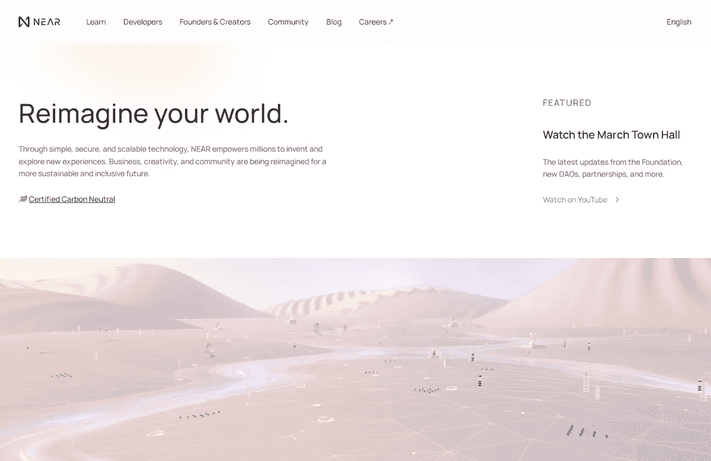
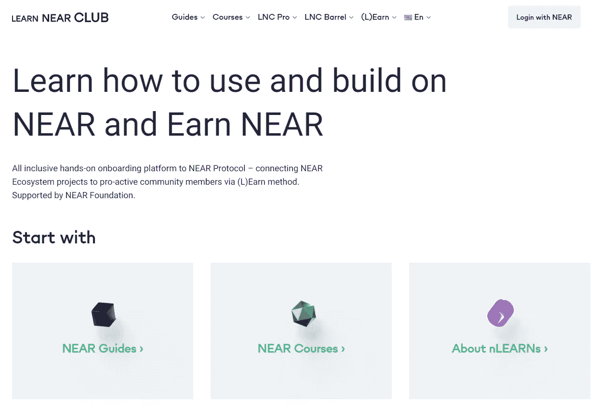

# 如何在 NEAR 协议上用不到 4 美元赚到超过 1000 美元？

> 原文：<https://medium.com/coinmonks/how-to-make-more-than-1000-usd-with-only-below-4-usd-on-the-near-protocol-8ebdec24a29c?source=collection_archive---------3----------------------->

假设你正在寻找一个赚钱的机会，并且仍然拥有知识。这个职位对你来说是一个极好的机会。我认识许多人，他们可以通过这个项目获得超过 3000 美元的奖金和证书。那么他们是怎么做到的呢？下面来看看这个帖子吧！

# 什么是近协议？

Near.org

在进入正题之前，我们要知道“协议附近的[是什么？”Near 协议是区块链第 1 层，它使用分片和公共利益证明(POS)。通过这些协议，我们有望成为扩展和创造多链未来的解决方案。](https://near.org/)

特别是，NEAR 正在清除 Web 3 应用的障碍。NEAR 的区块链正准备以高速度、低成本和渐进的用户体验进行快速扩张。此外，NEAR 还与以太坊、Polkadot、Cosmos 等协同运行，允许网络之间的资产和通信自由流动。因为这个项目的潜力，风投已经在 Near Protocol 上投资了超过 10 亿美元。

# 用 Near 赚钱的方法是什么？

正如我在标题中所说的，我们可以在 NEAR 协议上仅用不到 4 美元就赚超过 1000 美元，这是事实。通过 Learn Near 计划，您可以获得证书、金钱以及与 Near 团队合作的机会。但是，上这个节目之前，你得知道这个节目不适合懒人。

# 什么是近学？

Learn NEAR Club

NEAR Learn 是一个激励人们学习 NEAR 和了解更多加密知识的计划。通过这个项目，人们将学习代码以及如何开发 NEAR 生态系统。例如，你必须了解:

*   JavaScript SDK:帮助用户从任何 JS 上下文连接、注册、交易和部署到任何邻近的网络。
*   Rust Contract SDK:构建安全的私有契约。此外，Rust Contract SDK 还管理高价值资产。
*   AssemblyScript 契约 SDK:使用 JS 语法原生学习和创建。
*   桥:连接到其他区块链的快速、安全的互操作性。
*   EVM:以太坊虚拟机(加密市场上流行的虚拟机)。
*   Near CLI:提供一组命令，允许用户与 Near 的区块链系统进行交互。

# 学完近课程后你会得到什么？

学完 NEAR 的课程，你会成为一名优秀的开发者。除此之外，你还会在学习系列结束后获得证书。本质上，看起来你是在学校学习，但是是远程学习。然而，有了这个项目，每天的学习时间取决于你，只要你通过他们的测试。

此外，您可以在完成这些课程后开发一个新项目。如果你的项目是有潜力的，你会从 NEAR 基金会得到很多支持。他们将帮助你开发你的项目，帮助你营销和筹集资金。事实上，许多潜在项目的创始人都来自“就近学习”项目。其中一些可以筹集到 2000 万美元的资金。

即使你不能创建一个潜在的项目来筹集资金，你仍然可以在完成 NEAR 项目后获得一个证书和 500 美元的奖金。此时，Near 的价格大致为 17 美元。

# 教程加入了 Learn NEAR 计划

*   第一步，你需要加入网站[附近的学习俱乐部](https://learnnear.club/)。
*   之后，请连接你最近的钱包。你将需要 0.25 附近进入一次。记得把你的信息保存在你的电脑上。如果你不这样做，你将不得不继续支付 0.25 附近的后续访问。
*   选择课程，学习。如果你先从这个课程开始最好:【https://learnnear.club/courses/near-certified-developer/[。](https://learnnear.club/courses/near-certified-developer/)
*   最后一步是每天努力学习和工作，让自己变得更好，接受大量的知识。

# 虽然我没有 IT 背景，但我可以加入“就近学习”计划吗？

是的，当然。无论是否有 IT 背景，每个人都可以加入这个项目。不过，如果你有 it 背景就更好了。对于没有 IT 背景的人来说，会遇到一些困难。

然而，仍然有许多以前没有 IT 背景的用户，但
仍然完成了 NEAR 的所有课程，并从 NEAR 基金会获得了有价值的奖励。

另外，要支持学生。NEAR 还创建[向导](https://learnnear.club/guides/)和帮助学生的团体，如[电报](https://t.me/neardev)。Telegram 里的人几乎都是和你一样的开发者或者学生，有什么问题可以随便问他们。

# 结论

“就近学习”计划是一个学习和赚钱的好机会。通过本课程，我们可以学习如何创建一份智能合同，并对区块链有更多的了解。除此之外，在学习计划之后，我们还有大量的现金。如果你正在寻找发展自己的机会，让我们加入“就近学习”计划吧。

以上就是**如何在 NEAR 协议上只用不到 4 美元赚到 1000 多美元？**如果你对我有任何问题，请在本帖下方评论；我会为你写下他们。别忘了跟随我的媒介。祝你投资之旅成功。

> 加入 Coinmonks [电报频道](https://t.me/coincodecap)和 [Youtube 频道](https://www.youtube.com/c/coinmonks/videos)了解加密交易和投资

# 另外，阅读

*   [南非的加密交易所](https://coincodecap.com/crypto-exchanges-in-south-africa) | [BitMEX 加密信号](https://coincodecap.com/bitmex-crypto-signals)
*   [MoonXBT 副本交易](https://coincodecap.com/moonxbt-copy-trading) | [阿联酋的加密钱包](https://coincodecap.com/crypto-wallets-in-uae)
*   [Remitano 审查](https://coincodecap.com/remitano-review)|[1 英寸协议指南](https://coincodecap.com/1inch) | [购买 Floki](https://coincodecap.com/buy-floki-inu-token)
*   [MoonXBT vs Bybit vs 币安](https://coincodecap.com/bybit-binance-moonxbt) | [Arbitrum:第二层解决方案](https://coincodecap.com/arbitrum)
*   [买 PancakeSwap(蛋糕)](https://coincodecap.com/buy-pancakeswap)|[matrix export Review](https://coincodecap.com/matrixport-review)