# 如何用密码游戏获得被动收入【5 步】

> 原文：<https://medium.com/coinmonks/how-to-make-passive-income-with-crypto-games-5-steps-a6d5af68cb51?source=collection_archive---------8----------------------->

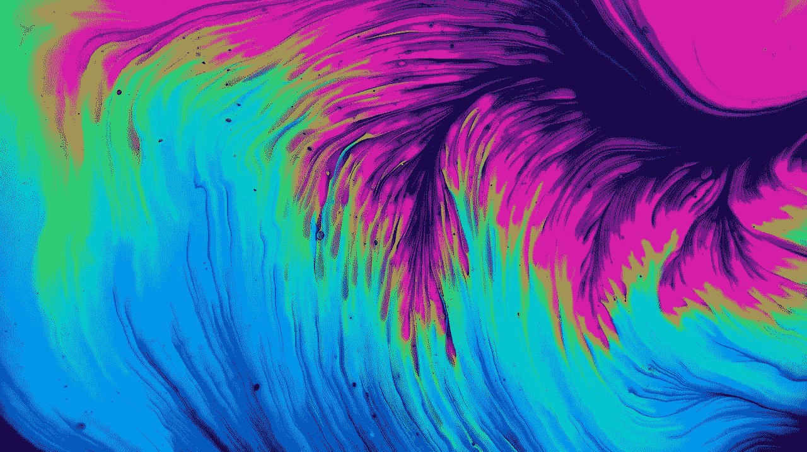

> 与我所有的文章一样，这是个人经验，而不是财务建议。

# 1.我如何找到优质项目

外面有成千上万的秘密项目。仅仅是数以千计的游戏赚取密码游戏。大部分都是骗局。不是骗局的大多很烂。

图像很糟糕。开发团队想要快速赚钱。令牌经济学是懒惰的。

如果你不加选择地模仿它们，你会很快丢掉你的帽子。

> *“猿”是什么意思？*
> 
> 想都没想就把一堆钱扔进一个项目。

我尽可能经常对项目说“不”。事实上，每一个项目都是“不”的，直到它证明不是这样。

【我正要告诉你我是如何找到项目并从中赚钱的。如果你想知道我如何选择 项目的 8 个步骤，[点击这里查看我的文章](https://thegreglarson.medium.com/8-questions-i-answer-before-buying-an-nft-3838cb6197ae)。]

**+来源于推特**

Twitter 是加密的前线。项目中的任何新进展都会首先在 Twitter 上发布。

为了了解新项目，我会关注空间中的各种随机账户。但是这 5 个是最有帮助的:

**1。**[**@ trader Joe _ XYZ**](https://twitter.com/traderjoe_xyz)

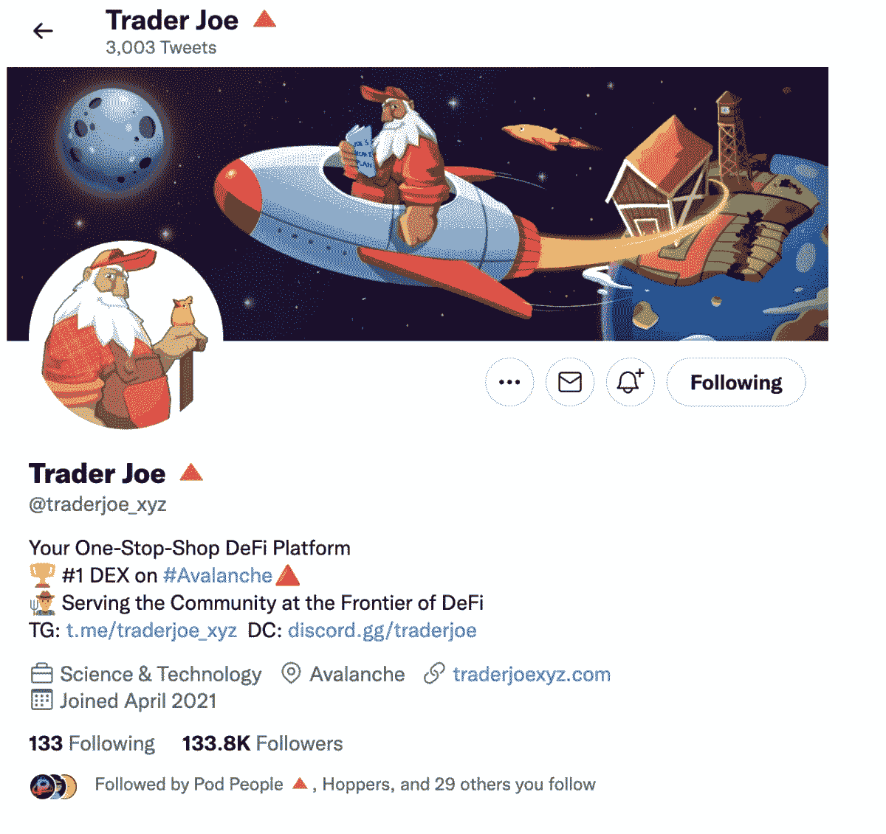

这是我在雪崩区块链上最喜欢的分散交易的 Twitter 账户(我只投资雪崩项目——伟大的社区，低汽油费，等等。).Trader Joe 推广各种高质量的新项目，包括 P2E 游戏。如果你跟随一个帐户去了解新的项目，这是一个。

**2。**[**@ avaxradar**](https://twitter.com/avaxradar)

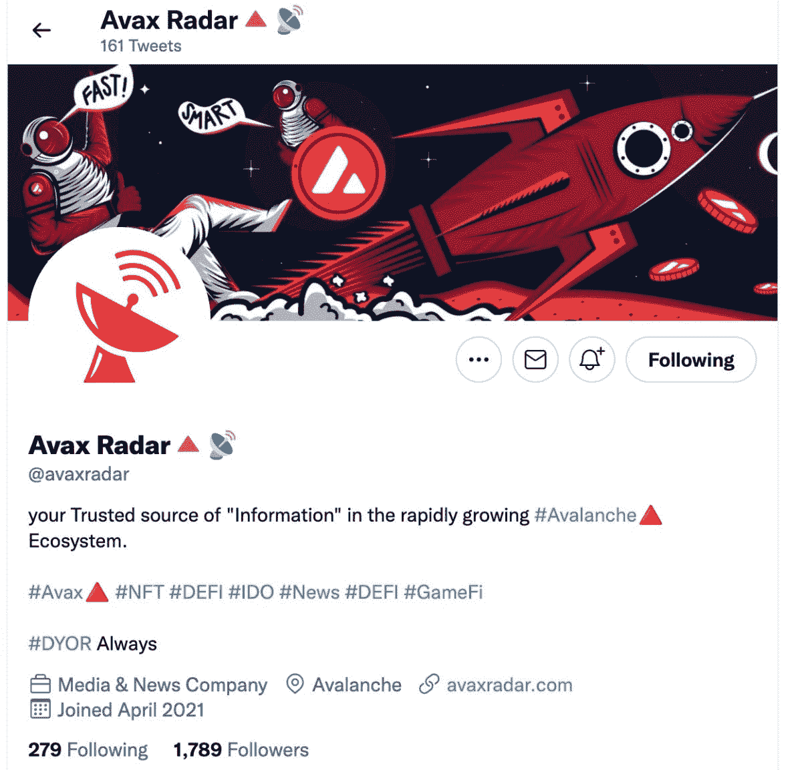

Avax 雷达会发布各种新的雪崩项目。这是一个很好的“包罗万象”的帐户遵循。但是它们也促进了大量的诈骗和欺诈。不是故意的，他们只是在推销所有的东西。

我这么说吧:如果 Trader Joe 在他们的账户上提到一个项目，它更有可能是真实的交易。如果 Avax Radar 在他们的帐户上提到一个项目，就无法判断它是否合法。我只是用它来了解太空中发生的新事情。

[**3。@NFTEthics**](https://twitter.com/NFTethics)

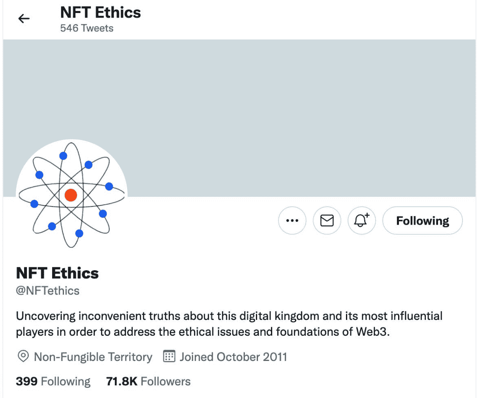

这个帐户揭露骗局和地毯拉。显然我不会从他们那里找到新的项目，但我对哪些项目不该投资有了更敏锐的眼光。

**4。** [**@FaridRached**](https://twitter.com/FaridRached)

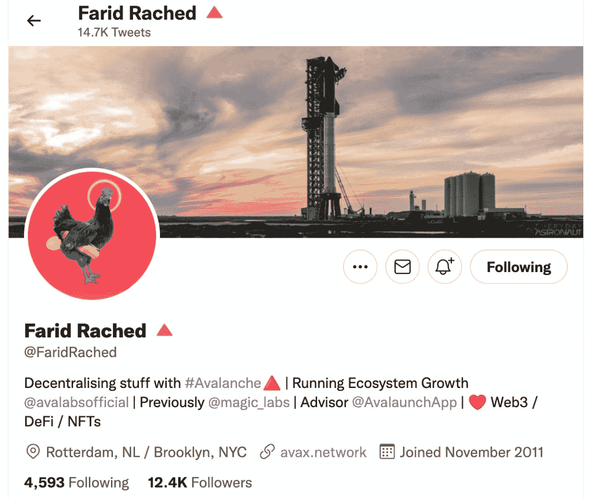

法里德负责雪崩星球的生态系统增长。换句话说，他的工作是寻找新项目并投资，这样它们就能在雪崩式的区块链上焕发生机。

他总是站在项目的前沿。另外，他是个可靠的人，在我们的项目上给了我们很多帮助。

**5。** [**@AVAXDaily**](https://twitter.com/AVAXDaily)

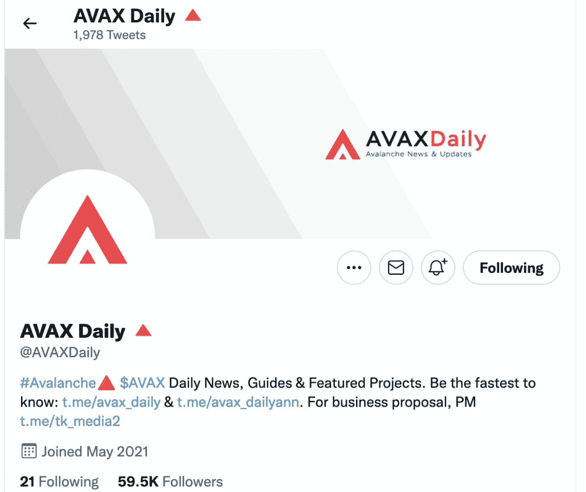

这个账户提供了关于 Avalanche 的顶级项目的更新。这是了解风景的好方法，尽管你不太可能在这里找到任何未经加工的钻石。

**+查看造币厂日历**

当我第一次开始投资 P2E 游戏的时候，在我发现加密 Twitter 之前，我根本不知道人们是怎么找到项目的。

这不是那种你不能谷歌搜索的东西。这个行业发展太快了。

在我找到几个不错的 Twitter 账户后，我找到了一个名为雪崩铸币日历的页面。

这是一个非常有用的日历，上面有雪崩区块链上(一些)即将到来的造币厂(即 NFT 销售)。

[http://avaxnfts.com/calendar/](http://avaxnfts.com/calendar/)

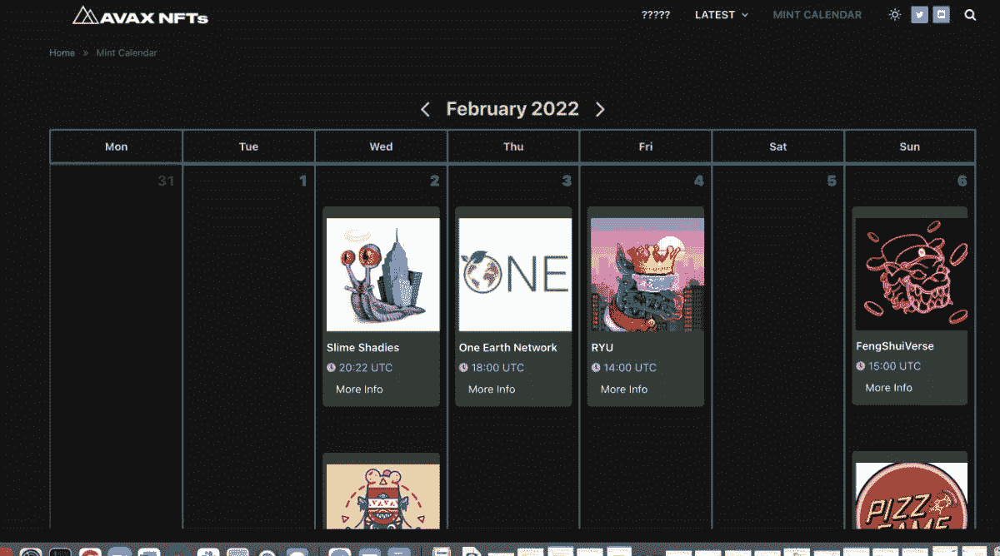

【同样，如果你想知道如何挑选投资项目，请点击这里查看我的 [8 步框架](https://thegreglarson.medium.com/8-questions-i-answer-before-buying-an-nft-3838cb6197ae)。]

# 2.我如何避免诈骗

人们在这个领域被投资他们看到的每个项目搞得一团糟。FOMO 秘密杀人。

你会错过机会。你会犯错误。关键是尽量减少损失，不要人云亦云。

起初，我看到一个项目为购买他们的 NFT 提供奖励(在另一个帖子中有更多关于这一点的内容)，我买了，希望赚点小钱。

幸运的是，那些早期的错误对我来说很管用。但这与技巧无关。

这里有一个完美的例子:

最近的一个项目叫做 [AVAX Pandas](https://www.pandavax.com/) (如果你点击那个链接，不要买这些东西。他们是骗局)。

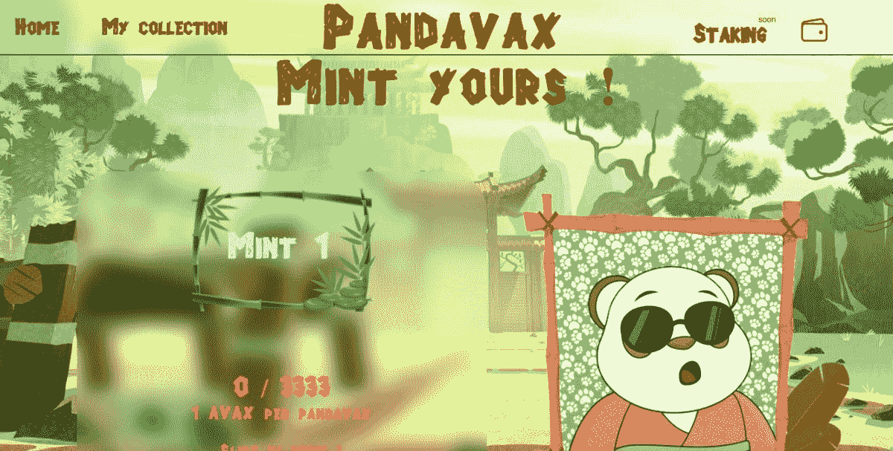

事情是这样的:

开发商创造了一堆看起来很便宜的卡通熊猫，卖掉了 3333 只，然后拿着钱跑了。可悲的是，这种情况经常发生。

但你不必成为受害者。这些混蛋身上都有骗局的迹象:

这种廉价卡通风格的 NFT 项目——没有深度，只有几条线和自动生成的配件——几乎总是引人注目。

> ***什么是地毯拉？***
> 
> 一个加密货币骗局。

其他需要注意的危险信号:

**-反射性奖励**-这意味着该项目向你承诺，他们每卖出一笔 NFT，你就能得到美元。我对这种狗屁奖励有偏见。好像每个诈骗项目都承诺了这些。

**-开发者将游戏作为人质**-项目将有时间表，他们说他们只提供特定的东西，当他们卖出 X%的 NFT 时。例如，Avax 熊猫公司表示，一旦所有的熊猫被铸造出来，他们就会发布游戏。嗯，他们铸造了 100%的狗屁熊猫，却从来没有发行过游戏。

[摘自《熊猫骗局》白皮书。]

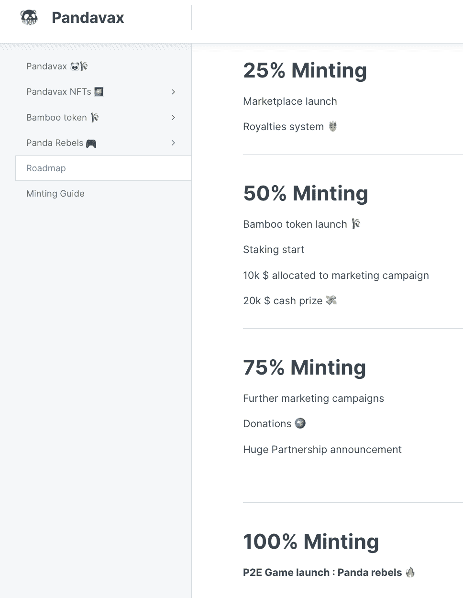

**-下注 soon™️**-下注意味着您将您的 NFT 存款用于奖励。这基本上就像把钱存入银行账户，并获得利息回报。除了 0.05%之外，你得到的钱可能会改变你的生活。以下是一个好项目(通常)会做的事情:他们会有一个 NFT 造币厂，你可以在那里购买他们游戏的 NFT。然后，在 mint 之后不久，他们将推出赌注奖励。

这是一个骗局会做的:他们会卖一堆 NFT，承诺月亮与赌注奖励，然后消失。我喜欢的项目，提供赌注几乎紧接着 NFT 造币厂。但这只是我。

**-项目网站上怪异的语言错误**-我的意思是，看看这段摘自熊猫网站的摘录。这是如此普通的废话，很难想象会有什么想法进入其中。所有骗局项目的宣传材料中都有这种语言。

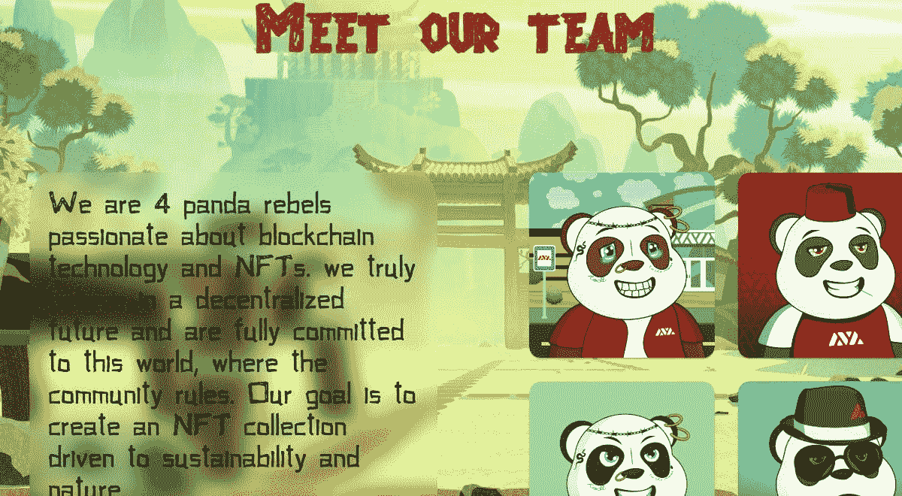

# 3.做大并多样化

一旦我找到一个我喜欢的项目，我会确保我不会得到 FOMO 并把一切都投入进去。我试着一次在 3-6 个项目之间分散，包括几个月后才会有结果的项目。

这就是我现在的处境:

[**披萨游戏**](https://pizza.game/)

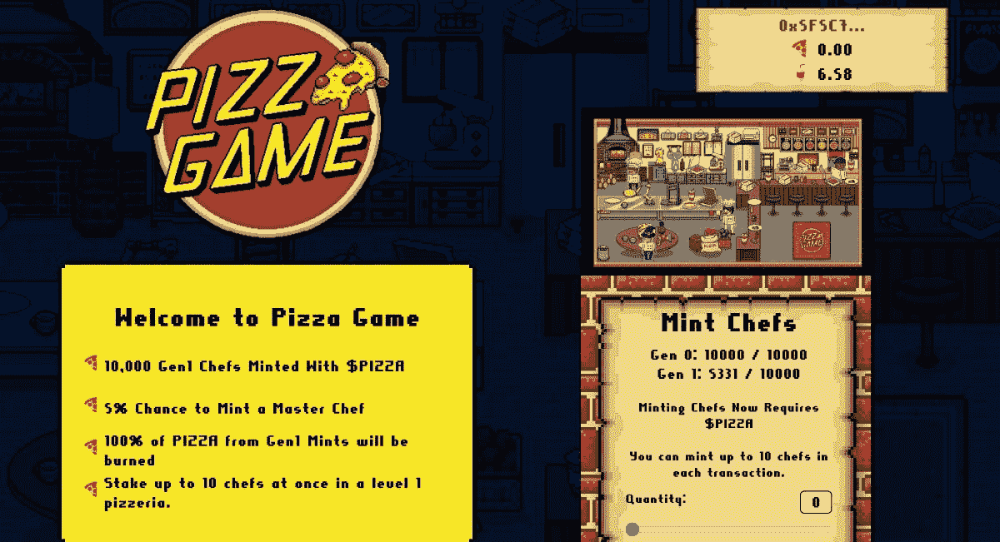

我发现这个项目之前，它的造币日期。我喜欢游戏机制。我喜欢词汇学。它是这样工作的:

-你买披萨厨师 NFTs。

-你赌 NFTs，以获得 100 美元的比萨饼硬币.

然后，您可以:

-下注＄PIZZA，以获得更多＄PIZZA(这很复杂，哈哈)

-以美元(或其他任何东西)的价格出售价值 10 美元的比萨饼

-将$PIZZA 与$AVAX 结合，获得另一个更有价值的游戏内代币$SODA(同样，这很复杂)

玩这个愚蠢的披萨游戏改变了我的生活。游戏机制一开始确实很复杂，但是当你把皮肤放到游戏中，你会学得很快——相信我。

[下一节将详细介绍我的盈利策略。]

[**帝国帝国**](https://imperiumempires.com/)

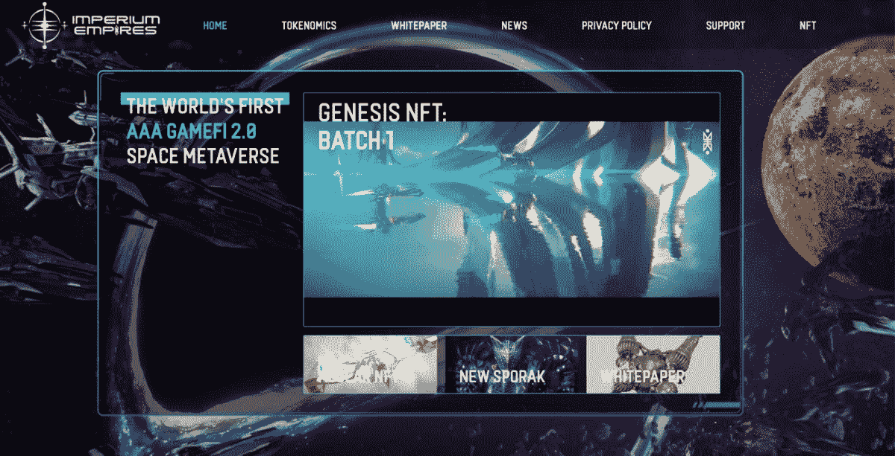

这场比赛会很精彩。事实上，它不会在几个月内推出，而且已经很大了。在这个世界上，大多数“游戏”只是你的 NFT 的数字照片和奖励令牌上升的计数器(如披萨游戏)，这将是一个真正的 AAA 视频游戏。这意味着它是高质量的图形和游戏。

这个游戏的机制和词汇学非常复杂，我还没有完全理解它们。我所知道的是这个游戏是有风险的——你和其他玩家一起加入公会，参加战斗，这些战斗会伤害甚至可能摧毁你的非战斗单位。

听起来真他妈恶心。

我是这样知道我喜欢这个的:

我得到几艘船只是因为我想玩这个游戏。我不在乎 P2E 奖。

好迹象。

[**刘某龙**](https://ryunft.com/)

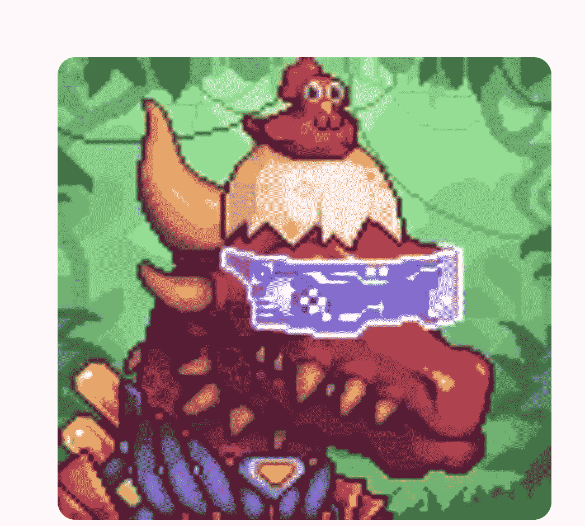

这个有风险。该项目由 3333 个独特的龙 NFT 组成，您可以下注获得奖励。这里没什么异常。但吸引我的是繁殖机制:你可以“繁殖”两个 NFT 来获得另一个(价值较低的)NFT。我喜欢这样。

此外，这一切都将导致今年晚些时候更深入的游戏。也就是说，如果开发团队遵循他们的路线图。在这个领域，这是一个很大的假设。

我唯一担心的是开发团队已经多次推迟了打桩。虽然我信任他们，但我开始有点担心。

我会随时通知你的。

[**矿工乔**](https://minerjoe.com/)

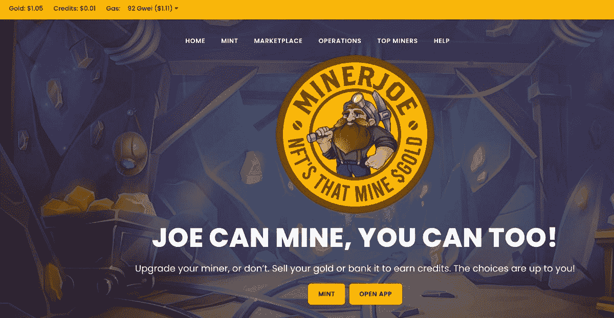

这是一个有趣的小项目。

你铸造了一个开采黄金的矿工 NFT。然后你可以卖掉美元黄金，或者把它存进银行赚取美元信用，这是不太有价值的。

我有三个矿工。我重新投资这个游戏大概有一个月了。我还没有拿任何利润，只是再投资。

开发团队非常适合奖励早期采用者，他们擅长锁定流动性。我不想永远呆在这里。这个项目的参与者太少，无法持续很长一段时间。我只投资了大约 1250 美元。

我会坚持几个月。保持联系。

[**摔跤元宇宙**](https://www.wrestlingmetaverse.com/)

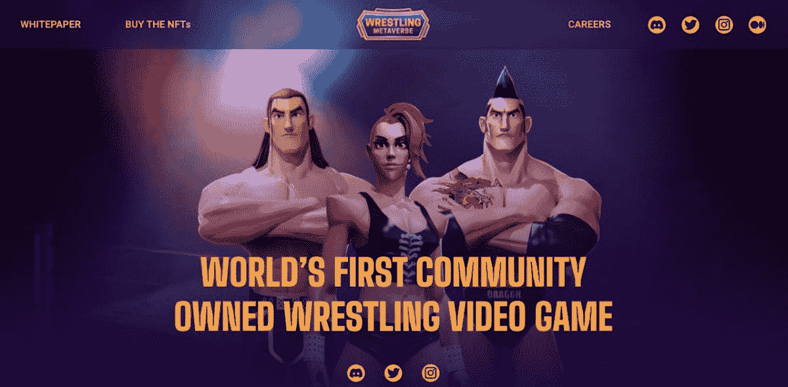

这个很有潜力。首先，设计很惊艳。

其次，它有一个完全多元化的庞大团队，这是一面罕见的绿色旗帜。

[白皮书](https://docsend.com/view/543bib72cu55achk)是迄今为止我在这个领域看到的最好的。

他们有明确的使命和惊人的游戏机制。

更不用说一些 NFT 将基于真正的摔跤手，我太他妈想要一个科特·安吉尔·NFT 了。

他们之前有薄荷糖，我也买了一个。我买的真正的摔跤手将在三月揭晓。我真想看看这个项目会变成什么样。

不过，目前还没有利润。

# 4.50%再投资，50%利润

对于盈利的项目，我是这样做的:

我的一个项目获得了 NFT 奖(或者 10 分)。

-我在游戏中下注(或存入)NFT。

-我赢得奖励硬币以换取我的 NFT 赌注。

-我赌硬币来获得其他奖励。

现在，在这一点上，我可以每天或每周提取我的奖励，并把它们存入我的银行账户。但是这种方法不允许有太多的时间来合成。

我更喜欢让回报复合 1 个月，然后清算，重新开始。

这里举个例子来说明。

我在披萨游戏里开了一家披萨店。

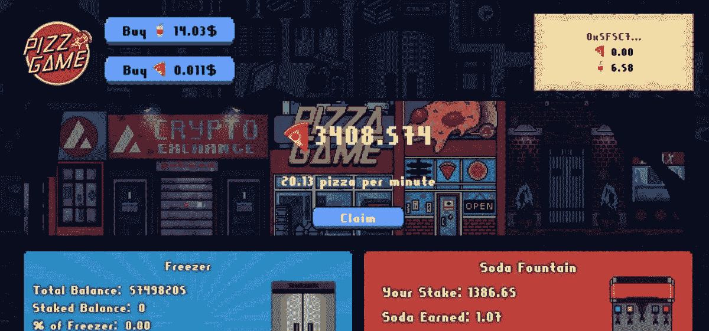

我押了 10 个厨师和一些工具，每分钟能赚我 20 美元。

价值 10 美元的披萨现在卖 0.01 美元。这相当于每天几百美元。还不错。

我可以把这些每天的利润，放在我的银行账户里，用最低的回报来体验最小的风险。或者，我可以将这些利润作为长期赌注，以获得更高的回报和最大的风险(以防项目在某个时候变为零)。

我选择两者之间的东西:

-每天，我拿出一半的披萨收入，买$AVAX。

-然后，我将我的$PIZZA 和$AVAX 放在一起(更多信息请见另一篇文章)。

-然后，我在披萨游戏中下注，赢得第二个游戏代币，称为$SODA，一直在$13 上下浮动。[这就是上图中所谓的“冷饮店”。]

-然后，我从我的$苏打奖励中拿出 50%,把它们卖给$PIZZA/$AVAX 组合，并进行再投资。

-我拿走我的$苏打奖励的另外 50%,并把它留在游戏中升级，如更多的厨师和比萨饼工具，这使我每分钟获得更多的$比萨饼。

-我这样做一个月，让回报复合。然后，在月底，我清算我所有的奖励硬币，并把预定的金额转入我的银行账户。

-任何超过这个数目的钱，我都会投入到一个叫做 stablecoin farm 的地方，我会在后面的帖子里解释。

所以现在是月底了。我已经拿走了一个月的复利，不得不重新开始。但是因为我把我收入的 50%再投资到改善我的比萨店，除了我银行账户里的现金，我还有剩余的游戏收益。

双赢，风险中等，回报高。

现在，在某个时候，这个项目将会夭折。

我没意见。我已经多次收回了我的初始投资。无论何时它真的死了，这种策略确保了最糟糕的事情是我失去了那个月的部分复利。

这让我想到了下一点…

# 5.每个项目时间短，整体时间长

我不想永远坚持披萨游戏。或者其他任何项目。整个 P2E 加密空间真的很新——一个已经存在了 10 个月的项目是永恒的。

所以，坦白地说，我还不知道如何退出。这只是一个心态问题。

我不想和每个项目呆在一起，直到它归零。我想进去，赚点外快，然后离开。

但是大多数人在这个领域犯的错误是:

他们担心项目会化为乌有。

事情是，任何项目都可以去 0…

而且还能赚钱。

只要你一路刮走利润。

***

想要独家访问我的每周加密观察列表，在那里我告诉你我在未来几周投资的项目？

[注册我的时事通讯](https://sendfox.com/lp/1x9d5n)并在雪崩区块链上从玩到赚游戏中赚取$$。

感谢阅读！

格雷格“密码小子”拉森