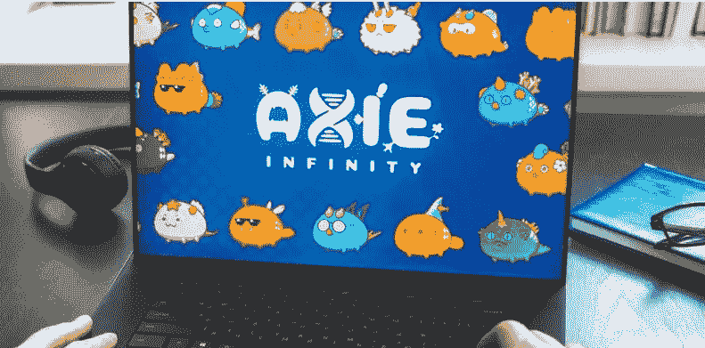

# 如何从 Axie Infinity 这样的 NFT 市场中获利？

> 原文：<https://medium.com/coinmonks/how-to-make-profit-with-an-nft-marketplace-like-axie-infinity-6864869115c2?source=collection_archive---------19----------------------->

不可替代的代币是目前的特殊资产。这些特殊的代币在一个名为 NFT 市场的专属平台上交易。NFT 市场是 NFT 在数字空间快速流通的原因。在数字空间中有一个广阔的市场。此外，有两种类型的市场；开放式和独占式。开放式市场是一个交易所有类型的非功能性交易的平台，而独占式市场是一个只交易选定类型的非功能性交易的平台。NFT 市场的这种变化是数字市场上买卖大量非功能性交易的原因之一。因此，现在在数字世界里，这是一个非常有利可图的行业。在货币化的 NFTs 中有许多变化。大多数情况下，NFT 通过市场赚钱，现在，NFT 游戏/市场正在成为赚钱的好方法，并在分散投资中发挥关键作用。一个最好的例子是 [**轴协无穷大**](https://axieinfinity.com/)；数字世界中最受欢迎的 NFT 游戏之一。

**通过 NFT 市场开发赚钱的最佳方式**

NFT 市场是数字世界中最流行的商业理念之一。用 [**NFT 市场开发**](https://bit.ly/3NjIgez) 赚钱的方法有很多。最好的方法是在这个数字空间里创业。凭借其巨大的潜力和市场发展的灵活性，一个完美的 NFT 企业可以以更高的速度运行。为了开始赚取市场业务，一切从选择区块链网络开始。区块链网络是建立赚钱核心的原因。首先，NFT 市场通过收取铸造费和交易费来赚钱。这些费用受区块链技术使用类型的影响。因此，有了合适的区块链网络，你可以收取对双方都有利的铸造费和交易费。另一个赚钱的好方法是在业务结构中引入 **NFT 赌注**和 **NFT 借贷&借款协议**。有许多 NFT 市场和 NFT 游戏可供选择，作为一个例子，跟随他们的脚步，在短时间内赚取利润。现在最好的是 Axie Infinity。

## **为什么 Axie Infinity 是企业的完美典范？**

A **谢无限**是一款基于 NFTs 概念和区块链技术的最受欢迎的网络游戏之一。NFT 游戏的崛起和成功取决于受欢迎程度，最重要的是取决于在二级市场上交易的游戏内 NFT 的数量，在 Axie Infinity 的情况下，大多数 NFT 都是在这里交易的。Axie Infinity 游戏基于战斗生物的概念。这些生物被称为 Axies。这些轴表示为 NFT。由于它们以非金融交易的形式出现，因此可以在广泛的二级市场进行交易。这个游戏的主要概念是玩家应该通过购买三个这样的轴来开始游戏。一旦他们被购买，他们就被训练和提升，一旦他们都被提升，战斗就开始了！这些 Axie 与众多竞争对手战斗，胜利者将获得奖励和升级他们的 Axie。升级越多，Axie NFT 的价值就越大。类似 NFT 市场的**[**Axie Infinity**](https://bit.ly/3HSWoKW)正在为每个人进入数字商业世界铺平道路。现在，Axie Infinity 是商业平台遵循的完美路线图，并从长远来看获得巨大的利润。**

## ****为什么 NFT 游戏是第二好的盈利方式？****

**总的来说，游戏平台是世界上最赚钱的业务之一。随着 NFTs 和区块链技术加入到这个行业，它现在变得更加令人印象深刻和独特。对于常规游戏平台来说，这一直是获取利润的单行道；游戏平台的开发者将获得所有的利润份额，而不是相反。有了 NFTs，就完全改变了，它创造了术语**“玩赚”**。每一个玩 NFT 游戏的玩家都将有机会在未来通过交易游戏中可收集的 NFTs 来赚钱。货币化并不是唯一的优势；安全性、隐私性和透明性也被提供给玩家，使得它在当前成为一个非常可信和令人愉快的平台。因此， [**NFT 游戏平台**](https://bit.ly/3bjReLz) 正成为商家迅速展开成功战役的绝佳方式。**

## ****包装完毕，****

**众所周知，NFT 正在把世界变成一个成功的企业。随着 NFT 市场和 NFT 游戏的发展，它很快成为赚钱和享受利润的最佳途径。因此，现在是时候通过联系一家顶级的 NFT 发展公司来发展业务了。**

> **加入 Coinmonks [电报频道](https://t.me/coincodecap)和 [Youtube 频道](https://www.youtube.com/c/coinmonks/videos)了解加密交易和投资**

# **另外，阅读**

*   **[加密货币储蓄账户](/coinmonks/cryptocurrency-savings-accounts-be3bc0feffbf) | [加密交易机器人](/coinmonks/crypto-trading-bot-c2ffce8acb2a)**
*   **[BigONE 交易所评论](/coinmonks/bigone-exchange-review-64705d85a1d4) | [CEX。IO 审查](https://coincodecap.com/cex-io-review) | [交换区审查](/coinmonks/swapzone-review-crypto-exchange-data-aggregator-e0ad78e55ed7)**
*   **[最佳比特币保证金交易](/coinmonks/bitcoin-margin-trading-exchange-bcbfcbf7b8e3) | [比特币保证金交易](https://coincodecap.com/bityard-margin-trading)**
*   **[加密保证金交易交易所](/coinmonks/crypto-margin-trading-exchanges-428b1f7ad108) | [赚取比特币](/coinmonks/earn-bitcoin-6e8bd3c592d9)**
*   **[WazirX vs CoinDCX vs bit bns](/coinmonks/wazirx-vs-coindcx-vs-bitbns-149f4f19a2f1)|[block fi vs coin loan vs Nexo](/coinmonks/blockfi-vs-coinloan-vs-nexo-cb624635230d)**
*   **[BlockFi 信用卡](https://coincodecap.com/blockfi-credit-card) | [如何在币安购买比特币](https://coincodecap.com/buy-bitcoin-binance)**