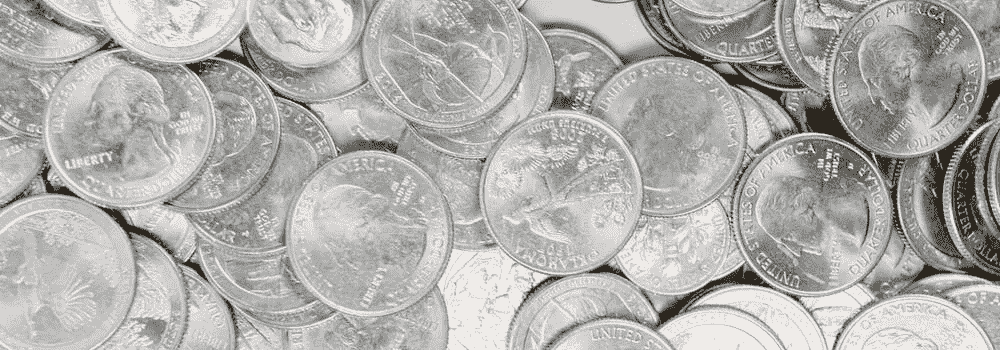

# 如何充分利用你的 401(k)

> 原文：<https://medium.com/coinmonks/how-to-make-the-most-out-of-your-401-k-77b692d2a50e?source=collection_archive---------50----------------------->

退休储蓄账户，如 401(k)和罗斯个人退休账户，是帮助美国人为舒适的退休生活储蓄的极好工具。仅仅有一个账户是不够的。如果你想充分利用你的个人退休帐户或 401(k)帐户，这样你就能真正过上你一直梦想的退休生活，有几件关键的事情要记住。在本帖中，我们将回顾你需要了解的关于 IRA 和 401(k)优化的内容。

# 罗斯个人退休帐户诉 401(k)

在你开始优化你的退休储蓄之前，了解 401(k)和 Roth IRA 账户之间的主要区别是至关重要的，这样你才能选择最符合你目标的账户。

401(k)账户通常由雇主赞助。当你退休时提取收入，你就要交税。这意味着在提款期间，你将支付你的税级税率。401(k)计划的资金来源是从你的工资中扣除的税前收入。这样做的好处是，你每年向 401(k)缴纳的费用会降低你的应税收入——而且，许多雇主会进行 401(k)匹配；这些比赛也有税收优惠。

相反，你的罗斯个人退休帐户是税后资金。这使得资金免税增长。另一个区别是，您可以随时从您的罗斯个人退休帐户中提取您的缴款(而不是您的收入),而不必支付税款罚款。401(k)账户提前提款的罚金通常是 10%。

谈论 401(k)和罗斯个人退休帐户的另一个主要区别是缴费限额。2022 年，50 岁以下的人的罗斯个人退休帐户缴款不能超过 6000 美元，50 岁或以上的人不能超过 7000 美元。对于 401(k)账户，如果你不到 50 岁，你可以在 2022 年贡献高达 20，500 美元，而对于 50 岁或以上的人，你可以贡献 27，000 美元——这与罗斯个人退休账户的贡献限制有很大的不同。

# 401(k)优化

为了充分利用您的 401(k)计划，您应该:

# 获得雇主匹配

最大化你的 401(k)缴款的最简单的方法是确保你的雇主与你的账户相匹配——或者至少有所贡献。如果他们不是，你可能要考虑找一个新的雇主或寻找一个新的退休账户选项。

# 不要提前取款

在你的职业生涯中，你可能会换几次工作。你可以选择将你的 401(k)账户转到一个新账户，或者让它继续增长。请记住，一旦你不再受雇于你的前雇主，他们将停止与你的贡献相匹配。我们知道换工作，401(k)看起来像是一个套现的机会。但是，要不惜一切代价避免这种诱惑。你最终只会以高额税收罚款的形式伤害自己，并损害你未来的退休生活。

# 分散你的资产

通过选择一个多元化的投资组合来最小化你的 401(k)损失的风险。越接近退休，你就越应该将投资组合转向波动性较小的投资。

# 罗斯个人退休帐户优化

为了充分利用您的罗斯个人退休帐户，您应该:

# 早点开始存钱

由于复利，你越早开始向你的罗斯个人退休帐户缴款，你将来就有越多的钱。即使你不能马上贡献出最大的数额，有总比没有好。如果有时间，即使是最小的投资也会扩大你的储蓄。

# 不要等到 4 月 15 日

一些投资者只在纳税日向他们的罗斯个人退休帐户缴款。但是，像这样等待意味着你没有给你的贡献一个公平的成长机会。更重要的是，你冒着在市场高点投资的风险。

相反，在年初做出你的贡献，这样它就有更多的时间增长和复利。或者，一次支付较少的每月捐款，同时让你的捐款有时间增长。

# 使用后门个人退休帐户

有些人会想超过他们的罗斯个人退休帐户的捐款限额。你可以通过使用一个后门个人退休帐户来做到这一点。这基本上意味着您将贡献过程分为两步:

*   第一步:向传统个人退休帐户缴纳不可扣除的费用
*   第二步:将你的缴款转换成罗斯个人退休帐户

就这么简单，你可以开始缴纳远远超过罗斯个人退休帐户限额的金额，以确保你的退休生活。

> 加入 Coinmonks [电报频道](https://t.me/coincodecap)和 [Youtube 频道](https://www.youtube.com/c/coinmonks/videos)了解加密交易和投资

# 另外，阅读

*   [密码本交易平台](/coinmonks/top-10-crypto-copy-trading-platforms-for-beginners-d0c37c7d698c) | [Coinmama 审核](/coinmonks/coinmama-review-ace5641bde6e)
*   [印度的加密交易所](/coinmonks/bitcoin-exchange-in-india-7f1fe79715c9) | [比特币储蓄账户](/coinmonks/bitcoin-savings-account-e65b13f92451)
*   [OKEx vs KuCoin](https://coincodecap.com/okex-kucoin) | [摄氏替代品](https://coincodecap.com/celsius-alternatives) | [如何购买 VeChain](https://coincodecap.com/buy-vechain)
*   [币安期货交易](https://coincodecap.com/binance-futures-trading)|[3 commas vs Mudrex vs eToro](https://coincodecap.com/mudrex-3commas-etoro)
*   [如何购买 Monero](https://coincodecap.com/buy-monero) | [IDEX 评论](https://coincodecap.com/idex-review) | [BitKan 交易机器人](https://coincodecap.com/bitkan-trading-bot)
*   [CoinDCX 评论](/coinmonks/coindcx-review-8444db3621a2) | [加密保证金交易交易所](https://coincodecap.com/crypto-margin-trading-exchanges)