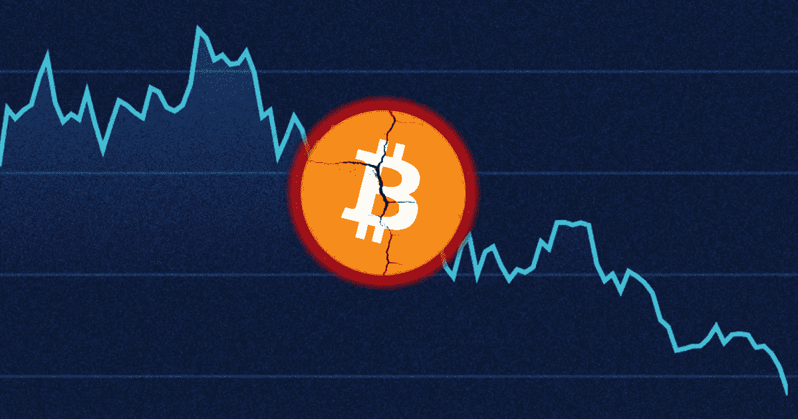
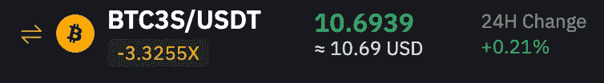
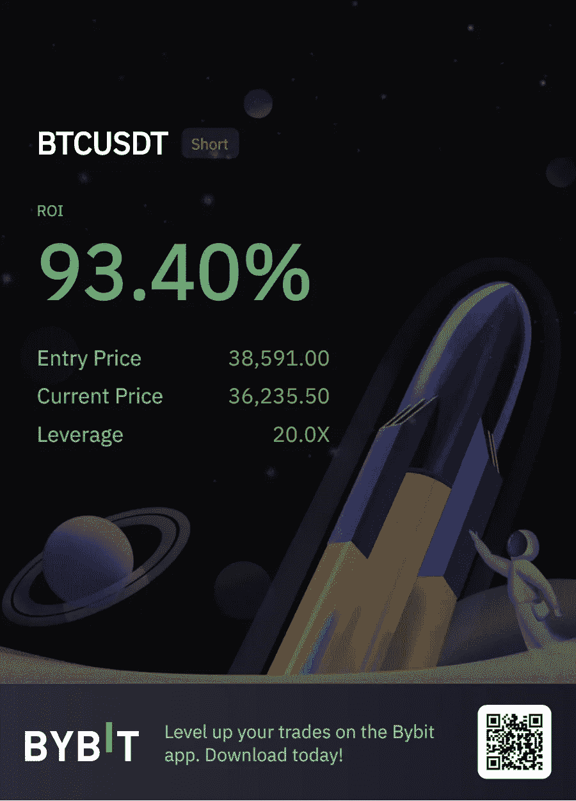
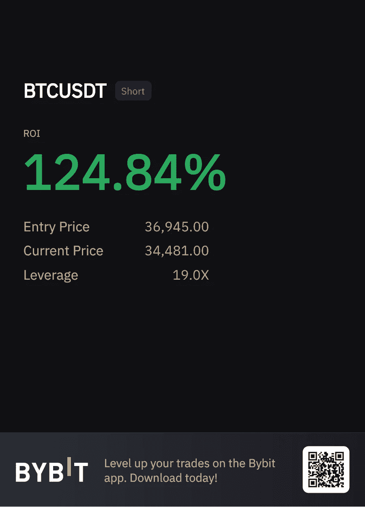
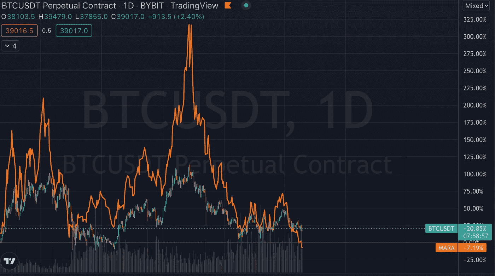

# 如何在比特币下跌时赚到几千美元

> 原文：<https://medium.com/coinmonks/how-to-make-thousands-of-dollars-when-bitcoin-is-falling-f68a9288209c?source=collection_archive---------22----------------------->

根据 CoinDesk 的数据，比特币今年迄今下跌了 16.69%。很多人认为这种下降会持续下去。所以下面是比特币继续下跌的情况下如何赚钱。快速提一下，如果你买了某种类型的密码，无论是比特币，以太坊等。从长远来看，你不应该出售。如果像这样的下跌让你想卖出，那么你对你买的东西没有足够的信心。无论未来一两年发生什么，无论比特币是否会再跌 50%。我仍然相信 5 年之内它会比现在高得多。确保不要仅仅因为比特币正在下跌就卖掉你的长期持有股票。在这次下跌中，只使用你投资组合中的交易部分来赚钱。

# **方法#1:**

第一种从比特币下跌中赚钱的方法是简单地做空比特币或其他密码。你可以在很多交流平台上这样做，就我个人而言，我使用 Bybit ( [我的推荐链接](https://partner.bybit.com/b/genzmoney))。当你注册 Bybit 或另一个交易所时，你可以通过两种主要方式来简化加密。第一种是利用现货交易和购买杠杆代币。对于杠杆代币，没有清算价格，所以你可以购买 3 倍的空头比特币代币。你可以搜索“BTC3S/USDT”并购买令牌。

如果当天比特币下跌 3%，那么你将获得 9%的收益。唯一要考虑的是不要长期持有杠杆代币，因为像滑点这样的东西会影响你的收益。但杠杆代币的好处是，与期货不同，它没有清算价格。期货是第二种做空比特币或其他密码的方式。Bybit 上也有期货。从本质上讲，在期货交易中，如果你的仓位是 100 美元，杠杆是 20 倍，那么你的仓位就变成了 2000 美元。因此，如果比特币下跌 1%，而不是上涨 1%，你将获得 20%的收益。如果你不小心的话，发生重大损失的可能性要大得多，而且你还有清算价格。如果你的空头头寸达到了你的平仓价格，你就会失去所有的钱。如果你想持有期货头寸的时间比平时长一点，你可以把杠杆设定得很低(低于 5 倍)，这样平仓的风险就会小很多。我已经从做空 cryptos 中获得了一些相当不错的收益(如下所示)。

# **方法 2:**

比特币下跌时赚钱的第二种方法是通过股票。假设你不想注册加密交易所，你可以做空 MARA 或 RIOT 等比特币挖矿公司。这些密码非常接近比特币。

上图显示的是比特币，橙色线是马拉叠加在上面的。如你所见，在方向上基本上是完全一致的。唯一的区别是，如果比特币上涨 100%，那么马拉很可能上涨两倍或三倍。因此，它几乎就像比特币的杠杆头寸。如果你做空马拉，当比特币下跌时，你可以赚钱。如果你住在加拿大，你也可以购买 BITI，这是一种反向比特币交易所交易基金。当比特币下跌时，BITI 当天上涨。

# 方法三:

在比特币下跌的时候，另一个赚钱的方法是开采比特币。挖掘比特币的最佳时机是 crypto 下降的时候。之所以这样，是因为你每天获得一定量的比特币。比方说，当比特币在 4 万美元左右时，你现在开采 1 个比特币。你没有赚到 4 万美元，你赚了 1 个比特币。因此，当比特币涨到 6 万美元时，你卖出你赚的钱，而不是最初的 4 万美元，实际上是 6 万美元。当密码下跌是最好的时机，因为从那时起，你可以积累大量的密码，并在一切上涨时出售。显然，挖掘的成本非常昂贵，但当比特币下跌时，这是你可以做的一个选择。

# 方法 4:

我要讲的最后一个方法是打桩。基本上，通过赌注，你可以拿你的比特币、USDT 或其他密码。把它锁起来一段时间，然后对密码感兴趣。如果你想降低风险，你可以投资稳定的硬币，这样即使加密市场下跌，你也能获得不错的年回报。有很多方法可以做到这一点，一种方法是通过锚协议，你可以通过赌注 UST 接近 20%的 APY。

当比特币下跌时，你可以通过这些方式赚钱。感谢阅读并关注更多类似的文章。

> 加入 Coinmonks [电报频道](https://t.me/coincodecap)和 [Youtube 频道](https://www.youtube.com/c/coinmonks/videos)了解加密交易和投资

# 另外，阅读

*   [WazirX vs coin dcx vs bit bns](/coinmonks/wazirx-vs-coindcx-vs-bitbns-149f4f19a2f1)|[block fi vs coin loan vs Nexo](/coinmonks/blockfi-vs-coinloan-vs-nexo-cb624635230d)
*   [本地比特币评论](/coinmonks/localbitcoins-review-6cc001c6ed56) | [加密货币储蓄账户](https://coincodecap.com/cryptocurrency-savings-accounts)
*   [什么是融资融券交易](https://coincodecap.com/margin-trading) | [成本平均法](https://coincodecap.com/dca)
*   [维护卡审核](https://coincodecap.com/uphold-card-review) | [信任钱包 vs MetaMask](https://coincodecap.com/trust-wallet-vs-metamask)
*   [Exness 点评](https://coincodecap.com/exness-review)|[moon xbt Vs bit get Vs Bingbon](https://coincodecap.com/bingbon-vs-bitget-vs-moonxbt)