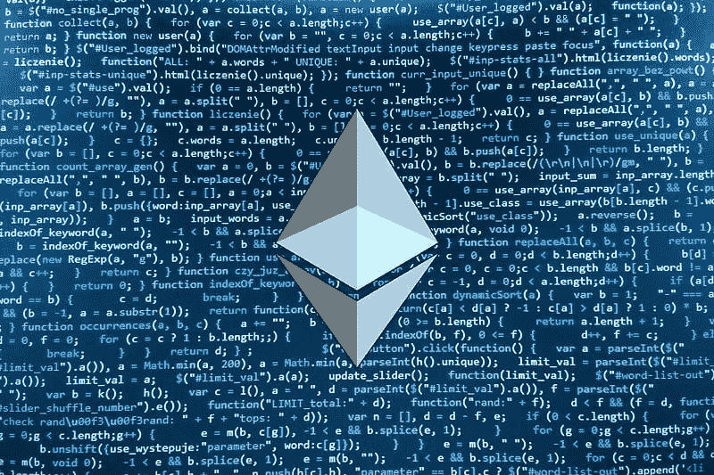
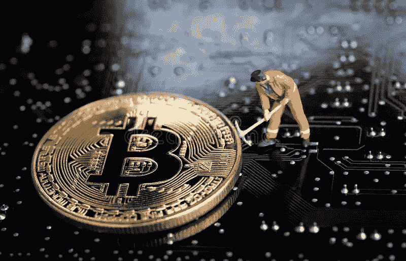

# 如何通过 4 个简单的步骤制作自己的加密货币

> 原文：<https://medium.com/coinmonks/how-to-make-your-own-cryptocurrency-in-4-easy-steps-eb4c601fd6de?source=collection_archive---------16----------------------->

**Cryptocurrency**

好吧，那么 [***加密货币***](https://bit.ly/3xKlx7k) 这个，比特币那个！

适可而止；虚拟货币的繁荣引起了如此多的骚动，以至于互联网上充斥着如何通过投资这些虚拟货币赚更多钱的信息。但是你有没有想过设计自己的加密货币会有多棒？

有没有考虑过？是时候思考了，因为在本帖中，我们将带你经历一个**四步流程**来制作你自己的加密货币。通读课文，决定你是否能自己完成它！

## 步骤 1 — **社区**

**Crypto Community**

不，如果你想主宰社交媒体，你不需要创建一个社区。这次有点不一样。你必须找到一群你认为可能有兴趣购买你的钱的人。

一旦你确定了一个**社区**，迎合他们的需求就更容易了，这让你可以专注于建立一个可靠的加密货币，而不是疯狂地追求你的目标。

记住，你不是在参加一场观赏性的运动。你在争取胜利。实现这一目标的最佳方式是建立一个愿意投资你的货币的个人社区！

## **步骤 2 —代码**

**Crypto Code**

下一个关键步骤是**编码**。要构建自己的加密货币，你不需要成为编码高手。您可以利用在线提供的各种**开源代码**。

你也可以雇佣专家来帮你完成这项任务。然而，在编码时要记住一件事:明显的抄袭不会让你走远。

为了把你的钱和其他已经存在的区别开来，你需要让它与众不同。它必须有足够的创意来引起市场**动荡**。这就是为什么简单地复制代码不足以让在比特币游戏中保持领先。

## **步骤 3 —矿工**

**Crypto Miners**

这个过程的第三步也是最关键的一步是寻求某些矿工的帮助，他们会开采你的硬币。

这意味着你需要一群人来帮助你在市场上传播关于你的 T2 货币的消息。你需要有人帮忙宣传你的钱。

这会让你在游戏中领先。而且，俗话说，**好的开始**是成功的一半；矿工可以帮助你在日益激烈的竞争中为成功销售你的**加密货币**打下基础。

## **第四步——营销**

**Crypto Marketing**

最后但同样重要的是，你必须与**商家**建立联系，他们最终会兑换你创造的虚拟货币。

换句话说，你需要在一个人们愿意投资这些货币的地方推广这些货币。这绝不是一项简单的任务。

你必须通过展示你有值得付出的东西来赢得他们的信任。

最好的入门方式是什么？起初宣传你的硬币最简单的策略是选择熟悉加密货币的目标受众。

毕竟，试图向从未听说过比特币的个人推销你的产品是毫无意义的。

## **结论**

正如你所看到的，作为一名顽固的技术人员或前卫的程序员，不如为了建立一种成功的加密货币而了解市场趋势重要。

如果你有这种洞察力，现在是时候趁着阳光普照的时候利用加密货币的优势了。按照这些**简单的步骤**准备创造你自己的硬币，看看结果如何！

## [***如果你想在没有任何技术知识的情况下用加密货币赚钱，请访问这里***](https://bit.ly/3xKlx7k)

> 加入 Coinmonks [电报频道](https://t.me/coincodecap)和 [Youtube 频道](https://www.youtube.com/c/coinmonks/videos)了解加密交易和投资

# 另外，阅读

*   [WazirX vs coin dcx vs bit bns](/coinmonks/wazirx-vs-coindcx-vs-bitbns-149f4f19a2f1)|[block fi vs coin loan vs Nexo](/coinmonks/blockfi-vs-coinloan-vs-nexo-cb624635230d)
*   [本地比特币审核](/coinmonks/localbitcoins-review-6cc001c6ed56) | [加密货币储蓄账户](https://coincodecap.com/cryptocurrency-savings-accounts)
*   [什么是融资融券交易](https://coincodecap.com/margin-trading) | [美元成本平均法](https://coincodecap.com/dca)
*   [拥护卡审核](https://coincodecap.com/uphold-card-review) | [信任钱包 vs MetaMask](https://coincodecap.com/trust-wallet-vs-metamask)
*   [Exness 评测](https://coincodecap.com/exness-review)|[moon xbt Vs bit get Vs Bingbon](https://coincodecap.com/bingbon-vs-bitget-vs-moonxbt)