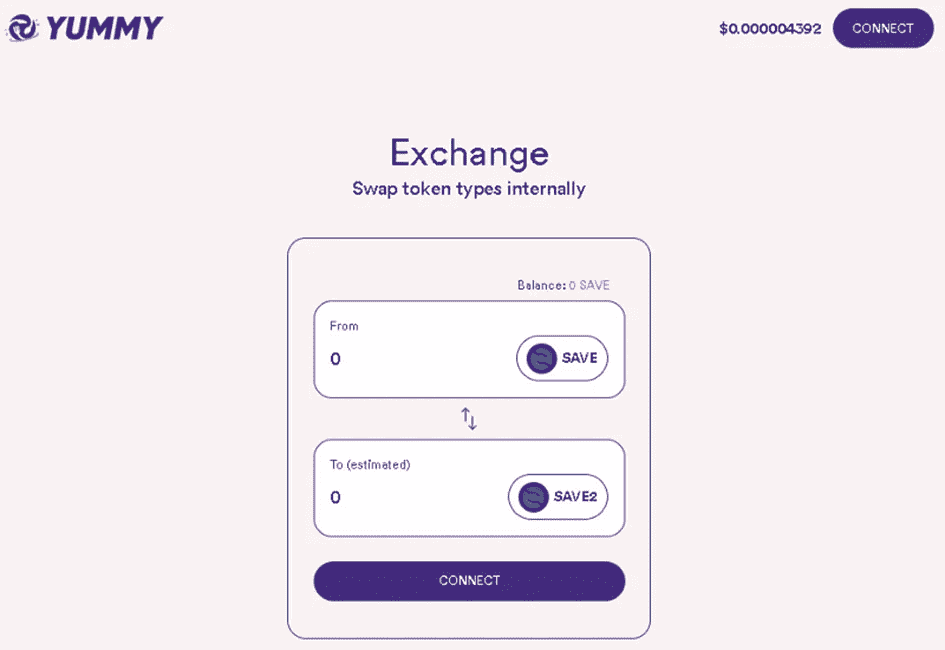
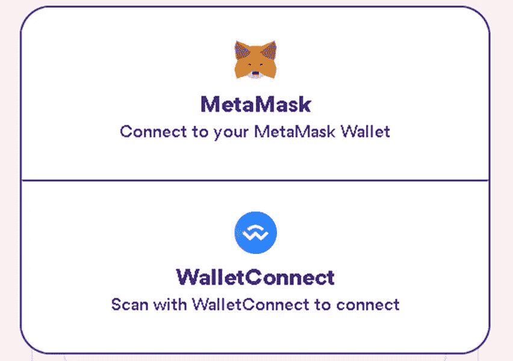
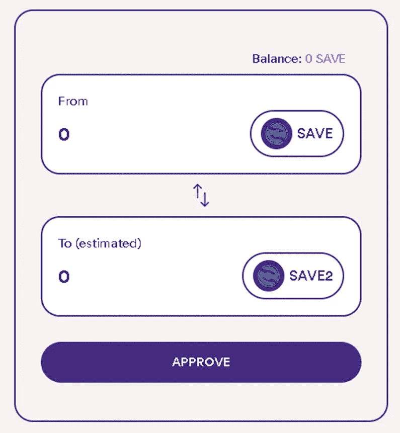
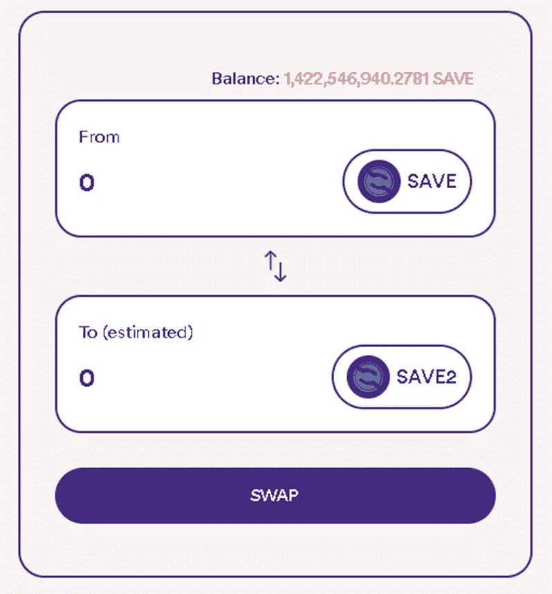
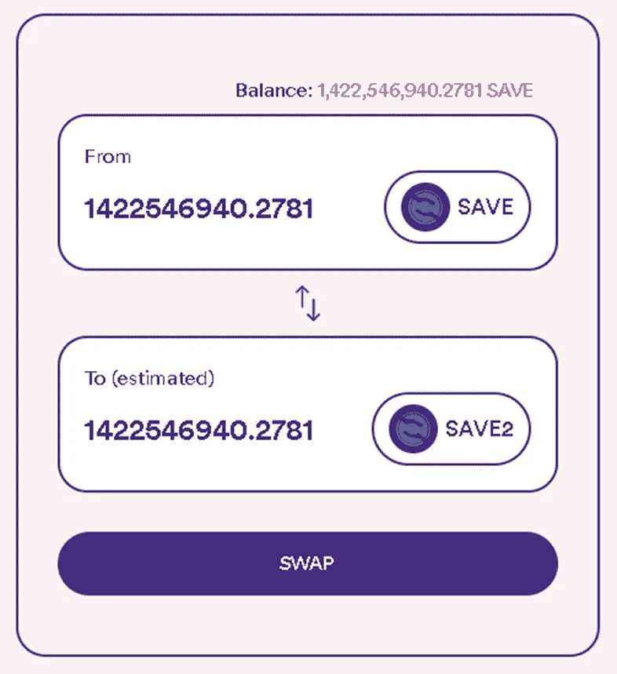
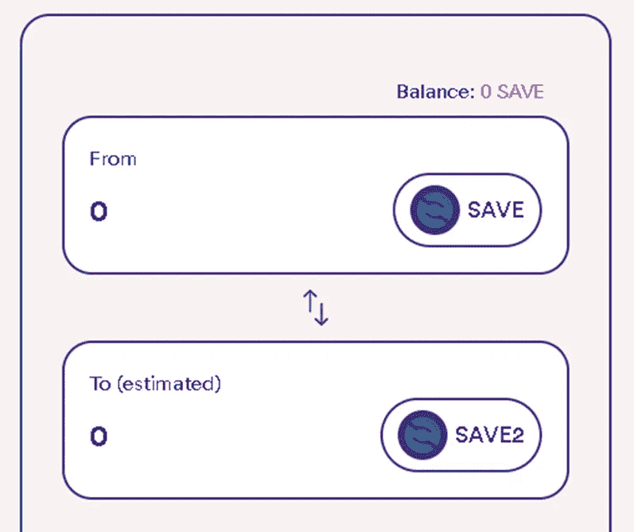

# 如何将 SAVE V1 迁移到 V2

> 原文：<https://medium.com/coinmonks/how-to-migrate-save-v1-to-v2-efc2ff43158d?source=collection_archive---------3----------------------->

拯救社区，

Yummy Crypto 和 Save the World 的团队尽了最大努力来创建一个简单易用的界面，让您可以安全地将令牌从 SAVE v1 迁移到 SAVE v2。

如果您遇到任何麻烦或需要额外的帮助，请随时联系拯救世界电报聊天的管理员。记住:无论是 Yummy 队还是 SAVE 队，都不会通过 DM 联系你的第一个朋友。任何指示你向任何地方发送储蓄代币的人都很可能是骗子。迁移的唯一方式是通过官方的 Yummy 迁移门户网站，并提供链接。

你可以在他们的官方电报室找到两个团队。

Yummy 密码[电报](https://t.me/yummyfinance)拯救世界[电报](https://t.me/SaveTheWorldToken)

迁移过程在 PC 和移动设备以及所有操作系统上都是一样的。如果您计划在移动设备上进行迁移，请确保使用 Web3 浏览器，例如 MetaMask 或 Trust Wallet 中提供的浏览器。

**迁移步骤**

**🔸第一步🔸**

访问官方的 [Yummy 迁移门户。](https://www.staking.yummy-crypto.com/exchange)

**🔸第二步🔸**

按下屏幕右上角的“连接”按钮，连接您的钱包。

将弹出一个选择钱包的窗口。对于移动钱包，单击“WalletConnect”按钮，对于 PC，您可以使用“MetaMask”按钮。

将需要您的 DeFi 钱包中的批准。

**🔸第三步🔸**

在您的 DeFi wallet 中获得批准后，您将连接到门户网站。下一步是批准您的 DeFi 钱包中的交换。请按“批准”按钮。

您的 DeFi 钱包将再次需要批准。

**🔸第四步🔸**

然后，您可以继续将 Save V1 交换到 V2。“批准”按钮将变成“交换”。''

要轻松交换全部储蓄金额，只需点击橙色天平，它将立即填入全部金额。

**🔸第五步🔸**

你现在可以交换 V1 代币了。您的 DeFi 钱包将需要另一个批准。成功后，您将在“0”处看到您保存的 v1 余额

**🔸第六步🔸**

您可以将新的储蓄令牌添加到您的 DeFi 钱包中。只需点击导入令牌(元掩码)或导入自定义令牌(信任钱包)按钮，并输入以下合同地址:

合同:0x 10 CDB be 9 b 9 e 2163 ce 93 d9 a 79 C4 d 46 b 388582 d0b 6
符号:保存
小数:9

如果迁移成功，您将在钱包中新的保存符号下看到您的余额。旧保存将位于“0”处，您可以删除此保存以避免混淆。

我们希望本教程能帮助您快速安全地进行迁移。如果您遇到任何困难或有任何问题，请随时联系我们的任何管理员。👍🏼👍🏼

Yummy Crypto [电报](https://t.me/yummyfinance)T2【拯救世界】电报

永远记住:无论是 Yummy 队还是 SAVE 队，都没有人会先联系你。

最好的，

美味团队和拯救世界团队

> 加入 Coinmonks [电报频道](https://t.me/coincodecap)和 [Youtube 频道](https://www.youtube.com/c/coinmonks/videos)了解加密交易和投资

# 另外，阅读

*   [5 款最佳加密交易终端](https://coincodecap.com/crypto-trading-terminals) | [最佳 DeFi 应用](https://coincodecap.com/best-defi-apps)
*   [最佳网上赌场](https://coincodecap.com/best-online-casinos) | [币安评论](/coinmonks/binance-review-ee10d3bf3b6e) | [BitMEX 评论](https://coincodecap.com/bitmex-review)
*   [麻雀交换评论](https://coincodecap.com/sparrow-exchange-review) | [纳什交换评论](https://coincodecap.com/nash-exchange-review)
*   [美国最佳加密交易机器人](https://coincodecap.com/crypto-trading-bots-in-the-us) | [经常性回顾](https://coincodecap.com/changelly-review)
*   [在印度利用加密套利赚取被动收入](https://coincodecap.com/crypto-arbitrage-in-india)
*   [Godex.io 审核](/coinmonks/godex-io-review-7366086519fb) | [邀请审核](/coinmonks/invity-review-70f3030c0502) | [BitForex 审核](https://coincodecap.com/bitforex-review)
*   [5 款最佳免费加密货币制图工具](https://coincodecap.com/crypto-charting-tools)