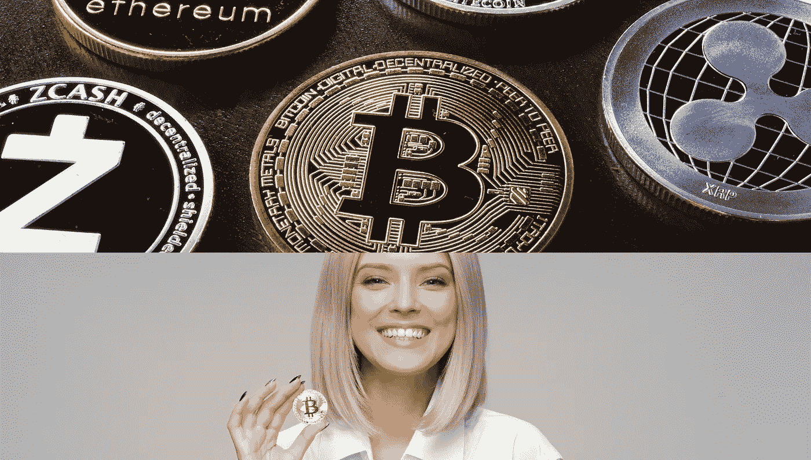
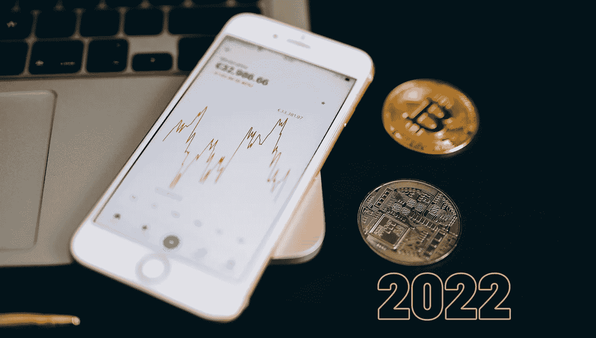
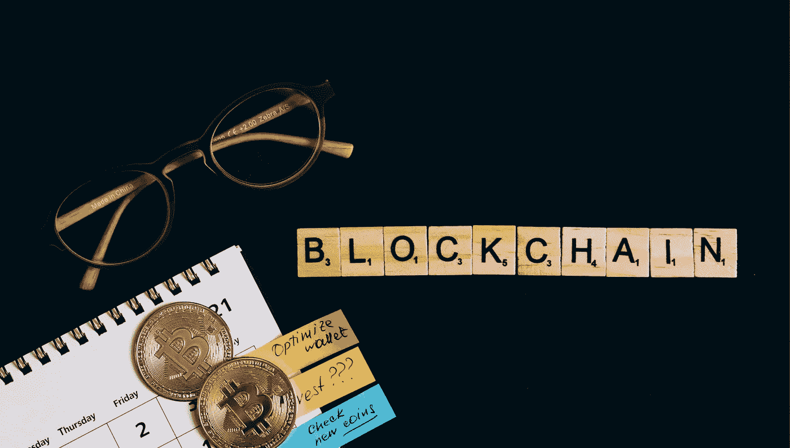
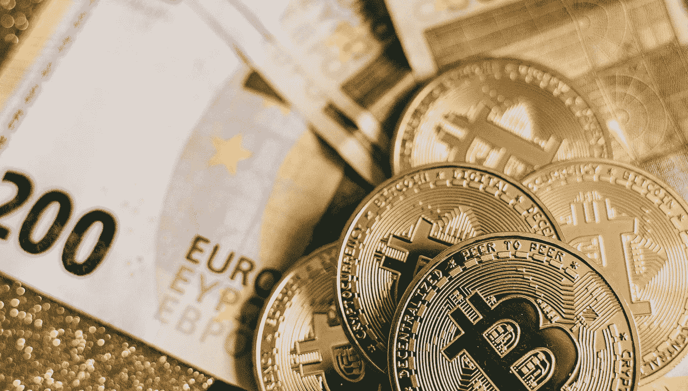

# 如何在家轻松挖矿比特币，快速挣钱

> 原文：<https://medium.com/coinmonks/how-to-mine-bitcoin-at-home-easily-and-earn-money-quickly-c2bd01f11182?source=collection_archive---------26----------------------->

比特币最近引起了很多热议。比特币最近不断成为头条新闻，这是有原因的。它是一种加密货币，可以用于在线购买物品，也可以用于交易其他货币。这种数字货币的价值一直在快速增长，许多人都在寻找参与其中的方法。

## [**> > >免费注册 coin base**](https://yazing.com/deals/coinbase/DavidBrian)

要开始使用比特币，了解它是什么以及它实际上是如何工作的非常关键。一种方法是挖掘比特币。挖掘比特币是一个又快又容易赚钱的好方法！近年来，比特币变得非常受欢迎，许多人为了赚钱，开始在家里挖掘比特币。

本博客讨论如何轻松快速地在家中挖掘比特币。我们还将讨论通过比特币挖矿可以获得的潜在利润，以及涉及的一些风险。因此，如果你有兴趣了解更多关于这个令人兴奋的机会，请继续阅读！

什么是比特币挖矿，为什么重要？

比特币挖矿是对比特币交易进行认证和合法化的过程——有点像成为比特币银行出纳员。挖掘包括创建专门制造的硬件来处理保持比特币安全的数字问题。

随着时间的推移，这变得更加复杂，因为它引发了一场军备竞赛，专门的采矿设备现在售价数千美元，专门的计算机芯片被设计用于采矿。

比特币挖掘至关重要，因为它有两个重要目的。一个是明显的；它将交易记录添加到比特币的公共账本区块链中。另一个不太明显但更重要:它也为矿工创造了新的比特币。这为人们采矿提供了动力，反过来又有助于保持比特币的安全(前提是高端采矿设备是安全的)。

比特币挖矿入门需要什么？

直截了当地说，只要能上网，有合适的硬件，任何人都可以参与挖矿。挖掘过程包括将最近的交易汇编成块，并试图解决计算上的难题。第一个解决难题的参与者可以在区块链上放置下一个方块并获得奖励。

[**> > >获得即时访问 COINBASE**](https://yazing.com/deals/coinbase/DavidBrian)

挖掘比特币的理想过程是怎样的？

*   向网络建议新的块:用户向网络建议新的块。他们通过求解一个密码方程来挖掘这个块，以找到一个小于某个目标的散列。然后这个区块进入区块链，他们会因为比其他人先找到答案而得到奖励。
*   开采并向链状网络中添加区块:矿工使用特殊软件解决数学问题，并因其工作获得比特币奖励。提出封杀的用户将获得 12.5 比特币的奖励，目前为 12.5 万美元。这给了其他用户开采和添加块到区块链网络的动机。
*   验证区块链上的区块:求解的区块被添加到区块链，并传播到网络上的所有节点。节点是相互连接以形成用于验证新块的网络的计算机。如果网络上的节点不能公平地验证这个新块，它将被网络上的其他节点拒绝。

采用这 6 种“屡试不爽”的方法，在家里以正确的方式挖掘比特币

1.获得一个比特币钱包

在家挖矿比特币的第一步是拿到钱包。它不仅仅是你储存辛苦赚来的硬币的地方——它也是处理比特币时所需的各种其他信息的安全之地，比如私钥和地址。

它是一个软件程序或应用程序，使用户能够接收、持有、出售和购买比特币。有许多适用于 Android、iOS 和 Windows Phone 的比特币和加密钱包。然而，重要的是去找一个可信的、安全的、有良好评价的钱包提供商。

2.买些比特币

一旦你决定了一个钱包，是时候买一些 BTC 了。只需从银行转账、信用卡或其他支付方式中选择最适合你的选项，然后购买比特币。

你可以把你的硬币放在你购买它们的交易所，直到你准备花掉它们，或者把它们转移到你的钱包里。无论你选择哪个选项，都要做好调查以避免欺诈。

3.找一个矿池加入

比特币挖矿很难靠自己创业。用户甚至在开始之前就被要求完成复杂的编码工作。如果你不是程序员，最好加入一个现有的矿池，或者寻找基于云的服务，比如 Hashflare 和 Genesis Mining。

比特币挖矿入门需要什么？

[**> > >点击此处获得完全访问**](https://www.digistore24.com/redir/325658/Rasmi22/) 到加密量子飞跃现在。

直白的说，只要能上网，有合适的硬件，任何人都可以参与挖矿。挖掘过程包括将最近的交易汇编成块，并试图解决计算上的难题。首先解决谜题的参与者可以在区块链上放置下一个方块并获得奖励。

挖掘比特币的理想过程是怎样的？

*   向网络建议新的块:用户向网络建议新的块。他们通过求解一个密码方程来挖掘这个块，以找到一个小于某个目标的散列。然后这个区块进入区块链，他们会因为比其他人先找到答案而得到奖励。
*   开采并向链状网络中添加区块:矿工使用特殊软件解决数学问题，并因其工作获得比特币奖励。提出封杀的用户将获得 12.5 比特币的奖励，目前为 12.5 万美元。这给了其他用户开采和添加块到区块链网络的动机。
*   验证区块链上的区块:求解的区块被添加到区块链，并传播到网络上的所有节点。节点是相互连接以形成用于验证新块的网络的计算机。如果网络上的节点不能公平地验证这个新块，它将被网络上的其他节点拒绝。

采用这 6 种“屡试不爽”的方法，在家里以正确的方式挖掘比特币

1.获得一个比特币钱包

在家挖矿比特币的第一步是拿到钱包。它不仅仅是你储存辛苦赚来的硬币的地方——它也是处理比特币时所需的各种其他信息的安全之地，比如私钥和地址。

它是一个软件程序或应用程序，使用户能够接收、持有、出售和购买比特币。有许多适用于 Android、iOS 和 Windows Phone 的比特币和加密钱包。然而，重要的是去找一个可信的、安全的、有良好评价的钱包提供商。

2.买些比特币

一旦你决定了一个钱包，是时候买一些 BTC 了。只需从银行转账、信用卡或其他支付方式中选择最适合你的选项，然后购买比特币。

你可以把你的硬币放在你购买它们的交易所，直到你准备花掉它们，或者把它们转移到你的钱包里。无论你选择哪个选项，都要做好调查以避免欺诈。

3.找一个矿池加入

比特币挖矿很难靠自己创业。用户甚至在开始之前就被要求完成复杂的编码工作。如果你不是程序员，最好加入一个现有的矿池，或者寻找基于云的服务，比如 Hashflare 和 Genesis Mining。

比特币挖矿入门需要什么？

直截了当地说，只要能上网，有合适的硬件，任何人都可以参与挖矿。挖掘过程包括将最近的交易汇编成块，并试图解决计算上的难题。首先解决谜题的参与者可以在区块链上放置下一个方块并获得奖励。

[**> > >点击此处获得完全访问**](https://www.digistore24.com/redir/325658/Rasmi22/) 到加密量子飞跃现在。

挖掘比特币的理想过程是怎样的？

*   向网络建议新的块:用户向网络建议新的块。他们通过求解一个密码方程来挖掘这个块，以找到一个小于某个目标的散列。然后这个区块进入区块链，他们会因为比其他人先找到答案而得到奖励。
*   开采并向链状网络中添加区块:矿工使用特殊软件解决数学问题，并因其工作获得比特币奖励。提出封杀的用户将获得 12.5 比特币的奖励，目前为 12.5 万美元。这给了其他用户开采和添加块到区块链网络的动机。
*   验证区块链上的区块:求解的区块被添加到区块链，并传播到网络上的所有节点。节点是相互连接以形成用于验证新块的网络的计算机。如果网络上的节点不能公平地验证这个新块，它将被网络上的其他节点拒绝。

采用这 6 种“屡试不爽”的方法，在家里以正确的方式挖掘比特币

1.获得一个比特币钱包

在家挖矿比特币的第一步是拿到钱包。它不仅仅是你储存辛苦赚来的硬币的地方——它也是处理比特币时所需的各种其他信息的安全之地，比如私钥和地址。

它是一个软件程序或应用程序，使用户能够接收、持有、出售和购买比特币。有许多适用于 Android、iOS 和 Windows Phone 的比特币和加密钱包。然而，重要的是去找一个可信的、安全的、有良好评价的钱包提供商。

2.买些比特币

一旦你决定了一个钱包，是时候买一些 BTC 了。只需从银行转账、信用卡或其他支付方式中选择最适合你的选项，然后购买比特币。

你可以把你的硬币放在你购买它们的交易所，直到你准备花掉它们，或者把它们转移到你的钱包里。无论你选择哪个选项，都要做好调查以避免欺诈。

3.找一个矿池加入

比特币挖矿很难靠自己创业。用户甚至在开始之前就被要求完成复杂的编码工作。如果你不是程序员，最好加入一个现有的矿池，或者寻找基于云的服务，比如 Hashflare 和 Genesis Mining。

家里比特币挖矿值得吗？总结想法

随着过去一年关于比特币的所有讨论，一些人提出了这样一个问题，“在家开采比特币值得吗？”当你自己回答这个问题时，有一些事情需要考虑。

首先，你需要看看你的现状，决定你是否想开采比特币。如果你像大多数人一样，你听说过比特币，但并不真正了解它是什么或它是如何工作的。希望这篇文章能让你明白在家采矿是否是你想从事的事情。

[**> > >获得即时访问 COINBASE**](https://yazing.com/deals/coinbase/DavidBrian)

> 加入 Coinmonks [电报频道](https://t.me/coincodecap)和 [Youtube 频道](https://www.youtube.com/c/coinmonks/videos)了解加密交易和投资

# 另外，阅读

*   [如何在 Bitbns 上购买柴犬(SHIB)币？](https://coincodecap.com/buy-shiba-bitbns) | [购买 Floki](https://coincodecap.com/buy-floki-inu-token)
*   [CoinFLEX 评论](https://coincodecap.com/coinflex-review) | [AEX 交易所评论](https://coincodecap.com/aex-exchange-review) | [UPbit 评论](https://coincodecap.com/upbit-review)
*   [十大最佳加密货币博客](https://coincodecap.com/best-cryptocurrency-blogs) | [YouHodler 评论](https://coincodecap.com/youhodler-review)
*   [AscendEx 保证金交易](https://coincodecap.com/ascendex-margin-trading) | [Bitfinex 赌注](https://coincodecap.com/bitfinex-staking)
*   [最好的卡达诺钱包](https://coincodecap.com/best-cardano-wallets) | [Bingbon 副本交易](https://coincodecap.com/bingbon-copy-trading)
*   [印度最佳 P2P 加密交易所](https://coincodecap.com/p2p-crypto-exchanges-in-india) | [柴犬钱包](https://coincodecap.com/baby-shiba-inu-wallets)
*   [8 大加密附属计划](https://coincodecap.com/crypto-affiliate-programs) | [eToro vs 比特币基地](https://coincodecap.com/etoro-vs-coinbase)
*   [最佳以太坊钱包](https://coincodecap.com/best-ethereum-wallets) | [电报上的加密货币机器人](https://coincodecap.com/telegram-crypto-bots)