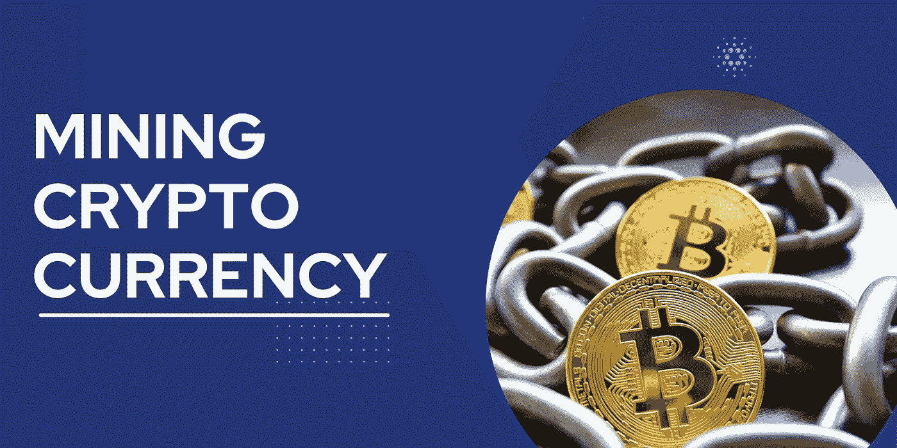

# 如何挖掘加密货币:综合指南

> 原文：<https://medium.com/coinmonks/how-to-mine-cryptocurrency-a-comprehensive-guide-ebfa50608141?source=collection_archive---------77----------------------->

加密货币是一种安全的数字货币。它使用加密技术来控制货币的创建和转移，以及验证资金的转移。加密货币是分散的，这意味着它们不受政府或金融机构的控制。

加密货币开采是创造新硬币的过程。矿工因验证并向区块链(所有已完成交易的数字分类账)提交交易而获得加密货币奖励。

按市值计算，以太坊是第二大加密货币，它使用一种不同于比特币的验证算法，名为 Ethash。加密货币矿工使用计算机硬件来解决复杂的数学问题，以便将交易添加到区块链中，并以加密货币的形式接收奖励。

在本指南中，我们将探索如何在运行 Windows 的计算机上挖掘[以太坊](https://www.coinbase.com/price/ethereum)。我们还将讨论最佳以太坊采矿硬件，并概述与加密货币采矿相关的一些风险。

**在我们开始之前，你需要一些东西来挖掘以太坊:**

# 以太坊钱包

这是存放乙醚的地方。我们建议使用软件钱包，如薄雾或 myetherwallet.com。

# 采矿钻机

一台[采矿钻机](https://academy.bit2me.com/en/what-is-mining-rig/)是一台专门为开采加密货币而设计的计算机。它将有多个显卡安装，并需要连接到互联网，以便我。

# 醚

这是通过以太坊挖掘出来的货币。

# 采矿软件

该软件将允许您将采矿钻机连接到[区块链](https://www.ibm.com/topics/what-is-blockchain)并开始采矿。有几个程序可用，但我们建议使用克莱莫的双以太坊矿工。

**既然你已经拥有了你需要的一切，那就让我们开始吧！**

# 1.安装以太坊钱包

你需要做的第一件事是在你的电脑上安装以太坊钱包。以太坊钱包是一个程序，允许您存储您的以太，也可以与其他用户进行交易。你可以从[这里](https://ethereum.org/)下载以太坊钱包。

# 2.安装采矿软件

一旦你安装了以太坊钱包，你将需要安装采矿软件。克莱莫的双重以太坊矿工是最受欢迎的程序之一。

# 3.配置您的采矿钻机

一旦您安装了采矿软件，您将需要配置您的采矿钻机。这包括指定您使用的显卡数量和输入您的钱包地址。

# 4.开始采矿

一旦你的采矿装备配置好了，你就可以开始开采以太坊了。只需打开挖矿软件，点击“开始”。您将开始看到接受和拒绝股票的结果。你接受的股份越多，你获得分红的可能性就越大。

# 5.领取您的奖金

一旦你的采矿设备产生了一定量的乙醚，它会自动将它发送到你的[以太坊钱包](https://ethereum.org/en/wallets/#:~:text=What's%20an%20Ethereum%20wallet%3F,funds%20and%20manage%20your%20ETH.)中。然后，你可以用它来进行交易，或者持有它，以应对未来的价格上涨。

就这些了！现在你知道如何在电脑上挖掘以太坊了。确保了解最新的以太坊新闻和价格变动，以便充分利用你的采矿设备。

> 加入 Coinmonks [电报频道](https://t.me/coincodecap)和 [Youtube 频道](https://www.youtube.com/c/coinmonks/videos)了解加密交易和投资

# 另外，阅读

*   [Coinswitch 俱吠罗评论](/coinmonks/coinswitch-kuber-review-1a8dc5c7a739) | [电网交易机器人](https://coincodecap.com/grid-trading) | [比特币基地费用](/coinmonks/coinbase-fees-831e77d4f2c5)
*   [Bitget 回顾](https://coincodecap.com/bitget-review)|[Gemini vs block fi](https://coincodecap.com/gemini-vs-blockfi)|[OKEx 期货交易](https://coincodecap.com/okex-futures-trading)
*   [OKEx vs KuCoin](https://coincodecap.com/okex-kucoin) | [摄氏替代品](https://coincodecap.com/celsius-alternatives) | [如何购买 VeChain](https://coincodecap.com/buy-vechain)
*   [币安期货交易](https://coincodecap.com/binance-futures-trading)|[3 commas vs Mudrex vs eToro](https://coincodecap.com/mudrex-3commas-etoro)
*   [在印度利用加密套利赚取被动收入](https://coincodecap.com/crypto-arbitrage-in-india)
*   [德国最佳加密交易所](https://coincodecap.com/crypto-exchanges-in-germany) | [WazirX P2P](https://coincodecap.com/wazirx-p2p)